# Control Center|../common/deepin-controlcenter.svg|

## Overview|../common/icon_overview.svg|

By Control Center, deepin manages the basic system settings, which includes account management, network settings, date and time, personalization, screen display settings and so on. After logging in deepin desktop environment, the Control Center panel will be opened by only moving the mouse pointer to the lower-right corner of the screen.

On Control Center panel, you can:

- Change the keyboard property.

- Adjust system volume.

- Optimize power function.

- Personalize desktop display.

- Change network connection.

- Create new account.

- Change system date and time display.

- Remote assistance.

- Enter shutdown interface.

- System and application update.

## Guide|../common/icon_guide.svg|

Control Center panel is mainly composed of system administrator account, system basic settings and power button.

> : Please refer to [Open Launcher and Control Center](dman:///dde#[Open Launcher and Control Center) and [Boot and Shutdown](dman:///dde#Boot and Shutdown) for specific operations of open/exit Control Center and power display interface.

  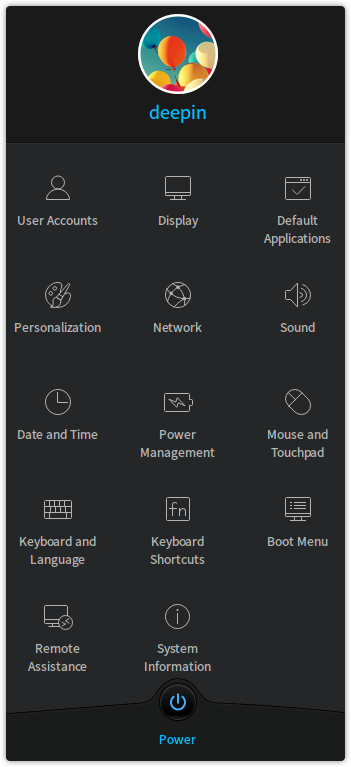

 <table class="block1">

     <caption>Icon Description</caption>

     <tbody>

     <tr>

            <td></td>

            <td>Click to create or manage, or execute other operations to account. </td>

            <td></td>

            <td>Click to set the resolution, brightness and others of the screen. </td>

         </tr>

          <tr>

            <td></td>

            <td>Click to set default startup applications. </td>

            <td></td>

            <td>Click to set theme, window, icon, cursor, wallpaper and font. </td>

         </tr>

           <tr>

            <td></td>

            <td>Click to set network. </td>

            <td></td>

            <td>Click to set speaker and microphone. </td>

         </tr>

         <tr>

            <td></td>

            <td>Click to set date and time. </td>

            <td></td>

            <td>Click to set power. </td>

         </tr>

         <tr>

            <td></td>

            <td>Click to set mouse and touchpad. </td>

            <td></td>

            <td>Click to set keyboard layout and language. </td>

         </tr>

         <tr>

            <td></td>

            <td>Click to set system shortcuts. </td>

            <td></td>

            <td>Click to set default boot menu. </td> 

         </tr>

             <tr>

            <td></td>

            <td>Click to visit and control other computers remotely through network to execute operations. </td>

            <td></td>

            <td>Click to view system detailed information and upgrade system and software. </td>

         </tr>

         </tbody>

 </table>

## Account Settings|../common/icon_account.svg|

By setting account, provide safety guarantee to your computer, protect your privacy and data.

### Auto-login

You can enable auto-login to automatically log in system with the account after booting each time.

1. On Control Center panel, click on **User Accounts**.

2. Select the account to set, click on **Auto-login** switch button to enable auto-login function.

3. On the pop-up authentication interface, input your account password to authorize the operation.

  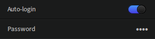

### Change Account Avatar

You can personalize your avatar by the following ways.

- Use built-in account avatar.

- Use your favorite image as account avatar.

- Use photo taken by camera as account avatar.

  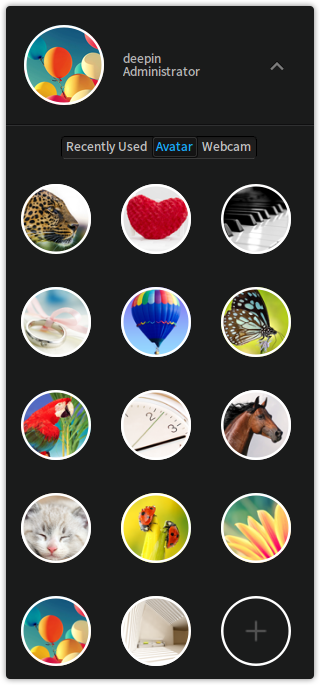

1. On Control Center panel, click on **User Accounts**.

2. Select the account that needs to change avatar, you can:

 - Click on **Avatar**, select an avatar you like to change.

 - Click on **Webcam**, use built-in or external camera to take a photo and use as avatar.

 - Click on , select other images stored in the computer to set as account avatar.

3. On the pop-up authentication interface, input your account password to authorize the operation.

### Change Account Password

The system will notify you to set a default account password during its installation. After logging in, you can change the default account password.

1. On Control Center panel, click on **User Accounts**.

2. Select the account to change password, in **Password** option, click on ••••.

3. Input a new password and confirm it.

4. Click on **Confirm**.

  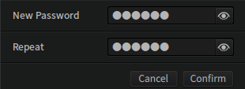

### Create New Account

After logging in, you can create a new account and switch users while using.

1. On Control Center panel, click on **User Accounts**.

2. Click on  in the upper right corner.

3. Input user name and password and confirm the password.

4. Select account type.

5. If you want to enable auto-Sign-in, please click on **Auto-login** switch button.

6. Click on **Confirm**, the new account will automatically be added into account list.

  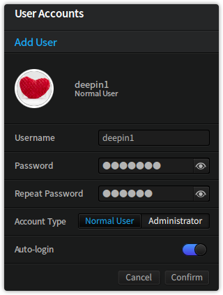

> : You can log in the computer as administrator, normal user or guest.

- **Administrator**: Fully permitted to control the computer, can make changes to the computer and have access to all the files in the computer.

- **Normal User**: Have access to programs installed in the computer, but restricted when executing other operations to the computer.

- **Guest**: Can view the programs installed in the computer, but can not make changes to computer files or applications.

## Display Settings|../common/icon_display.svg|

By setting the resolution, brightness, rotation of the monitor and extending the screen to optimize your computer display.

### Single Screen Settings

You can adjust the visual perception by setting the screen resolution, brightness and so on.

#### Resolution Settings

1. On Control Center panel, click on **Display**.

2. In **Resolution** collapse box, select the resolution to switch.

3. Click on **Apply**.

 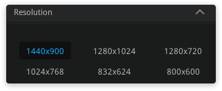

#### Set Rotation

1. On Control Center panel, click on **Display**.

2. In **Rotation** collapse box, select the displaying orientation for desktop screen.

3. Click on **Apply**.

 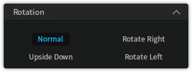

#### Brightness Settings

1. On Control Center panel, click on **Display**.

2. In **Brightness** option, drag the button leftwards/rightwards to adjust screen brightness.

 

### Multi-Screen Settings

Multi-screen display, boundlessly extends your vision.

With VGA cable, you can connect your computer to another monitor, projector and others. The contents in your computer can be displayed simultaneously on multiple screens.

#### Display Mode Settings

By setting display mode, you can choose to display screen contents on one screen or multiple screens.

1. On Control Center panel, click on **Display**.

2. In **Display Mode** collapse box, you can:

  - Select **Copy** to copy the contents from one screen to another.

  - Select **Extend** to extend the screen contents to display different contents on different screens.

  - Select **Only Displayed on LVDS** to display screen contents only on LVDS display device rather than other screens.

  - Select **Only Displayed on VGA-0** to display screen contents only on VGA-0 display device rather than other screens.

 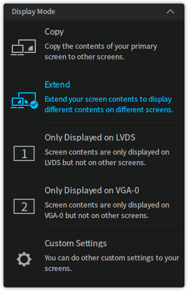

> : To cancel Copy display mode, please click on **Custom Settings** > **Split**. In Extend display mode, click on **Custom Settings** > **Edit** to drag display devices to change the display position as you like.

#### Custom Settings

You can set the other options in multi-screen display mode.

1. On Control Center panel, click on **Display**.

2. Click on **Custom Settings**, you can:

  - In **Enable Monitor** collapse box, select display device to use.

  - In **Primary** collapse box, select primary display device to use.

  - In **Resolution** collapse box, set the resolution of the display device.

  - In **Rotation** collapse box, set the screen orientation of the display device.

  - In **Brightness** collapse box, set the brightness of the display device.

 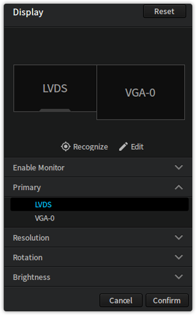

#### Recognize Multiple Monitors

When connected to multiple monitors, if you already set the display mode to Copy or Extend, then you can distinguish each display devices by recognition function.

1. On Control Center panel, click on **Display**.

2. Click on **Recognize**, and then on each screen you will see the names of relevant display devices.

 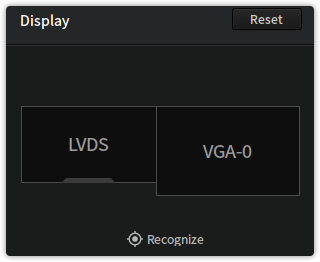

## Default Application Settings|../common/icon_defaultapp.svg|

### Default Startup Settings

When multiple application of the same type are installed in the system. You can select one of them to be the default startup application.

1. On Control Center panel, click on **Default Applications**.

2. In **Default Applications** option, you can:

  - In **Browser** collapse box, select default browser.

  - In **Mail** collapse box, select default mail client.

  - In **Text** collapse box, select default text editor.

  - In **Music** collapse box, select default music player.

  - In **Video** collapse box, select default video player.

  - In **Picture** collapse box, select default image editor.

  - In  **Terminal** collapse box, select default terminal tool.

 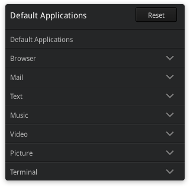

### Autoplay Settings

If autoplay is enabled, then the computer will automatically execute further operations when you insert media storage devices such as DVD.

1. On Control Center panel, click on **Default Applications**.

2. Click on **Autoplay** switch button to enable auto-play function.

3. In each displayed collapse box, you can set default operations for media files and software.

 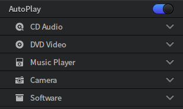

## Personalization|../common/icon_personalization.svg|

You can change the appearance of the desktop to your favorite style by using different wallpapers, icons, window types and so on.

### Theme Settings

1. On Control Center panel, click on **Personalization**.

2. In **Theme** collapse box, you can:

  - Use system default theme.

  - Use custom theme.

 

> : If you want to use customized theme, please set the window, icon, cursor, wallpaper and font respectively.

### Window Settings

1. On Control Center panel, click on **Personalization**.

2. In **Window** collapse box, select a window type to switch.

 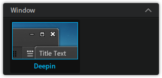

### Icon Settings

1. On Control Center panel, click on **Personalization**.

2. In **Icon** collapse box, select a icon type to switch.

 

### Cursor Settings

1. On Control Center panel, click on **Personalization**.

2. In **Cursor** collapse box, select a cursor type to switch.

 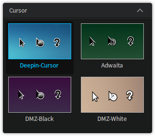

### Wallpaper Settings

#### Built-in Wallpaper

There are some different built-in wallpapers in the system, you can select your favorite wallpaper to switch.

1. On Control Center panel, click on **Personalization**.

2. In **Wallpaper** collapse box, select a wallpaper to switch.

 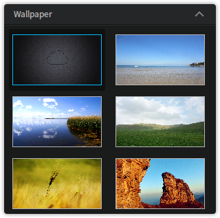

#### Acquire External Image

You can set your favorite image as wallpaper.

1. Open externally acquired image, right click and select **Set as Wallpaper**.

2. Wallpaper will automatically be switched to current image.

3. To delete external wallpaper, call out Control Center and click on **Personalization** > **Wallpaper**.

4. Click on the button in the upper-right corner of the image to delete.

> : To delete a external wallpaper, you have to switch to another image first, then a delete button will appear on the upper right corner of the external wallpaper.

 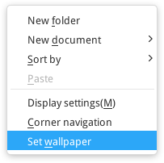

### Font Settings

1. On Control Center panel, click on **Personalization**.

2. In **Fonts** collapse box, set the type and size of the font displayed in the system.

 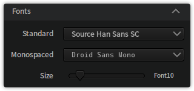

## Network Settings|../common/icon_network.svg|

Experience the fun surfing the Internet! You can browse news, play online video, download files, chat with friends, shop online and so on.

### View Network

You can view the status and detailed information of the current computer network.

> : If  is in front of the network name which you want to connect to, then the current computer is already connected to the network.

1. On Control Center panel, click on **Network**.

2. Click on  to view the detailed information of the currently selected network.

3. Click on  in the upper-right corner to view the detailed information of all the connected network.

 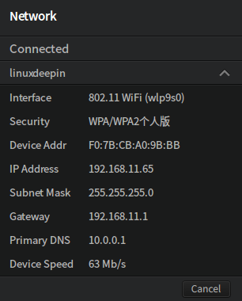

### Add Network Connection

You can connect to network by dial-up Internet connection or VPN connection to access Internet. The following operations is an example of VPN connection.

1. On Control Center panel, click on **Network**.

2. Click on  in the upper right corner.

3. Select network type.

4. Click on **Next**.

5. Select VPN type and input realistic basic information.

6. Click on **Add**.

 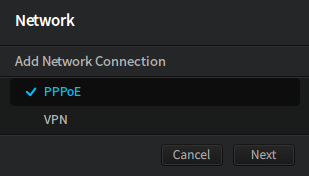

### Connect to Network

You can connect the computer to router or network port by wire to access wired network. If your computer is equipped with wireless device, you can search for the known wireless network to access.

#### Connect to Wired Network

1. Plug the wire in the network port on the computer.

2. Plug the other end of the wire in a router or network port.

3. On Control Center panel, click on **Network**.

4. Click on **Wired Network** switch button to enable wired network function.

5. After successfully connected to network, a prompt message of "Connected Wired Connection" will be displayed on the desktop.

  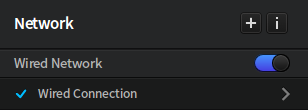

#### Connect to Wireless Network

- WLAN card has been built in most laptops, you only need to enable it to connect to wireless network.

- WLAN card is not built in most desktop computers, you can purchase one and insert it to the computer if needed. The computer will automatically identify the wireless device.

1. On Control Center panel, click on **Network**.

2. Click on **Wireless Network** switch button to enable wireless network function.

3. The computer will automatically search for available wireless network nearby.

4. Select wireless network to connect:

 - If the network is open, then it will be automatically connected.

 - If the network is encrypted, then you should input password according to hint, click on **Save**, then it will be automatically connected.

 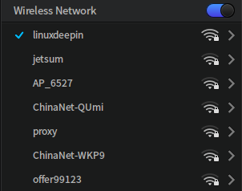

#### Delete Wireless Network

You can delete the unnecessary network from the list.

1. On Control Center panel, click on **Network**.

2. Select wireless network to delete, click on .

3. Click on **Delete this network**, a prompt message will display and says "Are you sure you want to delete this network?" 

4. Click on **Delete**.

 

### Enable Network Auto-Connection

After connected to wired or wireless network, you can enable auto-connection, so the computer will be automatically connected to the network when you log in next time.

1. On Control Center panel, click on **Network**.

2. Select wireless network to auto-connect, click on .

3. Click on **Automatically connect** switch button to enable auto-play function.

4. Click on **Save**.

 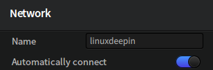

### Manually Configure IP Address

You can manually configure IP Address in both wired and wireless network.

1. On Control Center panel, click on **Network**.

2. Select wireless network to configure, click on .

3. Click on **IPv4** or **IPv6**.

4. In the pull-down option of **Method**, select **Manual**.

5. Input IP address, netmask, gateway and DNS server.

6. Click on **Save**.

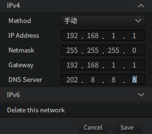

### Network Proxy Settings

You can breakthrough network limitations by setting proxy server, which makes your network unblocked.

1. On Control Center panel, click on **Network**.

2. In **System Proxy** collapse box, you can:

  - Click on **None** to disable proxy server function.

  - Click on **Manual** to input proxy server address and port information.

  - Click on **Auto** and input URL, the system will automatically configure the information of proxy server.

3. Click on **Apply system wide**.

 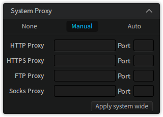

## Sound Settings|../common/icon_sound.svg|

You can adjust system volume by executing one of the following operations:

- Move the mouse pointer over  and drag the volume slider.

- On Dock, click on  or  > **Sound** to enter Control Center to set sound.

- Use volume control that is built in the application to set.

### Speaker Settings

Laptops usually have built-in speakers. You can listen to the player without an external speaker or earphone.

1. On Control Center panel, click on **Sound**.

2. Click on **Speaker** switch button to enable speaker.

3. Drag the slider leftwards/rightwards to adjust output volume and left/right balance.

 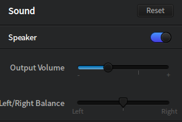

### Microphone Settings

Normally, a microphone have been built in the computer, and can be used to make recordings or talk to others.

1. On Control Center panel, click on **Sound**.

2. Click on **Microphone** switch button to enable microphone.

3. Drag the slider leftwards/rightwards to increase/decrease input volume.

 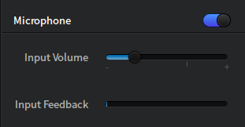

### Sound Effects Setting

Sound effects are integrated in system and enabled by default. "Log in", "Shutdown", "Log out" and "Restore" will be accompanied with different system sound effects. Meanwhile, notification and other sound effects can be enabled or disabled.

1. On Control Center panel, click on **Sound**.

2. In **Sound Effects** collapse box, you can:

  - Click on **Login** switch button to enable sound effect on logging in.

  - Click on **Log out** switch button to enable sound effect on logging out.

  - Click on **Shutdown** switch button to enable sound effect on shutting down.

  - Click on **Restore** switch button to enable sound effect on restoring.
  
  - Click on the switch button of other options to enable or disable the notification and other sound effects.

 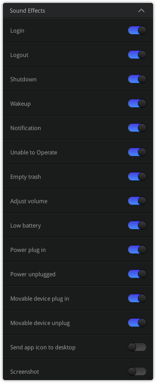

### Advanced Settings

You can make more detailed settings to input and output in advanced setting options.

1. On Control Center panel, click on **Sound**.

2. Click on **Show Advanced**.

3. Set the port and devices for output and input.

 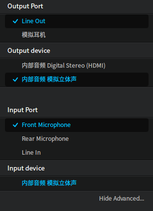

## Date and Time|../common/icon_dateandtime.svg|

System has made initialize settings for date and time, you can check if the date and time is correct on Dock.

### View Date and Time

- In Fashion mode, time will be displayed on Dock as . Move the mouse pointer over  to view date.

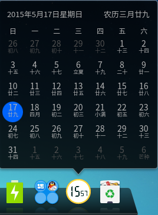

- In Efficient or Classic mode, time will be displayed on the lower right corner of the Dock as . Move the mouse pointer over  to view date.

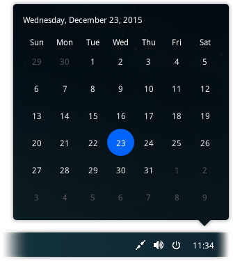

> : Click or right click on Time > **Datetime settings** to open Control Center panel to set date and time.

### Switch Display Mode

- In Fashion mode, right click on  > **Switch display mode**, time will display as .

- In Efficient or Classic mode, right click on  > **Show date** or **Show week** to display on Dock the date or day.

### Display 24-hour Clock

24-hour clock is different from 12-hour clock. In 24-hour clock, 1:00 p.m. is 13:00.

1. On Control Center panel, click on **Date and Time**.

2. Click on **Use 24-hour clock** switch button to enable 24-hour clock function.

 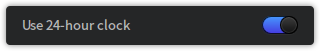

### Auto-Sync

Enabling auto-sync function will allow the computer to automatically acquire time from Internet and synchronously update time based on your region or location.

> : auto-sync is enabled by default in system.

1. On Control Center panel, click on **Date and Time**.

2. Click on **Sync Automatically** switch button to enable auto-sync function.

3. On the pop-up authentication interface, input your account password to authorize the operation.

 

### Manual Settings

You can manually set time according to other time tools around you, such as timepiece, official time and so on.

> : You can not manually change date and time when the function of "Sync Automatically" is enabled.

#### Time Settings

1. On Control Center panel, click on **Date and Time**.

2. Double click Time in the top display frame.

- Click on  and  to correct time.

4. Click on **Save** to complete time change.

 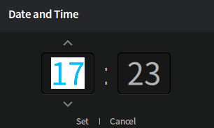

#### Date Settings

1. On Control Center panel, click on **Date and Time**.

2. In **Date** option, click on  and  to change year and month.

3. Use the mouse to select date.

4. Click on .

5. Click on **Confirm** to complete date change.

6. On the pop-up authentication interface, input your account password to authorize the operation.

 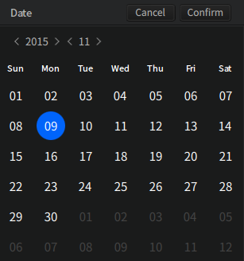

#### Time Zone Settings

Usually, if the system is installed with simplified Chinese, then the default time is Beijing Time. If you are in other countries or regions and need to set your computer to local time. You can add the local time zone.

1. On Control Center panel, click on **Date and Time**.

2. In **Time Zone** option, you can:

  - Click on  and select a time zone in the list to add and click on **Add**.

  - Click on  > , select a time zone to delete and click on **Confirm**.

 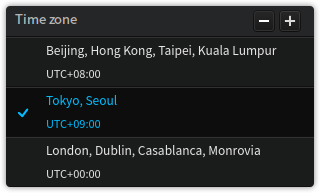

## Power Management|../common/icon_powermanagement.svg|

It will provide strong power for your work and entertainment to configure power management protocols.

### Power Button Operation

When you press the power button, the computer will execute the next operation automatically.

1. On Control Center panel, click on **Power Management**.

2. In **When I press the power button** option, you can:

  - Select **Shutdown**, then when you press power button, the system will shut down.

  - Select **Suspend**, then when you press power button, the system will suspend.

  - Select **Ask**, then when you press power button, the system will ask for your operation.

 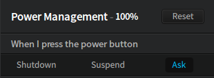

If you use laptop, you can set the operation when close the lid.

1. On Control Center panel, click on **Power Management**.

2. In **When I close the lid** option, you can:

  - Select **Shutdown**, then when you close the lid, the system will shut down.

  - Select **Suspend**, then when you close the lid, the system will suspend.

  - Select **Nothing**, then when you close the lid, the system will do nothing.

 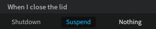

### Wake up Operation

Enable wake-up password to protect your personal files.

1. On Control Center panel, click on **Power Management**.

- Click on **Password required to wake up** switch button to enable wake-up password function.

3. Password will be needed to log in when waking up the computer for the next time.

 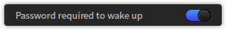

### Power Conservation Operation

Set and optimize power to make your work and entertainment last longer.

1. On Control Center panel, click on **Power Management**.

2. In **Plugged in** option, you can:

  - Select **Balanced**, the computer will shutdown the monitor when unused for 10 minutes to conserve power.

  - Select **Power saver**, the computer will shutdown the monitor when unused for 5 minutes, and will suspend when unused for 15 minutes.

  - Select **High performance**, the computer will provide its complete performance when needed, and will shutdown the monitor when unused for 15 minutes.

  - Select **Custom**, you can create and customize the time to shutdown the monitor and suspend the system.

 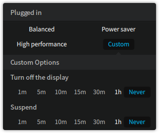

If you use laptop, you can set use mode for the laptop battery to optimize the use.

1. On Control Center panel, click on **Power Management**.

2. In **On battery** option, you can:

  - Select **Balanced**, the computer will shutdown the monitor when unused for 10 minutes to conserve power.

  - Select **Power saver**, the computer will shutdown the monitor when unused for 5 minutes, and will suspend when unused for 15 minutes.

  - Select **High performance**, the computer will provide its complete performance when needed, and will shutdown the monitor when unused for 15 minutes.

  - Select **Custom**, you can create and customize the time to shutdown the monitor and suspend the system.

 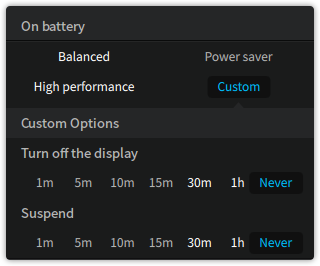

## Mouse and Touchpad|../common/icon_mouse.svg|

You can set mouse and use touchpad to operate the computer based on your habit.

### Mouse Settings

You can adjust the mouse sensitivity based on your habit in daily use.

1. On Control Center panel, click on **Mouse and Touchpad**.

2. In **Primary Button** option, click **Left Button** or **Right Button** to switch to left/right button as primary.

3. In **Pointer Speed** option, drag the slider leftwards/rightwards to adjust the pointer moving speed.

4. In **Double-click Speed** option, drag the slider leftwards/rightwards to adjust the button double-click speed.

 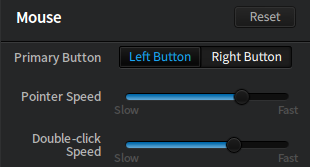

### Disable the Touchpad

If you enable the function, operation on touchpad will be disabled, all settings made to touchpad will be invalid.

1. On Control Center panel, click on **Mouse and Touchpad**.

2. Click on **Disable the touchpad when inserting the mouse** switch button to disable touchpad.

3. All functions of the touchpad will be invalid.

 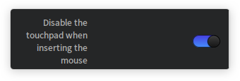

### Enable Touchpad

If you use a laptop, you can use touchpad on the computer instead of mouse.

> : Only when **Disable the touchpad when inserting the mouse** is disable then the operation to enable touchpad can work.

1. On Control Center panel, click on **Mouse and Touchpad**.

2. Click on **Touchpad** switch button to enable touchpad.

 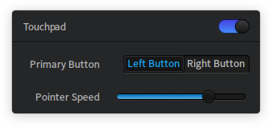

#### Touchpad Settings

1. On Control Center panel, click on **Mouse and Touchpad**.

2. In **Primary Button** option, click **Left Button** or **Right Button** to switch to left/right button as primary.

3. In **Pointer Speed** option, drag the slider leftwards/rightwards to adjust the touchpad pointer moving speed.

4. In **Double-click Speed** option, drag the slider leftwards/rightwards to adjust the touchpad button double-click speed.

5. In **Drag Threshold** option, drag the slider leftwards/rightwards to adjust the range of the touchpad pointer moving speed.

#### Touchpad Scroll Settings

1. On Control Center panel, click on **Mouse and Touchpad**.

2. Click on **Natural Scrolling** switch button to enable natural scroll function.

3. Click on **Tap to click ** switch button to enable tap clicking.

4. Click on **Two-finger scrolling** switch button to enable two-finger scroll function.

5. Click on **Edge scrolling** switch button to enable Edge scroll function.

Description for touchpad scrolling is as the following:

- **Natural Scrolling**: Two finger move up/down on the touchpad, the page content will move up/down along with it.

- **Tap to click**: Tap on the touchpad to click.

- **Two-finger scrolling**: Two finger move up/down on the touch pad to scroll.

- **Edge scrolling**: You can execute scroll operation at the edge of the touchpad.

## Keyboard and Language|../common/icon_keyboardandlanguage.svg|

Based on your nationality and region, you can select your keyboard input habit and layout.

### Enable Caps Lock Notification

Enable Caps Lock notification to notify you when you press Caps Lock to avoid typo.

1. On Control Center panel, click on **Keyboard and Language**.

2. Click on **Caps Lock prompt** switch button to enable Caps Lock notification function.

 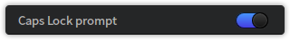

### System Language Settings

While installing the system, you can select system default display language. After logging in, you can change the default account password.

1. On Control Center panel, click on **Keyboard and Language**.

2. In **Language** collapse box, the language currently displayed in the system will have a  in front of it.

3. Select language to switch, the system will automatically start installing language packages.

4. After completing language package, a notification will pop up and say "System language has been changed, please log in after log out".

5. Log out and log in again, and the displaying language has been changed.

> : When system language is changed, the keyboard layout might also change. When log in again, please make sure to use the right keyboard layout to input password.

 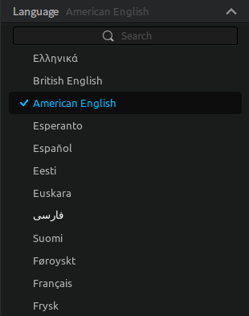

### Keyboard Layout Settings

The system default keyboard layout is US keyboard, you can add other keyboard layouts.

#### Add Keyboard Layout

1. On Control Center panel, click on **Keyboard and Language**.

2. In **Keyboard Layout** option, you can:

   - Click on  and select a keyboard layout to add, then click on *Add**.

   - Click on  > , select a keyboard layout to delete.

3. Click on **Done**.

 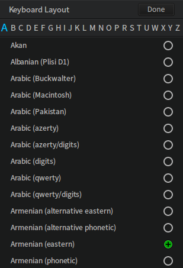

#### Switch Keyboard Layout

1. On Control Center panel, click on **Keyboard and Language**.

2. In **Keyboard Layout ** option, select a keyboard layout to switch.

3. After successfully switched keyboard layout,  will be displayed in front of the current keyboard layout.

 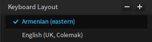

### Keyboard Settings

1. On Control Center panel, click on **Keyboard and Language**, you can:

   - In **Repeat Delay** option, drag the slider leftwards/rightwards to adjust the interval between two characters.

   4. In **Repeat Rate** option, drag the slider leftwards/rightwards to adjust the emerging rate of characters.

   - In **Cursor Blink Rate** option, drag the slider leftwards/rightwards to adjust the cursor blink rate.

2. In **Test Area**, you can test the keyboard effect in real time.

 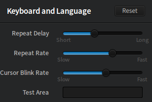

## Shortcut Settings|../common/icon_shortcuts.svg|

Use shortcuts wisely to save your valuable time.

### View Shortcuts

You not only can view all the system default shortcuts, but also change, delete or customize shortcuts.

1. On Control Center panel, click on **Keyboard Shortcuts**.

2. Click on **System**, **Window** and **Workspace**, the shortcuts for system, window and workspace are displayed in the corresponding collapse box.

<table class="block1">

    <caption>System Shortcuts</caption>

    <tbody>

        <tr>

            <td>Launcher</td>

            <td>Super</td>

        </tr>

        <tr>

            <td>Show desktop</td>

            <td>Super+D</td>

        </tr>

        <tr>

            <td>Lock screen</td>

            <td>Super+L</td>

        </tr>

         <tr>

            <td>File manager</td>

            <td>Super+E</td>

        </tr>

        <tr>

        <tr>

            <td>Show/Hide the dock</td>

            <td>Super+H</td>

        </tr>

        <tr>

            <td>Screenshot</td>

            <td>Control+Alt+A</td>

        </tr>

         <tr>

            <td>Window screenshot</td>

            <td>Alt+Print</td>

        </tr>

        <tr>

            <td>Delay screenshot</td>

            <td>Control+Print</td>

        </tr>

        <tr>

            <td>Terminal</td>

            <td>Control+Alt+T</td>

        </tr>

        <tr>

            <td>Terminal Quake Window</td>

            <td>F4</td>

        </tr>

        <tr>

            <td>Logout</td>

            <td>Control+Alt+Delete</td>

        </tr>

        <tr>

            <td>Switch Layout</td>

            <td>Super+Space</td>

        </tr>

        <tr>

            <td>Display workspace</td>

            <td>Super+S</td>

        </tr>

        <tr>

            <td>Display windows of current workspace</td>

            <td>Super+W</td>

        </tr>

        <tr>

            <td>Display windows of all workspaces</td>

            <td>Super+A</td>

        </tr>

        <tr>

            <td>Switch similar windows</td>

            <td>Alt+～</td>

        </tr>

        <tr>

            <td>Switch similar windows in reverse</td>

            <td>Alt+Shift+～</td>

        </tr>

        <tr>

            <td>Switch windows</td>

            <td>Alt+Tab</td>

        </tr>

        <tr>

            <td>Switch windows in reverse</td>

            <td>Alt+Shift+Tab</td>

        </tr>
        <tr>

            <td>Switch windows effects</td>

            <td>Super+Tab</td>

        </tr>

    </tbody>

 </table>

<table class="block1">

    <caption>Window Shortcuts</caption>

    <tbody>

        <tr>

            <td>Close window</td>

            <td>Alt+F4</td>

        </tr>

        <tr>

            <td>Maximize window</td>

            <td>Super+Up</td>

        </tr>

        <tr>

            <td>Restore window</td>

            <td>Super+Down</td>

        </tr>

        <tr>

            <td>Move window</td>

            <td>Alt+F7</td>

        </tr>

        <tr>

            <td>Resize window</td>

            <td>Alt+F8</td>

        </tr>

    </tbody>

 </table>

 

 <table class="block1">

    <caption>Workspace Shortcuts</caption>

    <tbody>

        <tr>

            <td>Switch to left workspace</td>

            <td>Super+Left</td>

        </tr>

        <tr>

            <td>Switch to right workspace</td>

            <td>Super+Right</td>

        </tr>

        <tr>

            <td>Move to left workspace</td>

            <td>Super+Shift+Left</td>

        </tr>

        <tr>

            <td>Move to right workspace</td>

            <td>Super+Shift+Right</td>

        </tr>

    </tbody>

 </table>

### Search Shortcuts

You can quickly find the shortcut you need by search function.

1. On Control Center panel, click on **Keyboard Shortcuts**.

2. Input keywords in the search box at the top, all shortcut(s) containing the keywords will be listed in the search bar.

 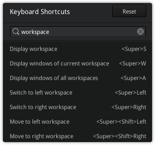

### Change Shortcuts

You can use system default shortcut settings or customize shortcuts based on your habit.

1. On Control Center panel, click on **Keyboard Shortcuts**.

2. Click on shortcuts to change.

3. Input new shortcut with keyboard.

> : To disable shortcuts, please press  or .

### Customize Shortcuts

Customize more shortcuts to simplify your operations.

1. On Control Center panel, click on **Keyboard Shortcuts**.

2. In **Custom** option, click on .

3. Input shortcut name and command.

4. Click on **Add**.

 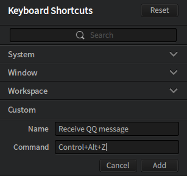

## Boot Menu Settings|../common/icon_bootmenu.svg|

Multiple system means multiple choices, boot menu makes your system boot vividly.

### Boot Background Settings

In Control Center, you can change the background on startup interface.

1. On Control Center panel, click on **Boot Menu**.

2. Press and hold the left mouse button,  drag and drop the image to use into the preview window to change the background.

> : It needs reboot to effect after background changed successfully.

 

### Default Boot Settings

When multiple operating system are installed in the computer, you can set a default system to run when the computer startups.

1. On Control Center panel, click on **Boot Menu**.

2. In **Default Boot** collapse box, select a default system to run when startup the computer.

 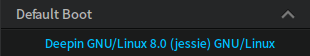

### Boot Delay Settings

Delay the system boot for you to execute other operations.

1. On Control Center panel, click on **Boot Menu**.

2. In **Boot delay** collapse box, set the boot delay time.

 

### Boot Interface Text Color Settings

You can set different color for the texts on the boot interface to distinguish one from another.

1. On Control Center panel, click on **Boot Menu**.

2. In **Text Color** collapse box, set color for the non-running operating system on the boot interface.

- In **Selected Text Color** collapse box, set color for the default operating system on the boot interface.

 

## Remote Assistance Settings|../common/icon_remoteassistance.svg|

With remote assistance, you can assist user and technicians to solve problems, in addition, you can do remote assist work, training, interactive teaching and learning, and so on.

### Share Operations

When you are seeking for online help or problem solution, you can initiate the share function of remote assistance to share your desktop for the controlling terminal to operate.

1. On Control Center panel, click on **Remote Assistance**.

2. On Remote Assistance interface, click on **Share**.

3. System will automatically generate a verification code.

4. Click on **Copy Code** to send the verification code to the controlling terminal.

 

### Access Operations

If the controlled terminal requires for remote assistance, with the verification code of the other party, you can access and control the desktop of the other party.

1. Acquire the verification code of the controlled terminal.

2. On Control Center panel, click on **Remote Assistance**.

3. On Remote Assistance interface, click on **Access**, then manually input or paste the verification code.

4. Click on **Connect** to access the desktop of the controlled terminal. Then you can help to solve problem or do other operations.

 

### Remote Connection

After inputting the verification code, the system will access the remote desktop of the other party, you can execute control operations to the desktop. Meanwhile, you can set the display effect of the remote desktop.

After successfully connected to remote desktop, click on **Preference** collapse menu, you can:

- Select **Balance**, the remote desktop will be in balance status.

- Select **Optimize Speed** to optimize the performance of remote assistance.

- Select **Optimize Quality** to optimize the screen display quality of the remote desktop.

- Select **Fullscreen** to switch to fullscreen mode and makes it easier for you to execute remote operations.

 

### Disconnect

When remote control operations are complete, you can disconnect with a button in the remote desktop.

1. A disconnect button will show on the desktop of the controlled terminal.

2. Click on **Disconnect**, the system will notify you to make sure if you want to disconnect with remote desktop.

3. Click on **Confirm** to end this remote assistance operation.

> : If the network is interrupted for other reasons while you are operating a remote desktop. The system will automatically disconnect after a while.

 

## System Information|../common/icon_systeminfo.svg|

You can view system edition and computer hardware, check GNU general public license, update system and applications.

### View System Information

You can view system edition, computer hardware and other information.

1. On Control Center panel, click on **System Information**.

2. In **System Information** option, you can:

  - View the edition of the current operating system.

  - View if it is a 64bit/32bit system.

  - View the CPU model.

  - View the size of the memory.

  - View the volume of the disk.

 

### View GNU General Public License

You can view details of GNU general public license.

1. On Control Center panel, click on **System Information**.

2. Click on **GNU GENERAL PUBLIC LICENSE**.

3. View details of GNU general public license.

 

### Update and Upgrade

You can check if there is update for the system and applications. Meanwhile, you can change update server, update system and applications.

#### Enable Auto-update

1. On Control Center panel, click on **System Information**.

2. In **Update** collapse box, click on 

3. Click on **Auto check update** switch button to enable automatic update check.

4. Click on **Done**.

5. It will notify in the collapse box when there is update for the system and applications.

> : automatic update check is enabled by default in system, you can manually disable it.

 

#### Update Server Settings

1. On Control Center panel, click on **System Information**.

2. In **Update** collapse box, click on 

3. In **Update server** option, click on **Change**.

4. Select applicable update server to refresh software package list.

5. Click on **Done**.

> : System default and recommended official stable server is at the top of the list.

 

#### Upgrade Applications and System

1. On Control Center panel, click on **System Information**.

2. In **Update** collapse box, select application(s) to update.

3. When there is notification for system or application update, click on , the system and utilities of applications contained in system will be both updated.

4. Hover the mouse pointer on the application to be updated, click on  to update this application only.

> : If there is no update for system, it will show "Click to view available updates"; if there is(are) update(s), then after updating system and applications, some functions can only be valid after rebooting.

 
