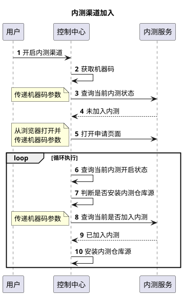
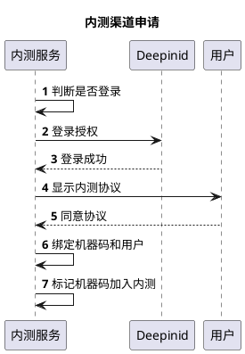
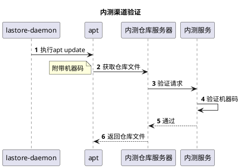

# Deepin内测渠道

## 内测渠道加入

用户可在「控制中心 - 更新 - 更新社区 - 内测渠道」开启内测渠道功能。

在「内测渠道」关闭状态，用户可通过点击来开启该功能。在用户开启时，控制中心首先获取机器码，再通过网络从内测服务查询当前终端设备是否已加入内测。

如果当前终端设备已加入内测，则直接安装内测仓库的配置安装包，并写配置文件标记「内测渠道」功能已开启。
如果当前终端设备未加入内测，则调用浏览器打开内测申请页面，并写配置文件标记「内测渠道」功能已开启。

由于内测申请有一定延迟，控制中心在配置文件记录「内测渠道」已开启的前提下，会在启动后通过网络从内测服务查询当前终端设备是否已加入内测，如果终端设备已加入内测，则安装内测仓库的配置安装包。

## 内测渠道申请

内测渠道申请在浏览器网页进行，通过控制中心传递的机器码绑定终端设备。
申请流程会自动通过，但需要用户先进行登录并同意参与内测的相关协议。在同意协议后，会自动将用户和终端社区绑定，每个用户可绑定多个终端设备。

## 内测渠道验证

内测仓库会在网关配置机器码验证，如果机器码没有在内测服务记录绑定，即便终端设备私自安装配置了内测仓库，也无法使用内测仓库。
在验证的同时，内测服务会记录终端设备的一些环境信息，例如IP地址，系统版本号等。

## 内测渠道退出

由于退出内测会有风险导致无法再安装其他软件，在退出前控制中心会弹出警告文案，再用户二次确认之后，想内测发送退出请求，然后卸载内测仓库的配置安装包。用户可在退出后重新申请加入内测。
