# 控制中心|common/deepin-controlcenter.svg|

## 概述|common/icon_overview.svg|

深度操作系统通过控制中心来管理系统的基本设置，包括账户管理、网络设置、日期和时间、个性化、屏幕显示设置等。当您进入深度桌面环境后，只需要将鼠标移至屏幕右下角即可打开控制中心面板。

在控制中心面板，您可以：

- 修改键盘的属性
- 调节系统音量大小
- 优化电源功能
- 个性化桌面显示
- 更改网络连接
- 创建新账户
- 修改系统显示日期和时间
- 远程协助操作
- 进入关机界面
- 系统和软件版本升级

## 使用入门|common/icon_guide.svg|
控制中心面板主要由系统管理员账户、系统基本设置、电源按钮组成。

> ：打开/退出控制中心和电源显示界面，具体操作请参阅 [打开启动器和控制中心](dman:///deepin-system#打开启动器和控制中心)和[开机和关机](dman:///deepin-system#开机和关机)。

  

 <table class="block1">
     <caption>图标说明</caption>
     <tbody>
     <tr>
            <td></td>
            <td>点击可对账户进行创建、管理等操作。</td>
            <td></td>
            <td>点击可对显示器的分辨率、亮度等进行设置。</td>
         </tr>
          <tr>
            <td></td>
            <td>点击可对默认启动程序进行设置。</td>
            <td></td>
            <td>点击可对主题、窗口、图标、光标、壁纸、字体进行设置。</td>
         </tr>
           <tr>
            <td></td>
            <td>点击可对网络进行设置。</td>
            <td></td>
            <td>点击可对扬声器和麦克风进行设置。</td>
         </tr>
         <tr>
            <td></td>
            <td>点击可对日期和时间进行设置。</td>
            <td></td>
            <td>点击可对电源进行设置。</td>
         </tr>
         <tr>
            <td></td>
            <td>点击可对鼠标和笔记本触摸板进行设置。</td>
            <td></td>
            <td>点击可对键盘布局和语言进行设置。</td>
         </tr>
         <tr>
            <td></td>
            <td>点击可对系统的快捷键进行设置。</td>
             <td></td>
            <td>点击可通过网络远程访问并控制其他电脑进行操作。</td> 
         </tr>
             <tr>
           <td></td>
            <td>点击可对默认启动菜单进行设置。</td>
            <td></td>
            <td>点击可查看系统详细信息以及系统和软件升级。</td>
         </tr>
         </tbody>
 </table>

## 账户设置|common/icon_account.svg|

通过设置账户为您的计算机提供安全保障，保护您的个人隐私和数据。

### 自动登录
您可以开启自动登录功能，当每次启动电脑后，将自动使用该账户登录系统。 

1. 在控制中心面板，点击 **账户**。
2. 选择需要设置的账户，将 **自动登录** 按钮向右滑动，开启自动登录功能。
3. 在弹出的授权界面，输入账户密码来授权此项操作。

  

### 更改账户头像

您可以通过以下方式来设置头像，让您的头像充满个性。

- 使用系统自带的账户头像。
- 使用您喜欢的图片作为账户头像。
- 使用摄像头拍摄的照片来作为账户头像。

  

1. 在控制中心面板，点击 **账户**。
2. 选择需要更改头像的账户，您可以：
 - 点击 **头像**，选择一款您喜欢的头像进行更改。
 - 点击 **拍照**，使用电脑自带或外接的摄像头来拍摄图片作为头像。
 - 点击 ，选择电脑中存储的其他图片来设置账户头像。
3. 在弹出的授权界面，输入账户密码来授权此项操作。

### 更改账户密码

在安装系统的过程中，系统会提示您设置一个默认的账户密码。登录电脑后，您可以更改默认的账户密码。

1. 在控制中心面板，点击 **账户**。
2. 选择要更改密码的账户，在 **密码** 选项，点击 ••••。
3. 输入一个新的密码和确认密码。
4. 点击 **确定**。

  

### 创建新账户
登录电脑后，您可以创建一个新的账户，在使用过程中可以切换用户来操作。

1. 在控制中心面板，点击 **账户**。
2. 点击 。
3. 输入新帐户的用户名、密码并再次确认密码。
4. 选择新账户的类型。
5. 如果要开启自动登录功能，请将 **自动登录** 按钮向右滑动。
6. 点击 **确定**，新账户将自动添加到账户列表中。

  

> ：您可以以管理员、普通用户或来宾三种不同的身份登录电脑。

- **管理员：** 拥有控制电脑的全部权限，可以对计算机进行更改，可以访问计算机上的所有文件。
- **普通用户：** 可以访问已经安装在计算机上的程序，但是在对计算机进行其他操作时会受到限制。
- **来宾：** 可以查看安装在计算机上的程序，但是不能对计算机的文件和应用程序进行修改操作。

## 显示设置|common/icon_display.svg|

通过设置显示器的分辨率、亮度、屏幕方向，以及扩展屏幕，让您的电脑显示到达最佳状态。

### 单屏设置
您可以通过设置显示器的分辨率、亮度等来调节屏幕的视觉观感。

#### 设置分辨率
1. 在控制中心面板，点击 **显示**。
2. 在 **分辨率** 折叠框中，选择需要切换的分辨率。
3. 点击 **应用**。

 

#### 设置旋转方向
1. 在控制中心面板，点击 **显示**。
2. 在 **旋转** 折叠框中，选择桌面屏幕的显示方向。
3. 点击 **应用**。

 

#### 设置亮度
1. 在控制中心面板，点击 **显示**。
2. 在 **亮度** 选项，通过左右拖动滑条来调节屏幕亮度。

 

### 多屏设置
多屏显示，让您的视野无限延伸！

您可以使用VGA线缆将您的电脑和另一台显示器、投影仪等连接起来，同时在多个屏幕上来显示您电脑上的内容。

#### 设置显示模式
您可以通过设置显示模式在一个或多个显示器上显示屏幕内容。

1. 在控制中心面板，点击 **显示**。
2. 在 **显示模式** 折叠框中，您可以：
  - 选择 **复制**，将一个屏幕的内容复制到其他屏幕中。
  - 选择 **扩展**，将一个屏幕的内容扩展到其他屏幕中，在不同的屏幕上显示不同的内容。
  - 选择 **仅在LVDS上显示**，将只在 LVDS 显示设备上显示屏幕内容，其他屏幕不显示。
  - 选择 **仅在VGA-0上显示**，将只在 VGA-0 显示设备上显示屏幕内容，其他屏幕不显示。

 

> ：当显示模式为复制时，如果要取消复制，请点击 **自定义设置** > **拆分**。当显示模式为扩展时，点击 **自定义设置** > **编辑** 可以随意拖动显示设备以改变显示位置。

#### 自定义设置
您可以对多屏显示下的其他选项进行设置。

1. 在控制中心面板，点击 **显示**。
2. 点击 **自定义设置**，您可以：
  - 点击 **启用显示器**，可以选择您要使用的显示设备。
  - 点击 **主屏**，可以选择您要使用的主显示设备。
  - 点击 **分辨率**，可以设置显示设备的分辨率。
  - 点击 **旋转**，可以设置显示设备的屏幕方向。
  - 点击 **亮度**，可以设置显示设备的显示亮度。

 

#### 识别多个显示器
当接入多个显示器时，如果您已经将显示模式设置为复制或扩展，您可以通过识别功能来区分各个显示设备。

1. 在控制中心面板，点击 **显示**。
2. 点击 **识别**，在各个显示器的屏幕上您将看到对应的显示设备名称。

 

## 默认程序设置|common/icon_defaultapp.svg|
### 默认启动设置
当系统中同一类型的应用程序安装多个时，您可以通过选择其中的一个程序来作为默认启动的应用程序。

1. 在控制中心面板，点击 **默认程序**。
2. 在 **默认程序** 选项，您可以：
  - 点击 **浏览器**，选择默认使用的浏览器。
  - 点击 **邮件**，选择默认使用的邮件客户端。
  - 点击 **文本**，选择默认使用的文本编辑器。
  - 点击 **音乐**，选择默认使用的音乐播放器。
  - 点击 **视频**，选择默认使用的视频播放器。
  - 点击 **图片**，选择默认使用的图片编辑器。
  - 点击 **终端**，选择默认使用的终端工具。

 

### 自动播放设置
开启自动播放功能，当您将DVD等媒体存储设备放入电脑中时，电脑会自动执行下一步操作。

1. 在控制中心面板，点击 **默认程序**。
2. 将 **自动播放** 按钮向右滑动，开启自动播放功能。
3. 在 **自动播放** 选项，您可以设置媒体文件、软件程序的默认操作方式。

 

## 个性化设置|common/icon_personalization.svg|
您可以通过使用不同的桌面壁纸、图标、窗口样式等来改变桌面的外观，设置成您喜欢的显示风格。

### 设置主题

1. 在控制中心面板，点击 **个性化**。
2. 在 **主题** 折叠框中，您可以：
  - 使用系统默认的主题样式。
  - 使用自定义的主题样式。
  - 将鼠标指针置于主题上时，点击右上角 ，您可以预览主题样式。

 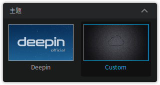

> ：如果您要使用自定义的主题样式，请分别对窗口、图标、光标、壁纸、字体进行设置。

### 设置窗口

1. 在控制中心面板，点击 **个性化**。
2. 在 **窗口** 折叠框中，选择一款窗口样式进行切换。

 

### 设置图标
1. 在控制中心面板，点击 **个性化**。
2. 在 **图标** 折叠框中，选择一款图标样式进行切换。

 

### 设置光标
1. 在控制中心面板，点击 **个性化**。
2. 在 **光标** 折叠框中，选择一款光标进行切换。

 

### 设置壁纸

#### 系统自带壁纸
系统默认会自带不同类型的壁纸，您可以选择喜欢的壁纸进行切换。

1. 在控制中心面板，点击 **个性化**。
2. 在 **壁纸** 折叠框中，选择一款壁纸图片进行切换。

 

#### 获取外部图片
您还可以将自己喜欢的图片设置为桌面壁纸。

1. 打开外部获取的图片，右键单击 **设为桌面壁纸**。
2. 桌面壁纸将自动切换成当前图片显示。
3. 如果要删除外部壁纸，进入控制中心点击 **个性化** > **壁纸**。
4. 点击图片右上角按钮将其删除。

 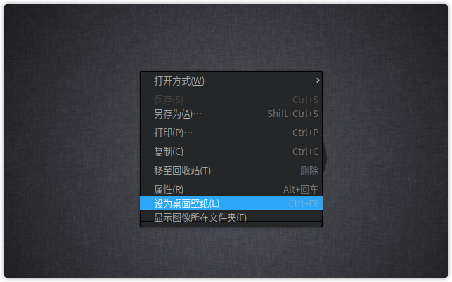

### 设置字体

1. 在控制中心面板，点击 **个性化**。
2. 在 **字体** 折叠框中，设置系统显示字体的类型和大小。

 

## 网络设置|common/icon_network.svg|

体验网上冲浪带来的乐趣！您可以在网络上浏览新闻、在线视频播放，也可以下载文件、聊天、网上购物等操作。

### 查看网络
您可以查看电脑当前的网络连接状态和详细信息。

1. 在控制中心面板，点击 **网络**。
2. 如果在接入的网络名称前显示 ，表示当前电脑已接入网络。
3. 点击  查看当前选中的网络详细信息。
4. 点击右上角的 ，查看全部已连接网络详细信息。
5. 如果要退出详细信息界面，请点击 **取消**。

 

### 新建网络
您可以通过拨号上网或连接VPN的方式接入网络。

1. 在控制中心面板，点击 **网络**。
2. 点击 。
3. 选择网络连接类型。
4. 点击 **下一步**。
5. 输入用户名和密码等信息。
6. 点击 **添加**。

 

### 连接网络
您可以使用网线将电脑连接到路由器或网络端口来接入有线网络。如果您的电脑已经配备了无线设备，通过搜索您身边已知的无线网络并接入。

#### 连接有线网络

1. 将网线插入电脑上的网络插孔。
2. 将网线的另一端插入路由器或网络端口。
3. 在控制中心面板，点击 **网络**。
4. 将 **有线网络** 按钮向右滑动，开启有线网络连接功能。
5. 当网络连接成功后，在桌面将会弹出“已连接有线连接”的提示信息。

  

#### 连接无线网络

- 多数笔记本都已经内置了无线网卡，您只要开启无线网络开关就可以连接到无线网络。
- 大部分的台式电脑没有配置无线网卡，如果需要使用无线网络，您可以购买一个无线网卡插入到电脑，电脑将会自动识别出该无线设备。

1. 在控制中心面板，点击 **网络**。
2. 将 **无线网络** 按钮向右滑动，开启无线网络连接功能。
3. 电脑会自动搜索并显示附近可用的无线网络。
4. 选择需要连接的无线网络：
 -  如果该网络是开放的，将自动连接到此网络。
 -  如果该网络是加密的，请根据提示输入密码，点击 **保存**，然后将自动完成连接。

 

#### 删除无线网络
您可以将多余的无线网络从列表中删除。

1. 在控制中心面板，点击 **网络**。
2. 选择需要删除的无线网络，点击 。
3. 点击 **删除此网络**，将会弹出“您确认要删除此网络吗？”的提示信息。
4. 点击 **删除**。

 

### 开启网络自动连接
当接入有线或无线网络后，您可以开启自动连接功能，下次登录时您的电脑会自动连接到此网络。

1. 在控制中心面板，点击 **网络**。
2. 选择要设置自动连接的网络，点击 。
3. 将 **自动连接** 按钮向右滑动，开启自动连接功能。
4. 点击 **保存**。

 

### 手动配置 IP 地址
您可以进入有线或无线网络中手动配置 IP 地址。
1. 在控制中心面板，点击 **网络**。
2. 选择要配置的网络，点击 。
3. 点击 **IPv4** 或 **IPv6** 。
4. 在 **方法** 下拉选项中，选择 **手动**。
5. 输入IP 地址、子网掩码、网关和 DNS 服务器地址。
6. 点击 **保存**。

 

### 设置网络代理
通过设置代理服务器，您可以突破网络限制，让您的网络畅通无阻。

1. 在控制中心面板，点击 **网络**。
2. 点击 **系统代理**，您可以：
  - 点击 **无**，关闭代理服务器功能。
  - 点击 **手动**，输入代理服务器的地址和端口信息。
  - 点击 **自动**，输入URL，系统将自动配置代理服务器的信息。
3. 点击 **应用到整个系统**。

 

## 声音设置|common/icon_sound.svg|
设置系统音量大小，您可以通过执行以下操作之一来调节：

- 将鼠标指针置于  上，拖动音量滑块。
- 在任务栏上，点击  或点击  > **声音** 进入控制中心面板来设置声音。
- 通过应用程序本身具有的音量控件来设置。

### 设置扬声器
目前，电脑中一般都已经内置了扬声器，您不用外接音箱或配带耳机就可以收听到播放器发出的声音。

1. 在控制中心面板，点击 **声音**。
2. 将 **扬声器** 按钮向右滑动，开启扬声器功能。
3. 通过左右拖动滑块来调节输出音量和左/右平衡。

 

### 设置麦克风
一般情况下，电脑系统中已经内置了麦克风，您可以使用麦克风进行录音或与他人进行通话。

1. 在控制中心面板，点击 **声音**。
2. 将 **麦克风** 按钮向右滑动，开启麦克风功能。
3. 通过左右拖动滑块来增大或减小输入音量。

 

### 高级设置
您可以进入高级设置选项对输入和输出进行更详细的设置。

1. 在控制中心面板，点击 **声音**。
2. 点击 **显示高级设置**。
3. 分别对输出和输入的端口和设备进行设置。

 

## 日期和时间|common/icon_dateandtime.svg|
系统对日期和时间已经进行了初始化设置，您可以在任务栏上查看日期和时间是否正确。

### 查看日期和时间
- 当任务栏为时尚模式显示时，时间将以  形式显示在任务栏上。将鼠标指针置于  上可以查看日期。
- 当任务栏为高效模式或经典模式显示时，时间将以 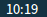 形式显示在任务栏的右侧。将鼠标指针置于  上可以查看日期。

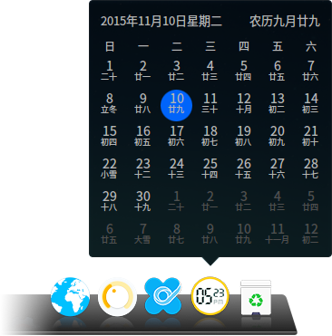 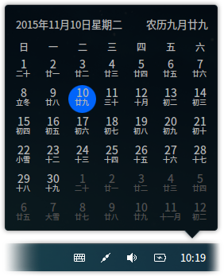 

> ：点击时间或右键单击时间 > **时间设置** 可以打开控制中心面板来进行日期和时间设置。

### 切换显示方式
- 当任务栏为时尚模式显示时，右键单击  > **切换显示方式**，时间将以  形式显示。

- 当任务栏为高效模式或经典模式显示时，右键单击  > **显示日期** 或 **显示星期几**，在任务栏上将显示日期或星期。

### 显示24小时制
24小时制区别于12小时制，在24小时制中，下午1点，被写成13点。

1. 在控制中心面板，点击 **日期和时间**。
2. 将 **24小时制** 按钮向右滑动，开启24小时制功能。

 

### 自动同步
开启自动同步功能，电脑会自动通过网络获取时间，并根据您所在的地区或位置来同步更新时间。

1. 在控制中心面板，点击 **日期和时间**。
2. 将 **自动同步** 按钮向右滑动，开启自动同步功能。

 

### 手动设置
您可以根据身边其他的时间工具如钟表、官方时间等来手动设置时间。

> ：如果您已经开启了自动同步功能，则不能手动修改日期和时间。

#### 设置时间

1. 在控制中心面板，点击 **日期和时间**。
2. 双击顶部显示框中的时间，您可以：
  - 点击  和  来校正时间。
  - 手动输入数字来更改时间。
3. 点击 **保存**，完成时间修改。

 

#### 设置日期

1. 在控制中心面板，点击 **日期和时间**。
2. 在 **日期** 选项，通过点击  和  来更改年份和月份。
3. 使用鼠标选定日期。
4. 点击 。
5. 点击 **确定**，完成日期修改。

 

### 设置时区
系统安装简体中文语言后，一般默认显示北京时间。如果您身处其它国家或地区，需要将电脑设置为当地的时间，您还可以添加当地的时区。

1. 在控制中心面板，点击 **日期和时间**。
2. 在 **时区** 选项，您可以：
  - 点击 ，在时区列表中选中需要添加的时区，点击 **添加**。
  - 点击 ，选中要删除的时区，点击 **确定**。

 

## 电源管理|common/icon_powermanagement.svg|
配置电源管理方案，为您的办公、娱乐提供强劲动力。

### 按下电源按钮操作
当您按下电源按钮后，让电脑将自动执行下一步操作。

1. 在控制中心面板，点击 **电源管理**。
2. 在 **按下电源按钮** 选项，您可以：
  - 选择 **关机**，当您按下电源按钮时，系统将会关机。
  - 选择 **待机**，当您按下电源按钮时，系统将会进入待机状态。
  - 选择 **询问**，当您按下电源按钮时，系统将会询问您的操作。

 

如果您使用的是笔记本电脑，还可以设置合上笔记本电脑后的下一步操作。

1. 在控制中心面板，点击 **电源管理**。
2. 在 **合上笔记本盖子** 选项，您可以：
  - 选择 **关机**，当您合上笔记本时，系统将会关机。
  - 选择 **待机**，当您合上笔记本时，系统将会进入待机状态。
  - 选择 **无**，当您合上笔记本时，系统将无任何操作。

 

### 唤醒操作
开启唤醒密码功能，保护您的个人资料安全。

1. 在控制中心面板，点击 **电源管理**。
2. 将 **唤醒需要密码** 按钮向右滑动，开启唤醒需要密码功能。

 

### 电源节能操作
对电源进行设置和优化，让您的办公娱乐持久续航。

1. 在控制中心面板，点击 **电源管理**。
2. 在 **接通电源** 选项，您可以：
  - 选择 **均衡**，电脑将会在闲置10分钟后关闭显示器以节省电源使用。
  - 选择 **节能**，电脑将会在闲置5分钟后关闭显示器，在闲置15分钟后进入待机状态。
  - 选择 **高性能**，电脑将会在需要时提供完全性能，在闲置15分钟后关闭显示器。
  - 选择 **自定义**，您可以创建并自定义关闭显示器和进入待机状态的时间。

 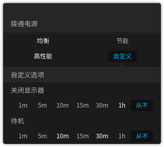

如果您使用的是笔记本电脑，还可以设置笔记本电脑的电池使用模式，使电池使用达到最优。

1. 在控制中心面板，点击 **电源管理**。
2. 在 **使用电池** 选项，您可以：
  - 选择 **均衡**，电脑将会在闲置10分钟后关闭显示器以节省电源使用。
  - 选择 **节能**，电脑将会在闲置5分钟后关闭显示器，在闲置15分钟后进入待机状态。
  - 选择 **高性能**，电脑将会在需要时提供完全性能，在闲置15分钟后关闭显示器。
  - 选择 **自定义**，您可以创建并自定义关闭显示器和进入待机状态的时间。

 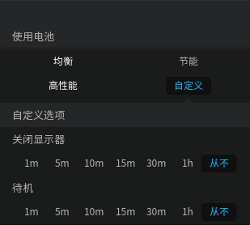

## 鼠标和触摸板|common/icon_mouse.svg|

您可以根据个人习惯设置鼠标并借助触摸板来操作电脑。

>  ：如果您使用的是台式机电脑，在控制中心面板仅显示 **鼠标**，如果您使用的是笔记本电脑，在控制中心面板将显示 **鼠标和触摸板**。

### 设置鼠标
您可以根据操作习惯调整指针灵敏度来满足日常操作。

1. 在控制中心面板，点击 **鼠标和触摸板**。
2. 在 **主按键** 选项，点击 **左键** 或 **右键** 来切换左/右键作为主按键。
3. 在 **指针移动速度** 选项，通过左右拖动滑条来调节鼠标移动速度的快慢。
4. 在 **双击速度** 选项，通过左右拖动滑条来调节鼠标的双击速度。

 

### 禁用触摸板

> ：如果您开启了该功能，在触摸板上的操作将会被禁用，对触摸板进行的所有设置也将全部无效。

1. 在控制中心面板，点击 **鼠标和触摸板**。
2. 将 **插入鼠标时禁用触摸板** 按钮向右滑动，开启禁用触摸板功能。
3. 将 **触摸板** 按钮向左滑动，开启禁用触摸板功能。

 

### 开启触摸板
如果您使用的是笔记本电脑，您可以使用电脑上的触摸板来代替鼠标使用。

> ：当您的 **插入鼠标时禁用触摸板** 功能未被开启时，此时对触摸板执行开启操作才能生效。

1. 在控制中心面板，点击 **鼠标和触摸板**。
2. 将 **触摸板** 按钮向右滑动，开启触摸板功能。

 

#### 设置触摸板

1. 在控制中心面板，点击 **鼠标和触摸板**。
2. 在 **主按键** 选项，点击 **左键** 或 **右键** 来切换左/右键作为主按键。
3. 在 **指针移动速度** 选项，通过左右拖动滑条来调节触摸板鼠标移动速度的快慢。
4. 在 **双击速度** 选项，通过左右拖动滑条来调节触摸板鼠标的双击速度。
5. 在 **拖动阈值** 选项，通过左右拖动滑条来调节触摸板鼠标移动速度范围。

#### 设置触摸滚动

1. 在控制中心面板，点击 **鼠标和触摸板**。
2. 将 **自然滚动** 按钮向右滑动，开启自然滚动功能。
3. 将 **轻触以点击** 按钮向右滑动，开启轻触点击功能。
4. 将 **双指滚动** 按钮向右滑动，开启双指滚动功能。
5. 将 **边缘滚动** 按钮向右滑动，开启边缘滚动功能。

触摸滚动的相关操作说明如下：

- **自然滚动：** 双指在触摸板向上/向下滑动，页面内容随着向上/向下显示。
- **轻触以点击：** 轻触触摸板即可执行点击操作。
- **双指滚动：** 双指在触摸板向上/向下滑动，可以执行滚动操作。
- **边缘滚动：** 在触摸板的边缘区域可以执行滚动操作。

## 键盘和语言|common/icon_keyboardandlanguage.svg|
您可以根据国家和地区，选择您的键盘输入习惯和布局。

### 开启大写键提示
开启大写键提示功能，在您按下大写锁定键时，提醒您当前已切换到大写输入状态，避免造成字符错误。

1. 在控制中心面板，点击 **键盘和语言**。
2. 将 **大写键提示** 按钮向右滑动，开启大写键提示功能。

 

### 设置系统语言
在安装系统的过程中，您可以选择系统默认的显示语言。登录电脑后，您可以更改系统的显示语言。

1. 在控制中心面板，点击 **键盘和语言**。
2. 在 **语言**折叠框中，当前系统的显示语言前将显示 。
3. 选择需要切换的语言，系统将自动开始安装语言包。
4. 语言包安装完成后，弹出“语言切换成功，请注销后重新登录”的提示框。
5. 注销并重新登录电脑，系统的显示语言完成更改。

> ：更改系统语言时，键盘布局可能也会发生改变。重新登录时，请确保使用正确的键盘布局来输入密码。

 

### 设置键盘布局

系统默认的键盘布局一般是美式键盘，您可以添加其他的键盘布局。

#### 添加键盘布局

1. 在控制中心面板，点击 **键盘和语言**。
2. 在 **键盘布局** 选项，点击 。
3. 在键盘布局列表中选择要添加的键盘布局。
4. 点击 **完成**。
5. 如果要删除键盘布局，在 **键盘布局** 选项，点击 。

 

#### 切换键盘布局
1. 在控制中心面板，点击 **键盘和语言**。
2. 在 **键盘布局** 选项，选择一个键盘布局进行切换。
3. 当切换键盘布局成功后，在当前使用的键盘布局前将显示 。

 

### 设置键盘属性

1. 在控制中心面板，点击 **键盘和语言**，您可以：
   - 在 **重复延迟** 选项，通过左右拖动滑条来调节第一个字符和第二个字符之间的时间间隔。
   - 在 **重复速度** 选项，通过左右拖动滑条来调节重复出现字符的速度。
   - 在 **光标闪烁频率** 选项，通过左右拖动滑条来调重复出现字符的速度。
2. 在 **测试区** 中，您可以实时测试键盘的设置效果。

 

## 快捷键设置|common/icon_shortcuts.svg|
巧用快捷键，帮您节省宝贵的时间。

### 查看快捷键
您可以查看到系统默认设置的所有快捷键，同时还可以修改、删除或自定义快捷键。

1. 在控制中心面板，点击 **快捷键**。
2. 点击 **系统**、**窗口** 和 **工作区**，系统快捷键、窗口快捷键和工作区快捷键将分别显示在对应的折叠框中。

<table class="block1">
    <caption>系统快捷键</caption>
    <tbody>
        <tr>
            <td>启动器</td>
            <td>Super</td>
        </tr>
        <tr>
            <td>显示桌面</td>
            <td>Super+D</td>
        </tr>
        <tr>
            <td>锁定界面</td>
            <td>Super+L</td>
        </tr>
         <tr>
            <td>文件管理器</td>
            <td>Super+E</td>
        </tr>
        <tr>
        <tr>
            <td>显示/隐藏任务栏</td>
            <td>Super+H</td>
        </tr>
        <tr>
            <td>屏幕截图</td>
            <td>Control+Alt+A</td>
        </tr>
         <tr>
            <td>窗口截图</td>
            <td>Alt+Print</td>
        </tr>
        <tr>
            <td>延时截图</td>
            <td>Control+Print</td>
        </tr>
        <tr>
            <td>终端</td>
            <td>Control+Alt+T</td>
        </tr>
        <tr>
            <td>终端雷神模式</td>
            <td>F4</td>
        </tr>
        <tr>
            <td>注销</td>
            <td>Control+Alt+Delete</td>
        </tr>
        <tr>
            <td>切换键盘布局</td>
            <td>Super+Space</td>
        </tr>
        <tr>
            <td>显示工作区</td>
            <td>Super+S</td>
        </tr>
        <tr>
            <td>显示当前工作区的窗口</td>
            <td>Super+W</td>
        </tr>
        <tr>
            <td>显示所有工作区的窗口</td>
            <td>Super+A</td>
        </tr>
        <tr>
            <td>切换同类型窗口</td>
            <td>Alt+～</td>
        </tr>
        <tr>
            <td>反向切换同类型窗口</td>
            <td>Alt+Shift+～</td>
        </tr>
        <tr>
            <td>切换窗口</td>
            <td>Alt+Tab</td>
        </tr>
        <tr>
            <td>反向切换窗口</td>
            <td>Alt+Shift+Tab</td>
        </tr>
    </tbody>
 </table>

<table class="block1">
    <caption>窗口快捷键</caption>
    <tbody>
        <tr>
            <td>关闭窗口</td>
            <td>Alt+F4</td>
        </tr>
        <tr>
            <td>最大化窗口</td>
            <td>Super+Up</td>
        </tr>
        <tr>
            <td>恢复窗口</td>
            <td>Super+Down</td>
        </tr>
        <tr>
            <td>移动窗口</td>
            <td>Alt+F7</td>
        </tr>
        <tr>
            <td>改变窗口大小</td>
            <td>Alt+F8</td>
        </tr>
    </tbody>
 </table>
 
 <table class="block1">
    <caption>工作区快捷键</caption>
    <tbody>
        <tr>
            <td>切换到左边工作区</td>
            <td>Super+Left</td>
        </tr>
        <tr>
            <td>切换到右边工作区</td>
            <td>Super+Right</td>
        </tr>
        <tr>
            <td>移动到左边工作区</td>
            <td>Super+Shift+Left</td>
        </tr>
        <tr>
            <td>移动到右边工作区</td>
            <td>Super+Shift+Right</td>
        </tr>
    </tbody>
 </table>

### 搜索快捷键
您可以使用搜索功能来快速找到需要的快捷键。

1. 在控制中心面板，点击 **快捷键**。
2. 在顶部的搜索框中输入关键字，搜索栏会自动列出包含关键字的所有快捷键。

 

### 修改快捷键
您可以使用系统默认的快捷键设置，也可以根据个人习惯设置新的快捷键。

1. 在控制中心面板，点击 **快捷键**。
2. 点击需要修改的快捷键。
3. 使用键盘输入新的快捷键。
4. 如果要禁用快捷键，请按下键盘上的  键或  键。

### 自定义快捷键
自定义更多的快捷键，简化您的操作。

1. 在控制中心面板，点击 **快捷键**。
2. 在 **自定义** 选项，点击 。
3. 输入快捷键名称和命令。
4. 点击 **添加**。
5. 如果要删除快捷键，请点击 。

 

## 远程协助设置|common/icon_remoteassistance.svg|

您可以通过远程协助操作来协助用户、技术人员解决问题，还可以进行远程协助办公、培训、交互式教学等使用。

 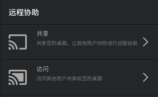

### 共享操作
当您需要在线寻求帮助或解决问题时，您可以发起远程协助共享功能，共享桌面给控制端来进行操作。

1. 在控制中心面板，点击 **远程协助**。
2. 在远程协助界面，点击 **共享**。
3. 系统会自动生成一个验证码。
4. 点击 **复制验证码**，可以将验证码发送给控制端。

> ：系统产生的验证码为随机分配的，如果控制端长时间未使用接入，该验证码将失效，您需要重新产生新的验证码。

 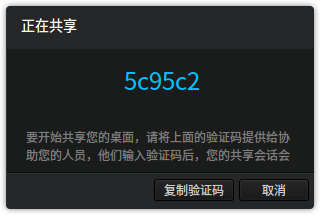

### 接入操作

如果对方请求远程协助控制，您可以通过获取对方的验证码，通过输入验证码接入并控制对方的桌面。

1. 获取被控端的验证码。
2. 在控制中心面板，点击 **远程协助**。
3. 在远程协助界面，点击 **访问**，手动输入或直接粘贴验证码。
4. 点击 **连接**，进入被控端的桌面，您可以帮助解决问题或进行其他操作。

 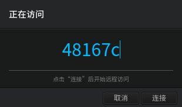

### 远程连接

当您输入验证码后，系统会进入对方的远程桌面中，您可以对桌面进行控制操作，同时设置远程桌面显示的效果。

当您连接远程桌面成功后，点击 **选项** 下拉菜单，您可以：

 - 设置平衡，使远程桌面达到平衡的状态。
 - 设置最优速度，使远程协助网络达到最佳速度。
 - 设置最优质量，保证远程协助桌面的画面达到最佳显示。
 - 设置全屏，调整到全屏模式以便您更加方便的进行远程操作。

 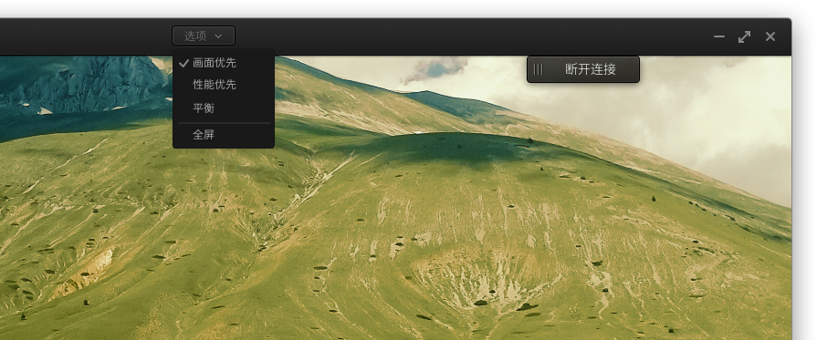

### 断开连接

当您完成远协助相关操作后，可以通过远程协助桌面中的按钮来结束并断开连接。

1. 点击 **断开连接**，系统提示您确定需要关闭远协助桌面连接。
2. 点击 **确定**，您可以结束本次远程协助操作。

> ：如果您正在使用远程桌面操作时，由于其他原因导致网络中断，系统将间隔一段时间后自动断开远程连接。

 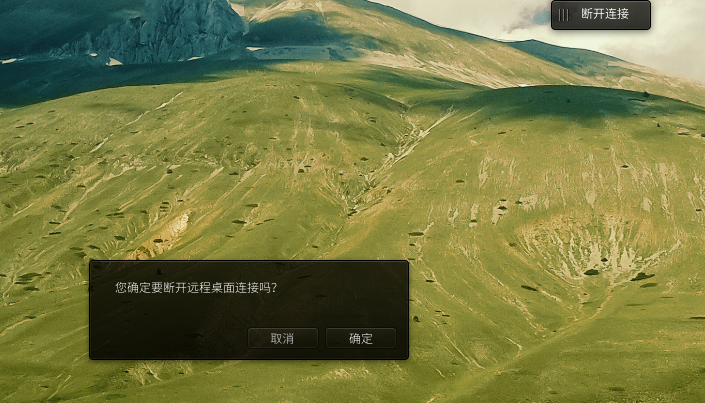

## 启动菜单设置|common/icon_bootmenu.svg|
多系统，多选择，通过启动菜单设置让您的系统启动生动起来。

### 设置默认启动系统
当电脑安装了多个操作系统时，您可以通过设置让电脑在启动时默认选择一个系统运行。

1. 在控制中心面板，点击 **启动菜单**。
2. 在 **默认启动** 折叠框中，选择电脑开机后默认启动的操作系统。

 

### 设置启动延时时间
延迟系统启动的时间，方便您进行更多其他操作。

1. 在控制中心面板，点击 **启动菜单**。
2. 在 **启动延时** 折叠框中，设置延迟启动的时间。

 

### 设置启动界面背景
您可以进入控制中心来更换启动界面的背景。

1. 在控制中心面板，点击 **启动菜单**。
2. 将要使用的图片拖拽到预览窗口中以更换背景。

 

### 设置启动界面文字颜色
您可以将启动界面的文字设置成不同的颜色以示区别。

1. 在控制中心面板，点击 **启动菜单**。
2. 在 **启动菜单** 折叠框中，您可以：
  - 点击 **文字颜色**，设置启动界面未启动的操作系统的显示颜色。
  - 点击 **选中文字颜色**，设置启动界面默认启动的操作系统的显示颜色。

 

## 系统信息|common/icon_systeminfo.svg|
您可以查看系统版本和电脑硬件等信息。

### 查看系统信息

1. 在控制中心面板，点击 **系统信息**。
2. 在 **系统信息** 选项，您可以：
  - 查看当前使用的操作系统的版本号。
  - 查看当前使用的操作系统是64位/32位。
  - 查看电脑CPU的型号。
  - 查看电脑内存大小。
  - 查看电脑硬盘容量。

 

### 查看公共许可协议

1. 在控制中心面板，点击 **系统信息**。
2. 点击 **GNU通用公共许可协议**。
3. 查看GNU通用公共许可协议详细描述。

### 更新

#### 设置更新源

#### 更新应用和系统

