# 控制中心|../common/deepin-controlcenter.svg|

## 概述|../common/icon_overview.svg|

深度操作系统通过控制中心来管理系统的基本设置，包括帐户管理、网络设置、日期和时间、个性化、屏幕显示设置等。

当您进入深度桌面环境后，只需要将鼠标移至屏幕右下角即可打开控制中心面板。

在控制中心面板，您可以：

- 修改键盘的属性
- 调节系统音量大小
- 优化电源功能
- 个性化桌面显示
- 更改网络连接
- 创建新帐户
- 修改系统显示日期和时间
- 进入关机界面
- 系统和应用更新升级

## 使用入门|../common/icon_guide.svg|

控制中心面板主要由系统管理员帐户、系统基本设置、电源按钮组成。

> ：打开/退出控制中心和电源显示界面，具体操作请参阅 [打开启动器和控制中心](dman:///dde#打开启动器和控制中心)和[开机和关机](dman:///dde#开机和关机)。

 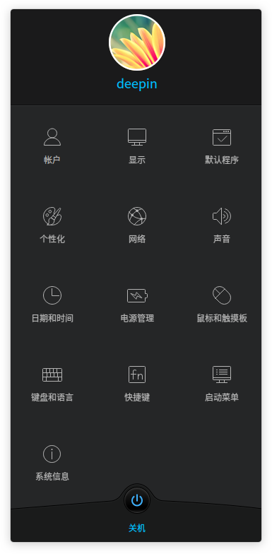

<table class="block1">

<caption>图标说明</caption>

<tbody>
<tr>
<td></td>
<td>点击可对帐户进行创建、管理等操作。
</td>
<td></td>
<td>点击可对显示器的分辨率、亮度等进行设置。
</td>
</tr>
<tr>
<td></td>
<td>点击可对默认启动程序进行设置。
</td>
<td></td>
<td>点击可对窗口、图标、光标、字体进行设置。
</td>
</tr>
<tr>
<td></td>
<td>点击可对网络进行设置。
</td>
<td></td>
<td>点击可对扬声器和麦克风进行设置。
</td>
</tr>
<tr>
<td></td>
<td>点击可对日期和时间进行设置。
</td>
<td></td>
<td>点击可对电源进行设置。
</td>
</tr>
<tr>
<td></td>
<td>点击可对鼠标和笔记本触摸板进行设置。
</td>
<td></td>
<td>点击可对键盘布局和语言进行设置。
</td>
</tr>
<tr>
<td></td>
<td>点击可对系统的快捷键进行设置。
</td>
<td></td>
<td>点击可对默认启动菜单进行设置。
</td>
</tr>
<tr>
<td></td>
<td>点击可查看系统详细信息以及系统和软件升级。
</td>
<td></td>
<td>
</td>
</tr>
</tbody>
</table>

## 帐户设置|../common/icon_account.svg|
通过设置帐户为您的计算机提供安全保障，保护您的个人隐私和数据。

### 自动登录
您可以开启自动登录功能，当每次启动电脑后，将自动使用该帐户登录系统。

1. 在控制中心面板，点击 **帐户**。
2. 选择需要设置的帐户，点击 **自动登录** 开关按钮，开启自动登录功能。
3. 在弹出的授权界面，输入帐户密码来授权此项操作。

 

### 更改帐户头像
 
您可以通过以下方式来设置头像，让您的头像充满个性。
 
- 使用系统自带的帐户头像。
 
- 使用您喜欢的图片作为帐户头像。
  
 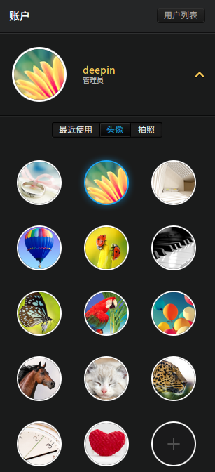
 

1. 在控制中心面板，点击 **帐户**。
 
2. 选择需要更改头像的帐户，您可以：
 
 - 点击 **头像**，选择一款您喜欢的头像进行更改。
 
 - 点击 ，选择电脑中存储的其他图片来设置帐户头像。
 
3. 在弹出的授权界面，输入帐户密码来授权此项操作。
 
### 更改帐户密码
在安装系统的过程中，系统会提示您设置一个默认的帐户密码。登录电脑后，您可以更改默认的帐户密码。

1. 在控制中心面板，点击 **帐户**。
2. 选择需要改密码的帐户，在 **密码** 选项，点击 ••••。
3. 输入一个新的密码和确认密码。
4. 点击 **确定**。

 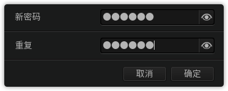

### 创建新帐户
登录电脑后，您可以创建一个新的帐户，在使用过程中可以切换用户来操作。

1. 在控制中心面板，点击 **帐户**。
2. 点击右上角的 。
3. 输入新帐户的用户名、密码并再次确认密码。 
4. 选择是否开启自动登录功能。
5. 点击 **确定**，新帐户将自动添加到帐户列表中。
 
 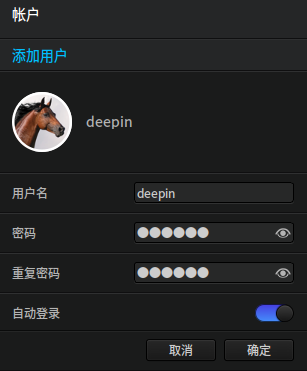

 
## 显示设置|../common/icon_display.svg|
通过设置显示器的分辨率、亮度、屏幕方向，以及扩展屏幕，让您的电脑显示到达最佳状态。

### 单屏设置
您可以通过设置显示器的分辨率、亮度等来调节屏幕的视觉观感。

#### 设置分辨率

1. 在控制中心面板，点击 **显示**。
2. 在 **分辨率** 折叠框中，选择需要切换的分辨率。
3. 点击 **应用**。

 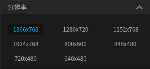

#### 设置旋转方向

1. 在控制中心面板，点击 **显示**。
2. 在 **旋转** 折叠框中，选择桌面屏幕的显示方向。
3. 点击 **应用**。

 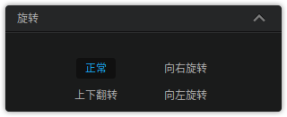

#### 设置亮度

1. 在控制中心面板，点击 **显示**。
2. 在 **亮度** 选项，通过左右拖动滑条来调节屏幕亮度。

 

### 多屏设置
 
多屏显示，让您的视野无限延伸！
 
您可以使用VGA线缆将您的电脑和另一台显示器、投影仪等连接起来，同时在多个屏幕上来显示您电脑上的内容。

#### 设置显示模式
您可以通过设置显示模式在一个或多个显示器上显示屏幕内容。

1. 在控制中心面板，点击 **显示**。
2. 在 **显示模式** 折叠框中，您可以：
 - 选择 **复制**，将一个屏幕的内容复制到其他屏幕中。
 - 选择 **扩展**，将一个屏幕的内容扩展到其他屏幕中，在不同的屏幕上显示不同的内容。
 - 选择 **仅在LVDS1显示**，将只在 LVDS1显示设备上显示屏幕内容，其他屏幕不显示。
 - 选择 **仅在VGA-1上显示**，将只在 VGA-1 显示设备上显示屏幕内容，其他屏幕不显示。

 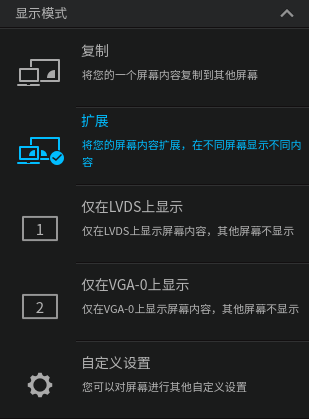

> ：当系统识别为多屏接入时，默认显示扩展模式。

#### 自定义设置
您可以对多屏显示下的其他选项进行设置，同时系统会保存最近一次自定义设置。

1. 在控制中心面板，点击 **显示**。
 
2. 点击 **自定义设置**，您可以：
 
 - 在 **启用显示器** 折叠框中，选择您要使用的显示设备。
 - 在 **主屏** 折叠框中，选择您要使用的主显示设备。
 - 在 **分辨率** 折叠框中，设置显示设备的分辨率。
 - 在 **旋转** 折叠框中，设置显示设备的屏幕方向。
 - 在 **亮度** 折叠框中，设置显示设备的显示亮度。

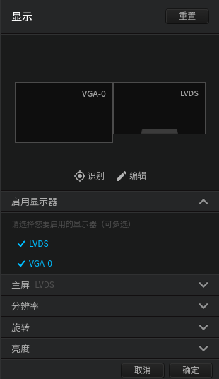

#### 识别多个显示器
当接入多个显示器时，如果您已经将显示模式设置为复制或扩展，您可以通过识别功能来区分各个显示设备。

1. 在控制中心面板，点击 **显示**。
2. 点击 **识别**，在各个显示器的屏幕上您将看到对应的显示设备名称。

 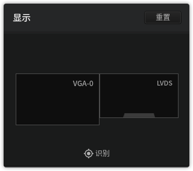

## 默认程序设置|../common/icon_defaultapp.svg|

### 默认启动设置
当系统中同一类型的应用程序安装多个时，您可以通过选择其中的一个程序来作为默认启动的应用程序。

1. 在控制中心面板，点击 **默认程序**。
2. 在 **默认程序** 选项，您可以：
 - 在 **浏览器** 折叠框中，选择默认使用的浏览器。
 - 在 **邮件** 折叠框中，选择默认使用的邮件客户端。
 - 在 **文本工具** 折叠框中，选择默认使用的文本编辑器。
 - 在 **音乐** 折叠框中，选择默认使用的音乐播放器。
 - 在 **视频** 折叠框中，选择默认使用的视频播放器。
 - 在 **图片** 折叠框中，选择默认使用的图片编辑器。
 - 在 **终端** 折叠框中，选择默认使用的终端工具。

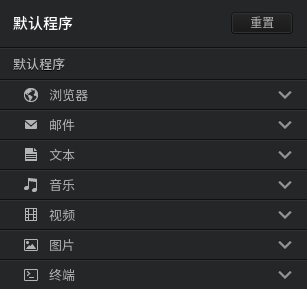

### 自动播放设置
开启自动播放功能，当您将DVD等媒体存储设备放入电脑中时，电脑会自动执行下一步操作。

1. 在控制中心面板，点击 **默认程序**。
2. 点击 **自动播放** 开关按钮，开启自动播放功能。
3. 在显示的各个折叠框中，您可以设置媒体文件、应用程序的默认打开方式。

 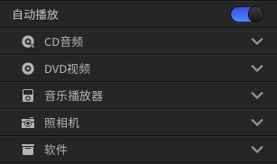

## 个性化设置|../common/icon_personalization.svg|
 
您可以通过使用不同的桌面壁纸、图标、窗口样式等来改变桌面的外观，设置成您喜欢的显示风格。
 
### 设置窗口

1. 在控制中心面板，点击 **个性化**。
2. 在 **窗口** 折叠框中，选择一款窗口样式进行切换。

 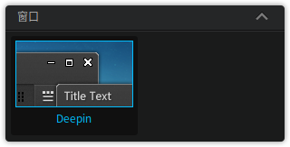

### 设置图标

1. 在控制中心面板，点击 **个性化**。
2. 在 **图标** 折叠框中，选择一款图标样式进行切换。

 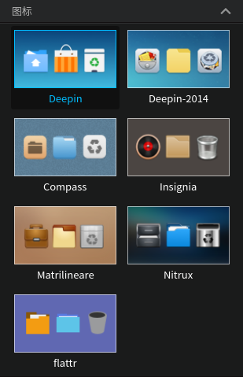

### 设置光标

1. 在控制中心面板，点击 **个性化**。
2. 在 **光标** 折叠框中，选择一款光标进行切换。

 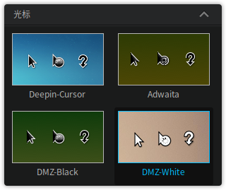

### 设置字体

1. 在控制中心面板，点击 **个性化**。
2. 在 **字体** 折叠框中，设置系统显示字体的类型和大小。

 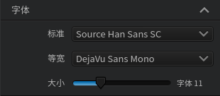

## 网络设置|../common/icon_network.svg|
体验网上冲浪带来的乐趣！您可以在网络上浏览新闻、在线视频播放，也可以下载文件、聊天、网上购物等操作。

### 查看网络
您可以查看电脑当前的网络连接状态和详细信息。

> ：如果在接入的网络名称前显示 ，表示当前电脑已接入网络。

1. 在控制中心面板，点击 **网络**。
2. 点击 ，查看当前选中的网络详细信息。
3. 点击右上角的 ，查看全部已连接网络详细信息。

 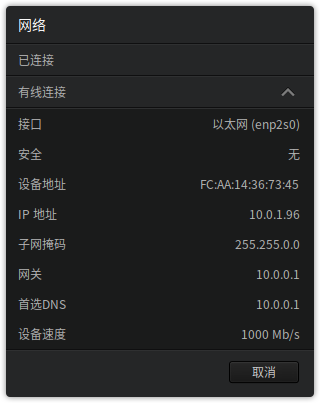

### 添加网络
您可以通过拨号上网或连接 VPN 的方式接入网络，以下操作以添加 VPN 网络为例。

1. 在控制中心面板，点击 **网络**。
2. 点击右上角的 。
3. 选择网络类型。
4. 点击 **下一步**。
5. 选择 VPN 类型，根据实际情况输入基本信息。
6. 点击 **添加**。

 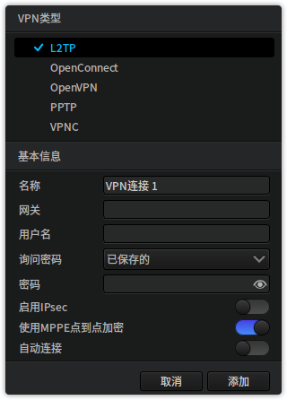

### 连接网络
您可以使用网线将电脑连接到路由器或网络端口来接入有线网络。

如果您的电脑已经配备了无线设备，通过搜索您身边已知的无线网络并接入。

#### 连接有线网络

1. 将网线插入电脑上的网络插孔。
2. 将网线的另一端插入路由器或网络端口。
3. 在控制中心面板，点击 **网络**。
4. 点击 **有线网络** 开关按钮，开启有线网络连接功能。
5. 当网络连接成功后，在桌面将会弹出“已连接有线连接”的提示信息。

 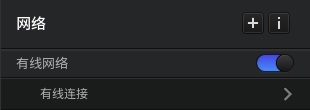

#### 连接无线网络
 
- 多数笔记本都已经内置了无线网卡，您只要开启无线网络开关就可以连接到无线网络。
 
- 大部分的台式电脑没有配置无线网卡，如果需要使用无线网络，您可以购买一个无线网卡插入到电脑，电脑将会自动识别出该无线设备。

1. 在控制中心面板，点击 **网络**。
2. 点击 **无线网络** 开关按钮，开启无线网络连接功能。
3. 电脑会自动搜索并显示附近可用的无线网络。
4. 选择需要连接的无线网络：
 - 如果该网络是开放的，将自动连接到此网络。
 - 如果该网络是加密的，请根据提示输入密码，点击 **连接**，然后将自动完成连接。

 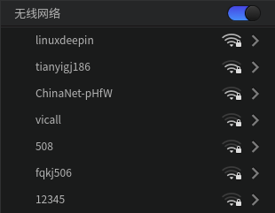

#### 删除无线网络
您可以将多余的无线网络从列表中删除。

1. 在控制中心面板，点击 **网络**。
2. 选择需要删除的无线网络，点击 。
3. 点击 **删除此网络**，将会弹出“您确认要删除此网络吗？”的提示信息。
4. 点击 **删除**。

 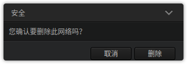

### 开启网络自动连接
当接入有线或无线网络后，您可以开启自动连接功能，下次登录时您的电脑会自动连接到此网络。

1. 在控制中心面板，点击 **网络**。
2. 选择要设置自动连接的网络，点击 。
3. 点击 **自动连接** 开关按钮，开启自动连接功能。
4. 点击 **保存**。

 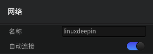

### 手动配置 IP 地址
您可以进入有线或无线网络中手动配置 IP 地址。

1. 在控制中心面板，点击 **网络**。
2. 选择要配置的网络，点击 。
3. 点击 **IPv4** 或 **IPv6** 。
4. 在 **方法** 下拉选项中，选择 **手动**。
5. 输入IP 地址、子网掩码、网关和 DNS 服务器地址。
6. 点击 **保存**。

 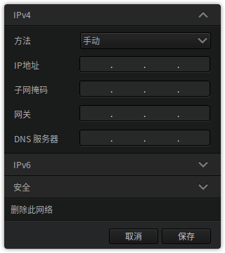

### 设置网络代理
通过设置代理服务器，您可以突破网络限制，让您的网络畅通无阻。

1. 在控制中心面板，点击 **网络**。
2. 在 **系统代理** 折叠框中，您可以：
 - 点击 **无**，关闭代理服务器功能。
 - 点击 **手动**，输入代理服务器的地址和端口信息。
 - 点击 **自动**，输入URL，系统将自动配置代理服务器的信息。
3. 点击 **应用到整个系统**。

 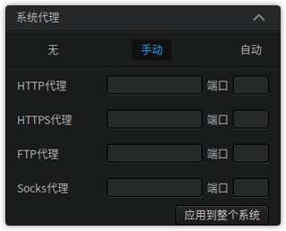

## 声音设置|../common/icon_sound.svg|
设置系统音量大小，您可以通过执行以下操作之一来调节：

- 点击  ，拖动音量滑块。
- 点击  > **声音** 进入控制中心面板来设置声音。
- 通过应用程序本身具有的音量控件来设置。

### 设置扬声器
一般笔记本电脑中都已经内置了扬声器，您不用外接音箱或配带耳机就可以收听到播放器发出的声音。

1. 在控制中心面板，点击 **声音**。
2. 点击 **扬声器** 开关按钮，开启扬声器功能。
3. 通过左右拖动滑块来调节输出音量和左/右平衡。

 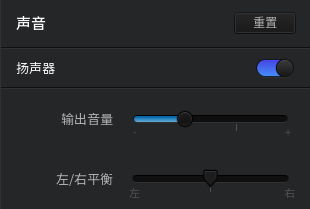

### 设置麦克风
一般情况下，电脑中已经内置了麦克风，您可以使用麦克风进行录音或与他人进行通话。

1. 在控制中心面板，点击 **声音**。
2. 点击 **麦克风** 开关按钮，开启麦克风功能。
3. 通过左右拖动滑块来增大或减小输入音量。

 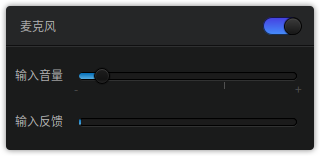

### 设置音效
系统默认集成并开启音效功能，当您执行登录、关机、注销、唤醒时会伴随着不同的系统音效。

1. 在控制中心面板，点击 **声音**。
2. 点击 **音效** 开关按钮，开启系统音效功能。
3. 执行相关操作时播放系统音效声音。
 
 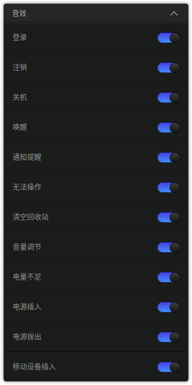

### 高级设置
您可以进入高级设置选项对输入和输出进行更详细的设置。

1. 在控制中心面板，点击 **声音**。
2. 点击 **显示高级设置**。
3. 分别对输出和输入的端口和设备进行设置。

 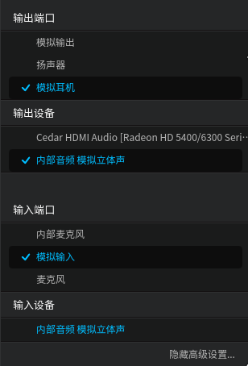

## 日期和时间|../common/icon_dateandtime.svg|
系统对日期和时间已经进行了初始化设置，您可以在任务栏上查看日期和时间是否正确。

### 查看日期和时间
 
- 当任务栏为时尚模式显示时，时间将以  形式显示在任务栏上。将鼠标指针置于  上可以查看日期。
 
- 当任务栏为高效模式显示时，时间将以  形式显示在任务栏的右下角。将鼠标指针置于  上可以查看日期。

### 显示24小时制
24小时制区别于12小时制，在24小时制中，下午1点，被写成13点。

1. 在控制中心面板，点击 **日期和时间**。
2. 点击 **24小时制** 开关按钮，开启24小时制功能。

 

### 自动同步
 
开启自动同步功能，电脑会自动通过网络获取时间，并根据您所在的地区或位置来同步更新时间。
 
> ：系统默认开启自动同步功能。
 
1. 在控制中心面板，点击 **日期和时间**。
 
2. 点击 **自动同步** 开关按钮，开启自动同步功能。
 
3. 在弹出的授权界面，输入帐户密码来授权此项操作。

 
 
### 手动设置
 
您可以根据身边其他的时间工具如钟表、官方时间等来手动设置时间。
 
> ：如果您已经开启了自动同步功能，则不能手动修改日期和时间。
 
#### 设置时间
 
1. 在控制中心面板，点击 **日期和时间**。
 
2. 双击顶部显示框中的时间。
 
3. 点击  和  来校正时间。
 
4. 点击 **保存**，完成时间修改。
 
 
 
#### 设置日期
 
1. 在控制中心面板，点击 **日期和时间**。
 
2. 在 **日期** 选项，通过点击  和  来更改年份和月份。
 
3. 使用鼠标选定日期。
 
4. 点击 。
 
5. 点击 **确定**，完成日期修改。
 
6. 在弹出的授权界面，输入帐户密码来授权此项操作。
 
 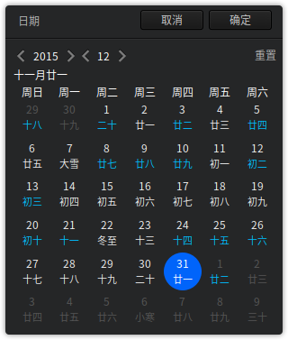
 
### 设置时区
系统安装简体中文语言后，一般默认显示北京时间。

如果您身处其它国家或地区，需要将电脑设置为当地的时间，您还可以添加当地的时区。

1. 在控制中心面板，点击 **日期和时间**。
2. 在 **时区** 选项，您可以：
  - 点击 ，在时区列表中选中需要添加的时区，点击 **添加**。
  - 点击   > ，选中需要删除的时区，点击 **确定**。

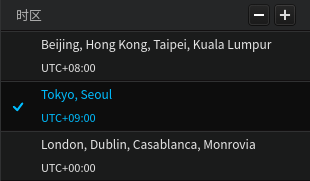

## 电源管理|../common/icon_powermanagement.svg|
配置电源管理方案，为您的办公、娱乐提供强劲动力。

### 显示器进入睡眠状态
在设置的时间后显示器将进入睡眠状态。

1. 在控制中心面板，点击 **电源管理**。
2. 在 **显示器进入睡眠** 选项，选择设置的时间间隔。
3. 显示器将在选择的时间后进入睡眠状态。

 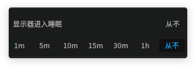

### 电脑进入睡眠状态
在设置的时间后系统将进入睡眠状态。

1. 在控制中心面板，点击 **电源管理**。
2. 在 **电脑进入睡眠** 选项，选择设置的时间间隔。
3. 电脑将在选择的时间后进入睡眠状态。

 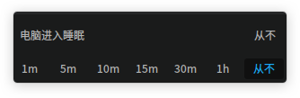

### 设置状态开关
开启唤醒或其他功能开关，保护您的个人资料安全。

在控制中心面板，点击 **电源管理**。
- 点击 **显示器唤醒时需要密码** 开关按钮，当下次唤醒屏幕时，需要输入密码进行登录。
- 点击 **电脑唤醒时需要密码** 开关按钮，当下次唤醒电脑时，需要输入密码进行登录。
- 点击 **笔记本盒盖时睡眠** 开关按钮，当下次合上笔记本盖子时进入睡眠状态。

 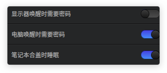

## 鼠标和触摸板|../common/icon_mouse.svg|
您可以根据个人习惯设置鼠标并借助触摸板来操作电脑。

### 设置鼠标
 
您可以根据操作习惯调整指针灵敏度来满足日常操作。
 
1. 在控制中心面板，点击 **鼠标和触摸板**。
 
2. 在 **主按键** 选项，点击 **左键** 或 **右键** 来切换左/右键作为主按键。
 
3. 在 **指针移动速度** 选项，通过左右拖动滑条来调节鼠标移动速度的快慢。
 
4. 在 **双击速度** 选项，通过左右拖动滑条来调节鼠标的双击速度。
 
 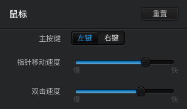
 
### 禁用触摸板
 
如果您开启了该功能，在触摸板上的操作将会被禁用，对触摸板进行的所有设置也将全部无效。
 
1. 在控制中心面板，点击 **鼠标和触摸板**。
 
2. 点击 **插入鼠标时禁用触摸板** 开关按钮，开启禁用触摸板功能。
 
3. 触摸板设置的所有功能将失效。
 
 
 
### 开启触摸板
 
如果您使用的是笔记本电脑，您可以使用电脑上的触摸板来代替鼠标使用。
 
> ：当 **插入鼠标时禁用触摸板** 功能被关闭时，此时对触摸板功能开启后才能生效。
 
1. 在控制中心面板，点击 **鼠标和触摸板**。
 
2. 点击 **触摸板** 开关按钮，开启触摸板功能。
 
 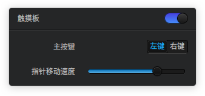
 
#### 设置触摸板
 
1. 在控制中心面板，点击 **鼠标和触摸板**。
 
2. 在 **主按键** 选项，点击 **左键** 或 **右键** 来切换左/右键作为主按键。
 
3. 在 **指针移动速度** 选项，通过左右拖动滑条来调节触摸板鼠标移动速度的快慢。
 
4. 在 **拖动阈值** 选项，通过左右拖动滑条来调节触摸板鼠标移动速度范围。
 
#### 设置触摸滚动
 
1. 在控制中心面板，点击 **鼠标和触摸板**。
 
2. 点击 **自然滚动** 开关按钮，开启自然滚动功能。
 
3. 点击  **轻触以点击** 开关按钮，开启轻触点击功能。
 
4. 点击  **双指滚动** 开关按钮，开启双指滚动功能。
 
5. 点击  **边缘滚动** 开关按钮，开启边缘滚动功能。
 
触摸滚动的相关操作说明如下：
 
- **自然滚动**： 双指在触摸板向上/向下滑动，页面内容随着向上/向下显示。
 
- **轻触以点击**： 轻触触摸板即可执行点击操作。
 
- **双指滚动**：双指在触摸板向上/向下滑动，可以执行滚动操作。
 
- **边缘滚动**： 在触摸板的边缘区域可以执行滚动操作。

### 设置小红点
一般ThinkPad等系列笔记本电脑自带小红点，您可以设置小红点的移动速度。

1. 在控制中心面板，点击 **鼠标和触摸板**。
2. 在 **小红点** 选项，通过左右拖动滑条来调节鼠标移动速度的快慢。

 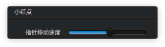

## 键盘和语言|../common/icon_keyboardandlanguage.svg|
您可以根据国家和地区，选择您的键盘输入习惯和布局。

### 开启大写键提示
开启大写键提示功能，在您按下大写锁定键时，提醒您当前已切换到大写输入状态，避免造成字符错误。

1. 在控制中心面板，点击 **键盘和语言**。
2. 点击 **大写键提示** 开关按钮，开启大写键提示功能。

 

### 设置系统语言
在安装系统的过程中，您可以选择系统默认的显示语言。登录电脑后，您可以更改系统的显示语言。

1. 在控制中心面板，点击 **键盘和语言**。
2. 在 **语言**折叠框中，当前系统的显示语言前将显示 。
3. 选择需要切换的语言，系统将自动开始安装语言包。
4. 语言包安装完成后，弹出“语言切换成功，请注销后重新登录”的提示框。
5. 注销并重新登录电脑，系统的显示语言完成更改。

> ：更改系统语言时，键盘布局可能也会发生改变。重新登录时，请确保使用正确的键盘布局来输入密码。

 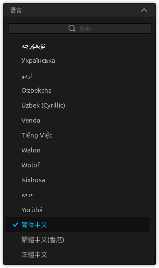

### 设置键盘布局
系统默认的键盘布局一般是美式键盘，您可以添加其他的键盘布局。

#### 添加键盘布局

1. 在控制中心面板，点击 **键盘和语言**。
2. 在 **键盘布局** 选项，您可以：
 - 点击 ，选择需要添加的键盘布局，点击 **添加**。
 
 - 点击  > ，选择需要删除键盘布局。
 
3. 点击 **完成**。

 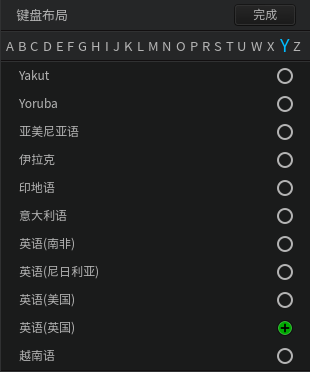

#### 切换键盘布局

1. 在控制中心面板，点击 **键盘和语言**。
2. 在 **键盘布局** 选项，选择一个键盘布局进行切换。
3. 当切换键盘布局成功后，在当前使用的键盘布局前将显示 。

 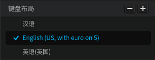

### 设置键盘属性

1. 在控制中心面板，点击 **键盘和语言**，您可以：
  - 在 **重复延迟** 选项，通过左右拖动滑条来调节第一个字符和第二个字符之间的时间间隔。
  - 在 **重复速度** 选项，通过左右拖动滑条来调节重复出现字符的速度。
  - 在 **光标闪烁频率** 选项，通过左右拖动滑条来调整光标闪烁的快慢。
2. 在 **测试区** 中，您可以实时测试键盘的设置效果。

 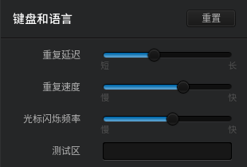

## 快捷键设置|../common/icon_shortcuts.svg|
巧用快捷键，帮您节省宝贵的时间。

### 查看快捷键
您可以查看到系统默认设置的所有快捷键，同时还可以修改、删除或自定义快捷键。

1. 在控制中心面板，点击 **快捷键**。
2. 点击 **系统**、**窗口** 和 **工作区**，系统快捷键、窗口快捷键和工作区快捷键将分别显示在对应的折叠框中。

<table class="block1">
<caption>系统快捷键</caption>
<tbody>
<tr>
<td>启动器</td>
<td>Super</td>
</tr>
<tr>
<td>显示桌面</td>
<td>Super+D</td>
</tr>
<tr>
<td>锁定界面</td>
<td>Super+L</td>
</tr>
<tr>
<td>文件管理器</td>
<td>Super+E</td>
</tr>
<tr>
<tr>
<td>截图</td>
<td>Control+Alt+A</td>
</tr>
<tr>
<td>窗口截图</td>
<td>Alt+Print</td>
</tr>
<tr>
<td>延时截图</td>
<td>Control+Print</td>
</tr>
<tr>
<td>终端</td>
<td>Control+Alt+T</td>
</tr>
<tr>
<td>终端雷神模式</td>
<td>F4</td>
</tr>
<tr>
<td>注销</td>
<td>Control+Alt+Delete</td>
</tr>
<tr>
<td>切换键盘布局</td>
<td>Super+Space</td>
</tr>
<tr>
<td>显示工作区</td>
<td>Super+S</td>
</tr>
<tr>
<td>显示当前工作区的窗口</td>
<td>Super+W</td>
</tr>
<tr>
<td>显示所有工作区的窗口</td>
<td>Super+A</td>
</tr>
<tr>
<td>切换同类型窗口</td>
<td>Alt+～</td>
</tr>
<tr>
<td>反向切换同类型窗口</td>
<td>Alt+Shift+～</td>
</tr>
<tr>
<td>切换窗口</td>
<td>Alt+Tab</td>
</tr>
<tr>
<td>反向切换窗口</td>
<td>Alt+Shift+Tab</td>
</tr>
<tr>
<td>切换窗口特效</td>
<td>Super+Tab</td>
</tr>
</tbody>
</table>
<table class="block1">
<caption>窗口快捷键</caption>
<tbody>
<tr>
<td>关闭窗口</td>
<td>Alt+F4</td>
</tr>
<tr>
<td>最大化窗口</td>
<td>Super+Up</td>
</tr>
<tr>
<td>恢复窗口</td>
<td>Super+Down</td>
</tr>
<tr>
<td>移动窗口</td>
<td>Alt+F7</td>
</tr>
<tr>
<td>改变窗口大小</td>
<td>Alt+F8</td>
</tr>
</tbody>
</table>
<table class="block1">
<caption>工作区快捷键</caption>
<tbody>
<tr>
<td>切换到左边工作区</td>
<td>Super+Left</td>
</tr>
<tr>
<td>切换到右边工作区</td>
<td>Super+Right</td>
</tr>
<tr>
<td>移动到左边工作区</td>
<td>Super+Shift+Left</td>
</tr>
<tr>
<td>移动到右边工作区</td>
<td>Super+Shift+Right</td>
</tr>
</tbody>
</table>

### 搜索快捷键
您可以使用搜索功能来快速找到需要的快捷键。

1. 在控制中心面板，点击 **快捷键**。
2. 在顶部的搜索框中输入关键字，搜索栏会自动列出包含关键字的所有快捷键。

 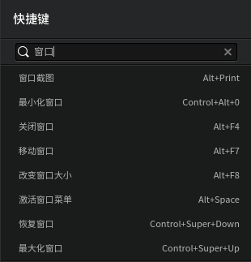

### 修改快捷键
您可以使用系统默认的快捷键设置，也可以根据个人习惯设置新的快捷键。

1. 在控制中心面板，点击 **快捷键**。
2. 点击需要修改的快捷键。
3. 使用键盘输入新的快捷键。

> ：如果需要禁用快捷键，请按下键盘上的  键或  键。

### 自定义快捷键
自定义更多的快捷键，简化您的操作。

1. 在控制中心面板，点击 **快捷键**。
2. 在 **自定义** 选项，点击 。
3. 输入快捷键的名称和命令。
4. 点击 **添加**。

 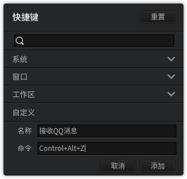

## 启动菜单设置|../common/icon_bootmenu.svg|
多系统，多选择，通过启动菜单设置让您的系统启动生动起来。

### 设置启动界面背景
您可以进入控制中心来更换启动界面的背景。

1. 在控制中心面板，点击 **启动菜单**。
2. 按住鼠标左键不放，将需要使用的图片拖拽到预览窗口中更换背景。

> ：当您更换背景图片成功后，需要重启才能生效。

 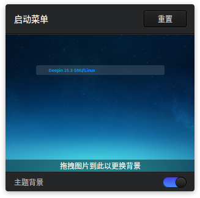

### 设置默认启动系统
当电脑安装了多个操作系统时，您可以通过设置让电脑在启动时默认选择一个系统运行。

1. 在控制中心面板，点击 **启动菜单**。
2. 在 **默认启动** 折叠框中，选择电脑开机后默认启动的操作系统。

 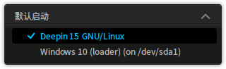

### 设置启动延时时间
延迟系统启动的时间，方便您进行更多其他操作。

1. 在控制中心面板，点击 **启动菜单**。
2. 在 **启动延时** 折叠框中，设置延迟启动的时间。

 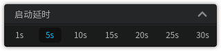

### 设置启动界面文字颜色
您可以将启动界面的文字设置成不同的颜色以示区别。

1. 在控制中心面板，点击 **启动菜单**。
2. 在 **文字颜色** 折叠框中，选择启动界面未启动的操作系统的显示颜色。
3. 在 **选中文字颜色** 折叠框中，选择启动界面默认启动的操作系统的显示颜色。

 

## 系统信息|../common/icon_systeminfo.svg|
您可以查看系统版本和计算机硬件信息、公共许可协议以及对系统、应用更新和升级。

### 查看系统信息
您可以查看系统版本和电脑硬件等信息。

1. 在控制中心面板，点击 **系统信息**。
2. 在 **系统信息** 选项，您可以：
  - 查看当前使用系统的版本号。
  - 查看当前使用系统的类型。
  - 查看电脑CPU的型号。
  - 查看电脑内存大小。
  - 查看电脑硬盘容量。

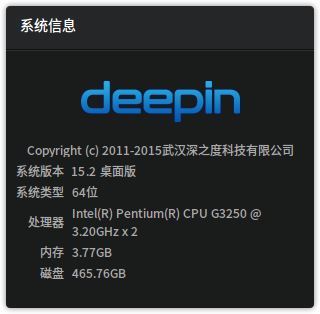

### 查看公共许可协议
您可以查看GNU公共许可协议的详细信息。

1. 在控制中心面板，点击 **系统信息**。
2. 点击 **GNU通用公共许可协议**。
3. 查看GNU通用公共许可协议详细描述。

 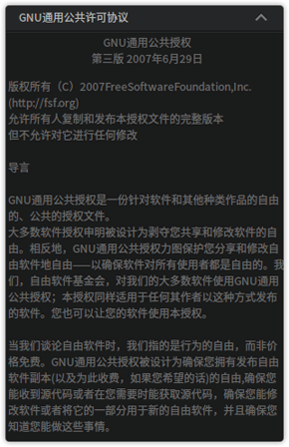

### 更新和升级
您可以检查系统和应用是否存在更新，同时还可以切换服务器、升级系统和应用。

#### 开启自动更新

1. 在控制中心面板，点击 **系统信息**。
2. 在 **更新** 折叠框中，点击 。
3. 点击 **自动检查更新** 开关按钮，开启自动检查更新功能。
4. 点击 **完成**。
5. 当系统和应用存在更新时，将在折叠框中以红色数字角标提示。

 

#### 切换服务器

1. 在控制中心面板，点击 **系统信息**。
2. 在 **更新** 折叠框中，点击 。
3. 在 **服务器** 选项，点击 **切换**。
4. 选择合适的服务器来刷新软件包列表。
5. 点击 **完成**。

> ：系统默认推荐官方稳定服务器并且在列表中最上显示。

 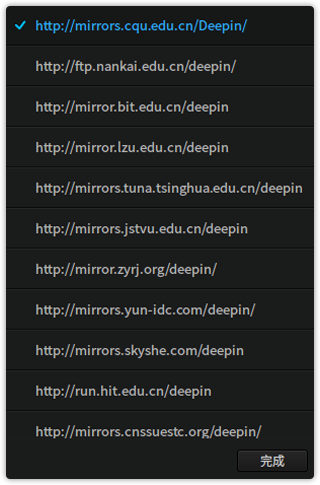

#### 升级应用和系统

1. 在控制中心面板，点击 **系统信息**。
2. 在 **更新** 折叠框中，查看需要升级的系统补丁和应用详情。
3. 点击 ，系统和应用组件将一起升级。
4. 将鼠标指针置于待升级的应用上，点击 ，仅升级该应用。

> ：如果系统无任何更新，将提示“点击按钮查看更新”；如果存在更新，点击系统和应用升级完成后，部分功能需要重启才生效。

 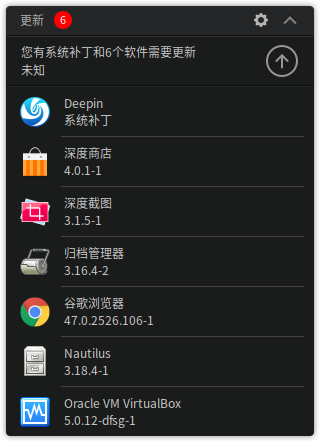
