# Desktop Environment|dde|

## Overview
UnionTech OS(UnionTech operating system) is a beautiful, easy-to-use and reliable Linux desktop operating system. It is equipped with a series of original applications such as File Manager, Image Viewer, System Monitor, and so on, which not only offers you abundant entertainment experience but also meet your daily needs of learning and working. With continual improvement, UnionTech OS is becoming one of the most popular open-source operating systems in China.

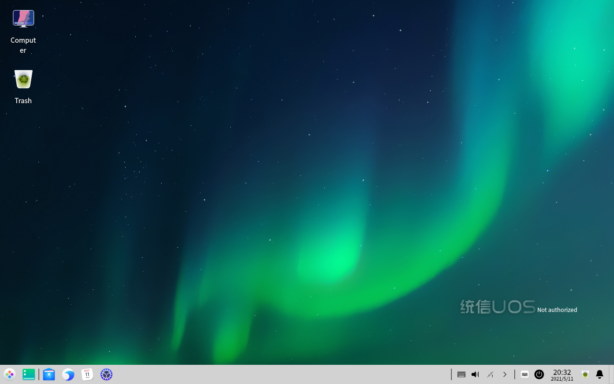

### Getting Started

When you log into the system for the first time, a welcome program will automatically start.  Watch the introduction video to get new features, customize your desktop, and know more about UnionTech OS.

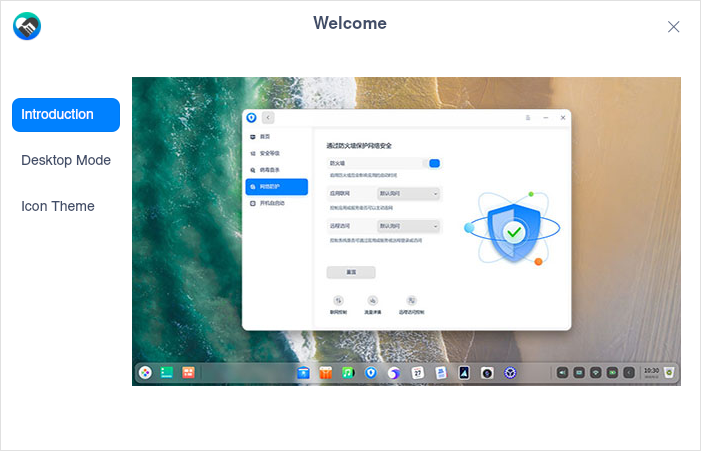

Once login, you are experiencing UnionTech OS Desktop Environment, which is comprised of Desktop, Dock, Launcher, Control Center, and window manager. 

## Desktop

Desktop is the main screen you see after logging in. On the desktop, you can create a new file/folder, sort files, open in terminal, set wallpaper and screensaver and etc. You can also add shortcuts for applications  on desktop by using "Send to desktop" function, see [Set App Shortcut](#Set App Shortcut).

>Notes: On the touchpad, move with four/five fingers downwards to display desktop, and move upwards immediately to hide which corresponds to the operation of **Super** + **D**. 

### Create New Folder/Document

Just as in File Manager, you can create a new folder/document on the desktop, or do some operations for the files on it.

   - Right-click the desktop, select **New folder** and enter the name for it.
   - Right-click the desktop, select **New document**, select the type and enter its name.

Right-click a file or folder on the desktop, and use the features of File Manager as below:

| Function         | Description                                                  |
| ---------------- | ------------------------------------------------------------ |
| Open with        | Select an app to open it.                                    |
| Cut              | Move it to another location.                                 |
| Copy             | Copy it to another location.                                 |
| Rename           | Change its name.                                             |
| Delete           | Delete and move it to the trash.                             |
| Create link      | Create a shortcut of the file or folder.                     |
| Tag information  | Add a tag.                                                   |
| Compress/Extract | Compress the file or folder, or extract the compressed file. |
| Properties       | View the basic info, share it or change the permission.      |

### Sort Files

Sort the files on your desktop to make it organized and fit your needs.

1. Right-click the desktop.
2. Click **Sort by**, you can:

   - Click **Name** to display files in the name sequence.
   - Click **Size** to display files in the size sequence.
   - Click **Type** to display files in type.
   - Click **Time modified** to display files in the order of last modified date.

>Tips: Check **Auto arrange**, icons on the desktop will be listed in order automatically, and if an icon is removed, another one will fill in the blank.

### Adjust Icon Size

1. Right-click the desktop.
2. Click **Icon size**, and choose a proper size.

>Tips: Press **Ctrl** + / /scrolling mouse wheel to adjust icon size on the desktop and in Launcher.

### Set Display
You can set display scaling, screen resolution, brightness and so on from the desktop.

1. Right-click the desktop.
2. Click **Display Settings** to open the settings in Control Center.

>Notes: For specific operations, please refer to [Display](#Display).

### Change Wallpaper
Select some elegant and fashionable wallpapers to beautify your desktop and make it distinctive.

1. Right-click the desktop.
2. Click **Wallpaper and Screensaver** to preview all the wallpapers.
3. Click your favorite one and it will apply in your desktop and screen lock.
4. You can also choose **Only desktop** or **Only lock screen**.

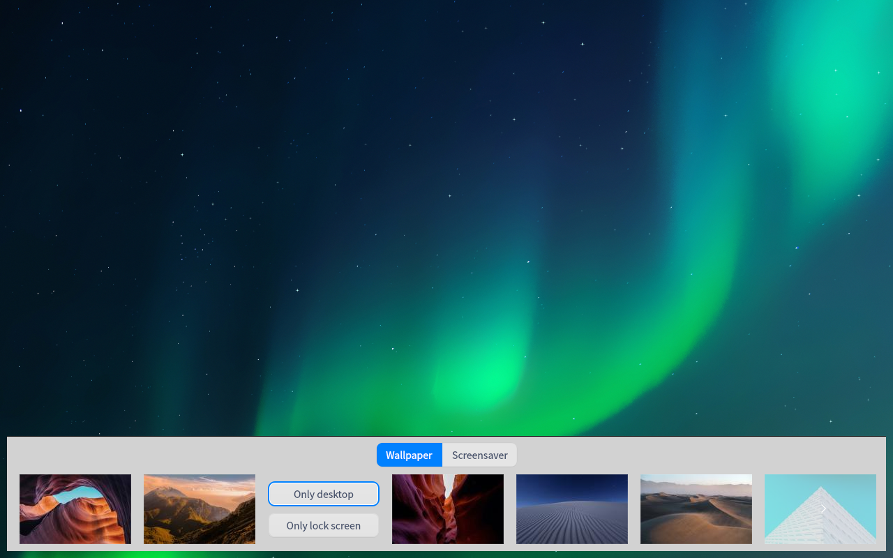

>Tips: You can also set your favorite picture as wallpaper in an image viewer.

### Set Screensaver
The screensaver was used to protect the kinescope before, but now it is mainly for protecting personal privacy from peering.

1. Right-click the desktop.
2. Click **Wallpaper and Screensaver**, and select **Screensaver** to preview all the screensavers.
3. Select one and click **Apply**, and set the **Wait**(waiting time) for the screensaver to start.
4. You can also check the box of **Require a password on wakeup** for a better privacy protection.
5. After that idle time, the screensaver will start.

### Clipboard

All the texts, pictures and documents cut and copied by the current user after login are displayed in the clipboard, which can be copied quickly by double-clicking the clipboard. The clipboard is cleared automatically after logout and shutdown.

1. Use the shortcuts **Ctrl**+**Alt**+ **V** to wake up the clipboard.

2. Double-click in the clipboard to copy the current content quickly and the corresponding block will be moved to the top of the clipboard.

3.  Select the target destination to paste it.

4. Clickto delete the current content and click **Clear All** to clear the clipboard.

   

## Dock

Dock is at the bottom of the desktop by default to help you quickly open frequently-used applications, which includes Launcher, applications, system tray, and plugins. In the dock, you can open launcher, show the desktop, enter the workspaces, open and exit apps, set input methods, adjust the volume, connect to a wireless network, view the calendar and enter the shutdown interface, and so on.

### Icons on Dock 
In the Dock, there are icons of Launcher, applications, system tray, and plugins.

| Icon | Description |
| ---- | ---- |
|  | Launcher - click to view all the installed applications. |
|  | Click to show the desktop. |
|  | File Manager - click to view files and folders on the disk. |
|  | Browser- click to open webpages. |
|  | Calendar -  view dates and create new schedules. |
|  |   Control Center - click to check or change system settings.   |
|  | Notification Center - show all notifications from the system and applications. |
|  | Onboard virtual keyboard. |
|  | Click to enter the shutdown interface. |
|  | Trash. |

>Tips: In Efficient Mode, you can click the right side of Dock to show the desktop. Move the cursor to the running app in the Dock and you will see its preview window.

### Switch Display Mode
There are two display modes of Dock: fashion mode and efficient mode.

&nbsp;&nbsp;&nbsp;&nbsp;&nbsp;&nbsp;&nbsp;&nbsp;&nbsp;&nbsp;&nbsp;&nbsp;&nbsp;

You can switch the display modes by the following operations:

1. Right-click the Dock and select **Mode**.
2. Select the display mode.

### Change Dock Location
You can place Dock in any direction of your desktop.

1. Right-click the Dock and select **Location**.
2. Select a location.

### Change Dock Height
Drag the top edge to increase or decrease the height.

### Show/Hide Dock

You can hide the Dock in order to maximize the expansion of the desktop operating area. 

1. Right-click the Dock and select **Status**.
2. On the submenu, you can select:
   - **Keep Shown** - display Dock all the time.
   - **Keep Hidden** - hide Dock and display it only when hovering on the dock area.
   - **Smart Hide** -  hide Dock automatically if the dock area is used.

### Show/Hide Plugins

1. Right-click the Dock and select **Plugins**.
2. In the submenu, you can check or uncheck **Trash, Power, Show Desktop, Onboard, Notification Center, and Datetime** to show or hide the corresponding icon in the Dock.

### View Notifications
When there are system or application notifications, they will be shown in the middle of the screen. If there are buttons in the message, click buttons to do the actions; if there are not, click the message to close it.

&nbsp;&nbsp;&nbsp;&nbsp;&nbsp;&nbsp;&nbsp;&nbsp;&nbsp;&nbsp;&nbsp;&nbsp;&nbsp;

Click  in Dock to view all the notifications.

>Notes: If you are using a computer equipped with a touchscreen, slide in from the right edge of the screen exceeding the dock's height to call out Notification Center.

### View Date and Time

   - Hover the cursor over the Time icon in Dock to view the current time, date and day of the week.
   - Click the Time icon to open Calendar.

### Enter Shutdown Interface

You can either click  in Dock or click  at the bottom right corner of Launcher mini mode to enter shutdown interface.

| Function                                                     | Description                                                  |
| ------------------------------------------------------------ | ------------------------------------------------------------ |
| Shut down   | Shut down the computer.                                      |
| Reboot          | Restart the computer.                                        |
| Suspend       | The computer will run with low consumption.                  |
| Hibernate           | "Hibernate" is mounted to system with swap partition. This option does not appear for systems without swap partition. |
| Lock                | Lock the computer, or press **Super** + **L** to lock it.    |
| Switch user  | Log in with another user account.                            |
| Log out         | Click it to clear up all information about the current account. |
| Start system monitor | Click it to open System Monitor quickly.               |

>Notes:  will be shown if there are multiple accounts in the system.

### Trash
You can find all temporarily deleted files in the trash, and also restore or empty them.

#### Restore Files

You can restore temporarily deleted files in Trash or press **Ctrl** + **Z** to restore the recently deleted files.

1. Select the file in the trash.
2. Right-click the file and select **Restore**.
3. The file will be in its original path.

>Attention: If the original folder of the file has been deleted, the deleted file will be restored to a new folder automatically created.

#### Delete Files

You can delete any one file in Trash.
1. Select the file to be deleted in the trash.
2. Right-click and select **Delete**.

#### Empty Trash

In the trash, click **Empty** to permanently delete all the files in the trash.

## Launcher
Launcher   helps you manage all the installed applications, where you can quickly find an application by category navigation or by a search.

> Notes: arm architecture does not support startup menu setting for now.

You can view newly installed applications in Launcher. The newly-installed ones are followed by a blue dot.

### Switch Launcher Modes

There are two display modes of Launcher: fullscreen mode and mini mode. Click the icon at the upper right corner to switch modes.

Both modes support searching applications and sending them to the desktop or Dock.

The mini mode also supports opening File Manager, Control Center and shutdown interface directly.

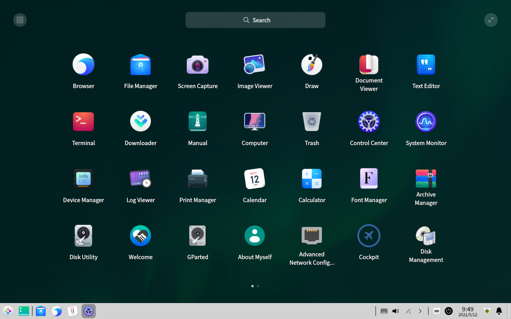
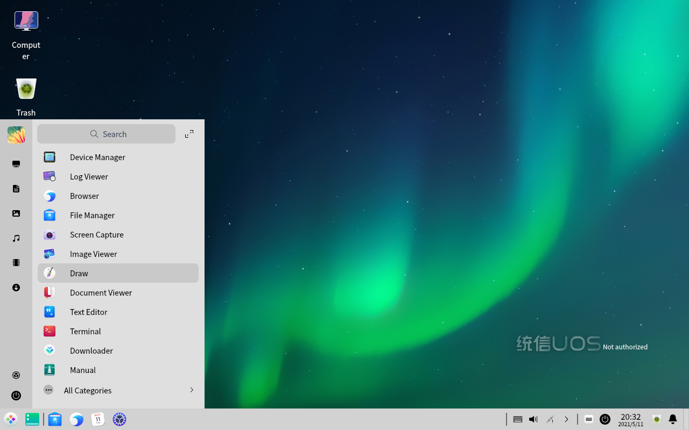

### Sort Applications

In fullscreen mode, all applications in Launcher are listed by the installation time by default. You can sort the application icons as the ways below:

   - Hover the cursor over an application icon, hold down the left key of mouse, drag and drop the application icon to arrange it freely.
   - Click the category icon  on the upper left in Launcher to arrange the icons by category.

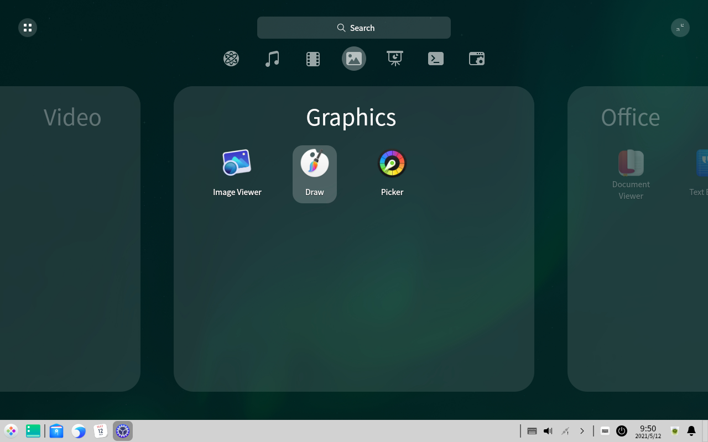

In mini mode,  applications are displayed according to using frequency by default.

### Find Applications

In Launcher, you can scroll up and down to find an application, or locate it with the category navigation.

If you already know the application name, just search for it.

### Set App Shortcut
The shortcut offers a method to run applications easily and quickly.

#### Create App Shortcut
Send the application icon to the desktop or Dock to facilitate the follow-up operations.

In Launcher, right-click an app icon and you can:

   - Select **Send to desktop** to create a shortcut on the desktop.
   - Select **Send to dock** to fix the application icon in Dock.

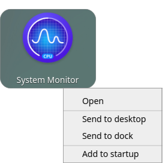

>Notes: You can drag the application icon from Launcher to Dock. But you cannot drag and drop the application while it is running. Then you can right-click the application icon in Dock and select **Dock** to fix it in order to open it quickly for the next time.

#### Delete Shortcut
Delete a shortcut from the desktop directly, or remove it from Dock or Launcher.

**Remove the shortcut from Dock:**

   - Hold down the left key of mouse, drag and drop the icon away from Dock. 
   - You cannot drag and drop the application icon while it is running. Then you can right-click the application icon in Dock and select **Undock** to remove it from Dock.

**Remove the shortcut from Launcher:**

In Launcher, right-click the icon and you can:
   - Select **Remove from desktop** to delete the shortcut from the desktop.
   - Select **Remove from dock** to remove the application icon from Dock.

>Notes: The above operations only delete the shortcut rather than uninstall the applications.

### Run Applications
For the applications whose shortcuts have been created on the desktop or Dock, you can open them in the following ways:

   - Double-click the desktop icon or right-click it and select **Open**.
   - Click the application icon in Dock or right-click it and select **Open**.

To open the application only shown in Launcher, click the icon or right-click it and select **Open**.

>Tips: For the frequently-used applications, right-click the app icon and select **Add to startup** to run it when the computer boots.

## Control Center
You can manage the system settings in Control Center, including account management, network settings, date and time, personalization, display settings, and so on. After entering the desktop environment, click  to open Control Center.

### Homepage Introduction

The homepage of Control Center provides several setting modules and click one to enter the detailed settings. 

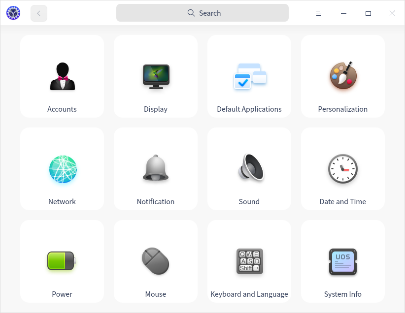

Once you open a setting module in Control Center, the navigation appears on the left. Click the left navigation to quickly switch to other settings.

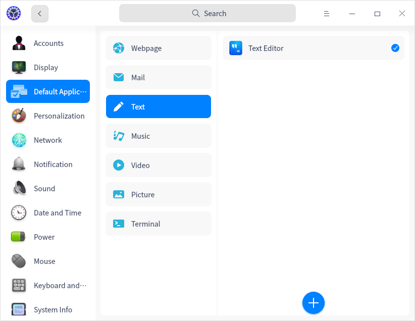

#### Title Bar

The title bar contains the back button, search box, main menu and the window buttons.

   - Back button: Click  to go back to the homepage.
   - Search box: Input a keyword and search the related settings.
   - Main menu: Click  to enter the main menu where you can set the window theme, view the manual and exit.

### Accounts
You have already created an account when installing the system. Here you can modify account settings or create a new one.

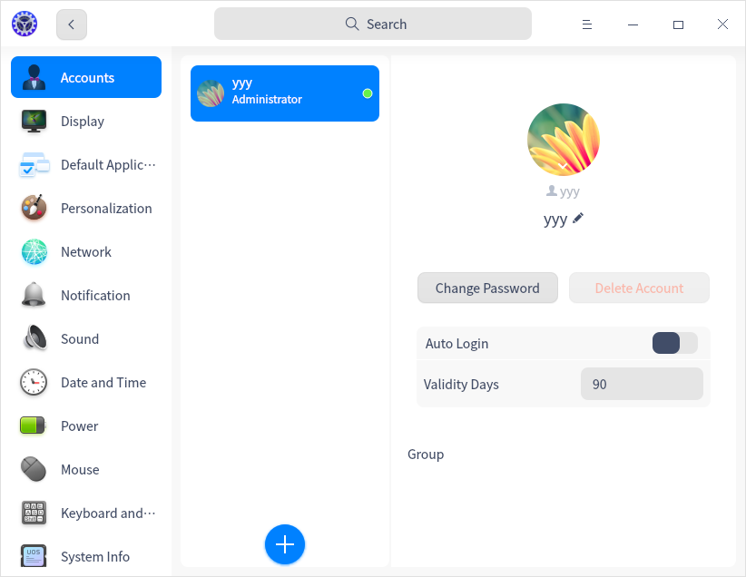

#### Create New Account

1. On the homepage of Control Center, click .
2. Click .
3. Input a username and a password twice.
4. Click **Create**.
5. Input the password of  the current user account in the authentication dialog box, and the new account will be added to the account list.

#### Change Account Avatar

1. On the homepage of Control Center, click .
2. Click an existing account in the list.
3. Click the user avatar, select a avatar or upload a local avatar.

#### Set Full Name
The account full name is shown in account list and system login interface and you can set it as needed.

1. On the homepage of Control Center, click .
2. Click an existing account in the list.
3. Click  after **Full Name**, and input a name.

#### Change Password

1. On the homepage of Control Center, click .
2. Click the current account.
3. Click **Change Password**.
4. Input the current password, the new password, and repeat the new one, click **Save**.

#### Delete Account

1. On the homepage of Control Center, click .
2. Click the other account.
3. Click **Delete Account**.
4. In the confirm dialog, click **Delete**.

>Attention: The logged in account cannot be deleted.

#### Privilege

The first account has administrator privilege when you install the system. All other accounts you add after that are common users. One account can be grouped in many user groups.

##### Group setting

When you add or modify accounts, you can:

- Select a group existing in the system.
- Select the group with the same name as the current user.
- Select the group with the same name as another user when the account was previously added. 

### Display
Set screen resolution, brightness, direction and display scaling properly to have the best visual effect.

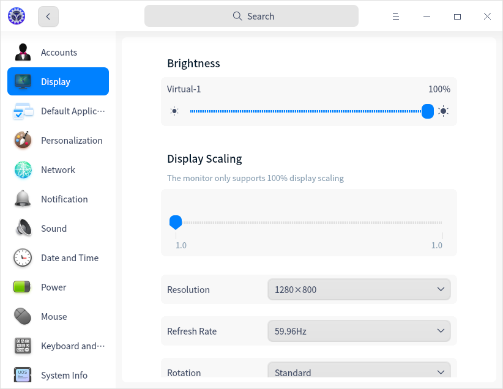

#### Single Screen Settings

When there is only one screen, you can adjust the brightness, resolution, refresh rate and display direction.

##### Adjust Brightness

1. On the homepage of Control Center, click .

2. In "Brightness" area, you can drag the slider to adjust the brightness.
   
##### Adjust Color Temperature

1. On the homepage of Control Center, click .

2. In "Color Temperature" area, you can:

   - Switch on **Night Shift**, the screen hue will be auto-adjusted according to your location.
   - Switch on **Change Color Temperature** is switched on, you can adjust the monitor brightness as you wish. 

>Notes: When **Night Shift** is switched on, **Change Color Temperature** becomes unavailable automatically, and vice versa.

##### Set Display Scaling

Set a proper display scale to have a normal display.

1. On the homepage of Control Center, click .
2. Click **Display Scaling**.
3. Change the display scaling, log out and log in again to see the changes.

>Notes: 
>   - When a HiDPI screen is detected, the display scaling will be automatically adjusted.
>   -  For the applications that do not support scaling, right-click it in Launcher and select **Disable display scaling** to get a better display.

##### Change Resolution

1. On the homepage of Control Center, click .
2. Select a proper resolution parameter from the drop-down list in "Resolution" area.
3. Click **Save**.

##### Change Refresh Rate

1. On the homepage of Control Center, click .
2. Click **Refresh Rate**.
3. Select a proper one, and click **Save**.

##### Change Display Direction

1. On the homepage of Control Center, click .
2. Select a proper direction parameter from the drop-down list in "Rotation" area.
3. Click **Save**.

#### Multiple Screen Settings
Expand your desktop by multiple screens! Use VGA/HDMI/EDP cable to connect your computer to other display devices such as monitor, projector and so on. When the computer is connected to another display device, **Multiple Displays** will appear.

1. On the homepage of Control Center, click .
2. In **Multiple Displays**, select a display mode:
   - **Duplicate**: display the same image on other screens.
   - **Extend**: expand the desktop across the screens.
   - **Only on xxxx**: only display on one screen.

 In multiple displays, press **Super** + **P** to show its OSD. 

Operations are as follows:

1. Hold **Super** and press **P** or click to select the options. 
2. Release the keys, the selected mode will take into effect.

>Notes: In multiple display mode, the sub-screens also support desktop icon display, right-click menu operation and other functions. 

### Touch Screen

If your computer has a touch screen, you can set your screen and adjust it.

1. On the homepage of Control Center, click to set your screen.
3. Click **Confirm**. 

### Default Applications
If you have installed several applications with similar functions, such as text editor, choose one of them to be the Default Applications to open that type of file.

#### Set Default Applications

1. Right-click the file, choose **Open with** > **Set default program**.
2. Select one application, **Set as default** is checked by default, and click **Confirm**.
3. The application will automatically be added to the Default Applications list in Control Center.

#### Change Default Applications

1. On the homepage of Control Center, click .
2. Select a file type.
3. Select another one in the list as the Default Applications.

#### Add Default Applications

1. On the homepage of Control Center, click .
2. Select a file type.
3. Click  below to add a desktop file (usually at /usr/share/applications) or a specified binary file as the Default Applications.
4. The application will be added to the list and set as Default Applications automatically. 

#### Delete Default Applications

In the Default Applications list, you can only delete the applications you added. To remove other applications from the list,  the only way is to uninstall them. Once uninstalled, they will automatically be deleted from the list.

To delete the Default Applicationss you have added, do as below:

1. On the homepage of Control Center, click .
2. Select a file type.
3. Click  after the application name to delete it.

### Personalization Settings
You can set overall personalization items such as theme, accent color, font, and so on, change the appearance of the desktop and windows to your favorite style.

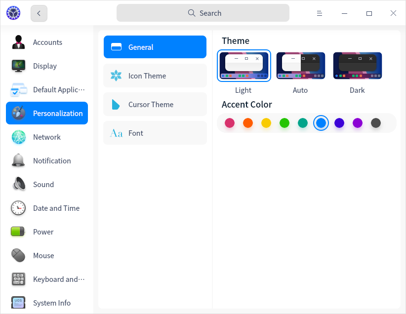

#### Set Window Theme
1. On the homepage of Control Center, click .
2. Click **General**.
3. Select one window theme, which will be used as system theme.

>Notes: "Auto" means changing window theme automatically according to the sunset and sunrise time. After sunrise, it is light theme; after sunset, it is dark theme.

#### Change Accent Color
Accent color refers to the color used when you select one option or file in the system.

1. On the homepage of Control Center, click .
2. Click **General**.
3. Pick a color under **Accent Color** and view its effects.

#### Set Icon Theme

1. On the homepage of Control Center, click .
2. Click **Icon Theme** and select an icon style.

#### Set Cursor Theme

1. On the homepage of Control Center, click .
2. Click **Cursor Theme** and select a set of cursors.

#### Change Font

1. On the homepage of Control Center, click .
2. Click **Font**.
3. Set the font and font size for the system.

### Network Settings
After login, you need to connect to a network first and then surf the Internet! 

>Tips: Check your network status by clicking the network icon in Dock.

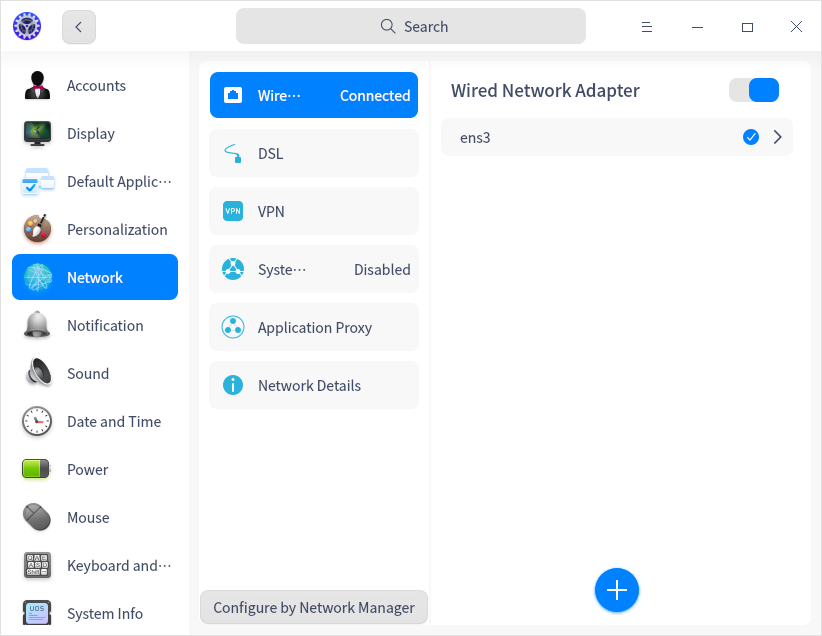

#### Wired Network

Wired network is secure and stable, which makes it the most common way to connect to the Internet. After your router is set, connect both ends of the network cable to the computer and router to connect to a wired network. 

1. Plug the cable into the network slot of a computer.
2. Plug another end of the cable into the router or network port.
3. On the homepage of Control Center, click .
4. Click **Wired Network** to enter the setting page of wired network.
5. Switch on **Wired Network Adapter** to enable wired network.
6. If it is successfully connected to the network, there will be a prompt "Wired Connection connected".

You can also edit and add a new wired network in the setting page.

#### Wireless Network

Wireless network helps you surf the network without cables, which is more flexible and supports more devices.

##### Connect to WLAN Network

1. On the homepage of Control Center, click .
2. Click **Wireless Network** to enter the setting page of wireless network.
3. Switch on **Wireless Network Adapter** to enable the wireless network.
4. The computer will auto search the nearby wireless network available .
5. Select the correct wireless network to connect.
   - If the network is open, it will auto connect to the network.
   - If the network is encrypted, please enter the password and click **Connect**.

##### Connect to Hidden Network

To prevent others from scanning your network and cracking your password, you can hide the wireless network in the router settings. After that, you will have to connect to it manually.

1. On the homepage of Control Center, click .
2. Click **Wireless Network** to enter the setting page of wireless network.
3. Switch on **Wireless Network Adapter** to enable the wireless network.
4. Click **Connect to Hidden Network**.
5. Enter the name, SSID, and other required info.
6. Click **Save**.

#### Hotspot

Hotspot changes the connected network signal to WLAN hotspot, so that other devices nearby can connect to the hotspot and surf the Internet. To enable hotspot, your computer must connect to a network and have a wireless network adapter.

1. On the homepage of Control Center, click .
2. Click **Personal Hotspot**.
3. Switch on **Hotspot** and do the settings.
4. Click **Save**. 

#### Mobile Network
If you are at a place without network, mobile network adapter is a useful tool to help you connect to the Internet as long as the place is covered by telephone signals.

1. Plug the mobile network adapter into your computer USB port.
2. Your computer will auto connect to the network.
3. On the homepage of Control Center, click .
4. Click **Mobile Network** to view the detailed network info.

#### DSL/PPPoE Connections

DSL is a dial-up connection using a standard phone line and analog modem to access the Internet. Configure the modem, plug the telephone line into the network interface of the computer, create a broadband dial-up connection, and enter the user name and password provided by the operator to dial up the Internet.

##### Create a PPPoE Connection

1. On the homepage of Control Center, click .
2. Click **DSL**, and click .
3. Enter the name, your account and password the operator provides.
4. Click **Save**. The connection will automatically start.

#### VPN

VPN is a virtual private network. Its main function is to establish a private network on the public network for encrypted communication. Whether you are on a business trip or working at home, you can use VPN to access intranet resources as long as you can access the Internet. You can also use VPN to speed up access to websites in other countries.

1. On the homepage of Control Center, click .
2. Click **VPN**, and click  or .
3. Select the VPN protocol type, and enter the name, gateway, account, password and other information. (Importing VPN will automatically fill in information)
4. Click **Save**,  the system will try to connect VPN network automatically.
5. You can export the VPN settings to backup or share with other users. 

>Notes: If you don't want to use the VPN as the default routing, but only want it to take effect on specific network resources, switch on **Only applied in corresponding resources**.

#### System Proxy

1. On the homepage of Control Center, click .
2. Click **System Proxy**.
3. Switch on **System Proxy**. For **Proxy Type**, you can:
   - Select **Manual** and input the address and port of proxy servers.
   - Select **Auto** and input a URL to configure the proxy info.
4. Click **Save**. 

#### Application Proxy

1. On the homepage of Control Center, click .
2. Click **Application Proxy**.
3. Do the necessary settings.
4. Click **Save**.

>Notes: After being configured, run Launcher, right-click any application's icon and check **Use a proxy**.

#### Network Info

You can view MAC, IP address, gateway and other network info in network details. 

1. On the homepage of Control Center, click .
2. Click **Network Details**.
3. View the network info of the current wired or wireless network.

### Notification Settings

You can set "Do Not Disturb" to system notifications, and also switch on or off the notification hints of some applications.

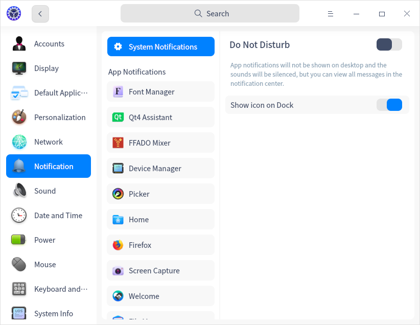

#### System Notification Settings

You can set "Do Not Disturb" to system notifications and whether to show icon on Dock here.

1. On the homepage of Control Center, click .

2. Click **System Notification**.

   - Switch on/off **Do Not Disturb**.
   After switching on this button, you can set the starting and ending time; also, you can check **When the screen is locked**. Under this mode, all notification are muted, but you can view all notifications in Notification Center. 
   - Switch on/off **Show icon on Dock**.

#### App Notification Settings

You can custom notification hints for all applications.

1. On the homepage of Control Center, click .
2. Under **App Notifications**, select an application, and in the window on the right, you can choose to check:
   - Play a sound
   - Show messages on lockscreen
   - Show only in notification center
   - Show message preview

### Sound Settings

Set your speaker and microphone properly to make you hear more comfortable and make clearer recordings.

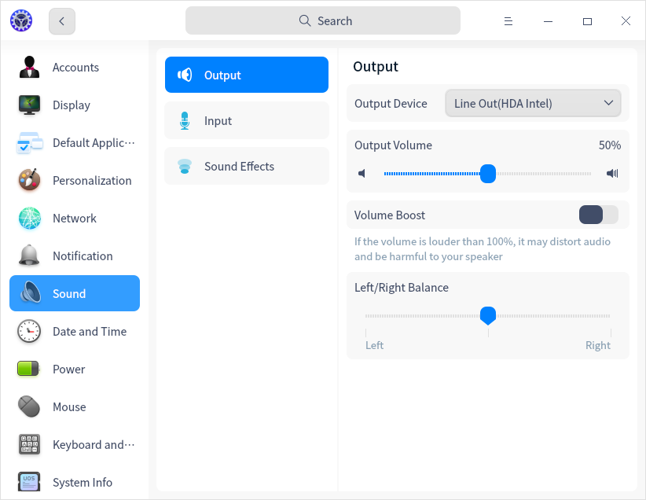

#### Output

1. On the homepage of Control Center, click .
2. Click **Output** to:
   - Select output device type from the drop-down list after **Output Device**.
   - Drag the slider to adjust output volume and left/right balance.
   - Switch on **Volume Boost**, the volume could be adjustable from 0~150% (the former range is 0~100%).

#### Input

1. On the homepage of Control Center, click .
2. Click **Input** to:
   - Select input device type from the drop-down list after **Input Device**.
   - Adjust input volume by dragging the slider.
   - You can enable **Automatic Noise Suppression**. 

>Tips: Usually, you need to turn up the input volume to make sure that you can hear the sound of the sound source, but the volume should not be too high, because it will cause distortion of the sound. Here is how to set input volume: Speak to your microphone at a normal volume and view "Input Level". If the indicator changes obviously according to the volume, then the input volume is at a proper level. 

#### System Sound Effects

1. On the homepage of Control Center, click .
2. Click **Sound Effects**, check the options you want to switch on the sound when the corresponding event occurs.

>Tips: Click to listen to the sound effect.

### Date and Time
Set your timezone properly to have correct date and time. You can also change them manually.

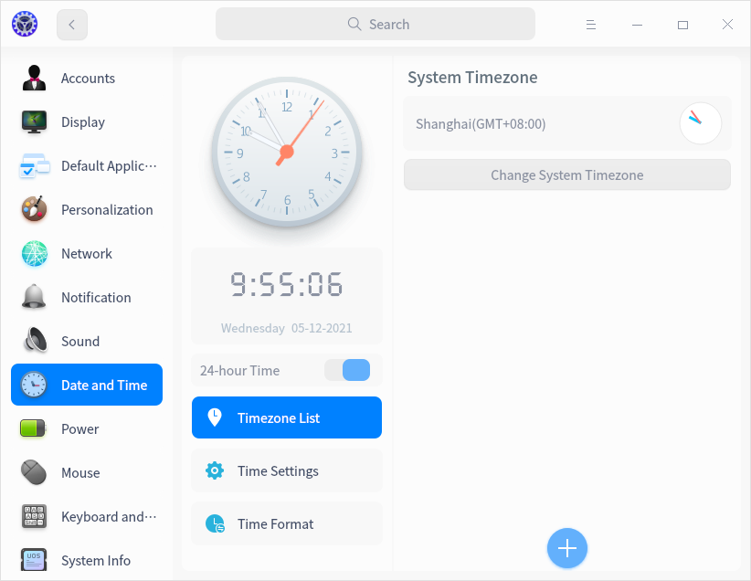

#### Change Timezone
You have selected the timezone during system installation and do as follows to change it.

1. On the homepage of Control Center, click .
2. Click **Timezone List**.
3. Click **Change System Timezone** and select a timezone by searching or clicking on the map.
4. Click **Confirm**.

#### Add Timezone
Add another timezone to see the date and time there.

1. On the homepage of Control Center, click .
2. Click **Timezone List**.
3. Click , select a timezone by searching or clicking on the map.
4. Click **Add**.

#### Delete Timezone

1. On the homepage of Control Center, click .
2. Click **Timezone List**.
3. Click **Edit** after "Timezone List".
4. Click  to remove the timezone.

#### Change Date and Time
Note that the auto-sync function will be disabled after changing date and time manually.

1. On the homepage of Control Center, click .
2. Click **Time Settings**.
3. Switch off **Auto Sync**.
4. Enter the correct date and time.
5. Click **Confirm**.

>Notes: You can also switch on **Auto Sync**, and set the server sync parameters.

#### Set Time Format

Setting the format of time and date is supported.

1. On the homepage of Control Center, click .
2. Click **Time Format** to set the first day of week, long date, short date, long time, and short time.

### Power Management

Power management turns the system to a low-power state when inactive, thus making a long battery endurance for laptop users, and protects system security.

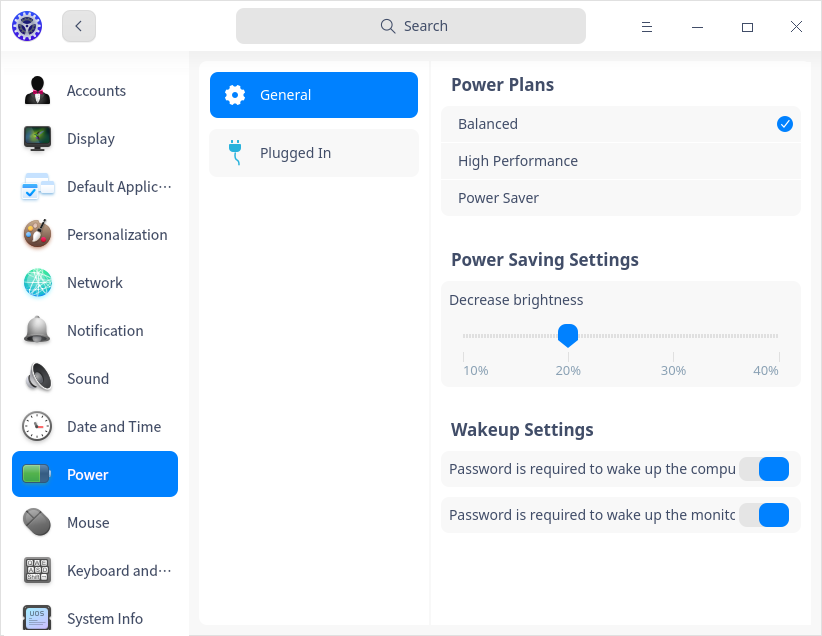

#### Power Plans

1. On the homepage of Control Center, click .
2. Click **General**.
3. You can select **Balanced**, **Power Saver** and **High Performance**.

>Notes: **High Performance** is displayed only when the computer supports high performance mode.

#### Power Saving Settings
To reduce the power consumption of your laptop, set your power saving mode.

1. On the homepage of Control Center, click .
2. Click **General**.
3. In **Power Saving Settings** area, you can:
   - Switch on **Auto power saving on low battery**(only applicable for laptops).
   - Switch on **Auto power saving on battery** (only applicable for laptops).
   - Drag the slider of **Decrease brightness** to adjust brightness.

>Notes: when **Auto power saving on battery** is switched off, the system enters **Balanced** mode directly.

#### Wakeup Settings

1. On the homepage of Control Center, click .
2. Click **General**.
3. Switch on **Password is required to wake up the monitor** and **Password is required to wake up the computer** in **Wakeup Settings** area to improve the security.

####  Time to Turn Off Monitor

1. On the homepage of Control Center, click .
2. Click **Plugged In** or **On Battery**.
3. Set the time to turn off the monitor by dragging the slider in "Monitor will suspend after" area.

>Notes: Laptop users can set different time for the same setting item under "Plugged In" and "On Battery".

#### Time to Suspend

1. On the homepage of Control Center, click .
2. Click **Plugged In** and **On Battery**.
3. Set the time to suspend by dragging the slider in "Computer will suspend after" area.

>Tips: For laptop users, you can select **Suspend** from the drop-down list after **When the lid is closed**.  

#### Time to Lock Screen

1. On the homepage of Control Center, click .
2. Click **Plugged In** and **On Battery**.
3. Set the time to lock screen by dragging the slider in "Lock screen after" area.

#### Set "When the lid is closed"

1. On the homepage of Control Center, click .
2. Click **Plugged In** and **On Battery**.
3. You can select **Suspend**, **Hibernate**, **Turn off the monitor** and **Do nothing** from the drop-down list after **When the lid is closed**.  
>Notes: This function is only available for laptops.

#### Power button settings

1. On the homepage of Control Center, click .
2. Click **Plugged In** and **On Battery**.
3. You can select **Shut down, Suspend, Hibernate, Turn off the monitor, Do nothing** from the drop-down list after **When pressing the power button**.

Any operation done here will take effect immediately. At the same time, the system will notify the user that the power button setting is changed. 

#### Set "Low Battery Notification"

1. On the homepage of Control Center, click .
2. Click **On Battery**.
3. Switch on **Low Battery Notification**. The system issues a low battery notification when the remaining battery power is below a set threshold (for example, 20%).

You can adjust the threshold of low battery level by dragging the slider below "Low battery level".  You can adjust the threshold of auto suspend battery level by dragging the slider below "Auto suspend battery level".

>Notes: This function is only available for laptops.

#### Set "Auto suspend battery level"
1. On the homepage of Control Center, click .
2. Click **On Battery**.
3. Adjust the threshold of auto suspend battery level by dragging the slider below "Auto suspend battery level".

>Notes: This function is only available for laptops.

### Mouse and Touchpad
Mouse and Touchpad are common computer input devices. Using the mouse, you can make the operation easier and faster. For laptop computer users, when there is no mouse, the touchpad can also be used to replace the mouse for operation. Some devices also support a pointer, which can operate the mouse without moving the finger away from the reference key. In **Mouse** setting module, users can set the mouse, touchpad and trackpoint to make the device experience more consistent with their own habits.

#### General Settings

1. On the homepage of Control Center, click .
2. Click **General**.
3. Switch on **Left Hand**, and adjust **Scrolling Speed**, **Double-click Speed** for both mouse and touchpad.

>Notes: If "Left Hand" is enabled, left-click and right-click of the mouse and touchpad exchange.

#### Mouse
After inserting or connecting the mouse, make relevant settings in the Control Center to make it more in line with your usage habits. 

>Notes: If there is no touchpad, “Disable touchpad when a mouse is connected” will not be shown.

1. On the homepage of Control Center, click .
2. Click **Mouse**.
3. Adjust **Pointer Speed**, which helps you to control the speed at which the pointer moves as the mouse moves.
4. Switch on **Natural Scrolling**/**Mouse Acceleration** if you want.

>Notes: 
>   - Turn on the mouse acceleration to improve the accuracy of the pointer. The moving distance of the mouse pointer on the screen will increase according to the acceleration of the moving speed. It can be turned on or off according to the usage.
>   - If Natural Scrolling is enabled, when you scroll down, the page will scroll down, when you scroll up, the page will scroll up as well. 

#### Touchpad

If you are using a laptop,  in order to avoid mis-operation on the touchpad, you can switch on **Disable touchpad while typing** in **Mouse > General** interface, and switch on **Disable touchpad when a mouse is connected** in **Mouse > Mouse** interface.  

You can also change **Pointer Speed**, and switch on **Natural Scrolling** for the touchpad.

#### TrackPoint

TrackPoint, also called pointing stick, is a small joystick used as a pointing device, typically mounted centrally in a laptop keyboard and used to control pointer movements on the screen.

1. On the homepage of Control Center, click .
2. Click **TrackPoint**.
3. Adjust **Pointer Speed** to a proper level.

### Keyboard and Language
Set keyboard properties and select your keyboard layout to keep your typing habit. You can also adjust the keyboard layout according to the country and language, set up input method, change system language, and customize shortcuts here.

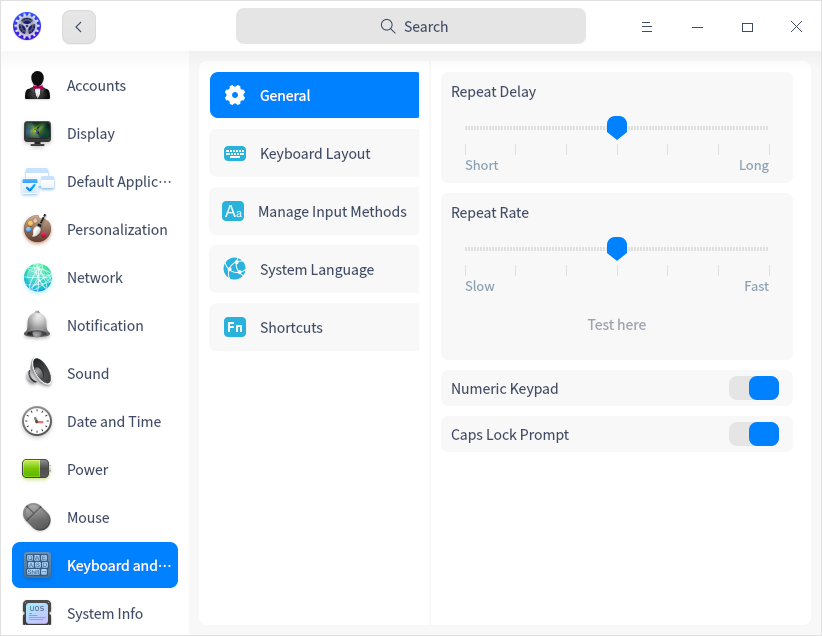

#### Keyboard Properties

1. On the homepage of Control Center, click .
2. Click **General**.
3. Adjust **Repeat Delay**/**Repeat Rate**.
4. Click **Test here** and hold down a key to test the repeat rate.
5. Switch on **Numeric Keypad** and **Caps Lock Prompt** if you want.

#### Keyboard Layout
Set the keyboard layout to customize the keyboard for the current language. When you press a key on the keyboard, the keyboard layout controls which characters are displayed on the screen. After changing the keyboard layout, the characters on the screen may not match the characters on the keyboard keys.

You have set a keyboard layout during system installation, but you can add more for other purposes. 

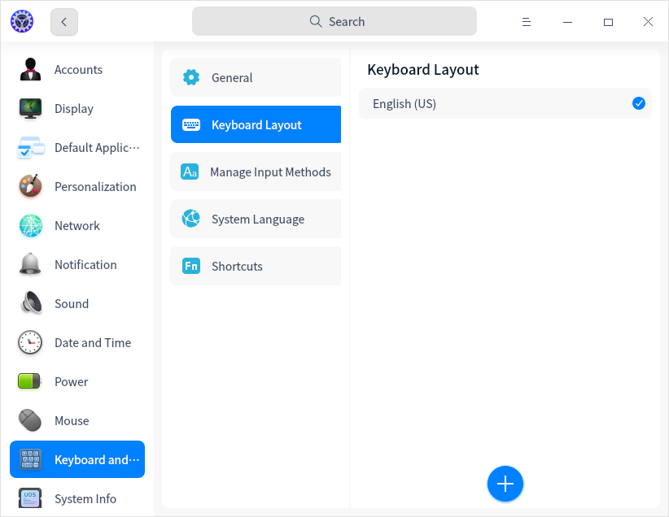

##### Add Keyboard Layout

1. On the homepage of Control Center, click .
2. Click **Keyboard Layout**.
3. Click . Click a keyboard layout to add it.

##### Delete Keyboard Layout

1. On the homepage of Control Center, click .
2. Click **Keyboard Layout**.
3. Click **Edit**.
4. Click  to delete keyboard layout.

#### Manage Input Methods

Setting the input method can provide more input methods for the system. In the input method interface, you can add multiple input methods and set the shortcut keys for input method switching, so that users can choose the input method that conforms to their personal typing habits.

##### Add Input Method

You can add multiple input methods to the input method management list to switch input methods.

1. On the homepage of Control Center, click .
2. Click **Manage Input Methods**.
3. Click  to select an input method to add it to the list in "Add Input Method" page.

>Notes: In "Manage Input Methods" page, click **Edit**, click  button to remove an input method. You can add the removed (but not uninstalled) input method in "Add Input Method" page.

##### Sort Input Method

1. On the homepage of Control Center, click .
2. Click **Manage Input Methods**.
3. In "Manage input methods" area, drag the input method up and down or click the up and down arrows after the input method to sort them.

##### Configure Input Method

1. On the homepage of Control Center, click .
2. Click **Manage Input Methods**.
3. In "Manage input methods" area, click  button after each input method to set up configurations.

##### Set Shortcut Key for Switching Input Methods

1. On the homepage of Control Center, click .
2. Click **Manage Input Methods**.
3. In "Shortcuts" area, select the shortcut key for switching input methods from the drop-down box.
>Notes: Once the shortcut key is set successfully, when the input method is switched, it will automatically switch to the keyboard layout corresponding to the input method. Select **Applies to** to apply the switched keyboard layout to the whole system or current application.

#### System Language

The system language is the language you selected when you installed the system by default, which can be changed at any time.

##### Add System Language
Add multiple languages into the list to change language conveniently.

1. On the homepage of Control Center, click .
2. Click **System Language**.
3. Click  to enter the language list.
4. Select the language you want, and it will be added into system language list automatically.

##### Change System Language

1. On the homepage of Control Center, click .
2. Click **System Language**.
3. Select the language you want to switch to, and the language package will be installed automatically.
4. After being successfully installed, log out and log in again to view the changes.

>Attention: The keyboard layout may also be changed in the process of switching the system language. Please make sure that you select a correct keyboard layout to enter the login password.

#### Shortcuts
The shortcut list includes all shortcuts in the system. View, modify and customize the shortcuts here as you want.

##### View Shortcuts

1. On the homepage of Control Center, click .
2. Click **Shortcuts**.
3. You can search or view the default shortcuts for system, window and workspace.

##### Modify Shortcuts

1. On the homepage of Control Center, click .
2. Click **Shortcuts**.
3. Click the shortcut you want to modify.
4. Press new shortcut to change it.

>Tips: To disable a shortcut, please press  on the keyboard. To cancel modifying, press **Esc** or click Restore Defaults at the bottom.

##### Customize Shortcuts

1. On the homepage of Control Center, click .
2. Click **Shortcuts**.
3. Click .
4. Enter the name, command and shortcut.
5. Click **Add**.
6. After being successfully added, click **Edit**.
7. Click  to delete the custom shortcut.

>Tips: To change the shortcut, click it and press a new shortcut to change it directly. To edit the name and command of the custom shortcut, click **Edit** > near the shortcut name to enter the shortcut settings.

### System Info
You can view system version, authorization info, hardware info, and the agreements here.

#### About This PC

1. On the homepage of Control Center, click .
2. Under **About This PC**, you can view system version, authorization and hardware information.
3. If the system has not been activated, click **Activate** to activate the system.

#### Edition License

1. On the homepage of Control Center, click .
2. View the system edition license under **Edition License**.

#### End User License Agreement

1. On the homepage of Control Center, click .
2. View the End User License Agreement under **End User License Agreement**.

#### Privacy Policy

1. On the homepage of Control Center, click .
2. View the Privacy Policy under **Privacy Policy**.

### Authorization Management

You can view the version authorization status through the GUI interface, or activate the system through command line operation.

Operations are as follows:

1. Press  **Ctrl + Alt + T**  to open Terminal. 

2. Execute the following command.

   Command:

`uos-activator-cmd  [OPTION]  <key><keyfile><keysfile><index><url>`

To view the system activation status and help prompts, you can execute the nonparametric program command **uos-activator-cmd**.

When you need to activate the system or set up the server's address, you can refer to the following program commands with parameters.

| Parameter                  | Description                                                  |
| -------------------------- | ------------------------------------------------------------ |
| -t , -T                    | Input command + parameter (-t or -T) to "try full version", which means to activate the system for a probation period. |
| -a , -A <key>              | Input command + parameter (-a or -A) +16-digit or 25-digit serial number to activate the system by serial number, in which ”-“ is not essential, and, Letters are not case sensitive. |
| -f , -F , --file <keyfile> | Input command + option(-f or -f or --file)+.key files to activate the system by key files. |
| -s , -S                    | To set up the activation server user guide and default server list display. |
| -s , -S --default <index>  | Input command uos-activator-cmd  -s/-S --default 0, which means that the address of the activation server selected by the user is: [https://license.chinauos.com](https://license.chinauos.com/) |
| -s , -S --http/https <url> | Input command + parameter (-s or -S) + parameter (--http/--https custom server)+ (url custom server address) to set up the activating server's address. |
| -q , -Q , --query          | Input command + parameter (-q or -Q) to query the activation status of the corresponding server in the current system. |
| -v , -V , --version        | Input command + parameter (-v or -V or --vision) to view command line program's version and its information. |
| -h , -H , --help           | Input command +  (-v or -V or --help) to view command line program's help information. |

#### View Activation Status

Execute command **uos-activator-cmd** to view activation status. 

In Terminal, the following information is displayed: 
`Ser URL: https://license.chinauos.com`
`Status : Unactivated`
`Autrorization : Not authorized`
`Try 'uos-activator-cmd --help' for more information`

Execute command **uos-activator-cmd --help**.
In Terminal, the following information is displayed: 
`Uasge : uos-activator-cmd [options]`
`Options :`
`-t , -T                                 Try full version`
`-a , -A <key>                     Activate with an serial number`
`-f , -F , --file <keyfile>      Activate with an activation file`
`-s , -S                                 Set the activation server address`
`-s , -S --default <index>  Set the default activation server address`
`-s , -S --http <url>            Customize activation server address to http://`
`-s , -S --https <url>           Customize activation server address to https://`
`-q , -Q , --query                 Query activation status`
`-v , -V , --version                Show version information`
`-h , -H , --help                    Displays help`

#### Activation Methods

The activation mode of authorization management can be divided into online activation and offline activation, while the online activation mode can be divided into **Try full version**, **Input serial number** and **Import license file**.

##### Online activation

###### Try Full Version

1. Execute command **uos-activator-cmd  -t**.
In Terminal, the following information is displayed: 
You have only one chance to try the full version in 180 days from the activation date. During the trial period, you can use all system features, and activate the system permanently through a serial number or a license file.
Are you sure you want to try the full version(y/n):

2. Input **y** to confirm.

Input **n**, the program terminates.

###### Input Serial Number

Execute command  **uos-activator-cmd  --a  xxxx-xxxx-xxxx-xxxx**.

xxxx-xxxx-xxxx-xxxx refers to serial number.

###### Import license file

Execute command  **uos-activator-cmd  -f  filename**.

##### **Offline Activation**

The off-line activation can be adopted when the network connection is abnormal. 

When you select to activate the system by inputting serial number or importing license file and the system has detected abnormal network connection and activating server could not be accessed, offline activation interface pops up.

You can scan the QR code by mobile device and input the offline activation code.

In Terminal, the following information is displayed: 

`Please scan the QR code on your device:`

`To quit activation, press [Ctrl+C]`

`Please input offline activation code:`

#### Activating Server Settings

##### Set up Server's User Guide Prompts

Execute command  **uos-activator-cmd -s**.

In Terminal, the following information is displayed: 

`Default servers list:`

`0——[https://license.chinauos.com](https://license.chinauos.com/)`

`1——https://license1.chinauos.com`

`You can use the ‘uos-activator-cmd -s --default number’ to select the default server, or set up a custom server using ‘--http /--https’.`

##### Set up Default Server

Execute command  **uos-activator-cmd -s --default index**.

##### Set up Custom Server

Execute command  **uos-activator-cmd  -s --http/--https url**.
