# Desktop Environment|dde|

## Overview
UnionTech OS(UnionTech operating system) is a beautiful, easy-to-use and reliable Linux desktop operating system. It is equipped with a series of original applications such as File Manager, App Store, System Monitor, and etc, which not only offers you abundant entertainment experience but also meet your daily needs of learning and working. With continual improvement, UnionTech OS is becoming one of the most popular open-source operating systems in China.

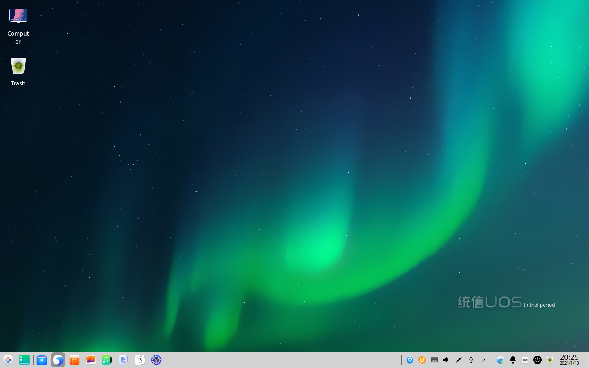

### Getting Started

When you log into the system for the first time, a welcome program will automatically start.  Watch the introduction video to get new features, customize your desktop, enable the window effect and know more about UnionTech OS.

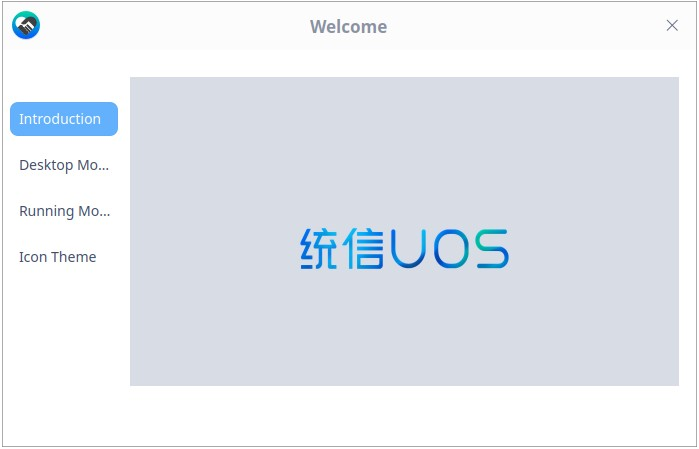

Once login, you are experiencing UnionTech OS Desktop Environment, which is comprised of Desktop, Dock, Launcher, Control Center, and window manager. 

## Desktop

Desktop is the main screen you see after logging in. On the desktop, you can create a new file/folder, sort files, open in terminal, set wallpaper and screensaver and etc. You can also add shortcuts for applications  on desktop by using "Send to desktop" function, see [Set App Shortcut](#Set App Shortcut).

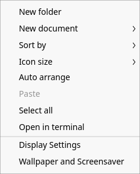

>Notes: On the touchpad, move with four/five fingers downwards to display desktop, and move upwards immediately to hide which corresponds to the operation of **Super** + **D**. 

### Create New Folder/Document

Just as in File Manager, you can create a new folder/document on the desktop, or do some operations for the files on it.

   - Right-click the desktop, select **New folder** and enter the name for it.
   - Right-click the desktop, select **New document**, select the type and enter its name.

Right-click a file or folder on the desktop, and use the features of File Manager as below:

| Function         | Description                                                  |
| ---------------- | ------------------------------------------------------------ |
| Open with        | Select an app to open it.                                    |
| Cut              | Move it to another location.                                 |
| Copy             | Copy it to another location.                                 |
| Rename           | Change its name.                                             |
| Delete           | Delete and move it to the trash.                             |
| Create link      | Create a shortcut of the file or folder.                     |
| Tag information  | Add a tag.                                                   |
| Compress/Extract | Compress the file or folder, or extract the compressed file. |
| Properties       | View the basic info, share it or change the permission.      |

>Notes: 
>   - If you are using a computer equipped with a touchscreen, long press for 1 second and release on the touchscreen.
>   - On the touchpad, click with two fingers to display the right-click menu. 
>   - Press **Alt** + **M** on the keyboard to open right-click menu. 

### Sort Files

Sort the files on your desktop to make it organized and fit your needs.

1. Right-click the desktop.
2. Click **Sort by**, you can:

   - Click **Name** to display files in the name sequence.
   - Click **Size** to display files in the size sequence.
   - Click **Type** to display files in type.
   - Click **Time modified** to display files in the order of last modified date.

>Tips: Check **Auto arrange**, icons on the desktop will be listed in order automatically, and if an icon is removed, another one will fill in the blank.

### Adjust Icon Size

1. Right-click the desktop.
2. Click **Icon size**, and choose a proper size.

>Tips: Press **Ctrl** + / /scrolling mouse wheel to adjust icon size on the desktop and in Launcher.

### Set Display
You can set display scaling, screen resolution, brightness and so on from the desktop.

1. Right-click the desktop.
2. Click **Display Settings** to open the settings in Control Center.

>Notes: For specific operations, please refer to [Display](#Display).

### Change Wallpaper
Select some elegant and fashionable wallpapers to beautify your desktop and make it distinctive.

1. Right-click the desktop.
2. Click **Wallpaper and Screensaver** to preview all the wallpapers.
3. Click your favorite one and it will apply in your desktop and screen lock.
4. You can also choose **Only desktop** or **Only lock screen**.

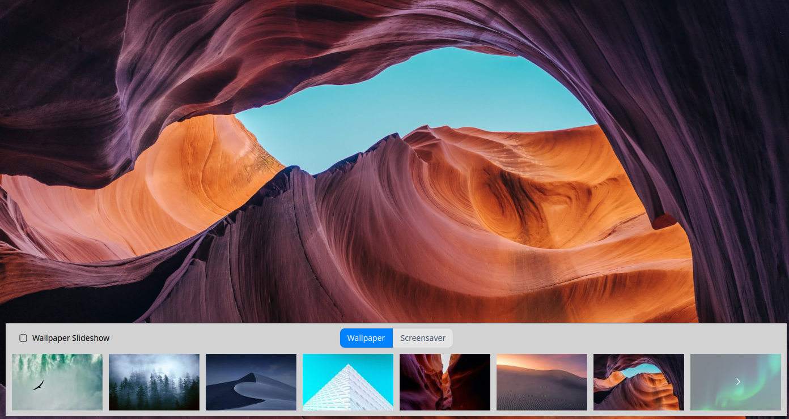

>Tips: 
>    - Check **Wallpaper Slideshow**, and set the time interval to change wallpaper automatically, or set to change the wallpaper in the process of login or wakeup. 
>    - You can also set your favorite picture as wallpaper in an image viewer.

### Set Screensaver
The screensaver was used to protect the kinescope before, but now it is mainly for protecting personal privacy from peering.

1. Right-click the desktop.
2. Click **Wallpaper and Screensaver**, and select **Screensaver** to preview all the screensavers.
3. Select one and click **Apply**, and set the **Wait**(waiting time) for the screensaver to start.
4. You can also check the box of **Require a password on wakeup** for a better privacy protection.
5. After that idle time, the screensaver will start.

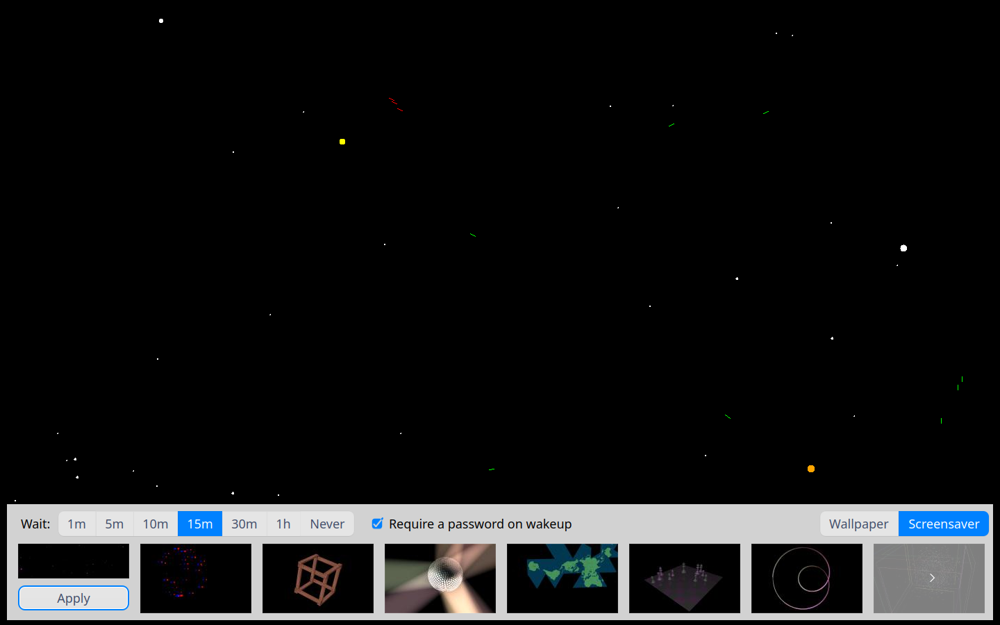

### Clipboard

All the texts, pictures and documents cut and copied by the current user after login are displayed in the clipboard, which can be copied quickly by double-clicking the clipboard. The clipboard is cleared automatically after logout and shutdown.

1. Use the shortcuts **Ctrl**+**Alt**+ **V** to wake up the clipboard.

2. Double-click in the clipboard to copy the current content quickly and the corresponding block will be moved to the top of the clipboard.

3.  Select the target destination to paste it.

4. Clickto delete the current content and click **Clear All** to clear the clipboard.

   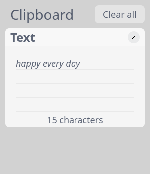

>Notes: If you are using a computer equipped with a touchscreen, slide in from the left edge of the screen exceeding the dock's height to call out Clipboard.

## Dock

Dock is at the bottom of the desktop by default to help you quickly open frequently-used applications, which includes Launcher, applications, system tray, and plugins. In the dock, you can open launcher, show the desktop, enter the workspaces, open and exit apps, set input methods, adjust the volume, connect to a wireless network, view the calendar and enter the shutdown interface, and so on.

### Icons on Dock 
In the Dock, there are icons of Launcher, applications, system tray, and plugins.

| Icon | Description |
| ---- | ---- |
|  | Launcher - click to view all the installed applications. |
|  | Click to show the desktop. |
|  | Multitasking View - click to show workspaces. |
|  | File Manager - click to view files and folders on the disk. |
|  | Browser- click to open webpages. |
|  | Album - import and manage photos. |
|  | Store - search and install applications. |
|  |  Music - play local songs.  |
|  | Contacts - click to communicate with friends and hold video conferences. |
|  | Calendar -  view dates and create new schedules. |
|  |   Control Center - click to check or change system settings.   |
|  | Notification Center - show all notifications from the system and applications. |
|  | Desktop AI Assistant - click to issue instructions or make inquiries with voice or texts. |
|  | Onboard virtual keyboard. |
|  | Click to enter the shutdown interface. |
|  | Trash. |

>Tips: In Efficient Mode, you can click the right side of Dock to show the desktop. Move the cursor to the running app in the Dock and you will see its preview window.

### Switch Display Mode
There are two display modes of Dock: fashion mode and efficient mode, icon sizes and window effects are different in them.

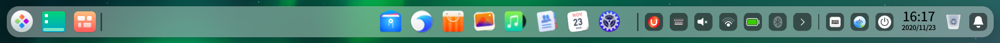

&nbsp;&nbsp;&nbsp;&nbsp;&nbsp;&nbsp;&nbsp;&nbsp;&nbsp;&nbsp;&nbsp;&nbsp;&nbsp;

You can switch the display modes by the following operations:

1. Right-click the Dock and select **Mode**.
2. Select the display mode.

### Change Dock Location
You can place Dock in any direction of your desktop.

1. Right-click the Dock and select **Location**.
2. Select a location.

### Change Dock Height
Drag the top edge to increase or decrease the height.

### Show/Hide Dock

You can hide the Dock in order to maximize the expansion of the desktop operating area. 

1. Right-click the Dock and select **Status**.
2. On the submenu, you can select:
   - **Keep Shown** - display Dock all the time.
   - **Keep Hidden** - hide Dock and display it only when hovering on the dock area.
   - **Smart Hide** -  hide Dock automatically if the dock area is used.

>Notes: If you are using a computer equipped with a touchscreen: 
> when the Dock is set as "Always Hidden" or "Smart Hide", if the Dock is at the bottom, slide in upward from the bottom edge of the screen to call it out; and if the Dock is on the top, slide in downward from the upper edge of the screen to call it out. 

### Show/Hide Plugins

1. Right-click the Dock and select **Plugins**.
2. In the submenu, you can check or uncheck **Trash, Power, Show Desktop, Onboard, Notification Center, Multitasking View, Datetime and Desktop AI Assistant** to show or hide the corresponding icon in the Dock.

### View Notifications
When there are system or application notifications, they will be shown in the middle of the screen. If there are buttons in the message, click buttons to do the actions; if there are not, click the message to close it.

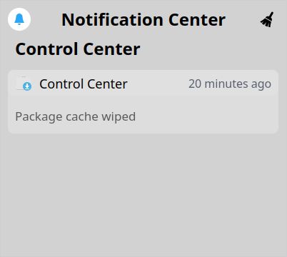

&nbsp;&nbsp;&nbsp;&nbsp;&nbsp;&nbsp;&nbsp;&nbsp;&nbsp;&nbsp;&nbsp;&nbsp;&nbsp;

Click  in Dock to view all the notifications.

>Notes: If you are using a computer equipped with a touchscreen, slide in from the right edge of the screen exceeding the dock's height to call out Notification Center.

### Use Desktop AI Assistant

Desktop AI Assistant supports voice and text input, information search, operation instructions, etc. With it, you can adjust system volume and screen brightness, and switch on/off power saving mode, WiFi or Bluetooth.

>Notes: Voice dictation, voice reading, translation and other functions of Desktop AI Assistant are available only after you activate the system. When you run Desktop AI Assistant for the first time, a private agreement window pops up. After you agree with it, you can use functions such as voice dictation, voice reading, translation and others normally.

You can wake up Desktop AI Assistant as follows:

1. Press **Super** + **Q** to wake up Desktop AI Assistant.

2. Use fixed phrase "Hello Xiaohua" or "Hello Xiaohua + order" to wake up Desktop AI Assistant.

You can input words and voice as follows：

1. Click  in the Dock to open Desktop AI Assistant.
2. Connect the recording devices and  talk to Desktop AI Assistant directly, such as  "change the wallpaper", "adjust the screen brightness", and "what's the weather".
3. It is also available to input text instructions after the input box appears.

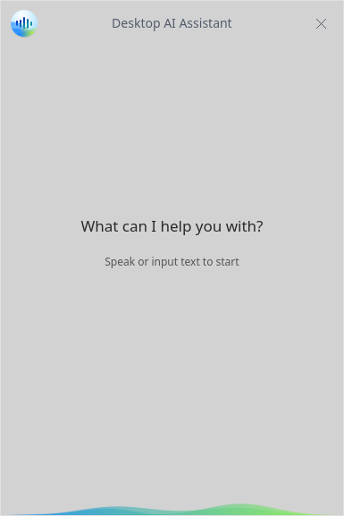 

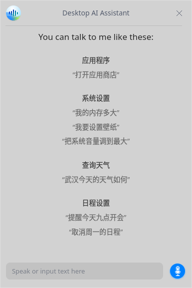
>Tips: Select the text information needed and press **Ctrl** + **Alt** + **P** for voice reading; after connecting the recording devices, press **Ctrl** + **Alt** + **O** in the input box to enter the dictation mode and convert the voice input to texts.

#### Set up Speech to Text

Speech to Text is set in Assistive Tools in Control Center.  It is enabled by default and can be disabled as needed. 

Select the input box, invoke the Speech to Text function via the shortcut keys **Ctrl** + **Alt** + **O** and start dictating the input voice. 

#### Set up Text to Speech

Text to Speech is set by default in Assistive Tools in Control Center. Only when it is enabled, Text to Speech function can be available. 

Text to Speech is only available for the currently-selected texts and the operation steps are as follows:

1. Select the texts, press  **Ctrl** + **AIt** + **P** on the keyboard or right-click **Text to Speech** to start reading.
2. Click the speaker icon or right-click **Stop reading** to stop reading.

>Notes: If you select other texts during reading, the current speaker icon will be displayed in the newly-selected location. Click the speaker icon, use the shortcut key or right-click **Text to Speech**, the current reading will be interrupted and  it starts reading the newly-selected texts.

#### Set up Translation

Translation is set by default (enabled) in Assistive Tools in Control Center. Only when it is enabled, the Translation function can be available. 

Translation is only available for the currently-selected texts and the operation steps are as follows:

1. Select the texts, press  **Ctrl** + **AIt** + **U** on the keyboard or right-click **Translate** to start translation.

>Notes: It only supports Chinese-English and English-Chinese translation currently.

### View Date and Time

   - Hover the cursor over the Time icon in Dock to view the current time, date and day of the week.
   - Click the Time icon to open Calendar.

### Enter Shutdown Interface

You can either click  in Dock or click  at the bottom right corner of Launcher mini mode to enter shutdown interface.

| Function                                                     | Description                                                  |
| ------------------------------------------------------------ | ------------------------------------------------------------ |
| Shut down   | Shut down the computer.                                      |
| Reboot          | Restart the computer.                                        |
| Suspend       | The computer will run with low consumption.                  |
| Hibernate           | "Hibernate" is mounted to system with swap partition. This option does not appear for systems without swap partition. |
| Lock                | Lock the computer, or press **Super** + **L** to lock it.    |
| Switch user  | Log in with another user account.                            |
| Log out         | Click it to clear up all information about the current account. |
| Start system monitor | Click it to open System Monitor quickly.               |

>Notes:  will be shown if there are multiple accounts in the system.

### Trash
You can find all temporarily deleted files in the trash, and also restore or empty them.

#### Restore Files

You can restore temporarily deleted files in Trash or press **Ctrl** + **Z** to restore the recently deleted files.

1. Select the file in the trash.
2. Right-click the file and select **Restore**.
3. The file will be in its original path.

>Attention: If the original folder of the file has been deleted, the deleted file will be restored to a new folder automatically created.

#### Delete Files

You can delete any one file in Trash.
1. Select the file to be deleted in the trash.
2. Right-click and select **Delete**.

#### Empty Trash

In the trash, click **Empty** to permanently delete all the files in the trash.

## Launcher
Launcher   helps you manage all the installed applications, where you can quickly find an application by category navigation or by a search.

> Notes: arm architecture does not support startup menu setting for now.

You can view newly installed applications in Launcher. The newly-installed ones are followed by a blue dot.

>Notes: On the touchpad, click with four/five fingers to display/hide Launcher, which corresponds to the operation of  **Super**.

### Switch Launcher Modes

There are two display modes of Launcher: fullscreen mode and mini mode. Click the icon at the upper right corner to switch modes.

Both modes support searching applications and sending them to the desktop or Dock.

The mini mode also supports opening File Manager, Control Center and shutdown interface directly.

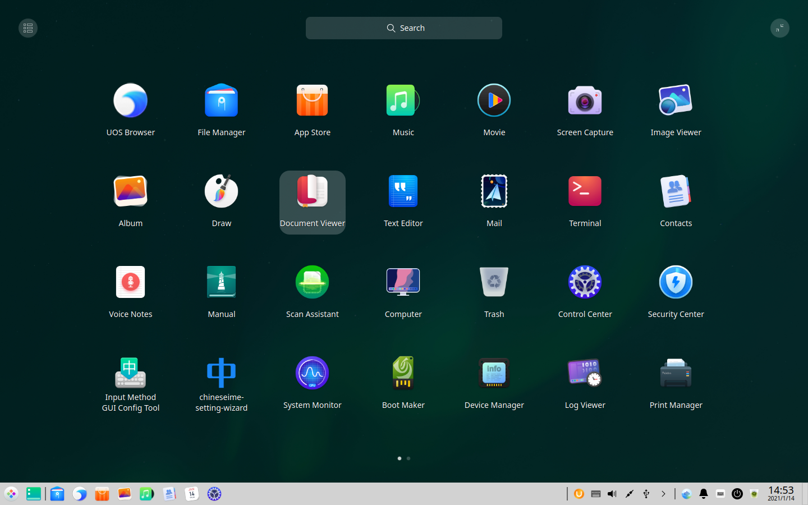
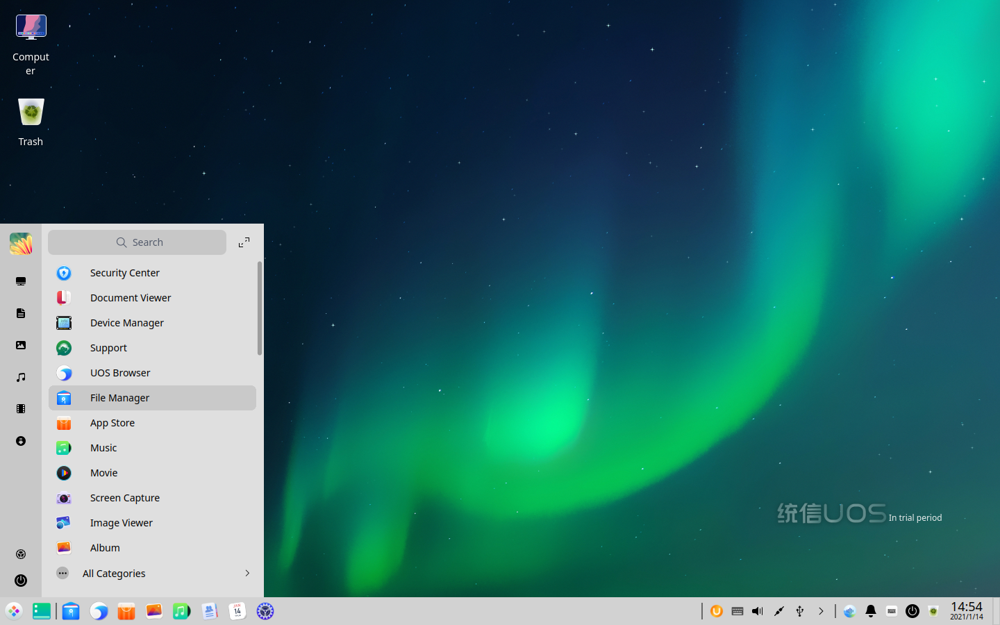

### Sort Applications

In fullscreen mode, all applications in Launcher are listed by the installation time by default. You can sort the application icons as the ways below:

   - Hover the cursor over an application icon, hold down the left key of mouse, drag and drop the application icon to arrange it freely.
   - Click the category icon  on the upper left in Launcher to arrange the icons by category.

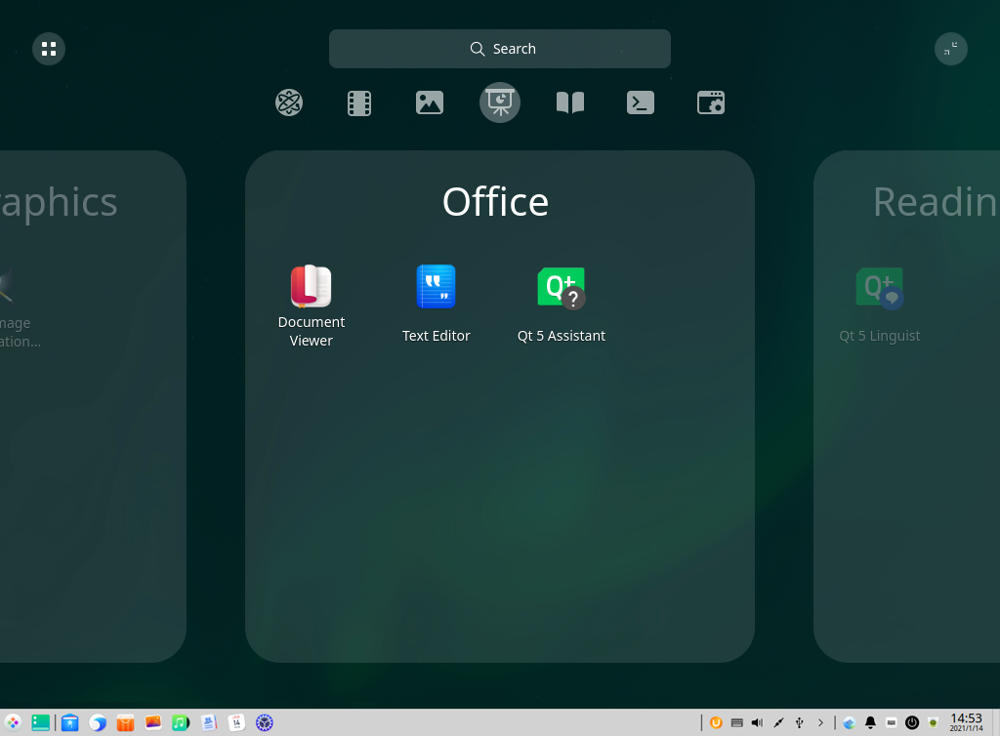

In mini mode,  applications are displayed according to using frequency by default.

### Find Applications

In Launcher, you can scroll up and down to find an application, or locate it with the category navigation.

If you already know the application name, just search for it.

### Set App Shortcut
The shortcut offers a method to run applications easily and quickly.

#### Create App Shortcut
Send the application icon to the desktop or Dock to facilitate the follow-up operations.

In Launcher, right-click an app icon and you can:

   - Select **Send to desktop** to create a shortcut on the desktop.
   - Select **Send to dock** to fix the application icon in Dock.

>Notes: You can drag the application icon from Launcher to Dock. But you cannot drag and drop the application while it is running. Then you can right-click the application icon in Dock and select **Dock** to fix it in order to open it quickly for the next time.

#### Delete Shortcut
Delete a shortcut from the desktop directly, or remove it from Dock or Launcher.

**Remove the shortcut from Dock:**

   - Hold down the left key of mouse, drag and drop the icon away from Dock. 
   - You cannot drag and drop the application icon while it is running. Then you can right-click the application icon in Dock and select **Undock** to remove it from Dock.

**Remove the shortcut from Launcher:**

In Launcher, right-click the icon and you can:
   - Select **Remove from desktop** to delete the shortcut from the desktop.
   - Select **Remove from dock** to remove the application icon from Dock.

>Notes: The above operations only delete the shortcut rather than uninstall the applications.

### Install Applications
Search and install more applications you want in App Store.

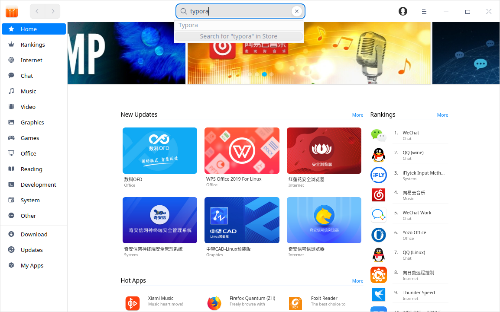

### Run Applications
For the applications whose shortcuts have been created on the desktop or Dock, you can open them in the following ways:

   - Double-click the desktop icon or right-click it and select **Open**.
   - Click the application icon in Dock or right-click it and select **Open**.

To open the application only shown in Launcher, click the icon or right-click it and select **Open**.

>Tips: For the frequently-used applications, right-click the app icon and select **Add to startup** to run it when the computer boots.

### Uninstall Applications
Uninstall the applications you no longer use to save disk space.

1. In Launcher, right-click the application icon.
2. Click **Uninstall**.

>Tips: In **Fashion mode**, drag the application icon in Launcher fullscreen mode to  in the Dock to uninstall the application.

## Control Center
You can manage the system settings in Control Center, including account management, network settings, date and time, personalization, display settings, system and application update, etc. After entering the desktop environment, click  to open Control Center.

>Notes: On the touchpad, slide with two fingers from the right edge of the touchpad to the left to display Control Center; slide with two fingers from the left edge of the touchpad to the right to hide Control Center. 

### Homepage Introduction

The homepage of Control Center provides several setting modules and click one to enter the detailed settings. 

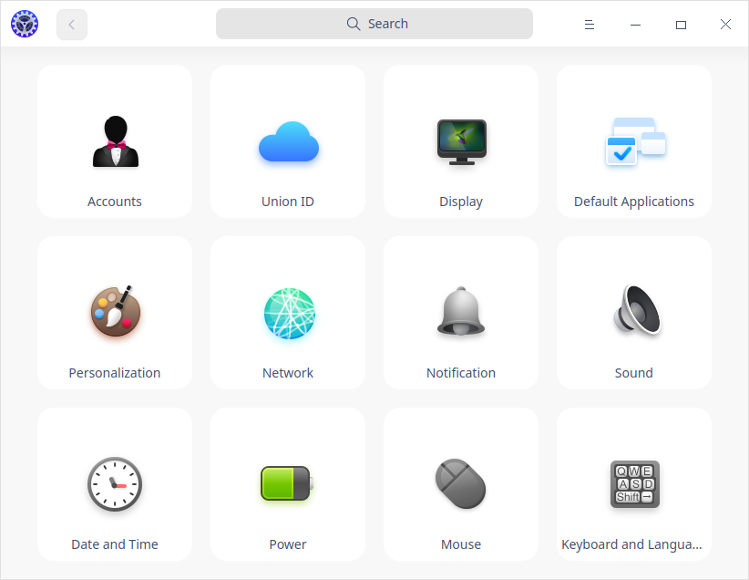

Once you open a setting module in Control Center, the navigation appears on the left. Click the left navigation to quickly switch to other settings.

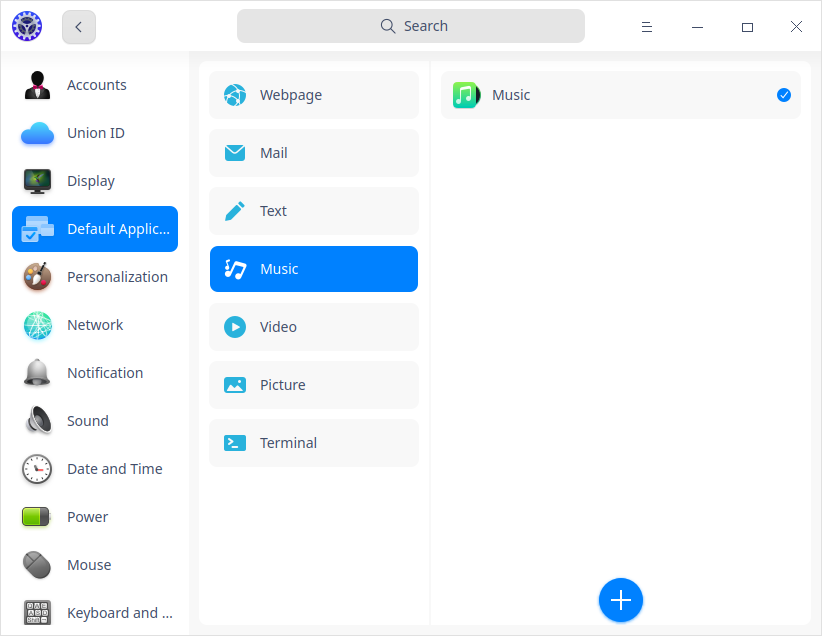

#### Title Bar

The title bar contains the back button, search box, main menu and the window buttons.

   - Back button: Click  to go back to the homepage.
   - Search box: Input a keyword and search the related settings.
   - Main menu: Click  to enter the main menu where you can set the window theme, view the manual and exit.

### Accounts
You have already created an account when installing the system. Here you can modify account settings or create a new one.

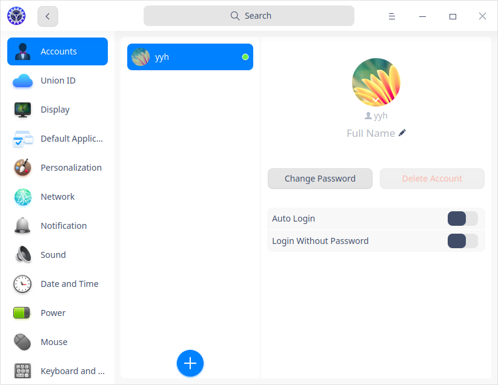

#### Create New Account

1. On the homepage of Control Center, click .
2. Click .
3. Input a username and a password twice.
4. Click **Create**.
5. Input the password of  the current user account in the authentication dialog box, and the new account will be added to the account list.

#### Change Account Avatar

1. On the homepage of Control Center, click .
2. Click an existing account in the list.
3. Click the user avatar, select a avatar or upload a local avatar.

#### Set Full Name
The account full name is shown in account list and system login interface and you can set it as needed.

1. On the homepage of Control Center, click .
2. Click an existing account in the list.
3. Click  after **Full Name**, and input a name.

#### Change Password

1. On the homepage of Control Center, click .
2. Click the current account.
3. Click **Change Password**.
4. Input the current password, the new password, and repeat the new one, click **Save**.

#### Auto Login
If "Auto Login" is enabled, you can log into the system directly, without inputting a password when the computer reboots or starts next time. But you still have to enter the password after locking or logging out of  the computer.

1. On the homepage of Control Center, click .
2. Click the current account.
3. Switch on **Auto Login**.

#### Login Without Password
If "Login Without Password" is enabled, you only need to click  to log into the system without inputting a password. 

1. On the homepage of Control Center, click .
2. Click the current account.
3. Switch on **Login Without Password** and you can log into the system without a password.

>Tips: 
>   - If both **Auto Login** and **Login Without Password** are enabled, once reboot or start, your computer will enter the desktop directly without requiring a password.
>   - "Empty keyring password" is checked by default, which means you don't have to input login password again for the applications of which the password is remembered under "Login Without Password" mode. Otherwise, you will have to input password whenever you run the application.

#### Set Fingerprint Password

Fingerprint password is used in system login, application authorization, and other scenarios. Scan your fingerprint when user password is required.

1. On the homepage of Control Center, click .
2. Click the current account.
3. Click **Add Fingerprint**.
4. Put your finger on a fingerprint reader and follow the instructions repeatedly until your fingerprint is added successfully.
5. Click **Done**. 

>Notes: You can add multiple fingerprint passwords for one account, and delete one by one as well. 

#### Delete Account

1. On the homepage of Control Center, click .
2. Click the other account.
3. Click **Delete Account**.
4. In the confirm dialog, click **Delete**.

>Attention: The logged in account cannot be deleted.

### Union ID

By logging in your Union ID, you can use cloud services such as cloud synchronization, App Store, Mail, browser and others.

When logging in for the first time, the window of **Privacy Policy** will pop up. If users need to open cloud services and other functions, you can check **I have read and agree to the Privacy Policy**, and click **Confirm**.

Cloud synchronization can automatically synchronize various system configurations to the cloud, such as network, sound, mouse, update, dock, launcher, wallpaper, theme, power supply, etc. To sync the settings from the cloud to another computer, just sign in with the same Union ID on that computer.

>Tips: When "Auto Sync" is enabled, you can check the options you want; when it is disabled, all settings will not be synced.

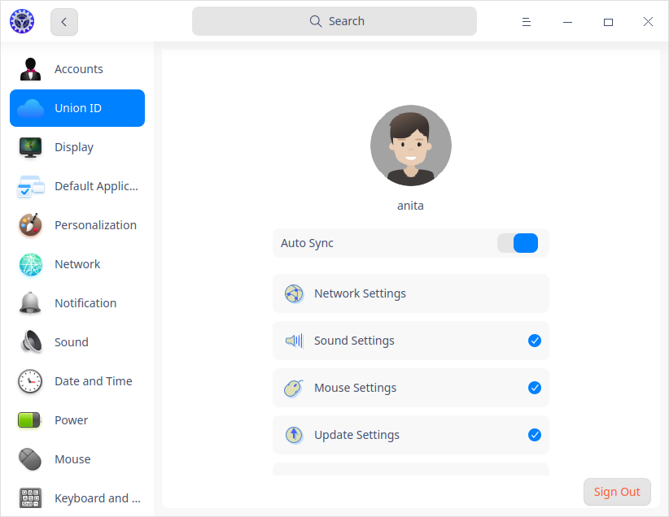

If you don't have a Union ID yet, you can sign up on the official website (currently multiple methods are supported including scanning via WeChat on mobile phone and register with phone number, and so on). The related functions here are available only after you have successfully registered a Union ID.

### Display
Set screen resolution, brightness, direction and display scaling properly to have the best visual effect.

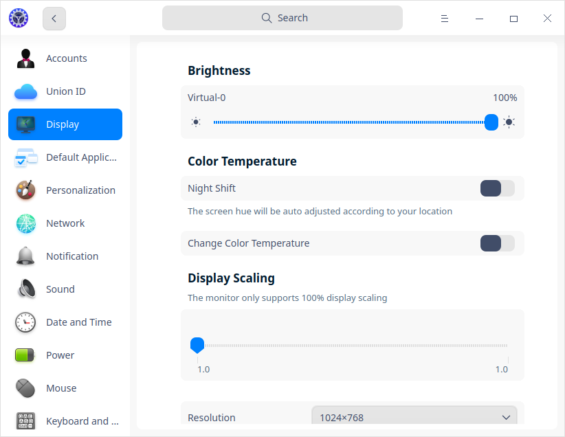

#### Single Screen Settings

When there is only one screen, you can adjust the brightness, resolution, refresh rate and display direction.

##### Adjust Brightness

1. On the homepage of Control Center, click .

2. In "Brightness" area, you can drag the slider to adjust the brightness.
   
##### Adjust Color Temperature

1. On the homepage of Control Center, click .

2. In "Color Temperature" area, you can:

   - Switch on **Night Shift**, the screen hue will be auto-adjusted according to your location.
   - Switch on **Change Color Temperature** is switched on, you can adjust the monitor brightness as you wish. 

>Notes: When **Night Shift** is switched on, **Change Color Temperature** becomes unavailable automatically, and vice versa.

##### Set Display Scaling

Set a proper display scale to have a normal display.

1. On the homepage of Control Center, click .
2. Click **Display Scaling**.
3. Change the display scaling, log out and log in again to see the changes.

>Notes: 
>   - When a HiDPI screen is detected, the display scaling will be automatically adjusted.
>   -  For the applications that do not support scaling, right-click it in Launcher and select **Disable display scaling** to get a better display.

##### Change Resolution

1. On the homepage of Control Center, click .
2. Select a proper resolution parameter from the drop-down list in "Resolution" area.
3. Click **Save**.

##### Change Refresh Rate

1. On the homepage of Control Center, click .
2. Click **Refresh Rate**.
3. Select a proper one, and click **Save**.

##### Change Display Direction

1. On the homepage of Control Center, click .
2. Select a proper direction parameter from the drop-down list in "Rotation" area.
3. Click **Save**.

#### Multiple Screen Settings
Expand your desktop by multiple screens! Use VGA/HDMI/EDP cable to connect your computer to other display devices such as monitor, projector and so on. When the computer is connected to another display device, **Multiple Displays** will appear.

1. On the homepage of Control Center, click .
2. In **Multiple Displays**, select a display mode:
   - **Duplicate**: display the same image on other screens.
   - **Extend**: expand the desktop across the screens.
   - **Only on xxxx**: only display on one screen.

 In multiple displays, press **Super** + **P** to show its OSD. 

Operations are as follows:

1. Hold **Super** and press **P** or click to select the options. 
2. Release the keys, the selected mode will take into effect.

>Notes: In multiple display mode, the sub-screens also support desktop icon display, right-click menu operation and other functions. 

### Touch Screen

If your computer has a touch screen, you can set your screen and adjust it.

1. On the homepage of Control Center, click to set your screen.
3. Click **Confirm**. 

### Default Applications
If you have installed several applications with similar functions, such as text editor, choose one of them to be the Default Applications to open that type of file.

#### Set Default Applications

1. Right-click the file, choose **Open with** > **Set default program**.
2. Select one application, **Set as default** is checked by default, and click **Confirm**.
3. The application will automatically be added to the Default Applications list in Control Center.

#### Change Default Applications

1. On the homepage of Control Center, click .
2. Select a file type.
3. Select another one in the list as the Default Applications.

#### Add Default Applications

1. On the homepage of Control Center, click .
2. Select a file type.
3. Click  below to add a desktop file (usually at /usr/share/applications) or a specified binary file as the Default Applications.
4. The application will be added to the list and set as Default Applications automatically. 

#### Delete Default Applications

In the Default Applications list, you can only delete the applications you added. To remove other applications from the list,  the only way is to uninstall them. Once uninstalled, they will automatically be deleted from the list.

To delete the Default Applicationss you have added, do as below:

1. On the homepage of Control Center, click .
2. Select a file type.
3. Click  after the application name to delete it.

### Personalization Settings
You can set overall personalization items such as theme, accent color, font, window effect and transparency, change the appearance of the desktop and windows to your favorite style. In addition, you can set icon theme, cursor theme and font.

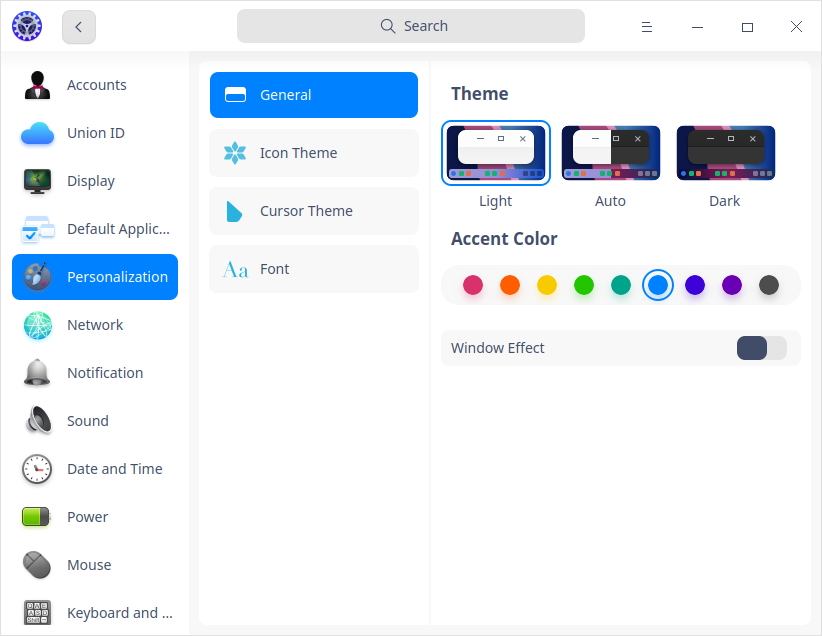

#### Set Window Theme
1. On the homepage of Control Center, click .
2. Click **General**.
3. Select one window theme, which will be used as system theme.

>Notes: "Auto" means changing window theme automatically according to the sunset and sunrise time. After sunrise, it is light theme; after sunset, it is dark theme.

#### Change Accent Color
Accent color refers to the color used when you select one option or file in the system.

1. On the homepage of Control Center, click .
2. Click **General**.
3. Pick a color under **Accent Color** and view its effects.

#### Enable Window Effect
Enable window effect to make the desktop and the windows more beautiful and delicate.

1. On the homepage of Control Center, click .
2. Click **General**.
3. Switch on **Window Effect**.

>Notes: You can set **Window Minimize Effect** as **Scale** or **Magic Lamp**. 

#### Adjust Transparency

This function is available only when "Window Effect" is switched on. Move the slider from left to right to set the transparency of Launcher (in mini mode), which is from totally transparent to opaque.

1. On the homepage of Control Center, click .
2. Click **General**, and switch on **Window Effect**.
3. Click the bar to adjust the transparency and view the effect in real time.

#### Set Icon Theme

1. On the homepage of Control Center, click .
2. Click **Icon Theme** and select an icon style.

#### Set Cursor Theme

1. On the homepage of Control Center, click .
2. Click **Cursor Theme** and select a set of cursors.

#### Change Font

1. On the homepage of Control Center, click .
2. Click **Font**.
3. Set the font and font size for the system.

### Network Settings
After login, you need to connect to a network first and then surf the Internet! 

>Tips: Check your network status by clicking the network icon in Dock.

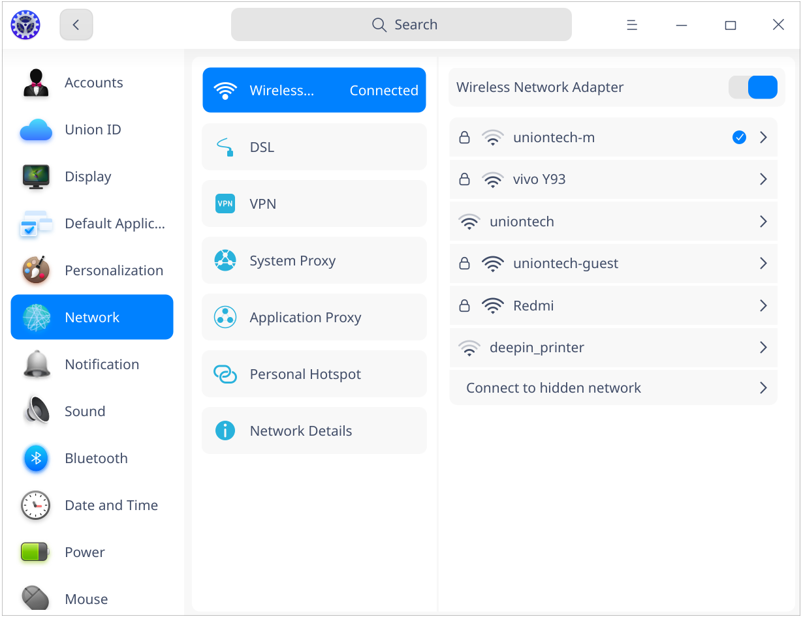

#### Wired Network

Wired network is secure and stable, which makes it the most common way to connect to the Internet. After your router is set, connect both ends of the network cable to the computer and router to connect to a wired network. 

1. Plug the cable into the network slot of a computer.
2. Plug another end of the cable into the router or network port.
3. On the homepage of Control Center, click .
4. Click **Wired Network** to enter the setting page of wired network.
5. Switch on **Wired Network Adapter** to enable wired network.
6. If it is successfully connected to the network, there will be a prompt "Wired Connection connected".

You can also edit and add a new wired network in the setting page.

#### Wireless Network

Wireless network helps you surf the network without cables, which is more flexible and supports more devices.

##### Connect to WLAN Network

1. On the homepage of Control Center, click .
2. Click **Wireless Network** to enter the setting page of wireless network.
3. Switch on **Wireless Network Adapter** to enable the wireless network.
4. The computer will auto search the nearby wireless network available .
5. Select the correct wireless network to connect.
   - If the network is open, it will auto connect to the network.
   - If the network is encrypted, please enter the password and click **Connect**.

##### Connect to Hidden Network

To prevent others from scanning your network and cracking your password, you can hide the wireless network in the router settings. After that, you will have to connect to it manually.

1. On the homepage of Control Center, click .
2. Click **Wireless Network** to enter the setting page of wireless network.
3. Switch on **Wireless Network Adapter** to enable the wireless network.
4. Click **Connect to Hidden Network**.
5. Enter the name, SSID, and other required info.
6. Click **Save**.

#### Hotspot

Hotspot changes the connected network signal to WLAN hotspot, so that other devices nearby can connect to the hotspot and surf the Internet. To enable hotspot, your computer must connect to a network and have a wireless network adapter.

1. On the homepage of Control Center, click .
2. Click **Personal Hotspot**.
3. Switch on **Hotspot** and do the settings.
4. Click **Save**. 

#### Mobile Network
If you are at a place without network, mobile network adapter is a useful tool to help you connect to the Internet as long as the place is covered by telephone signals.

1. Plug the mobile network adapter into your computer USB port.
2. Your computer will auto connect to the network.
3. On the homepage of Control Center, click .
4. Click **Mobile Network** to view the detailed network info.

#### DSL/PPPoE Connections

DSL is a dial-up connection using a standard phone line and analog modem to access the Internet. Configure the modem, plug the telephone line into the network interface of the computer, create a broadband dial-up connection, and enter the user name and password provided by the operator to dial up the Internet.

##### Create a PPPoE Connection

1. On the homepage of Control Center, click .
2. Click **DSL**, and click .
3. Enter the name, your account and password the operator provides.
4. Click **Save**. The connection will automatically start.

#### VPN

VPN is a virtual private network. Its main function is to establish a private network on the public network for encrypted communication. Whether you are on a business trip or working at home, you can use VPN to access intranet resources as long as you can access the Internet. You can also use VPN to speed up access to websites in other countries.

1. On the homepage of Control Center, click .
2. Click **VPN**, and click  or .
3. Select the VPN protocol type, and enter the name, gateway, account, password and other information. (Importing VPN will automatically fill in information)
4. Click **Save**,  the system will try to connect VPN network automatically.
5. You can export the VPN settings to backup or share with other users. 

>Notes: If you don't want to use the VPN as the default routing, but only want it to take effect on specific network resources, switch on **Only applied in corresponding resources**.

#### System Proxy

1. On the homepage of Control Center, click .
2. Click **System Proxy**.
3. Switch on **System Proxy**. For **Proxy Type**, you can:
   - Select **Manual** and input the address and port of proxy servers.
   - Select **Auto** and input a URL to configure the proxy info.
4. Click **Save**. 

#### Application Proxy

1. On the homepage of Control Center, click .
2. Click **Application Proxy**.
3. Do the necessary settings.
4. Click **Save**.

>Notes: After being configured, run Launcher, right-click any application's icon and check **Use a proxy**.

#### Network Info

You can view MAC, IP address, gateway and other network info in network details. 

1. On the homepage of Control Center, click .
2. Click **Network Details**.
3. View the network info of the current wired or wireless network.

### Notification Settings

You can set "Do Not Disturb" to system notifications, and also switch on or off the notification hints of some applications.

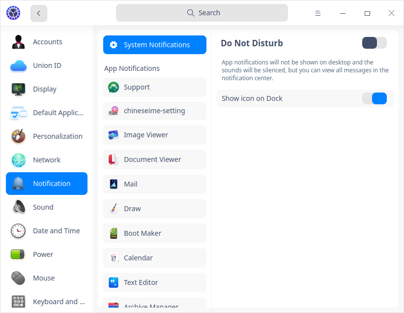

#### System Notification Settings

You can set "Do Not Disturb" to system notifications and whether to show icon on Dock here.

1. On the homepage of Control Center, click .

2. Click **System Notification**.

   - Switch on/off **Do Not Disturb**.
   After switching on this button, you can set the starting and ending time; also, you can check **When the screen is locked**. Under this mode, all notification are muted, but you can view all notifications in Notification Center. 
   - Switch on/off **Show icon on Dock**.

#### App Notification Settings

You can custom notification hints for all applications.

1. On the homepage of Control Center, click .
2. Under **App Notifications**, select an application, and in the window on the right, you can choose to check:
   - Play a sound
   - Show messages on lockscreen
   - Show only in notification center
   - Show message preview

### Sound Settings

Set your speaker and microphone properly to make you hear more comfortable and make clearer recordings.

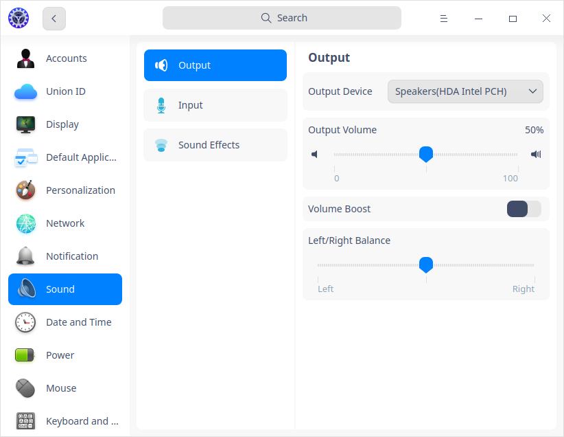

#### Output

1. On the homepage of Control Center, click .
2. Click **Output** to:
   - Select output device type from the drop-down list after **Output Device**.
   - Drag the slider to adjust output volume and left/right balance.
   - Switch on **Volume Boost**, the volume could be adjustable from 0~150% (the former range is 0~100%).

#### Input

1. On the homepage of Control Center, click .
2. Click **Input** to:
   - Select input device type from the drop-down list after **Input Device**.
   - Adjust input volume by dragging the slider.
   - You can enable **Automatic Noise Suppression**. 

>Tips: Usually, you need to turn up the input volume to make sure that you can hear the sound of the sound source, but the volume should not be too high, because it will cause distortion of the sound. Here is how to set input volume: Speak to your microphone at a normal volume and view "Input Level". If the indicator changes obviously according to the volume, then the input volume is at a proper level. 

#### System Sound Effects

1. On the homepage of Control Center, click .
2. Click **Sound Effects**, check the options you want to switch on the sound when the corresponding event occurs.

>Tips: Click to listen to the sound effect.

### Bluetooth Settings
Bluetooth helps you make a short-distance wireless communication between Bluetooth devices without cable or network. The common Bluetooth devices are Bluetooth keyboard, Bluetooth mouse, Bluetooth earphones, Bluetooth speakers, etc.

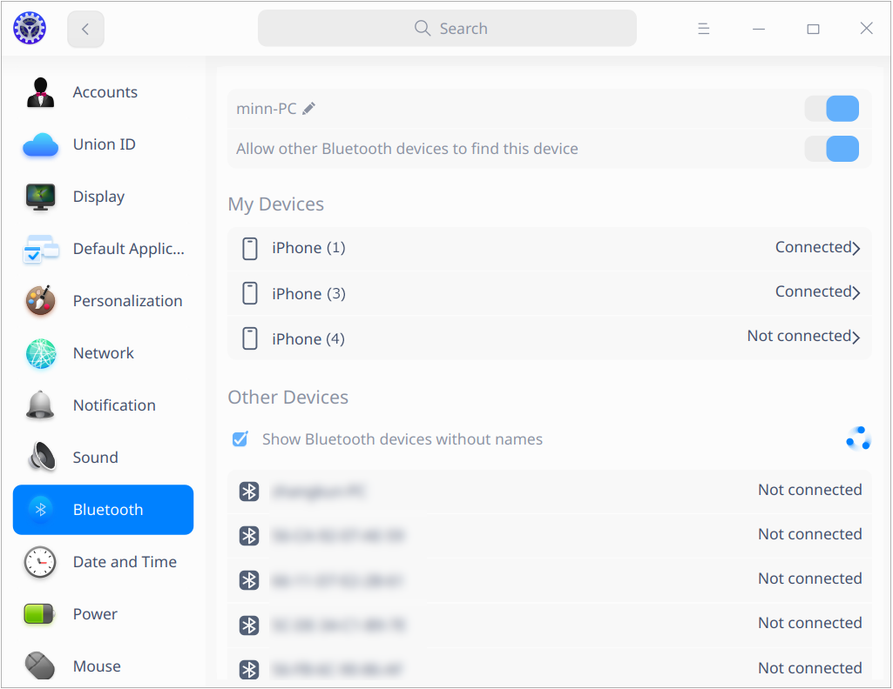

>Notes: Most laptops have Bluetooth. Just enable and use it. But most desktop computers do not have it and you can purchase one Bluetooth adapter and plug it into computer USB port to enable the function.

#### Change Bluetooth Name

1. On the homepage of Control Center, click .
2. Click  after the Bluetooth name, and enter a new name for your computer.

>Notes: Your computer's new name will be broadcasted automatically, and other devices should rescan to find it.

#### Connect to a Bluetooth Device

1. On the homepage of Control Center, click .
2. Switch on **Bluetooth**. The system will scan the nearby devices automatically and list them in **Other Devices**.
3. Click the device you want to connect, and input the PIN code if required. After pairing successfully, the device will be connected automatically. 
4. After that, the Bluetooth device will be added to **My Device** list.
5. In the list, click the device, you can **Disconnect** the device, or change its name.

#### Transfer/Receive files via Bluetooth

Files could be transferred / received via Bluetooth between UnionTech OS PC and non UnionTech OS PC or between UnionTech OS PC and mobile device (mobile phone / tablet).

Prerequisite: the Bluetooth devices of both the sender and the receiver have been paired and connected successfully.

**Transfer files from Bluetooth of UnionTech OS PC**

Usage scenario: sender (UnionTech OS PC) transfers files via Bluetooth to receiver(non UnionTech OS PC / mobile phone / tablet)

1. On the homepage of Control Center, click .
2. Switch on **Bluetooth**. The system will scan Bluetooth devices nearby automatically.
3. Select a paired and connected Bluetooth device in "My Devices". Click **Send Files** (this button will only appear on PC / mobile phone / tablet Bluetooth devices). Select a file to be sent from the popped-up File Manager interface, click **Open**.  
4. Click **Send** in the interface pops up to send a request. 

**Transfer files from Bluetooth of a mobile phone**

Usage scenario: sender (taking android phones as an example) transfers files via Bluetooth to receiver(UnionTech OS PC)

1. Switch on Bluetooth. The system will scan Bluetooth devices nearby automatically.
2. Select a paired and connected Bluetooth device.
3. Select a file to be sent in the phone, click **Send** to send it via Bluetooth.

**Receive files via Bluetooth**

When the sender sends a file, a prompt window pops up in the receiver's device, and the receiver can **Agree** or **Refuse** the file transfer.

   - If the receiver agrees with the request, then the sender starts to transfer the file and Bluetooth file transfer window is displayed; after the file transfer is completed, a prompt message will pop up at the the receiver, and the user can view the file content.
   - If the receiver is in the following situation, part of the file transfer fails, which will be displayed in the transmission failure list.
      - The file transfer request is refused by the receiver, then the transfer terminates, and "File Transfer Failed" window pops up.
      - The receiver times out or the transferring distance is beyond transmission range, and "File Transfer Failed" window pops up(Bluetooth device connection failed).
      - The receiver does not operate for 1 minute, then the transfer terminates by default,  and "File Transfer Failed" window pops up. 

### Date and Time
Set your timezone properly to have correct date and time. You can also change them manually.

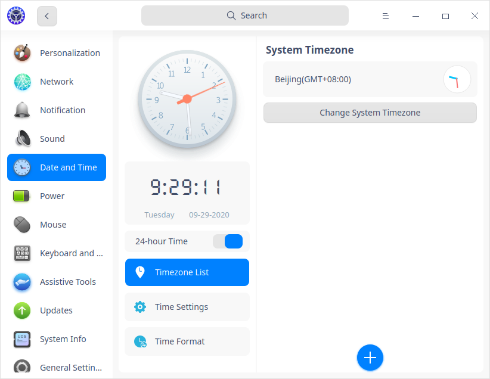

#### Change Timezone
You have selected the timezone during system installation and do as follows to change it.

1. On the homepage of Control Center, click .
2. Click **Timezone List**.
3. Click **Change System Timezone** and select a timezone by searching or clicking on the map.
4. Click **Confirm**.

#### Add Timezone
Add another timezone to see the date and time there.

1. On the homepage of Control Center, click .
2. Click **Timezone List**.
3. Click , select a timezone by searching or clicking on the map.
4. Click **Add**.

#### Delete Timezone

1. On the homepage of Control Center, click .
2. Click **Timezone List**.
3. Click **Edit** after "Timezone List".
4. Click  to remove the timezone.

#### Change Date and Time
Note that the auto-sync function will be disabled after changing date and time manually.

1. On the homepage of Control Center, click .
2. Click **Time Settings**.
3. Switch off **Auto Sync**.
4. Enter the correct date and time.
5. Click **Confirm**.

>Notes: You can also switch on **Auto Sync**, and set the server sync parameters.

#### Set Time Format

Setting the format of time and date is supported.

1. On the homepage of Control Center, click .
2. Click **Time Format** to set the first day of week, long date, short date, long time, and short time.

### Power Management

Power management turns the system to a low-power state when inactive, thus making a long battery endurance for laptop users, and protects system security.

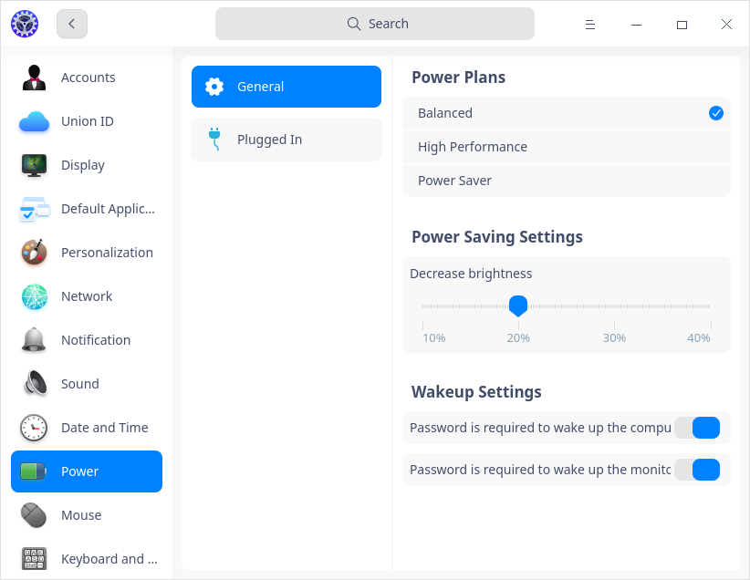

#### Power Plans

1. On the homepage of Control Center, click .
2. Click **General**.
3. You can select **Balanced**, **Power Saver** and **High Performance**.

>Notes: **High Performance** is displayed only when the computer supports high performance mode.

#### Power Saving Settings
To reduce the power consumption of your laptop, set your power saving mode.

1. On the homepage of Control Center, click .
2. Click **General**.
3. In **Power Saving Settings** area, you can:
   - Switch on **Auto power saving on low battery**(only applicable for laptops).
   - Switch on **Auto power saving on battery** (only applicable for laptops).
   - Drag the slider of **Decrease brightness** to adjust brightness.

>Notes: when **Auto power saving on battery** is switched off, the system enters **Balanced** mode directly.

#### Wakeup Settings

1. On the homepage of Control Center, click .
2. Click **General**.
3. Switch on **Password is required to wake up the monitor** and **Password is required to wake up the computer** in **Wakeup Settings** area to improve the security.

#### Battery 
1. On the homepage of Control Center, click .
2. Click **General**.
      - Switch on **Display capacity and remaining charging time** in **Battery** area to display remaining capacity and charging time(when you place the cursor over the battery icon on Tray).
      - Switch off **Display capacity and remaining charging time** in **Battery** area to display remaining capacity only(when you place the cursor over the battery icon on Tray).
>Notes: This function is only available on laptops.

####  Time to Turn Off Monitor

1. On the homepage of Control Center, click .
2. Click **Plugged In** or **On Battery**.
3. Set the time to turn off the monitor by dragging the slider in "Monitor will suspend after" area.

>Notes: Laptop users can set different time for the same setting item under "Plugged In" and "On Battery".

#### Time to Suspend

1. On the homepage of Control Center, click .
2. Click **Plugged In** and **On Battery**.
3. Set the time to suspend by dragging the slider in "Computer will suspend after" area.

>Tips: For laptop users, you can select **Suspend** from the drop-down list after **When the lid is closed**.  

#### Time to Lock Screen

1. On the homepage of Control Center, click .
2. Click **Plugged In** and **On Battery**.
3. Set the time to lock screen by dragging the slider in "Lock screen after" area.

#### Set "When the lid is closed"

1. On the homepage of Control Center, click .
2. Click **Plugged In** and **On Battery**.
3. You can select **Suspend**, **Hibernate**, **Turn off the monitor** and **Do nothing** from the drop-down list after **When the lid is closed**.  
>Notes: This function is only available for laptops.

#### Power button settings

1. On the homepage of Control Center, click .
2. Click **Plugged In** and **On Battery**.
3. You can select **Shut down, Suspend, Hibernate, Turn off the monitor, Do nothing** from the drop-down list after **When pressing the power button**.

Any operation done here will take effect immediately. At the same time, the system will notify the user that the power button setting is changed. 

#### Set "Low Battery Notification"

1. On the homepage of Control Center, click .
2. Click **On Battery**.
3. Switch on **Low Battery Notification**. The system issues a low battery notification when the remaining battery power is below a set threshold (for example, 20%).

You can adjust the threshold of low battery level by dragging the slider below "Low battery level".  You can adjust the threshold of auto suspend battery level by dragging the slider below "Auto suspend battery level".

>Notes: This function is only available for laptops.

#### Set "Auto suspend battery level"
1. On the homepage of Control Center, click .
2. Click **On Battery**.
3. Adjust the threshold of auto suspend battery level by dragging the slider below "Auto suspend battery level".

>Notes: This function is only available for laptops.

### Mouse and Touchpad
Mouse and Touchpad are common computer input devices. Using the mouse, you can make the operation easier and faster. For laptop computer users, when there is no mouse, the touchpad can also be used to replace the mouse for operation. Some devices also support a pointer, which can operate the mouse without moving the finger away from the reference key. In **Mouse** setting module, users can set the mouse, touchpad and trackpoint to make the device experience more consistent with their own habits.

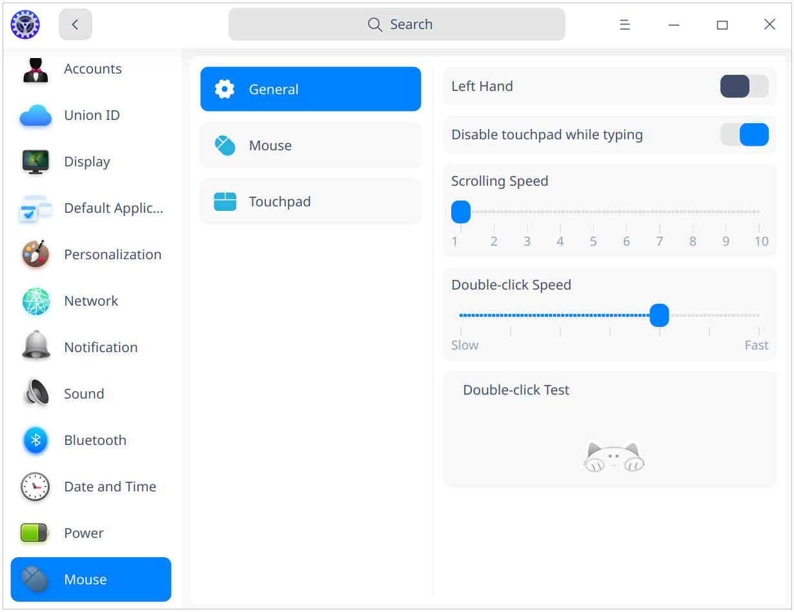

#### General Settings

1. On the homepage of Control Center, click .
2. Click **General**.
3. Switch on **Left Hand**, and adjust **Scrolling Speed**, **Double-click Speed** for both mouse and touchpad.

>Notes: If "Left Hand" is enabled, left-click and right-click of the mouse and touchpad exchange.

#### Mouse
After inserting or connecting the mouse, make relevant settings in the Control Center to make it more in line with your usage habits. 

>Notes: If there is no touchpad, “Disable touchpad when a mouse is connected” will not be shown.

1. On the homepage of Control Center, click .
2. Click **Mouse**.
3. Adjust **Pointer Speed**, which helps you to control the speed at which the pointer moves as the mouse moves.
4. Switch on **Natural Scrolling**/**Mouse Acceleration** if you want.

>Notes: 
>   - Turn on the mouse acceleration to improve the accuracy of the pointer. The moving distance of the mouse pointer on the screen will increase according to the acceleration of the moving speed. It can be turned on or off according to the usage.
>   - If Natural Scrolling is enabled, when you scroll down, the page will scroll down, when you scroll up, the page will scroll up as well. 

#### Touchpad

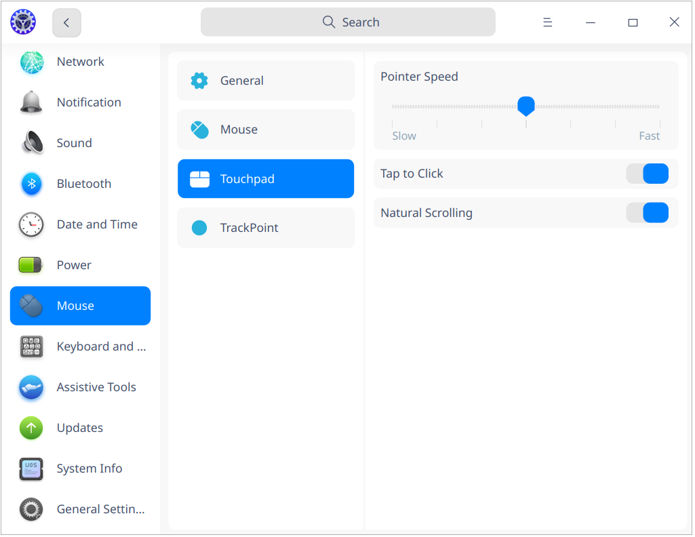

If you are using a laptop,  in order to avoid mis-operation on the touchpad, you can switch on **Disable touchpad while typing** in **Mouse > General** interface, and switch on **Disable touchpad when a mouse is connected** in **Mouse > Mouse** interface.  

You can also change **Pointer Speed**, and switch on **Natural Scrolling** for the touchpad.

#### TrackPoint

TrackPoint, also called pointing stick, is a small joystick used as a pointing device, typically mounted centrally in a laptop keyboard and used to control pointer movements on the screen.

1. On the homepage of Control Center, click .
2. Click **TrackPoint**.
3. Adjust **Pointer Speed** to a proper level.

### Drawing Tablet

Drawing tablet, also called graphics tablet and pen tablet, is a computer input device that enables a user to hand draw images, animations and graphics with a special pen-like stylus. 

After connecting to the computer, you can set the pressure sensing force of the drawing tablet, that is, the pressure sensing value of the pen tip and eraser.

>Notes: This part will be shown only if a drawing tablet is connected.

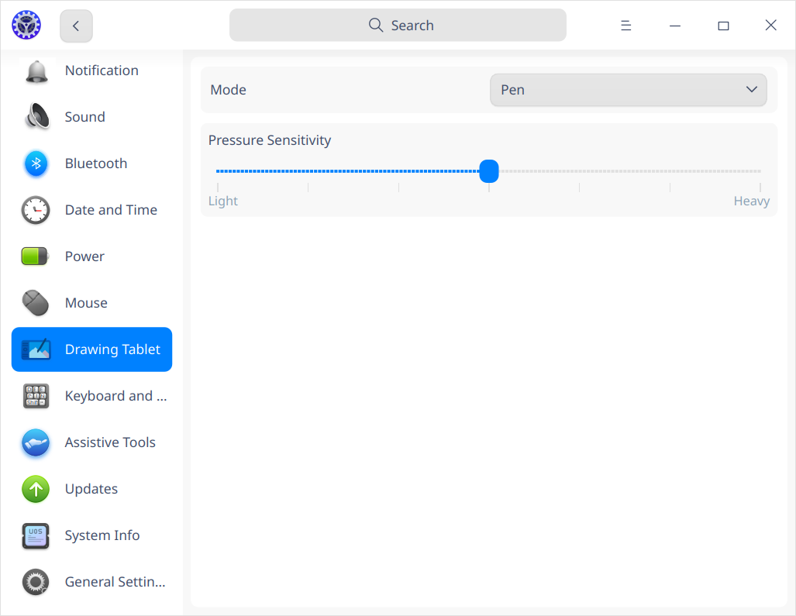

1. On the homepage of Control Center, click .
2. Choose **Pen** mode.
3. Adjust **Pressure Sensitivity** for the pen.

### Keyboard and Language
Set keyboard properties and select your keyboard layout to keep your typing habit. You can also adjust the keyboard layout according to the country and language, set up input method, change system language, and customize shortcuts here.

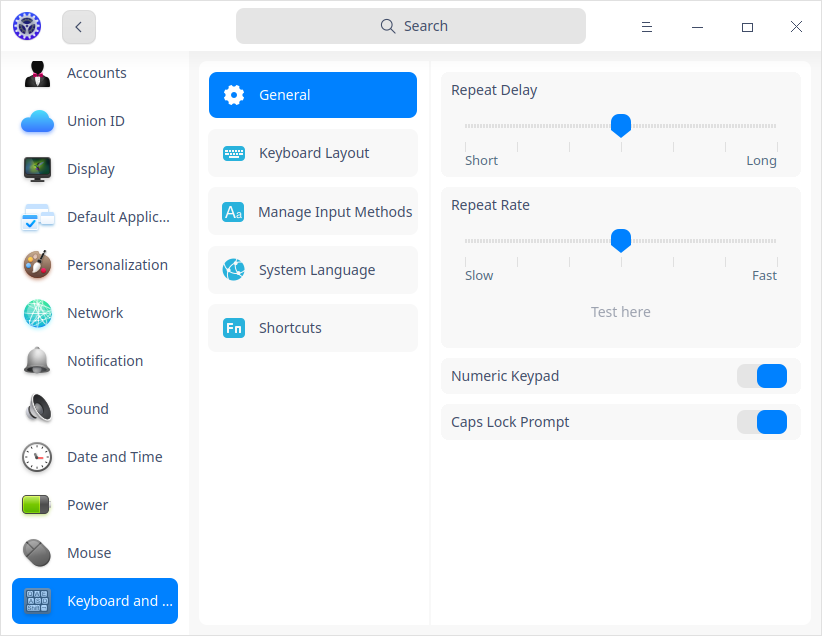

#### Keyboard Properties

1. On the homepage of Control Center, click .
2. Click **General**.
3. Adjust **Repeat Delay**/**Repeat Rate**.
4. Click **Test here** and hold down a key to test the repeat rate.
5. Switch on **Numeric Keypad** and **Caps Lock Prompt** if you want.

#### Keyboard Layout
Set the keyboard layout to customize the keyboard for the current language. When you press a key on the keyboard, the keyboard layout controls which characters are displayed on the screen. After changing the keyboard layout, the characters on the screen may not match the characters on the keyboard keys.

You have set a keyboard layout during system installation, but you can add more for other purposes. 

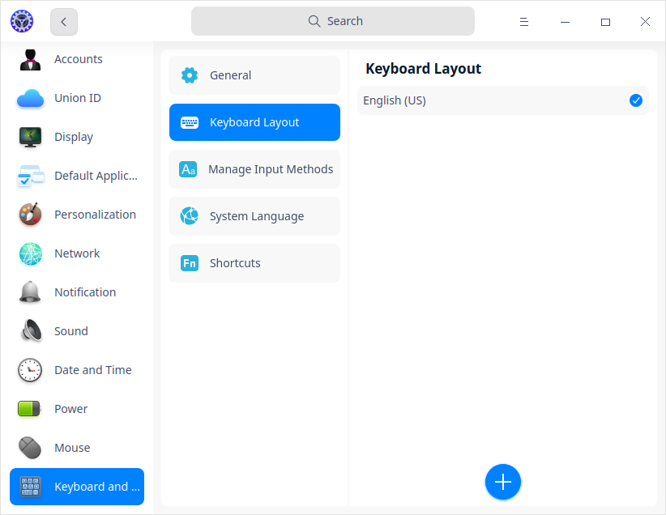

##### Add Keyboard Layout

1. On the homepage of Control Center, click .
2. Click **Keyboard Layout**.
3. Click . Click a keyboard layout to add it.

##### Delete Keyboard Layout

1. On the homepage of Control Center, click .
2. Click **Keyboard Layout**.
3. Click **Edit**.
4. Click  to delete keyboard layout.

#### Manage Input Methods

Setting the input method can provide more input methods for the system. In the input method interface, you can add multiple input methods and set the shortcut keys for input method switching, so that users can choose the input method that conforms to their personal typing habits.

##### Add Input Method

You can add multiple input methods to the input method management list to switch input methods.

1. On the homepage of Control Center, click .
2. Click **Manage Input Methods**.
3. Click  to:
   - Click **Find more in App Store**, then you can download an input method in App Store. After being successfully downloaded, it will be set as the default input method by the system automatically.
   - In "Add Input Method" page, select an input method to add it to the list.

>Notes: In "Manage Input Methods" page, click **Edit**, click  button to remove an input method. You can add the removed (but not uninstalled) input method in "Add Input Method" page.

##### Sort Input Method

1. On the homepage of Control Center, click .
2. Click **Manage Input Methods**.
3. In "Manage input methods" area, drag the input method up and down or click the up and down arrows after the input method to sort them.

##### Configure Input Method

1. On the homepage of Control Center, click .
2. Click **Manage Input Methods**.
3. In "Manage input methods" area, click  button after each input method to set up configurations.

##### Set Shortcut Key for Switching Input Methods

1. On the homepage of Control Center, click .
2. Click **Manage Input Methods**.
3. In "Shortcuts" area, select the shortcut key for switching input methods from the drop-down box.
>Notes: Once the shortcut key is set successfully, when the input method is switched, it will automatically switch to the keyboard layout corresponding to the input method. Select **Applies to** to apply the switched keyboard layout to the whole system or current application.

#### System Language

The system language is the language you selected when you installed the system by default, which can be changed at any time.

##### Add System Language
Add multiple languages into the list to change language conveniently.

1. On the homepage of Control Center, click .
2. Click **System Language**.
3. Click  to enter the language list.
4. Select the language you want, and it will be added into system language list automatically.

##### Change System Language

1. On the homepage of Control Center, click .
2. Click **System Language**.
3. Select the language you want to switch to, and the language package will be installed automatically.
4. After being successfully installed, log out and log in again to view the changes.

>Attention: The keyboard layout may also be changed in the process of switching the system language. Please make sure that you select a correct keyboard layout to enter the login password.

#### Shortcuts
The shortcut list includes all shortcuts in the system. View, modify and customize the shortcuts here as you want.

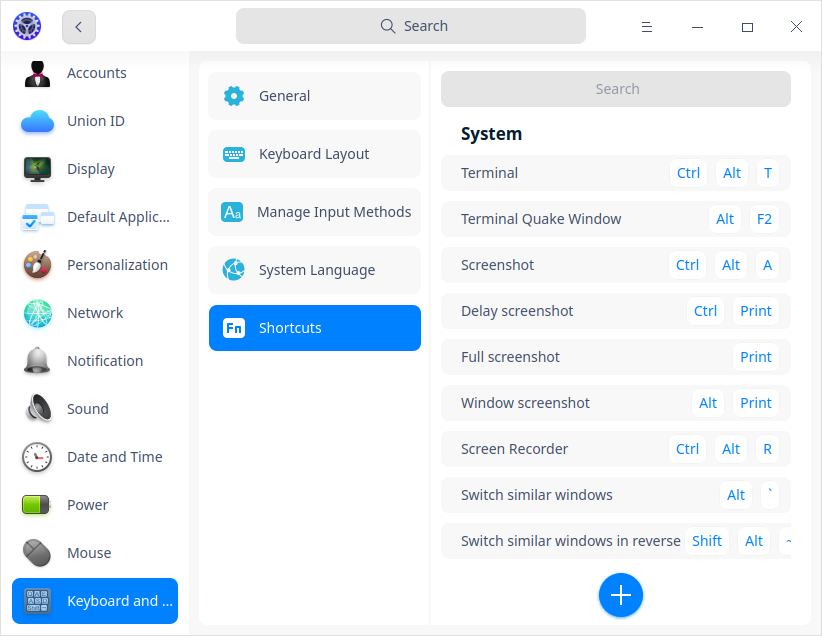

##### View Shortcuts

1. On the homepage of Control Center, click .
2. Click **Shortcuts**.
3. You can search or view the default shortcuts for system, window and workspace.

##### Modify Shortcuts

1. On the homepage of Control Center, click .
2. Click **Shortcuts**.
3. Click the shortcut you want to modify.
4. Press new shortcut to change it.

>Tips: To disable a shortcut, please press  on the keyboard. To cancel modifying, press **Esc** or click Restore Defaults at the bottom.

##### Customize Shortcuts

1. On the homepage of Control Center, click .
2. Click **Shortcuts**.
3. Click .
4. Enter the name, command and shortcut.
5. Click **Add**.
6. After being successfully added, click **Edit**.
7. Click  to delete the custom shortcut.

>Tips: To change the shortcut, click it and press a new shortcut to change it directly. To edit the name and command of the custom shortcut, click **Edit** > near the shortcut name to enter the shortcut settings.

### Assistive Tools

Desktop AI Assistant, Speech to Text, Text to Speech and Translation are available on the Assistive Tools interface.

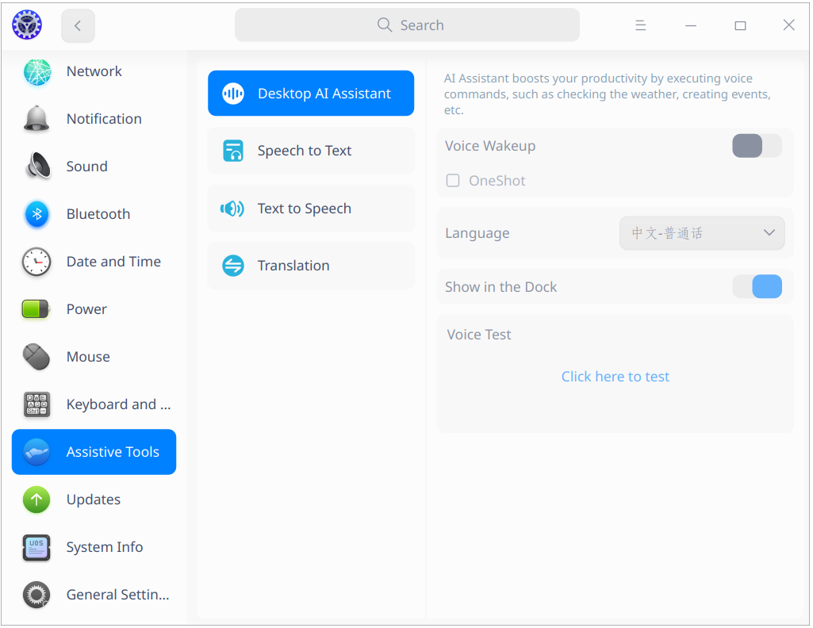

#### Desktop AI Assistant

Desktop AI Assistant  boosts your productivity by executing voice commands, such as checking the whether, creating events, etc. 

   - Switch on/off **Voice Wakeup**: when you switch on **Voice Wakeup**, you can check **OneShot** to enable wakeup order + semantic order, for example, "Hello, Xiaohua. What's the weather in Beijing?".
   - **Language**: Chinese-Mandarin, English
   - Switch on/off **Show in the Dock**: When it is enabled, Desktop AI Assistant will be displayed in the Dock. Otherwise, it will not be displayed but can be woken up by shortcuts.
   - **Voice Test**: Test whether the voice input is normal or not.

#### Speech to Text

   - Speech to Text: When there is audio input device available, Speech to Text is enabled by default. Otherwise it is disabled.
   - Language: It supports both Chinese-Mandarin and English. The default language is Chinese-Mandarin.

#### Text to Speech

   - Text to Speech: When there is audio input device available, Speech to Text is enabled by default. Otherwise it is disabled and hidden.
   - Show Speech Widget: It is disabled by default and is set not to display the speech widget only but can be woken up by the shortcut.
   - Voice Gender: It is used to set the voice gender and supports male and female with female as default.

#### Translation

   - Translation: It is enabled by default.
   - Language: It is used to set the translation language and supports both Chinese-English and English-Chinese with Chinese-English as default.

### Update Settings

When there are system updates, it will be notified on the home page of Control Center. Click  to enter "Updates" page. Click **Check for Updates**. After checking is done, you can download and install system and application updates. You can also set to download the updates automatically. 

>Tips: If you do not want to get the updates prompt, switch off "Updates Notification" in Update Settings.

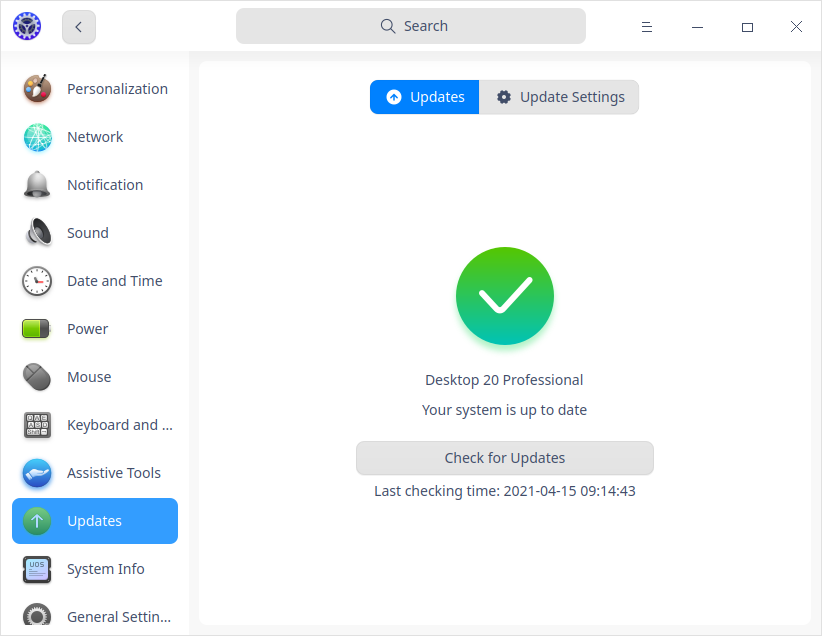

#### Update and Upgrade

1. On the homepage of Control Center, click .
2. Click **Update** to check if there is an update.
   - If there is no update, you will see "Your system is up to date".
   - If there is an update, you will see **Download and install updates** button, change log and other messages.
3. Click **Download and install updates** to download and install updates.
4. After updating finishes, a hint appears telling you the system is updated successfully, 

>Notes: You can click the button to pause and resume the downloading process. After updating finishes, a dialogue box pops up to remind you to **Reboot** or **Shut down** your computer to make the updates come into effect.

#### Auto Download Updates

1. On the homepage of Control Center, click .
2. Click **Update Settings**.
3. Switch on **Auto Download Updates**.
4. When there are system updates, they will be automatically downloaded.

>Tips:  Switch on **Auto Clear Package Cache** to remove the downloaded package caches regularly. 

### System Info
You can view system version, authorization info, hardware info, and the agreements here.

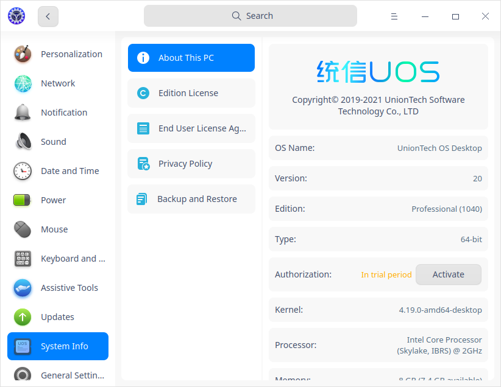

#### About This PC

1. On the homepage of Control Center, click .
2. Under **About This PC**, you can view system version, authorization and hardware information.
3. If the system has not been activated, click **Activate** to activate the system.

#### Edition License

1. On the homepage of Control Center, click .
2. View the system edition license under **Edition License**.

#### End User License Agreement

1. On the homepage of Control Center, click .
2. View the End User License Agreement under **End User License Agreement**.

#### Privacy Policy

1. On the homepage of Control Center, click .
2. View the Privacy Policy under **Privacy Policy**.

### Authorization Management

Authorization management is a self-developed tool to help you activate the system.  

Here mainly introduces the unactivated interface, activation method, activation success and activation failure interfaces.

#### Unactivated Interface

The inactive status includes "unactivated" and "unactivated after expiration".

   - Unactivated: info in the interface includes name, edition, and authorization status.
   - Unactivated after expiration: the system is not activated within expiration date, info in the interface includes name, edition, authorization status, authorization object and expiration date. 

There are two ways to run the authorization management tool when the system has not been activated before:

   - Click on the tray in the lower right corner to enter the interface.

   - Open the **Control Center** to select the **System Info** and click **About This PC** to view the edition authorization column. Click **Activate** to enter the interface.

>Notes: If the system is not activated, the authorization management icon will be always displayed on the tray in the lower right corner.

#### Activation Method

The activation methods of authorization management can be divided into online activation and offline activation, while the online activation methods include "Try Full Version", "Input Serial Number" and "Import License File".

>Attention: Only systems in the trial period or the ones activated successfully can all the functions of UnionTech OS be used normally, otherwise some functions will be limited. 

##### On-line Activation

The on-line activation is available only when the network is connected normally.

###### Try Full Version

There is only one chance of **Try Full Version** for each device and the valid period is 90 days calculated from the activation date. All the system functions are available in the trial period.

1. Click  on the tray in the lower right corner to enter the interface.

   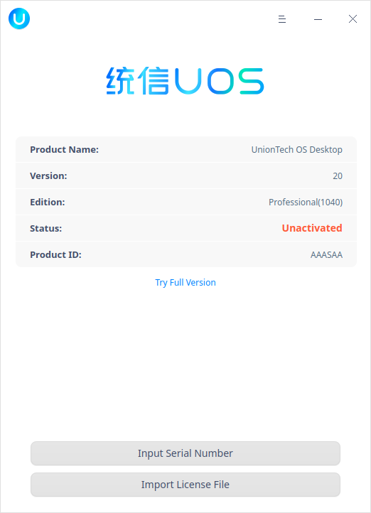

2. Click **Try Full Version** and go to the activation interface.
3. Click **Activate Now** and pops up the confirmation dialogue once again. Click **Confirm** to successfully activate the interface and the icon in the dock is changed to .

It is available to view the information such as status, expiration date and so on. The system could also be activated by serial number and license files.

   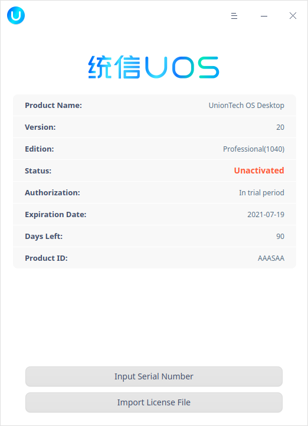

###### Input Serial Number

1. Click  on the tray in the lower right corner to enter the interface.
2. Click **Input Serial Number** to input the correct activation code and click **Activate Now**.
   >Notes: UnionTech OS supports both 16-digit and 25-digit serial numbers. 

   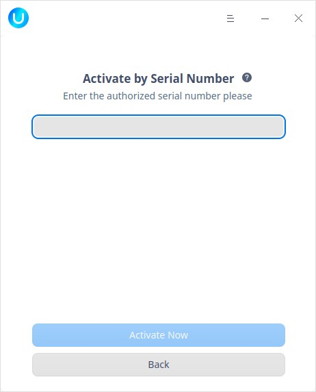

3. Click **Confirm** in the pop-up confirmation dialogue box and pops up the activation success interface.

###### Import License File

1. Click  on the tray in the lower right corner to enter the interface.
2. Click **Import License File**, select the correct license file in .key format in the File Manager and click **Activate Now**.  
3. Click **Confirm** in the secondary confirming dialogue box and pops up the activation success interface.

##### Off-line Activation

The off-line activation can be adopted when the network connection is abnormal.    

1. It will jump to the off-line activation interface when abnormal network connection is detected by the system in the process of activating the system by inputing the serial number or importing the license file.

   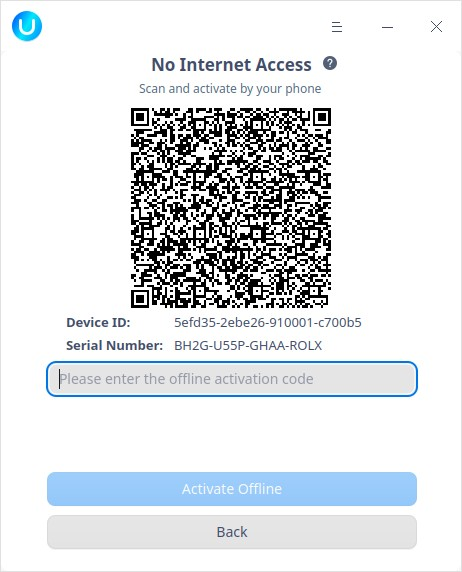

2. Scan the QR code with your mobile phone  and the current device ID as well as activation code are displayed in the pop-up activation interface.

   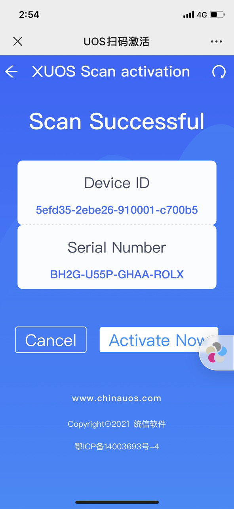 

3. Click **Activate Now** and click **Confirm** in the pop-up confirmation dialogue. 

4. The device ID, activation code and off-line activation code are displayed in the activation success interface.

5. Input manually in the input box in PC the off-line activation code in the your mobile phone.

6. Click **Activate Offline** to jump to the activation success interface.

#### Activation Success

After the system is activated successfully, the authorization management icon will not be shown in the Dock. You can check the relevant information from "Control Center > System Info > About This PC". 

The activation success interface shows the information such as product name, version, and so on. You can click **View Details** to view more information. 

The major information shown includes:
   - Product Name:  operation system name
   - Version: operation system version
   - Activation Status: including unactivated, expired and unactivated, and activated.
   - Authorization Status: including unauthorized, expired and authorized. 
   - Activation Method: it displays your actual activation method.
   - Expiration Date: From the 10th day to expiration date, the system will remind you that the authorization is about to expire.

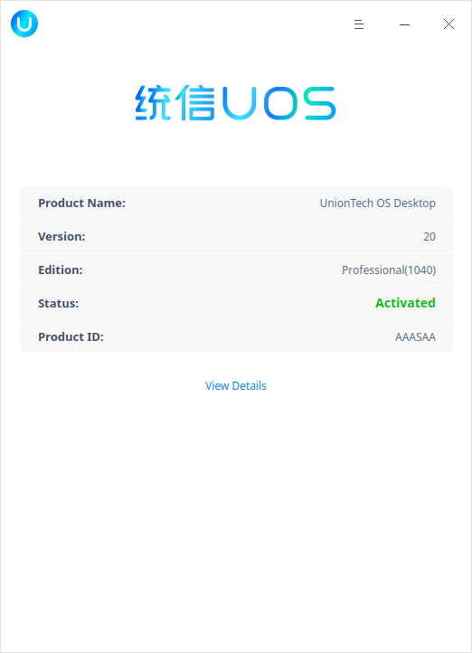

##### Change Serial Number

When the system is activated successfully, the serial number needs to be changed for some reasons.

If and only if the following conditions are met, the serial number can be changed.

   - When the network status is online, changing serial number is supported. When the network status is offline, changing serial number is not supported, but activation by mobile phone code scanning is still supported.

   - Changing serial number is supported only when the authorization status is activated.

   - Only when the authorization mode is OPEN, the serial number can be changed.

Operation steps are as follows:

1. In the "View details" page, click **Change serial number**.
2. A prompt box pops up, click **Change**.
3. Enter the new serial number.
4. Click **Activate Now** to change the serial number.

> Notes: the system supports changing serial number by executing the command **uos-activator-cmd -c/-C**, but it can only be changed for 3 times.

#### Activation Failure

The activation failure interface will pop up if the activation file has been used or expired.

#### Server Activation Setting

If the current server crashes, it is available to customize a new activation server by clicking the **Settings** in the main menu of the authorization management tool.

### Backup and Restore

In order to avoid data loss or damage caused by software defects, hardware damage, improper human operation, hacker attacks, computer viruses, natural disasters and other factors, the application data or system data can be backed up and restored to ensure the normal operation of the system.

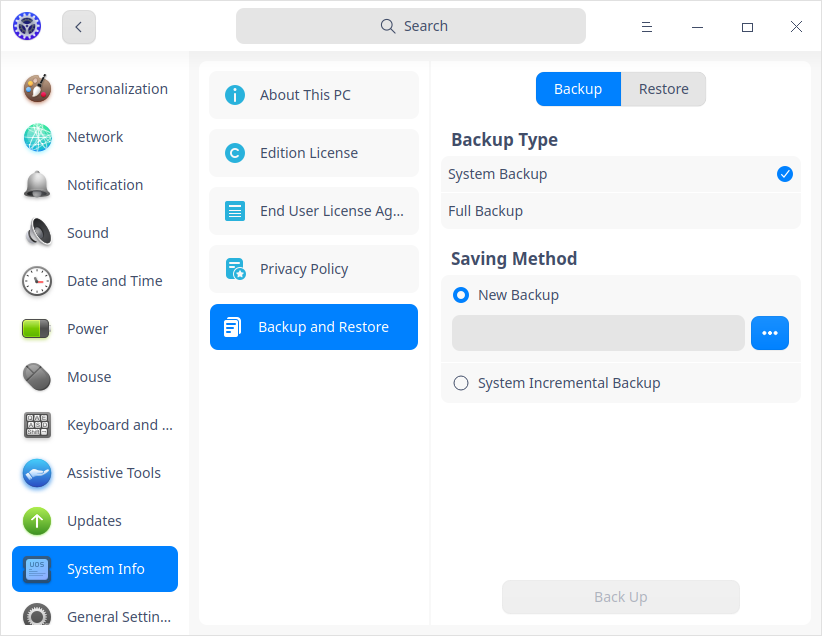

#### Backup

UnionTech OS provides backup by initialization and backup through Control Center.

##### Backup by initialization

If "Full Disk" is selected during system installation, a recovery partition would be created automatically at first, and the boot partition and root partition would be backup after that.

##### Backup through control center

You can backup data through either **Full Backup** or **System Backup** from Control Center.

1. On the homepage of Control Center, click .

2. Select **Backup and Restore** > **Backup** to set the backup type and save the path of files backed up.
   - Backup Type: Full Backup and System Backup
      + Full Backup: to back up system files and user files of the whole disk
      + System Backup: When the user data is not reserved, the files of the root partition and the boot partition are backed up; when the user data is reserved, the files of the root partition, boot partition, opt partition and home partition are backed up.
   - Saving Method: New Backup and System Incremental Backup

>Notes: The function **Full Backup** can only back up files in other storage media instead of files on its own disk.

3. Click **Back Up**, the password input box pops up, please input the password to authorize the backup file until the file backup is completed.

>Attention: In the process of file backup, please do not unplug the power supply or forcibly shut down to prevent data loss or damage.

#### Restore

UnionTech OS supports "restore from grub" and "restore from Control Center".

##### Restore from Grub

During system startup, in the system selection interface, click **UnionTech OS Restore**, you can choose "Reset to factory settings" to read initial backup during installation, or select "restore from backup files" to open the file directory and select the backup to be restored.

##### Restore from Control Center

You can either restore all settings or manually restore the previous backup data.

1. On the homepage of Control Center, click .
2. Click **Backup and Restore** > **Restore** to select:
   - Restore to factory settings
      1. You can choose to check **Keep personal files and apps** and click **Restore Now**. Click **Confirm** in the dialogue box pops up. 
      2. Please input the password to authorize the data restoring.
   - Restore from backup files
      1. After selecting restoring directory, click  to select the files you want to restore.
      2. Click **Restore Now** to start system restoring.

### General Settings

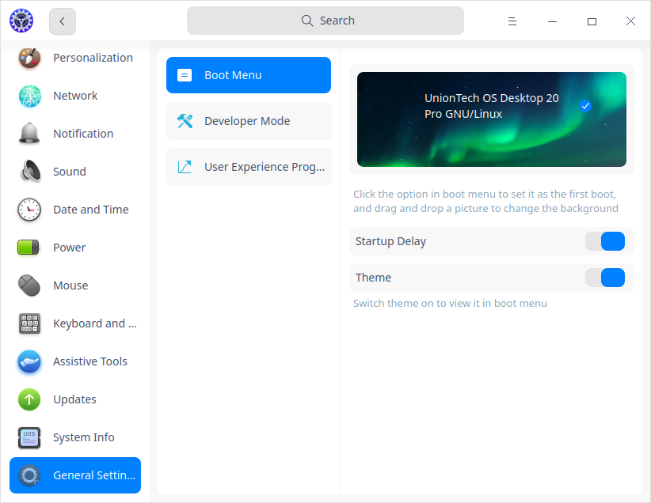

#### Boot Menu

Boot menu is the grub menu for users to select an operating system to start. After selecting and confirming the boot option, your computer will load the system.

##### Startup Delay

When there are multiple systems in the computer, Startup Delay will be switched on by default, and the grub menu will keep 5 seconds for users to select.

When there is only one system in the computer, Startup Delay will be switched off by default, and the grub menu will keep only 1 second.

##### Default Boot Entry

1. On the homepage of Control Center, click .
2. Click **Boot Menu**.
3. Click the option in the preview window to set it as the default one.

##### Boot Menu Theme

1. On the homepage of Control Center, click .
2. Click **Boot Menu**.
3. Switch on **Theme** to use it as the theme of boot menu.

>Tips: You can drag and drop an image to the preview window to change the background of boot menu.

#### Developer Mode

In Developer Mode, you can have root access, perform sudo operation, install and run the non signed applications that are not on App Store. The system does not enter Developer Mode by default.

>Attention: After entering Developer Mode, there may be risks, and you will no longer enjoy the official warranty service. Please operate carefully.

1. In the homepage of Control Center, click .
2. Click the **Developer Mode** and click the **Enter Developer Mode** Icon.
   - If you choose the online Mode, please log into your Union ID first. Read the disclaimer carefully, check **Agree and Enter the Developer Mode** and click **Confirm** after understanding the precautions. The button will be changed to **Having Entered the Developer Mode** after the certificate is issued by the system.
   - If you choose the offline mode, download the certificate according to the prompt. Enter the developer mode after importing the certificate.
3. Click **Reboot Now** in the pop-up  dialogue and enter the developer mode after rebooting the system.

>Attention: You can not exit or undo after you have entered Developer Mode. All accounts will have root access.

#### User Experience Program
User Experience Program collects your hardware, application and system information and help us better understand the user needs and thus improve user experiences. To have a better operating system, you are recommended to join the User Experience Program. And you are free to join and exit the program anytime.

1. On the homepage of Control Center, click .
2. Switch on **User Experience Program**, and read the privacy policy.
3. If you agree, check **Agree and Join User Experience Program**, and **Confirm**.

## Window Manager
Window Manager can display different window contents in different workspaces. With the Window Manager, you can use multiple desktops at the same time to manage desktop windows in groups.

>Notes: this function is available only when **Window Effect** is turned on in **Control Center**>**Personalization** >**General** . 

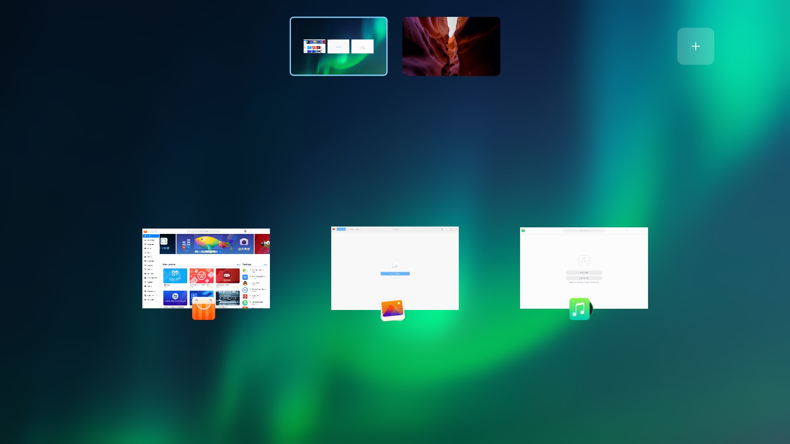

>Notes: On the touchpad, move with four/five fingers upwards to display multi-task view, and move downwards immediately to hide multi-task view, which corresponds to the operation of **Super** + **S**. 

### Open Workspace
Workspace manages your desktop windows in different groups. Your work area could be enlarged by dividing the workspace.

On the desktop, press **Super** + **S** or click  to open the workspace interface.

>Notes: If you are using a computer equipped with a touchscreen, slide in from the bottom of the screen exceeding the dock's height to open Workspace.

### Add Workspace

On the workspace interface, you can add workspace in the following ways:

   - Click **+** above workspace.
   - Press **Alt** + **+** on the keyboard.

>Notes: When the workspace number has reached its limit, you cannot add more workspaces. 

### Switch Workspace
On the workspace interface and desktop, you can switch workspace in the following ways:

   - On the desktop, press  **Super**+  /  to switch to Previous/Next workspace.
   - On the desktop, press  **Super** + Numeric keys (1-4)  to switch to a specified workspace.
   - On the workspace interface, scroll up or down to switch to Previous/Next workspace.
   - On the workspace interface, click the preview window or press the numeric keys (1-4) to switch to a specified workspace.

>Notes: On the touchpad, move with four/five fingers to the left/right to switch to the previous or next workspace, which corresponds to the operation of **Super** + **Left** or **Super** + **Right**. 

### Delete Workspace

After deleting a workspace, all windows in the workspace will be moved to a nearby workspace. You cannot delete the workspace when there is only one.

   - On the workspace interface, click the  to delete a workspace.
   - On the workspace interface, press **Alt** + **-** to delete a workspace.
   - Drag a workspace upward outside the screen to delete it.

### Exit Workspace
After finishing the operations on the workspace interface, you can quit in the following ways:

   - Press **Esc**.
   - Click the blank area outside the workspace interface.
   - Press **Super** + **S** again.

### View All Windows
View all the windows in the workspaces in the following ways:

   - On the desktop, press **Super** + **A** on the keyboard to view the windows in all workspaces.
   - On the desktop, press **Super** + **W** to view the windows in the current workspace.

#### Move Windows among Workspaces
Move the windows to another workspace in the following ways:

   - On the workspace interface, drag and drop the window to the specified workspace.
   - On the desktop, press  **Super**+ **Shift** +  /  to move the current window to the Previous/Next workspace.
   - On the desktop, press  **Super** + **Shift** + Numeric Keys to move the current window to the workspace in the corresponding order.
   - On the desktop, press  **AIt** + **Space** or right-click the window title bar to open the window menu, and select **Always on Visible Workspace** or **Move to Workspace Left/Right** to move the current window to the specified workspace.

>Tips: In the window menu, you can also minimize, maximize, move, resize, top or close the window.

### Switch Desktop Windows
Switch desktop windows in the current workspace as below.

#### Fast Switch between Nearby Windows

   - On the desktop, press  **AIt** + **Tab** at the same time and release, to switch between the current window and the nearby window quickly;
   - On the desktop, press **AIt** + **Shift** + **Tab** at the same time and release, to fast switch between current window and the nearby window reversely;

#### Fast Switch between Windows of the Same Type

   - On the desktop, press **Alt** +    at the same time and release, to switch between the current window and other windows of the same type quickly;
   - On the desktop, press  **AIt** + **Shift** +  at the same time and release, to fast switch between current window and other windows in same type reversely;

#### Switch among All Windows

   - On the desktop, press and hold **Alt** and press **Tab** continually and it will show the right windows one by one; 
   - On the desktop, press and hold **Alt** + **Shift** and press **Tab** continually and it will show the left windows one by one.

#### Switch among Windows of the Same Type
   - On the desktop, press and hold **Alt** and press  continually and it will show the same type of windows towards the right one by one.
   - On the desktop, press and hold **Alt** + **Shift** and press  continually and it will show the same type of windows towards the left one by one.

### Split Screen
With split screen, multiple applications and tasks are displayed simultaneously, which  improves your work and learning efficiency by not only making full use of the space of the large screen, but also reducing frequent switching between multiple application windows.

1. Drag the window to the left or right part of the screen until the cursor touches the screen edge and the white transparent background appears, drop the window and it will be adsorbed on the left or right half of the screen.

>Tips: To cancel split screen, just drag a window away from the screen edge.

