# 桌面環境|dde|

## 概述

統信操作系統（簡稱「統信UOS」）是一款美觀易用、安全可靠的國產桌面操作系統。統信UOS預裝了檔案管理員、應用商店、看圖、系統監視器等一系列原生應用。它既能讓您體驗到豐富多彩的娛樂生活，也可以滿足您的日常工作需要。隨着功能的不斷升級和完善，統信操作系統已成為國內最受歡迎的桌面操作系統之一。

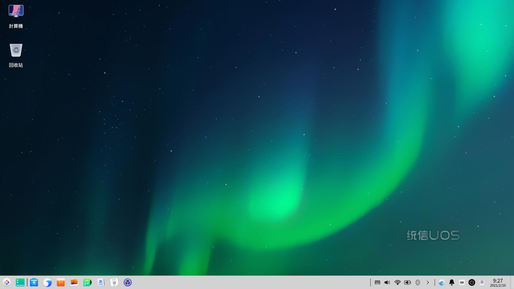

### 系統簡介

初次進入統信操作系統，會自動打開歡迎程序。您可以觀看影片了解系統功能，選擇桌面模式和圖標主題，進一步了解該系統。

成功登錄系統後，即可體驗統信UOS桌面環境。桌面環境主要由桌面、任務欄、啟動器、控制中心和窗口管理器等組成，是您使用該操作系統的基礎。

## 桌面

桌面是登錄後看到的主螢幕區域。在桌面上，您可以新建文件夾/文檔、排序文檔、在終端中打開、設置壁紙與屏保等，還可以通過 [傳送到桌面](#設置快捷方式) 向桌面添加應用的快捷方式。

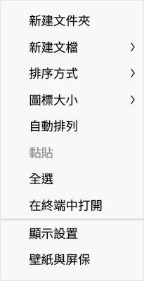

> 說明：在觸控板上，四指/五指向下移動顯示桌面，緊接着向上移動隱藏桌面， 對應 **Super** + **D** 快捷鍵。

### 新建文件夾/文檔

在桌面新建文件夾或文檔，也可以對文档進行常規操作，和在檔案管理員中一樣。

- 在桌面上，單擊鼠標右鍵，單擊 **新建文件夾**，輸入新建文件夾的名稱。
- 在桌面上，單擊鼠標右鍵，單擊 **新建文檔**，選擇新建文檔的類型，輸入新建文檔的名稱。

在桌面文檔或文件夾上，單擊鼠標右鍵，在彈出的菜單中主要包含如下功能：

| 功能        | 說明                                                     |
| ----------- | -------------------------------------------------------- |
| 打開方式    | 選定系統默認打開方式，也可以選擇其他關聯應用程序來打開。 |
| 壓縮/解壓 | 壓縮文檔或文件夾，或對壓縮文檔進行解壓。                    |
| 剪切        | 移動文檔或文件夾。                                      |
| 複製        | 複製文檔或文件夾。                                      |
| 重命名      | 重命名文檔或文件夾。                                    |
| 刪除        | 刪除文檔或文件夾。                                      |
| 創建鏈接    | 創建一個快捷方式。                                       |
| 標記訊息    | 添加標記訊息，以對文檔或文件夾進行標籤化管理。          |
| 病毒查殺 | 對文檔或文件夾進行病毒查殺。              |
| 屬性        | 查看文檔或文件夾的基本訊息、共享方式及其權限。          |

> 說明：
> - 當使用觸控螢幕電腦時，在觸摸屏上長按1秒再抬起即打開當前對象的右鍵菜單。
> - 在觸控板上，二指單擊，顯示右鍵菜單。
> - 在鍵盤上按下 **Alt** + **M** 快捷鍵，打開右鍵菜單。

### 設置排列方式

您可以對桌面上的圖標按照需要進行排序。

1. 在桌面上，單擊鼠標右鍵。
2. 單擊 **排序方式**，您可以：
  - 單擊 **名稱**，將按文檔的名稱順序顯示。
  - 單擊 **修改時間**，文檔將按最近一次的修改日期順序顯示。
  - 單擊 **大小**，將按文檔的大小順序顯示。
  - 單擊 **類型**，將按文檔的類型順序顯示。

>  竅門：您也可以勾選 **自動排列**，桌面圖標將從上往下，從左往右按照當前排序規則排列，有圖標被刪除時後面的圖標會自動向前填充。

### 調整圖標大小
1. 在桌面上，單擊鼠標右鍵。
2. 單擊 **圖標大小**。
3. 選擇一個合適的圖標大小。

>  竅門：您也可以用 **Ctrl** + / / 鼠標滾動來調整桌面和啟動器中的圖標大小。

### 設置顯示器

從桌面單擊右鍵菜單選擇「顯示設置」，可以快速進入控制中心設置顯示器的縮放比例、解像度和亮度等。

1. 在桌面上，單擊鼠標右鍵。
2. 單擊 **顯示設置**，快速進入控制中心的顯示設置界面。

>  說明：關於顯示的設置，具體操作請參閱 [顯示設置](#顯示設置)。

 ### 更改壁紙

選擇一些精美、時尚的壁紙來美化桌面，讓您的電腦顯示與眾不同。

1. 在桌面上，單擊鼠標右鍵。
2. 單擊 **壁紙與屏保**，在桌面底部預覽所有壁紙。
3. 選擇某一壁紙後，壁紙就會在桌面和鎖定螢幕中生效。
4. 單擊 **僅設置桌面** 和 **僅設置鎖屏** 來控制壁紙的生效範圍。

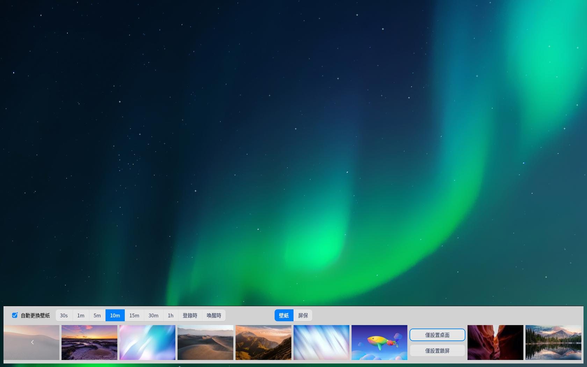

&nbsp;&nbsp;&nbsp;&nbsp;&nbsp;&nbsp;&nbsp;&nbsp;&nbsp;&nbsp;&nbsp;&nbsp;&nbsp;
>  竅門：
> - 勾選 **自動更換壁紙**，設置自動更換壁紙的時間間隔。您還可以設置在 **登錄時** 和 **喚醒時** 自動更換壁紙。
> - 您還可以在圖片查看器中設置您喜歡的圖片為桌面壁紙。

### 設置屏保程式

螢幕保護程序原本是為了保護顯像管，現在一般用來防範他人偷窺您電腦上的一些私隱。

1. 在桌面上，單擊鼠標右鍵。
2. 單擊 **壁紙與屏保**，單擊 **屏保**，在桌面底部預覽所有螢幕保護程序。
3. 選擇其中一個螢幕保護程序，單擊 **設置屏保**，在上方選擇 **閒置時間**。
4. 勾選 **恢復時需要密碼**，以便更好地保護您的私隱。
5. 待電腦空閒指定時間後，將啟動您選擇的螢幕保護程序。

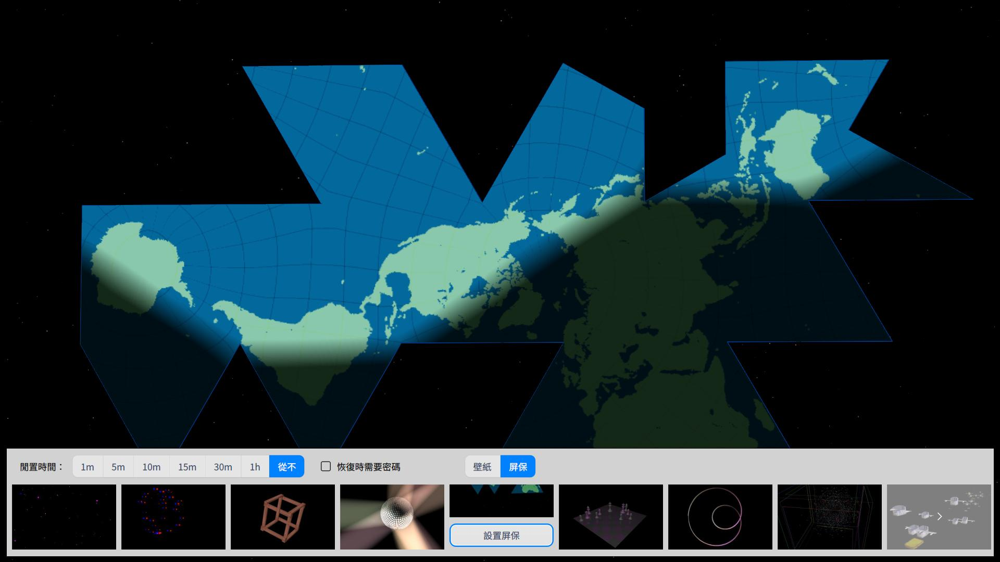

### 剪貼板

剪貼板展示當前用戶登錄系統後複製和剪切的所有文本、圖片和文檔。使用剪貼板可以快速複製其中的某項內容。註銷或關機後，剪貼板會自動清空。

1. 使用快捷鍵 **Ctrl** + **Alt** + **V** 喚出剪貼板。
2. 雙擊剪貼板內的某一區塊，會快速複製當前內容，且當前區塊會被移動到剪貼板頂部。
3. 選擇目標位置黏貼。
4. 鼠標移入剪貼板的某一區塊，單擊上方的 ，刪除當前內容；單擊頂部的 **全部清除**，清空剪貼板。

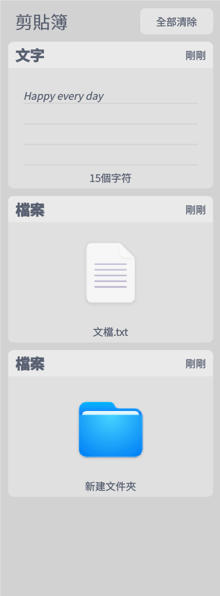

> 說明：當使用觸控螢幕電腦時，在觸摸屏上從螢幕左側邊緣劃入超過任務欄高度，喚出剪貼板。

## 任務欄

任務欄一般是指位於桌面底部的長條，主要由啟動器、應用程序圖標、托盤區、系統外掛等組成。在任務欄，可以打開啟動器、顯示桌面、進入工作區，對其上的應用程序進行打開、新建、關閉、強制退出等操作，還可以設置輸入法，調節音量，連接網絡，查看日曆，進入關機界面等。

### 認識任務欄圖標

任務欄圖標包括啟動器圖標、應用程序圖標、托盤區圖標、系統外掛圖標等。

| 圖標 | 說明 | 圖標 | 說明 |
| ------------------------------------------------------------ | :---------------------------------- | -------------------------------------------------------- | --------------------------------------------------- |
|                         | 啟動器 - 單擊查看所有已安裝的應用。 |  | 顯示桌面。                                          |
|  | 多任務視圖 - 單擊顯示工作區。     |            | 檔案管理員 - 單擊查看磁盤中的文檔、文件夾。 |
|  | 瀏覽器 - 單擊打開網頁。           |              | 應用商店 - 搜索安裝應用軟件。                         |
|                       | 相冊 - 導入並管理照片。             |                    | 音樂 - 播放本地音樂。                               |
|                  | 聯繫人 - 好友通訊，視像會議。       |                    | 日曆 - 查看日期、新建日程。                         |
|                      | 控制中心 - 單擊進入系統設置。     |                    | 通知中心 - 顯示所有系統和應用的通知。               |
|                                     |   桌面智能助手 - 使用語音或文字來發佈指令或進行詢問。     | | 螢幕鍵盤 - 單擊使用虛擬鍵盤。 |
|                         | 電源 - 單擊進入關機界面。          |                             | 回收站。                                            |

&nbsp;&nbsp;&nbsp;&nbsp;&nbsp;&nbsp;&nbsp;&nbsp;&nbsp;&nbsp;&nbsp;&nbsp;&nbsp;
>  竅門：在高效模式下，單擊任務欄右側可顯示桌面。將鼠標指針移到任務欄上已打開窗口的圖標時，會顯示相應的預覽窗口。

### 切換顯示模式

任務欄提供兩種顯示模式：時尚模式和高效模式，顯示不同的圖標大小和應用窗口啟動效果。

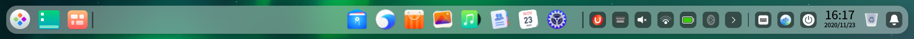

&nbsp;&nbsp;&nbsp;&nbsp;&nbsp;&nbsp;&nbsp;&nbsp;&nbsp;&nbsp;&nbsp;&nbsp;&nbsp;

您可以通過以下操作來切換顯示模式：

1. 右鍵單擊任務欄。
2. 在 **模式** 子菜單中選擇一種顯示模式。

### 設置任務欄位置

您可以將任務欄放置在桌面的任意方向。

1. 右鍵單擊任務欄。
2. 在 **位置** 子菜單中選擇一個方向。

### 調整任務欄高度 

鼠標拖動任務欄邊緣，改變任務欄高度。

### 顯示/隱藏任務欄

任務欄可以隱藏，以便最大程度的擴展桌面的可操作區域。 

1. 右鍵單擊任務欄。
2. 在 **狀態** 子菜單中您可以：
  - 選擇 **一直顯示**，任務欄將會一直顯示在桌面上。
  - 選擇 **一直隱藏**，任務欄將會隱藏起來，只有在鼠標移至任務欄區域時才會顯示。
  - 選擇 **智能隱藏**，當佔用任務欄區域時，任務欄自動隱藏。

> 說明：當使用觸控螢幕電腦時，在觸摸屏上：
> 當任務欄設置為「 智能隱藏」或「 一直隱藏」時，如果任務欄在底部，在螢幕邊緣從下往上划入，喚出任務欄；如果任務欄在頂部，在螢幕邊緣從上往下划入，喚出任務欄。

### 顯示/隱藏外掛

1. 右鍵單擊任務欄。
2. 在 **外掛** 子菜單中勾選或取消勾選 **回收站、電源、顯示桌面、螢幕鍵盤、通知中心、多任務視圖、時間、桌面智能助手**，可以設置這些外掛在任務欄上的顯示和隱藏效果。

### 查看通知

當有系統或應用通知時，會在桌面上方彈出通知消息。若有按鈕，單擊按鈕執行對應操作；若無按鈕，單擊關閉此消息。

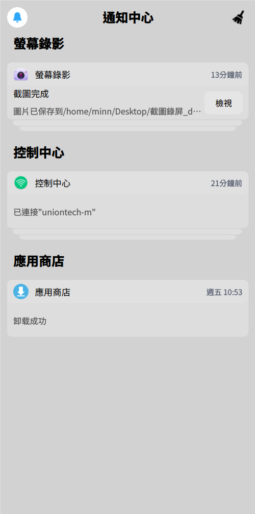

&nbsp;&nbsp;&nbsp;&nbsp;&nbsp;&nbsp;&nbsp;&nbsp;&nbsp;&nbsp;&nbsp;&nbsp;&nbsp;

此外，還可以單擊任務欄上的 ， 打開通知中心，查看所有通知。

> 說明：當使用觸控螢幕電腦時，手指從螢幕右側邊緣劃入超過任務欄高度，喚出通知中心。

### 使用智能助手

智能助手支持語音和文字輸入，支持查找訊息、操作指令等功能。

通過智能助手可以調節系統音量、螢幕亮度、還可以開啟/關閉電源節能模式、WiFi或藍牙。

>  說明：只有系統授權後，才可以使用語音聽寫、語音朗讀、翻譯及桌面智能助手相關功能。當首次啟動桌面智能助手時，需要同意私隱協議，確定同意私隱協議後，才可以正常使用桌面智能助手及語音聽寫、語音朗讀、翻譯的功能。

使用以下方法可以喚醒智能助手：

- 通過快捷鍵 **Super** + **q**，喚出助手對話框界面。
- 支持固定語「你好，小華」或「你好，小華+命令語」喚起桌面智能助手，喚出助手對話界面。

使用智能助手文字輸入、語音輸入的操作步驟如下。
1. 單擊任務欄上的 ， 打開桌面智能助手。
2. 連接錄音設備後，使用語音與智能助手直接對話，如更換壁紙、調節螢幕亮度，查詢訊息等。
3. 等輸入框出現後，還可以輸入文字指令。

 
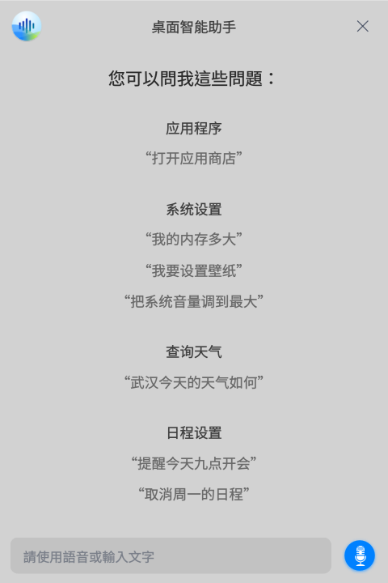

>  竅門：選中文字按下 **Ctrl** + **AIt** + **P** 可以進行語音播報；連接錄音設備後，輸入框內按下 **Ctrl** + **AIt** + **O** 進入聽寫模式，把語音輸入轉換為文字。

#### 設置語音聽寫

在控制中心默認設置語音聽寫功能，默認是開啟狀態，可以關閉此功能。

選中文本輸入框後可通過快捷鍵 **Ctrl** + **Alt** + **O** 喚起語音聽寫功能，開始聽寫輸入文本。 

#### 設置語音朗讀

在控制中心設置語音朗讀功能，只有開啟了語音朗讀功能後，才能喚起朗讀。 

朗讀當前選中文本的操作步驟如下 。

1.  選中文本， 在鍵盤上按下快捷鍵 **Ctrl** + **Alt** + **P** 或在右鍵菜單中選擇 **語音朗讀** ，單擊後喚起朗讀。
2. 如果需要中斷朗讀時， 單擊喇叭圖標中止朗讀，或右鍵單擊 **停止朗讀**。 

> 說明：如果在朗讀中，再次選中其他文本，則朗讀圖標顯示在最新選中文本的位置。按下快捷鍵、單擊朗讀圖標或右鍵菜單選擇語音朗讀，打斷正在朗讀的文本轉而朗讀最新選中的文本。

#### 設置翻譯功能

控制中心默認開啟了翻譯功能，開啟後才可以喚起翻譯功能。

翻譯當前選中文本的操作步驟如下 。

1. 選中文本， 按下快捷鍵 **Ctrl** + **Alt** + **U** 或在右鍵菜單中選擇 **翻譯**， 彈出翻譯的浮窗。 

> 說明：當前僅支持中英互譯。

### 查看日期時間

- 鼠標指針懸停在任務欄的時間上，查看當前日期、星期和時間。
- 單擊時間，打開日曆。

### 進入關機界面

您可以單擊任務欄上的  進入關機界面，也可以在啟動器的小窗口模式中單擊 。

| 功能                                                         | 說明                                                     |
| ------------------------------------------------------------ | -------------------------------------------------------- |
| 關機        | 關閉電腦。                                               |
| 重啟            | 關機後再次重新運行您的電腦。                             |
| 待機          | 整個系統將處於低能耗運轉的狀態。                         |
| 休眠                | 沒有swap分區不顯示此項。有swap分區的機器休眠掛載到硬碟。 |
| 鎖定                | 鎖定電腦，按下快捷鍵 **Super** + **L** 鎖定。            |
| 切換使用者 | 選擇另一個用戶帳戶登錄。                                 |
| 註銷            | 清除當前登錄用戶的訊息。                                 |
| 系統監視器 | 快速啟動系統監視器。                                     |

&nbsp;&nbsp;&nbsp;&nbsp;&nbsp;&nbsp;&nbsp;&nbsp;&nbsp;&nbsp;&nbsp;&nbsp;&nbsp;

>  說明：當系統存在多個賬戶時才顯示 **切換使用者** 。

### 回收站

在回收站中，可以找到電腦中臨時被刪除的文件，也可以選擇還原或清空這些文件。

#### 還原文件
臨時被刪除的文件，可以在回收站進行還原，或使用快捷鍵 **Ctrl** + **Z** 還原剛刪除的文件。

1. 在回收站中，選擇要恢復的文件。
2. 單擊鼠標右鍵，選擇 **還原**。
3. 還原文件到原來的存儲路徑下。

> 注意：如果原來所在的文件夾已經刪除，還原文件時會自動新建文件夾。

#### 刪除文件

回收站中可以單獨清除某一文件。

1. 在回收站中，選擇要刪除的文件。
2. 單擊鼠標右鍵，選擇 **刪除**，即可刪除回收站的文件。

#### 清空回收站

在回收站中，單擊 **清空**，將徹底刪除回收站的所有內容。

## 啟動器

啟動器  可以管理系統中所有已安裝的應用，在啟動器中使用分類導航或搜索功能可以快速找到需要的應用程序。

> 說明：arm架構系統暫不支持啟動菜單設置。

在啟動器中可以查看新安裝的應用，新安裝應用的旁邊會出現一個小藍點提示。

> 說明：在觸控板上，四指/五指單擊，顯示/隱藏啟動器， 對應 **Super** 快捷鍵。

### 切換模式

啟動器有全螢幕和小窗口兩種模式。單擊啟動器界面右上角的圖標來切換模式。

兩種模式均支持搜索應用、設置快捷方式等操作。

小窗口模式還支持快速打開檔案管理員、控制中心和進入關機界面等功能。

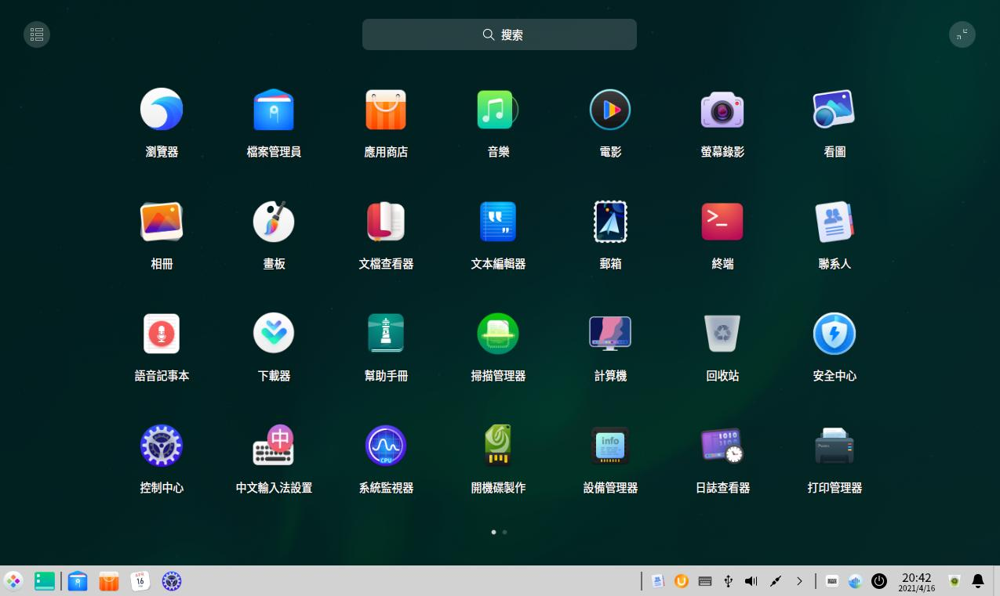

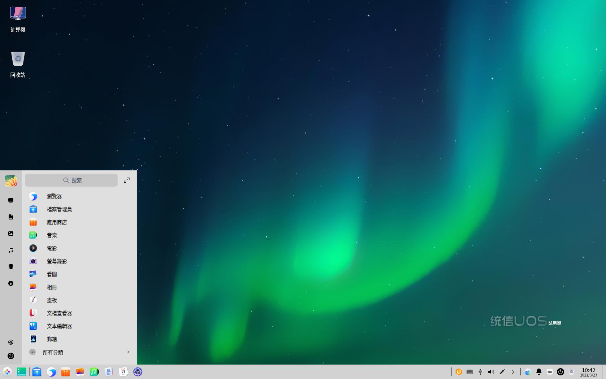

### 排列應用

在全螢幕模式下，系統默認按照安裝時間排列所有應用。

- 將鼠標懸停在應用圖標上，按住鼠標左鍵不放，將應用圖標拖拽到指定的位置自由排列。
- 單擊啟動器界面左上角分類圖標  進行排列。

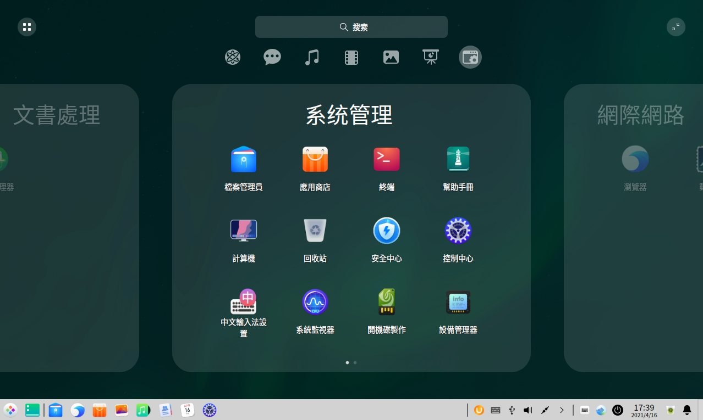

&nbsp;&nbsp;&nbsp;&nbsp;&nbsp;&nbsp;&nbsp;&nbsp;&nbsp;&nbsp;&nbsp;&nbsp;&nbsp;

在小窗口模式下，默認按照使用頻率排列應用。

### 查找應用

在啟動器中，您可以滾動鼠標滾輪或切換分類導航查找應用。

如果知道應用名稱，直接在搜索框中輸入關鍵字，快速定位到需要的應用。

### 設置快捷方式

快捷方式提供了一種簡單快捷地啟動應用的方法。

#### 創建快捷方式

將應用發送到桌面或任務欄上，方便您的後續操作。

在啟動器中，右鍵單擊應用圖標，您可以：

- 單擊 **傳送到桌面**，在桌面創建快捷方式。

- 單擊 **傳送到任務欄**，將應用固定到任務欄。

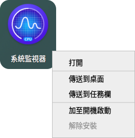

>  說明：您還可以從啟動器拖拽應用圖標到任務欄上放置。但是當應用處於運行狀態時您將無法拖拽固定，此時您可以右鍵單擊任務欄上的應用圖標，選擇 **駐留** 將應用固定到任務欄，以便下次使用時從任務欄上快速打開。

#### 刪除快捷方式

您既可以在桌面直接刪除應用的快捷方式，也可以在任務欄和啟動器中刪除。

**從任務欄上刪除**

- 在任務欄上，按住鼠標左鍵不放，將應用圖標拖拽到任務欄以外的區域移除快捷方式。
- 當應用處於運行狀態時您將無法拖拽移除，此時可以右鍵單擊任務欄上的應用圖標，選擇 **移除駐留** 將應用從任務欄上移除。

**從啟動器中刪除**

在啟動器中，右鍵單擊應用圖標，您可以：

- 單擊 **從桌面移除**，刪除桌面快捷方式。
- 單擊 **從任務欄移除**，將固定到任務欄上的應用移除。

>  說明：以上操作，只會刪除應用的快捷方式，而不會卸載應用。

### 安裝應用

如果啟動器中沒有您需要的應用，可以在應用商店一鍵下載安裝。

### 運行應用

對於已經創建了桌面快捷方式或固定到任務欄上的應用，您可以通過以下途徑來打開應用。

- 雙擊桌面圖標，或右鍵單擊桌面圖標選擇 **打開**。
- 直接單擊任務欄上的應用圖標，或右鍵單擊任務欄上的應用圖標選擇 **打開**。

在啟動器中，直接單擊應用圖標打開，或右鍵單擊應用圖標選擇 **打開**。

>  竅門：對於經常使用的應用，您可以在啟動器中，右鍵單擊應用圖標選擇 **開機自動啟動**。

### 解除安裝應用

對於不再使用的應用，您可以選擇解除安裝，以節省硬盤空間。

1. 在啟動器中，右鍵單擊應用圖標。
2. 單擊 **解除安裝**。

>  竅門：在 **時尚模式** 下，您還可以在啟動器的全螢幕模式界面，按住鼠標左鍵不放，將應用圖標拖拽到任務欄的  中卸載應用。

## 控制中心

統信操作系統通過控制中心來管理系統的基本設置，包括帳號管理、網絡設置、日期與時刻設置、個性化設置、顯示設置、系統升級等。當您進入桌面環境後，單擊任務欄上的  即可打開控制中心窗口。

> 說明：在觸控板上，二指從觸控板右邊緣向左滑動，顯示控制中心；二指從觸控板左邊緣向右滑動，隱藏控制中心。

### 首頁介紹

控制中心首頁主要展示各個設置模塊，方便日常查看和快速設置。

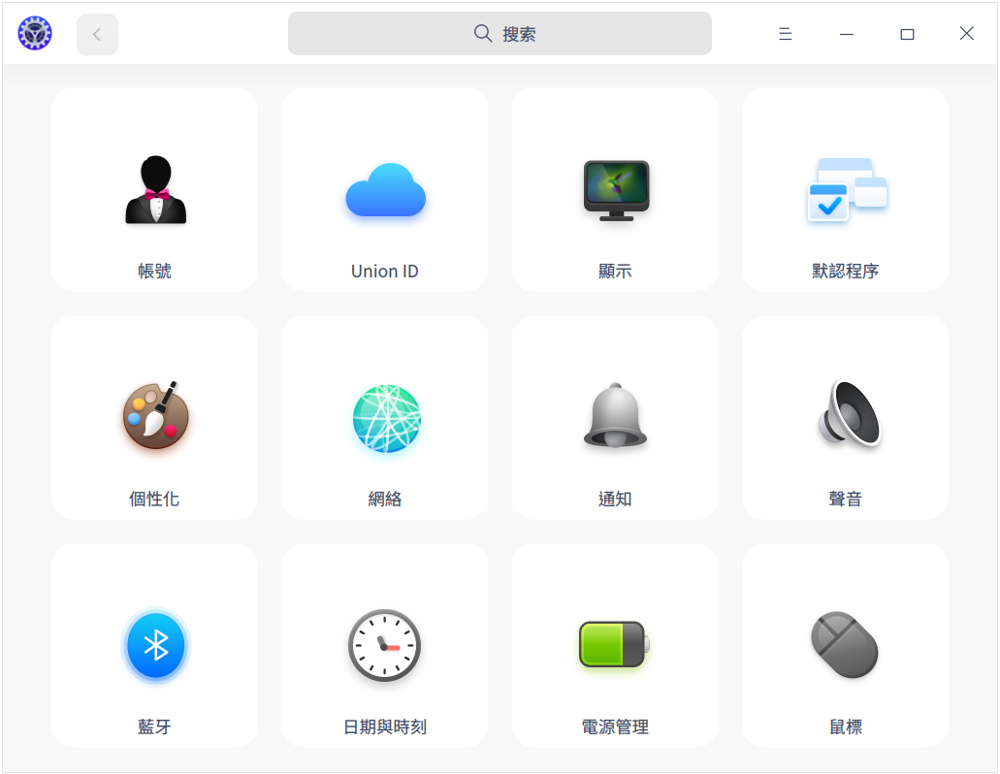

&nbsp;&nbsp;&nbsp;&nbsp;&nbsp;&nbsp;&nbsp;&nbsp;&nbsp;&nbsp;&nbsp;&nbsp;&nbsp;

打開控制中心的某一設置模塊後，可以通過左側導航欄快速切換到另一設置模塊。

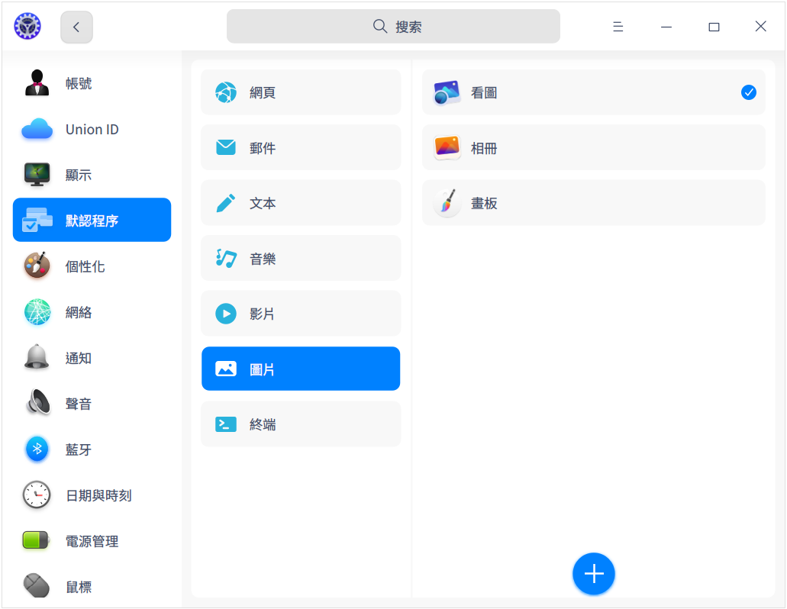

#### 標題欄
標題欄包含返回按鈕、搜索框、主菜單及窗口按鈕。

- 返回按鈕：若要返回首頁，單擊 。
- 搜索框：輸入關鍵字，單擊鍵盤上 **Enter** 鍵，搜索相應設置。
- 主菜單：單擊  進入主菜單。在主菜單中，您可以設置窗口主題、查看版本或退出控制中心。

### 賬號設置

在安裝系統時會創建一個賬戶，在控制中心的賬戶設置模塊可以修改賬戶設置或創建一個新賬戶。

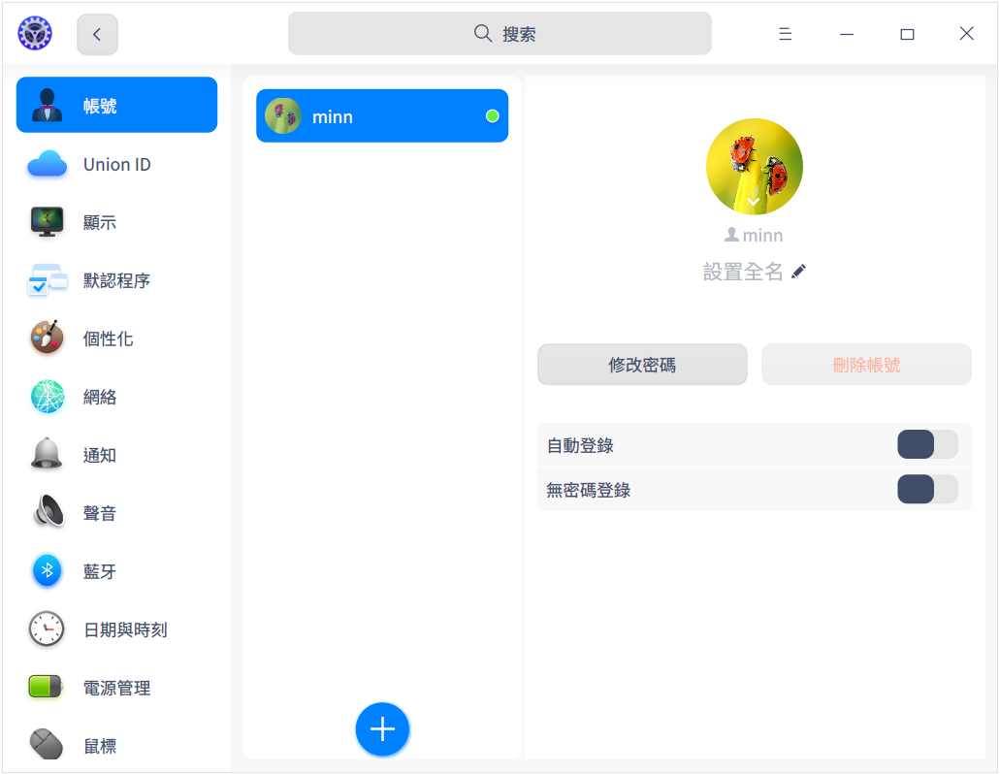

#### 創建新帳號

1. 在控制中心首頁，單擊 。
2. 單擊 **創建帳戶** 按鈕 。
3. 輸入用戶名、密碼和重複密碼。
4. 單擊 **創建**。
5. 在授權對話框輸入當前賬號的密碼，新賬號就會添加到賬號列表中。

#### 更改頭像

1. 在控制中心首頁，單擊 。
2. 單擊列表中的帳號。
3. 單擊賬號頭像，選擇一個頭像或添加本地頭像，頭像就替換完成了。

#### 設置全名

賬號全名會顯示在賬號列表和系統登錄界面，可根據需要設置。

1. 在控制中心首頁，單擊 。
2. 單擊列表中的帳號。
3. 單擊 **設置全名** 後的 ，輸入賬號全名。

#### 修改密碼

1. 在控制中心首頁，單擊 。
2. 單擊當前帳號。
3. 單擊 **修改密碼**，進入修改密碼頁面。
4. 輸入當前密碼、新密碼和重複密碼，單擊 **保存**。

#### 自動登錄

開啟 **自動登錄** 後，下次啟動系統時（重啟、開機）可直接進入桌面。在鎖定螢幕和登出後再次登錄需要密碼。

1. 在控制中心首頁，單擊。
2. 單擊當前帳號。
3. 打開 **自動登錄** 開關，開啟自動登錄功能。

#### 無密碼登錄

開啟 **無密碼登錄** 後，下次登錄系統時（重啟、開機和在登出後再次登錄），不需要密碼，單擊 **登錄** 按鈕 即可登錄系統。

1. 在控制中心首頁，單擊。
2. 單擊當前帳號。
3. 打開 **無密碼登錄** 開關，開啟後可以不用輸入密碼登錄系統。

>  竅門： 
> 
> - 若 **無密碼登錄** 和 **自動登錄** 同時打開，下次啟動系統（重啟、開機）則直接進入桌面。
>
> - 默認勾選 **清空鑰匙環密碼**，在無密碼登錄情況下登錄已經記錄密碼的程序時不需要再次輸入系統登錄密碼，反之則每次都需要輸入系統登錄密碼。

#### 設置指紋ID

指紋ID可以用來登錄系統、解鎖螢幕、特殊操作授權。當需要輸入賬號密碼時，請掃描您的指紋。

1. 在控制中心首頁，單擊 。
2. 單擊當前帳號。
3. 單擊 **添加指紋** 。
4. 使用指紋設備錄入指紋。
5. 待指紋添加成功之後單擊 **完成**。

>  說明：您可以添加多個指紋密碼；也可以刪除一個個指紋密碼。

#### 刪除帳號

1. 在控制中心首頁，單擊 。
2. 單擊其他未登錄的帳戶。
3. 單擊 **刪除賬號** 。
4. 在彈出的確認界面中單擊 **刪除**。

>  注意：已登錄的賬號無法被刪除。

### Union ID

登錄Union ID後，您可以使用雲同步、應用商店、郵箱客戶端、瀏覽器等相關雲服務功能。

首次登入時，會彈出 **隱私政策** 視窗，如果使用者需要開啟雲服務等功能，可以勾選 **我已閱讀並同意《隱私政策》**，單擊 **確定**。

開啟雲同步功能可自動同步各種系統配置到雲端，如網絡、聲音、鼠標、更新、任務欄、啟動器、壁紙、主題、電源等。若想在另一台電腦上使用相同的系統配置，只需登錄此網絡帳戶，即可一鍵同步以上配置到該設備。

>  竅門： 當 **自動同步配置** 開啟時，可以選擇同步項；關閉時，則全部不能同步。

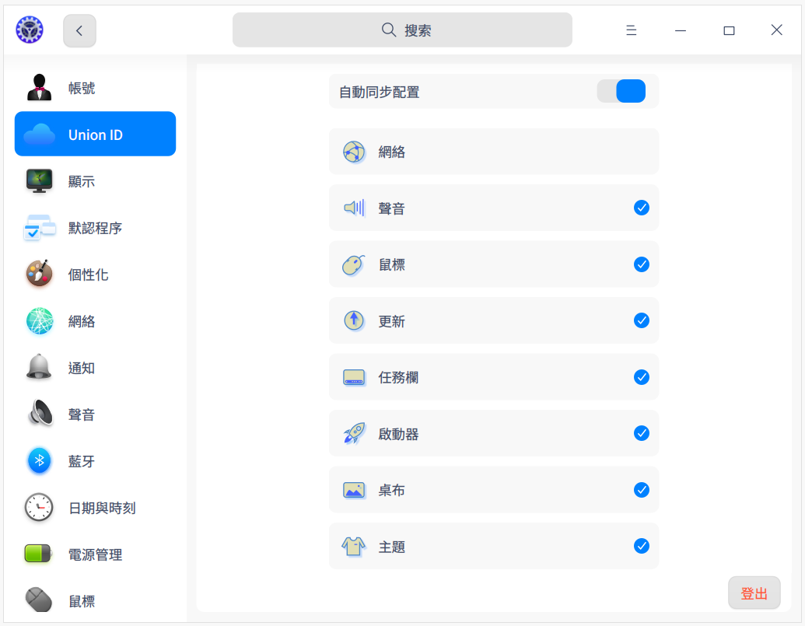

如果您尚未註冊Union ID，可以在官網先進行註冊（支持微信掃描、手機號碼等方式進行註冊），註冊成功並登錄後，才能使用Union ID相關的功能。

### 顯示設置

設置顯示器的亮度、解像度、螢幕方向以及縮放倍數，讓您的電腦顯示到達最佳狀態。

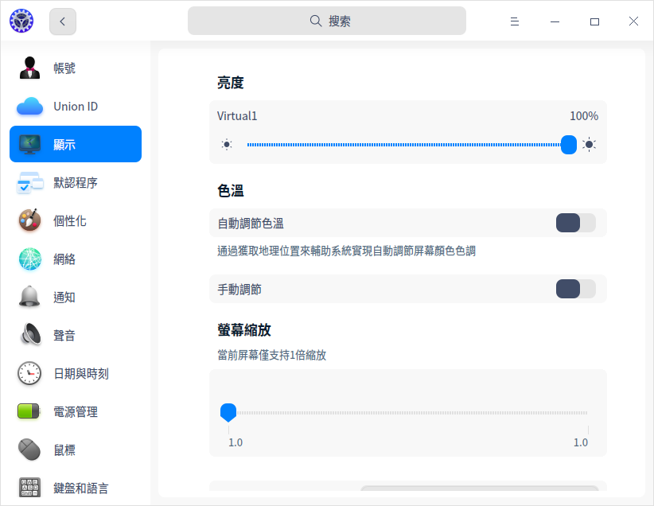

#### 單屏設置
當螢幕為單屏時，可以調節螢幕亮度、解像度、刷新率、顯示方向等。

##### 調節亮度

1. 在控制中心首頁，單擊 。
2. 在亮度區域，拖動亮度條滑塊，調節螢幕亮度。

##### 調節色温

1. 在控制中心首頁，單擊 。
2. 在色溫區域，可以：
   - 開啟 **自動調節色溫** 開關，進入護眼模式，自動調節螢幕色溫。
   - 開啟 **手動調節** 色溫開關，手動調節螢幕色溫。

>  說明：**自動調節色溫** 開關開啟時，如單擊開啟 **手動調節** 開關將自動關閉 **自動調節色溫** 開關；反之亦然。

##### 設置螢幕縮放

當桌面和窗口顯示過大或過小時，您可能需要調節螢幕縮放，以便正常顯示。

1. 在控制中心首頁，單擊 。
2. 在螢幕縮放區域， 單擊或拖動滑塊調整縮放倍數。
3. 註銷後重新登錄系統螢幕縮放操作即可生效。

>  說明：
>
> - 當檢測到螢幕為高分屏時，會自動調整縮放倍數。
> - 有的應用可能不支持螢幕縮放，可以在啟動器中右鍵單擊該應用，選擇 **禁用屏幕縮放**，以獲得更好的顯示效果。

##### 更改解像度

1. 在控制中心首頁，單擊 。
2. 在解像度區域的下拉列表中，選擇合適的解像度參數。
3. 單擊 **保存**。

##### 設置螢幕刷新率

1. 在控制中心首頁，單擊 。
2. 在刷新率區域的下拉列表中，選擇一個合適的刷新率。
3. 單擊 **保存**。

##### 改變螢幕方向

1. 在控制中心首頁，單擊 。
2. 在方向區域的下拉列表中，選擇一個合適的方向參數。
3. 單擊 **保存**，改變螢幕方向。

#### 多萤幕顯示設置

多屏顯示可以讓螢幕的視野無限延伸，使用VGA、HDMI、DP等線纜將電腦和另一台顯示器、投影儀等連接起來，電腦上的內容即可同時在多個螢幕中顯示。當電腦設備連接上另一台顯示設備，多屏顯示模式設置模塊才會出現。

1. 在控制中心首頁，單擊 。
2. 在多屏設置區域，模式下拉框中選擇螢幕顯示樣式。

 - **同步** 將主螢幕的顯示內容複製到其他螢幕。
 - **延伸** 將主螢幕的顯示內容擴展到其他螢幕，擴大桌面區域。
 - **僅在xxx顯示** 只在某個螢幕顯示內容。

在多螢幕環境下，按下 **Super** + **P** 調出多螢幕顯示模式的OSD。

詳細操作方法如下。

1. 按住 **Super** 不放，再按下 **P** 或鼠標單擊來進行模式選擇。
2. 鬆開按鍵，確認選擇，模式生效。

>  說明：當多螢幕顯示時，副螢幕也支持桌面圖標顯示、操作右鍵菜單等功能。

### 觸控屏設置

當接入觸控屏時，您可以設置所在螢幕，並對其進行調整。

1. 在控制中心首頁，單擊 。
2. 並對螢幕進行設置後，單擊 **確定**。

### 默認程序設置

當安裝有多個功能相似的應用程序時，可以通過右鍵菜單或控制中心為某種類型的文件指定其中的一個應用作為打開文件的默認啟動程序。

#### 設置默認程序

1. 右鍵單擊文檔，選擇 **打開方式** > **選擇默認程序**。
2. 選擇一個應用，自動勾選 **設為默認**，單擊 **確定**。
3. 該應用將自動添加到控制中心的默認程序列表。

#### 更改默認程序

1. 在控制中心首頁，單擊 。
2. 選擇一個文檔類型進入默認程序列表。
3. 在列表中選擇另一個應用程序。

#### 添加默認程序

1. 在控制中心首頁，單擊 。
2. 選擇文檔類型進入默認程序列表。
3. 單擊列表下的**添加默認程序** 按鈕，選擇desktop文檔（一般在/usr/share/applications)，或特定的二進制文檔。
4. 該程序將添加到列表，並自動設置為默認程序。

#### 刪除默認程序

在默認程序列表中，您只能刪除自己添加的應用程序，不能刪除系統已經安裝的應用。要刪除系統已經安裝的應用，只能卸載應用。卸載後該應用將自動從默認程序列表中刪除。

可用以下方法刪除自己添加的默認程序。

1. 在控制中心首頁，單擊 。
2. 選擇文檔類型進入默認程序列表。
3. 單擊程序後面的，刪除默認程序。

### 個性化設置

在控制中心個性化設置模塊可以進行一些通用的個性化設置，包括系統主題、活動用色、字體、窗口特效和透明度，改變桌面和窗口的外觀。除此之外還可設置圖標主題、光標主題和字體。

#### 設置窗口主題

1. 在控制中心首頁，單擊 。
2. 單擊 **通用**，選擇一種窗口主題。
3. 該主題即為系統窗口主題。

>  說明：自動主題表示根據當前時區的時間，根據日出日落的時間自動更換窗口主題。日出後是淺色，日落後是深色。

#### 更改活動用色

活動用色是指選中某一選項時的強調色。

1. 在控制中心首頁，單擊 。
2. 單擊 **通用**。
3. 單擊 **活動用色** 下的一種顏色，可實時查看該顏色效果。

#### 開啟窗口特效

開啟窗口特效可以讓桌面和窗口更美觀精緻。

1. 在控制中心首頁，單擊 。
2. 單擊 **通用**。
3. 打開 **窗口特效** 開關，開啟窗口特效。

>  說明：開啟窗口特效後，可以設置最小化時效果為縮放或魔燈。

#### 調節透明度

您可以設置任務欄、和啟動器（小窗口模式）的透明度。滑塊越靠左越透明，越靠右越不透明。

1. 在控制中心首頁，單擊 。
2. 單擊 **通用**，開啟 **窗口特效**。
3. 單擊 **透明度調節**，可實時體驗透明效果。

#### 設置圖標主題

1. 在控制中心首頁，單擊 。
2. 單擊 **圖標主題**，選擇一款圖標樣式。

#### 設置光標主題

1. 在控制中心首頁，單擊 。
2. 單擊 **光標主題**，選擇一款光標樣式。

#### 更改系統字體

1. 在控制中心首頁，單擊 。
2. 單擊 **字體**，進入設置字體界面。
3. 設置系統字號和字體。

### 網絡設置

登錄系統後，您需要連接網絡，才能接收郵件、瀏覽新聞、下載文檔、聊天、網上購物等。

>  竅門：您可以單擊任務欄托盤區的網絡圖標，查看當前網絡狀態。

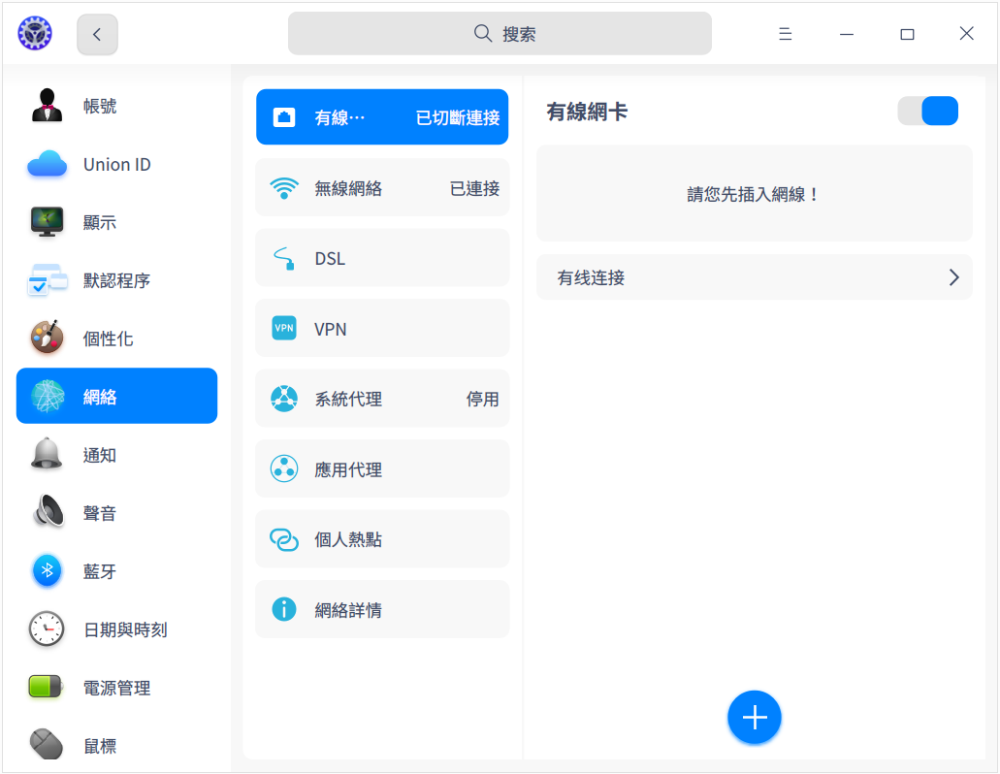

#### 有線網絡

有線網絡安全快速穩定，是最常見的網絡連接方式。當您設置好路由器後，把網線兩端分別插入電腦和路由器，即可連接有線網絡。

1. 將網線插入電腦上的網絡插孔。
2. 將網線的另一端插入路由器或網絡端口。
3. 在控制中心首頁，單擊 。
4. 單擊 **有線網絡**，進入有線網絡設置界面。
5. 打開 **有線網卡**，開啟有線網絡連接功能。
6. 當網絡連接成功後，桌面右上角將彈出 **已連接有線連接** 的提示訊息。

您還可以在有線網絡的設置界面，編輯或新建有線網絡設置。

#### 無線網絡

無線網絡幫助您擺脫線纜的束縛，上網形式更加靈活，支持更多設備使用。

##### 連接無線網絡

1. 在控制中心首頁，單擊 。
2. 單擊 **無線網絡**，進入無線網絡設置界面。
3. 打開 **無線網卡**，開啟無線網絡連接功能。
4. 電腦會自動搜索並顯示附近可用的無線網絡。
5. 選擇需要連接的無線網絡。

   - 如果該網絡是開放的，將自動連接到此網絡。
   - 如果該網絡是加密的，請根據提示輸入密碼，單擊 **連接**，然後將自動完成連接。

##### 連接隱藏網絡

為了防止他人掃描到自己的WiFi，進而破解WiFi密碼連接您的網絡，您可以在路由器設置界面隱藏無線網絡。設置後，您需要手動連接隱藏網絡才能上網。

1. 在控制中心首頁，單擊 。
2. 單擊 **無線網絡**，進入無線網絡設置界面。
3. 單擊 **連接到隱藏網絡**。
4. 輸入網絡名稱、SSID和其他必填選項。
5. 單擊 **保存** 。

#### 無線熱點

無線熱點將電腦連接的網絡信號轉換為WiFi熱點，以供一定距離內的其他設備無線上網。要開啟無線熱點，電腦必須連接到網絡並裝有無線網卡。

1. 在控制中心首頁，單擊 。
2. 單擊 **個人熱點**。
3. 打開 **熱點** 開關，設置熱點訊息。
4. 單擊 **保存**。

#### 移動網絡

當您處於一個沒有網絡信號的地方時，可以使用無線上網卡來上網。在有電話信號覆蓋的任何地方，無線上網卡通過運營商的移動數據網絡接入寬帶服務。

1. 將移動網卡插入電腦上的USB接口中。
2. 電腦將根據移動網卡和運營商訊息，自動適配並自動連接網絡。
3. 在控制中心首頁，單擊 。
4. 單擊 **移動網絡**，查看詳細設置訊息。

#### 撥號網絡

撥號上網（DSL）是指通過本地電話撥號連接到網絡的連接方式。配置好調制解調器，把電話線插入電腦的網絡接口，創建寬帶撥號連接，輸入運營商提供的用戶名和密碼，即可撥號連接到Internet上。

##### 新建撥號連接

1. 在控制中心首頁，單擊  。
2. 單擊 **DSL**，並單擊 **創建PPPoE連接** 按鈕 。
3. 輸入寬帶名稱、用戶名、密碼。
4. 單擊 **保存**，系統自動創建寬帶連接並嘗試連接。

#### VPN

VPN即虛擬專用網絡，其主要功能是在公用網絡上建立專用網絡，進行加密通訊。無論您是在外地出差還是在家中辦公，只要能上網就能利用VPN訪問企業的內網資源。您還可以使用VPN加速訪問其他國家的網站。

1. 在控制中心首頁，單擊 。
2. 單擊 **VPN**，選擇 **添加VPN** 按鈕 或 **導入VPN** 按鈕。
3. 選擇VPN協議類型，並輸入名稱、網關、賬號、密碼等訊息。（導入VPN會自動填充訊息）
4. 單擊 **保存**，系統自動嘗試連接VPN網絡。
5. 您可以將VPN設置導出，備用或共享給其他用戶。

>  說明：打開 **僅用於相對應的網絡上的資源** 開關，可以不將VPN設置為默認路由，只在特定的網絡資源上生效。

#### 系統代理

1. 在控制中心首頁，單擊  。
2. 單擊 **系統代理**，進入系統代理界面。
3. 開啟系統代理，在代理類型後的下拉框中選擇 **手動** 或 **自動**。

   - 單擊 **手動**，輸入代理伺服器的地址和端口訊息。
   - 單擊 **自動**，輸入URL，系統將自動配置代理伺服器的訊息。

4. 單擊 **保存**。

#### 應用代理

1. 在控制中心首頁，單擊  。
2. 單擊 **應用代理**。
3. 設置應用代理參數。
4. 單擊 **保存**。

>  說明：應用代理設置成功後，打開啟動器，右鍵單擊應用圖標，可以選擇 **使用代理**。

#### 網絡詳情

在網絡詳情界面，您可以查看MAC、IP位址、網關和其他網絡訊息。

1. 在控制中心首頁，單擊 。
2. 單擊 **網絡詳情**，進入網絡訊息界面。
3. 查看當前有線網絡或無線網絡的訊息。

### 通知設置

設置通知勿擾模式，開啟或關閉某些應用的通知顯示。

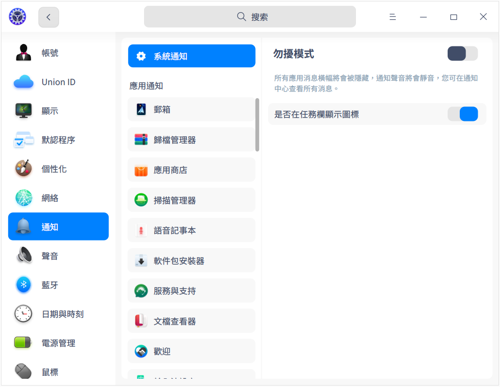

#### 設置系統通知

設置系統通知的勿擾模式及是否在任務欄顯示通知圖標。

1. 在控制中心首頁，單擊 。

2. 單擊 **系統通知**，進入系統通知界面。

   - 開啟或關閉勿擾模式。
     當開啟勿擾模式後，可以設置勿擾模式的開啟時間、結束時間；也可以設置 **在屏幕鎖屏時** 顯示通知。開啟勿擾模式可以使所有通知靜音，但您可以在通知中心查看所有消息。
   - 設置 **是否在任務欄顯示圖標**。

#### 設置應用通知

自定義設置個性化的應用通知顯示。

1. 在控制中心首頁，單擊 。
2. 在應用通知區域選擇一個應用，開啟後，您可以勾選：
   - 通知時提示聲音
   - 鎖屏時顯示消息
   - 在通知中心顯示
   - 顯示消息預覽

### 聲音設置

輸入輸出設備聲音的設置（如設置揚聲器和麥克風），讓您聽得更舒適，錄音更清晰。

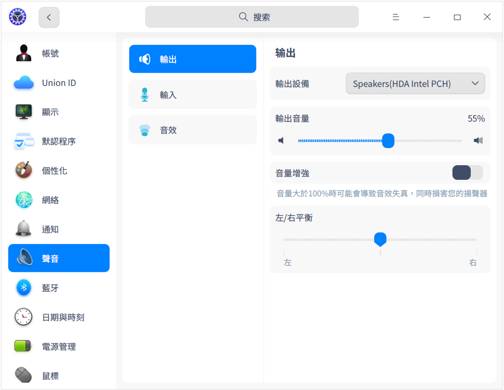

#### 输出設備

1. 在控制中心首頁，單擊 。
2. 單擊 **输出**，進入输出設置界面，您可以：
   - 在輸出設備後的下拉框中選擇輸出設備類型。
   - 通過拖曳滑塊調節輸出設備音量和左/右聲道平衡。
   - 打開 **音量增強**，音量的可調節區間由0~100%轉變為0~150%。

#### 輸入設備

1. 在控制中心首頁，單擊 。
2. 單擊 **輸入**，進入輸入設備設置介面，您可以：

   - 在輸入設備後的下拉框中選擇輸入設備類型。
   - 透過拖曳滑塊調節輸入設備音量。
   - 打開 **啟用** 開關，還可以設置 **噪音抑制** 功能。

>  竅門：通常需要調大輸入音量，方可確保能夠聽到聲源的聲音，但是音量不宜過大，否則將導致聲音失真。您可以對着輸入設備以正常說話的音量講話，並觀察反饋音量的變化，變化較明顯，則說明輸入音量合適。

#### 音效

1. 在控制中心首頁，單擊 。
2. 單擊 **音效**，勾選選項，開啟某一事件發生時的聲音效果。

>  竅門：您可以單擊試聽音效。

### 藍牙設置

藍牙能夠實現短距離的無線通信。通過藍牙無需網絡或連接線就可以與附近的其他藍牙設備連接。常見的藍牙設備包括：藍牙鍵盤、藍牙鼠標、藍牙耳機、藍牙音響等。

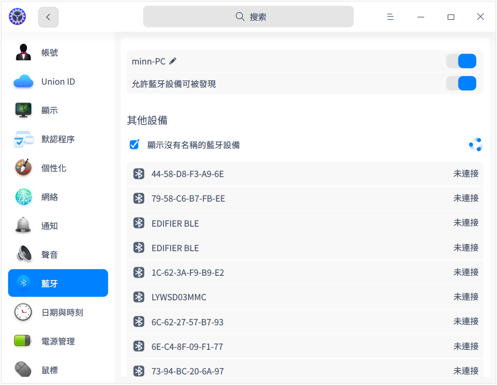

&nbsp;&nbsp;&nbsp;&nbsp;&nbsp;&nbsp;&nbsp;&nbsp;&nbsp;&nbsp;&nbsp;&nbsp;&nbsp;

>  說明：大多數筆記本電腦都配備有藍牙模塊，您只需開啟藍牙開關；而大部分台式電腦都沒有配備藍牙，您可以購買藍牙適配器，插入到電腦的USB端口中使用。

#### 修改藍牙名稱

1. 在控制中心首頁，單擊 。
2. 單擊藍牙名稱旁的 ，輸入本機新的藍牙名稱。

>  說明：修改藍牙名稱後，將自動對外廣播藍牙設備的新名字，需要其他設備重新進行搜索。

#### 連接藍牙設備

1. 在控制中心首頁，單擊 。
2. 開啟 **藍牙**，系統將自動掃描附近的藍牙設備，並顯示在 **其他設備** 列表。
3. 單擊想連接的藍牙設備，在該設備上輸入藍牙配對碼（若需要），配對成功後將自動連接。
4. 連接成功後，藍牙設備會添加到 **我的設備** 列表中。
5. 在列表中單擊該設備，您可以 **斷開連接**，或修改設備名稱。

#### 使用藍牙傳送/接收文件

UOS PC與非UOS PC或者UOS PC與移動設備（手機/平板）之間通過藍牙設備傳送/接收文件。

前提條件：發送端藍牙設備與接收端藍牙設備已配對並連接成功。

**使用UOS PC端藍牙傳送文件**

場景：發送端（UOS PC）通過藍牙向接收端（非UOS PC/手機/平板）傳送文件。

1. 在控制中心首頁，單擊 。
2. 開啟 **藍牙**，系統將自動掃描附近的藍牙設備。
3. 進入“我的設備”選擇已配對連接的藍牙設備，單擊進入詳情，單擊 **發送文件** 按鈕（僅PC/手機/平板的藍牙設備有該按鈕），在彈出的文件管理器窗口中選擇要發送的文件，單擊 **打開**。
4. 在彈出的選擇接收此文件的藍牙設備窗口中，單擊 **發送**，發送傳輸文件請求。

**使用手機端藍牙傳送文件**

場景：發送端（以安卓手機為例）通過藍牙向接收端（UOS PC）傳送文件。

1. 開啟 **藍牙**，系統將自動掃描附近的藍牙設備。
2. 選擇已配對並連接成功的藍牙設備。
3. 在手機中選擇文件，單擊 **發送**，通過藍牙發送文件。

**使用藍牙接收文件**

發送端發送文件後，接收端彈出提示窗口，用戶可以單擊 **接受** 或 **拒絕** 文件。

- 如果接收端藍牙設備同意接收，則發送端開始傳輸文件並顯示發送文件窗口，文件傳輸完成後；接收端會彈出提示訊息，用戶可以查看接收成功的文件。
- 如果接收端為如下情況，發送端部分文件傳輸失敗，會顯示在傳輸失敗列表。
   - 接收端藍牙設備選擇拒絕，則結束傳輸，顯示傳輸失敗。
   - 接收端藍牙設備超時未操作或超出傳輸範圍，則顯示傳輸失敗（藍牙設備連接失敗）。
   - 接收端即不單擊接收也不單擊拒絕，默認1分鐘後則結束傳輸，顯示傳輸失敗。

### 日期與時刻

選擇正確的所在時區，即可在電腦上顯示所在地的時間和日期，也可以手動修改時間和日期。

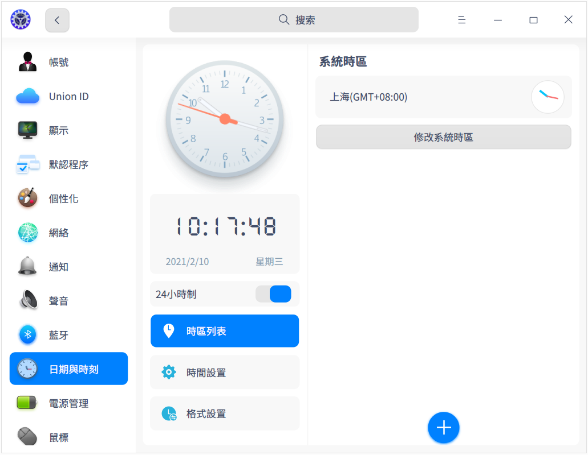

#### 修改系統時區

在您安裝系統時，已選擇了系統時區。若要修改系統時區，請按如下步驟設置。

1. 在控制中心首頁，單擊 。
2. 單擊 **時區列表**。
3. 單擊 **修改系統時區**， 通過搜索或單擊地圖選擇時區。
4. 單擊 **確定**。

#### 添加時區

您可以同時使用多個時區，以便查看另一時區的時間。

1. 在控制中心首頁，單擊 。
2. 單擊 **時區列表**。
3. 單擊 **添加時區** 按鈕 ，通過搜索或單擊地圖選擇時區。
4. 單擊 **添加**。

#### 刪除時區

1. 在控制中心首頁，單擊 。
2. 單擊 **時區列表**。
3. 單擊時區列表後面的 **更改**。
4. 單擊 **刪除** 按鈕，刪除已添加的時區。

#### 修改時間和日期

默認情況下，系統通過網絡自動同步該時區的本地時間和日期。您也可以手動修改時間和日期。手動設置後，自動同步功能會被關閉。

1. 在控制中心首頁，單擊 。
2. 單擊 **時間設置** 。
3. 關閉 **自動同步配置**。
4. 手動設置正確的時間和日期。
5. 單擊 **確定**。

> 說明：您還可以打開 **自動同步配置**、設置伺服器同步參數。

#### 設置時間日期格式

系統支持即時設置時間日期的格式。

1. 在控制中心首頁，單擊 。
2. 單擊 **格式設置**，可以設置星期、長短日期、長短時間等格式。

### 電源管理

對系統電源進行一些設置，讓筆記本電池更耐用，讓系統更安全。

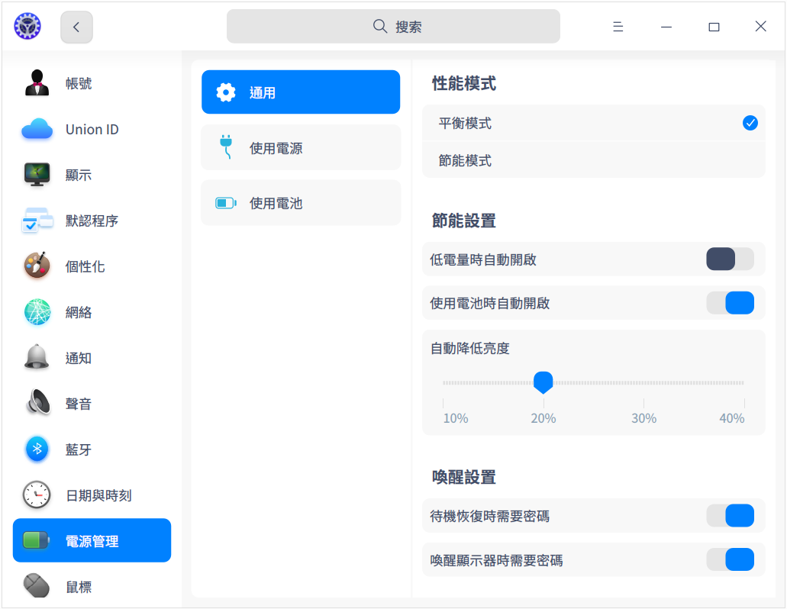

&nbsp;&nbsp;&nbsp;&nbsp;&nbsp;&nbsp;&nbsp;&nbsp;&nbsp;&nbsp;&nbsp;&nbsp;&nbsp;

#### 調整性能模式

1. 在控制中心首頁，單擊 。
2. 單擊 **通用**。
3. 在性能模式區域，選擇 **平衡模式**、**高性能模式** 或 **節能模式**。

> 說明：僅當硬件支持高性能模式時，才顯示 **高性能模式** 選項。

#### 設置節能模式

為降低電腦的耗電量，您可以對節能模式進行設置，降低螢幕亮度。

1. 在控制中心首頁，單擊 。
2. 單擊 **通用**。
3. 選擇 **節能模式**。
4. 在節能設置下：
   - 打開 **低電量時自動開啟** 節能模式（僅手提電腦支持）。
   - 打開 **使用電池時自動開啟** 節能模式（僅手提電腦支持）。
   - 拖動 **自動降低亮度** 條滑塊，調節亮度。

> 說明：當關閉 **使用電池時自動開啟** 節能模式時，則直接進入 **平衡模式**。

#### 喚醒時需要密碼

1. 在控制中心首頁，單擊 。
2. 單擊 **通用**。
3. 打開 **待機恢復時需要密碼**/**喚醒顯示器時需要密碼**，開啟相應安全設置。

#### 設置電量顯示模式

1. 在控制中心首頁，單擊 。
2. 點擊 **通用**。
   - 打開 **顯示剩餘電量及剩餘充電時間**，顯示剩餘電量及剩餘充電時間。
   - 關閉 **顯示剩餘電量及剩餘充電時間**，則僅顯示剩餘電量。

>  說明：僅筆記本電腦支持設置電量顯示模式。

#### 設置顯示器關閉時間

1. 在控制中心首頁，單擊 。
2. 單擊 **使用電源** 或 **使用電池**。
3. 選擇關閉顯示器的時間。

>  說明：筆記本電腦用戶可以在 **使用電源** 和 **使用電池** 下對同一設置項分別設置不同的時間。

#### 設置電腦待機時間

1. 在控制中心首頁，單擊 。
2. 單擊 **使用電源** 或 **使用電池**。
3. 選擇電腦進入待機模式的時間。

>  竅門：筆記本電腦用戶還可以選擇 **筆記本合蓋時** 待機，以便在使用電源時合蓋待機。

#### 設置自動鎖屏時間

1. 在控制中心首頁，單擊 。
2. 單擊 **使用電源** 或 **使用電池**。
3. 選擇自動鎖屏的時間。

#### 設置合蓋顯示狀態

1. 在控制中心首頁，點擊 。
2. 點擊 **使用電源** 或 **使用電池**。
3. 設置 **筆記本合蓋時** 為 **待機**、**休眠**、**關閉顯示器** 或 **無任何操作**。

>  說明：僅筆記本電腦支持設置合蓋顯示狀態。

#### 設置按電源按鈕時顯示狀態

1. 在控制中心首頁，單擊 。
2. 單擊 **使用電源** 或 **使用電池**。
3. 選擇按電源按鈕時的顯示狀態 **關機**、**待機**、**休眠**、**關閉顯示器** 或 **無任何操作**，更改按電源按鈕時的設置。

更改設置後會即時生效，並有通知提示。

#### 設置低電量通知

1. 在控制中心首頁，單擊 。
2. 單擊 **使用電池**。
3. 打開 **低電量通知**，當電池剩餘電量低於設置的閾值（例如，20%）時，系統會發出低電量通知。

通過拖拽低電量滑塊，調節低電量的閾值；或通過拖拽自動待機電量滑塊，調節待機電量的閾值。

>  說明：僅筆記本電腦支持設置低電量通知。

#### 設置自動待機電量

1. 在控制中心首頁，單擊 。
2. 單擊 **使用電池**。
3. 拖動 **自動待機電量** 條滑塊，調節自動待機電量。

>  說明：僅筆記本電腦支持設置自動待機電量。

### 鼠標和觸控板

鼠標和觸控板是電腦常用的輸入設備。使用鼠標，可以使操作更加簡便快捷。對於手提電腦用戶，當沒有鼠標時，也可以使用觸控板代替鼠標進行操作。部分設備還支持指點杆，使用指點杆不需要將手指從基準鍵上移開便能操縱鼠標。在控制中心鼠標設置模塊，用戶可以對鼠標、觸控板和指點杆進行設置，從而讓設備使用體驗更加符合自己的使用習慣。

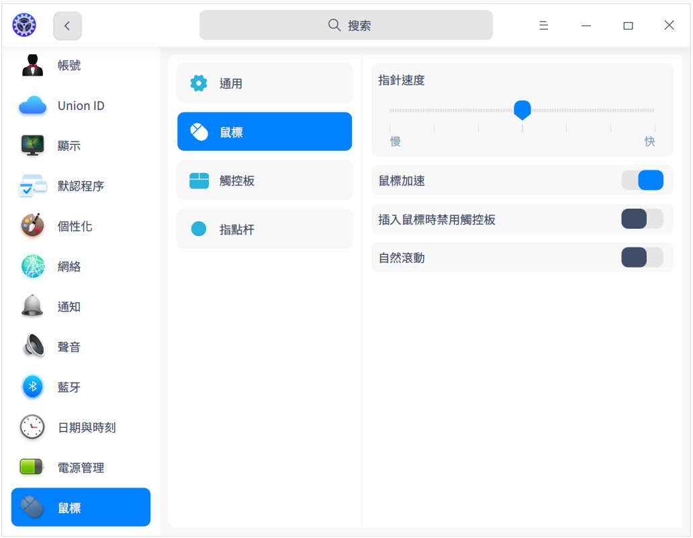

#### 通用設置

1. 在控制中心首頁，單擊 。
2. 單擊 **通用**。
3. 開啟 **左手模式**，調節鼠標和觸控板的**滾動速度**，**雙擊速度**。

>  說明：開啟 **左手模式** 後，鼠標和觸控板的左右鍵功能互換。

#### 鼠標設置

插入或連接鼠標後，在控制中心進行相關設置，讓其更符合您的使用習慣。

>  說明：當沒有觸控板時，不會顯示 **插入鼠標時禁用觸控板**。
>

1. 在控制中心首頁，單擊 。
2. 單擊 **鼠標**。
3. 調節 **指針速度**， 控制鼠標移動時指針移動的速度。
4. 單擊 **自然滾動**/**鼠標加速** 開關，開啟相應功能。

>  說明：
>
> - 開啟鼠標加速，提高了指針精確度，鼠標指針在螢幕上的移動距離會根據移動速度的加快而增加。可以根據使用情況開啟或關閉。
> - 自然滾動開啟後，鼠標滾輪向下滾動，內容會向下滾動；鼠標滾輪向上滾動，內容會向上滾動。

#### 觸控板設置

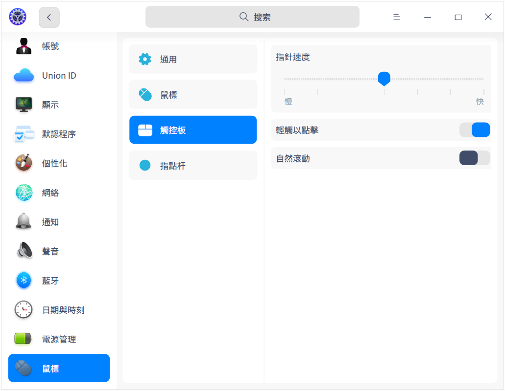

&nbsp;&nbsp;&nbsp;&nbsp;&nbsp;&nbsp;&nbsp;&nbsp;&nbsp;&nbsp;&nbsp;&nbsp;&nbsp;

若您使用的是筆記本電腦，可以在 **鼠標** > **通用** 界面開啟 **輸入時禁用觸控板**，在 **鼠標** > **鼠標** 界面開啟 **插入鼠標時禁用觸控板**，以避免誤觸觸控板。

您還可以調節觸控板的 **指針速度**，控制手指移動時指針移動的速度；開啟自然滾動，變更滾動方向。

#### 指點杆設置

指點杆，常稱為小紅帽，是一種主要應用於筆記本電腦的定點設備，可用來控制指針的移動。

1. 在控制中心首頁，單擊 。
2. 單擊 **指點杆**。
3. 調節 **指針速度**， 控制使用指點杆時指針移動的速度。

### 數位板

數位板，又名繪圖板、繪畫板、手繪板等，主要用作繪畫創作，是計算機的一種輸入設備。
連接到電腦後，您可以設置數位板的壓感力度，即筆尖和橡皮擦的壓力感應值。

>  說明：連接數位板設備後，該模塊才會顯示。

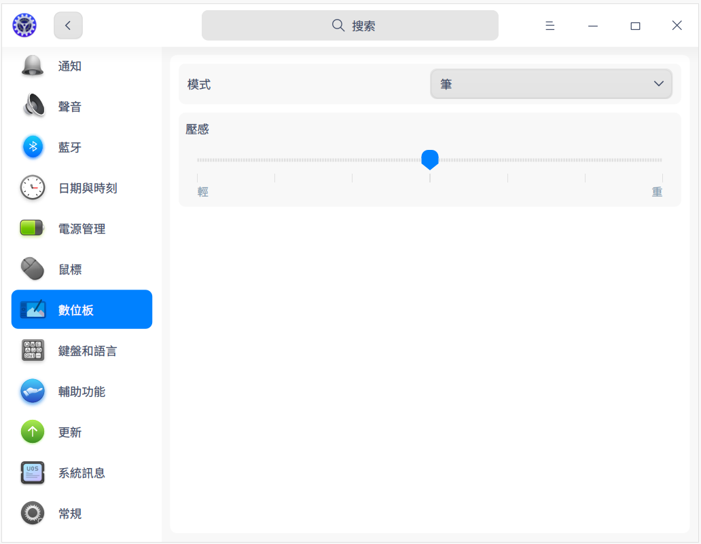

&nbsp;&nbsp;&nbsp;&nbsp;&nbsp;&nbsp;&nbsp;&nbsp;&nbsp;&nbsp;&nbsp;&nbsp;&nbsp;

1. 在控制中心首頁，單擊 。
2. 選擇 **筆** 模式。
3. 調節 **壓感** 力度。

### 鍵盤和語言

在此模塊可以設置鍵盤屬性，以便符合個人的輸入習慣，還可以根據國家和語言調整鍵盤佈局，設置輸入法、系統語言，以及自定義快捷鍵。

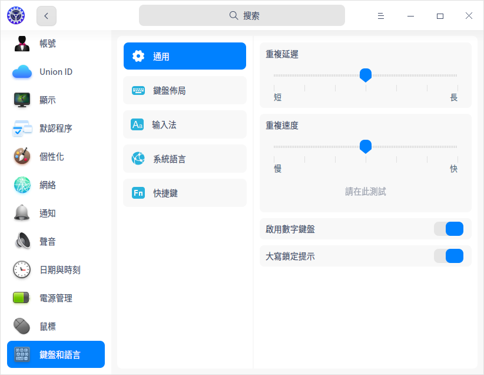

#### 鍵盤屬性

1. 在控制中心首頁，單擊 。
2. 單擊 **通用**。
3. 調節 **重複延遲**/**重複速度**。
4. 單擊 **請在此測試**，按下鍵盤上的任意字符不鬆開，查看調節效果。
5. 單擊 **啟用數字鍵盤**/**大寫鎖定提示** 開關，開啟相應功能。

#### 鍵盤佈局

鍵盤佈局可以為當前語言設置自定義鍵盤。完成鍵盤佈局設置後，按下鍵盤上的按鍵，螢幕上會按照鍵盤佈局設置好的字符進行顯示。更改鍵盤佈局後，螢幕上的字符可能與鍵盤按鍵上的字符不相符。

一般在安裝系統時就已經設置了鍵盤佈局，可以根據需求添加或刪除其他的鍵盤佈局。

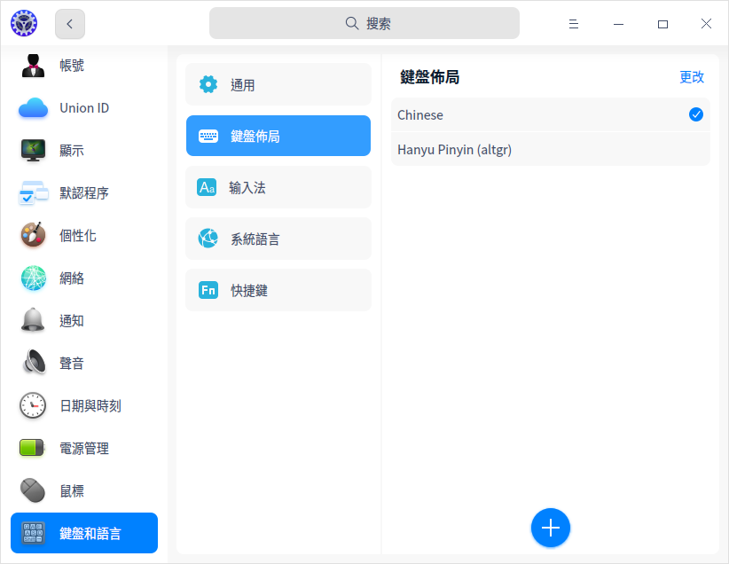

##### 添加鍵盤佈局

1. 在控制中心首頁，單擊 。
2. 單擊 **鍵盤佈局**，進入鍵盤佈局界面。
3. 單擊 **添加** 按鈕 ，單擊某一鍵盤佈局即可添加到列表。

##### 刪除鍵盤佈局

1. 在控制中心首頁，單擊 。
2. 單擊 **鍵盤佈局**，進入鍵盤佈局界面。
3. 單擊 **鍵盤佈局** 後的 **更改**。
4. 單擊 **刪除** 按鈕 ，刪除該鍵盤佈局。

#### 輸入法

對輸入法進行設置，可以為系統提供更豐富的輸入方式。在輸入法界面可以添加多個輸入法，設置輸入法切換的快捷鍵，以便用戶選擇符合個人打字習慣的輸入方式。

##### 添加輸入法

您可以添加多個輸入法到輸入法管理列表，以便切換輸入法。

1. 在控制中心首頁，單擊 。
2. 單擊 **輸入法**，進入輸入法界面。
3. 單擊 **添加** 按鈕  ，您可以：
   - 單擊 **前往商店下載**，在應用商店下載輸入法，當該輸入法下載完成後，系統自動設置其為默認輸入法。
   - 進入添加輸入法界面，選擇輸入法，將該輸入法添加到輸入法管理列表。

> 說明： 在輸入法管理界面，單擊 **編輯**，單擊 **刪除** 按鈕即可移除某輸入法。對於被移除（非卸載）的輸入法，可以在添加輸入法界面進行添加。

##### 設置輸入法排序

1. 在控制中心首頁，單擊 。
2. 單擊 **輸入法**，進入輸入法界面。
3. 在輸入法管理區域，上下拖動輸入法或單擊輸入法後面的上下箭頭，進行排序。

##### 設置輸入法配置項

1. 在控制中心首頁，單擊 。
2. 單擊 **輸入法**，進入輸入法界面。
3. 在輸入法管理區域，單擊輸入法後面的 **設置** 按鈕 ，設置輸入法自身的配置項。

##### 設置輸入法切換快捷鍵

1. 在控制中心首頁，單擊 。
2. 單擊 **輸入法**，進入輸入法界面。
3. 在快捷鍵區域，切換輸入法下拉框中，選擇輸入法切換的快捷鍵。

> 說明：輸入法切換快捷鍵設置成功後，當切換輸入法，自動切換為輸入法對應的鍵盤佈局。選擇 **切換方式**， 讓切換後的鍵盤佈局應用於整個系統或當前應用。

#### 系統語言

系統語言默認為安裝系統時所選擇的語言，可以隨時進行更改。在系統語言列表可以添加多個語言，以便切換系統語言。

##### 添加系統語言

您可以添加多個語言到系統語言列表，以便切換系統語言。

1. 在控制中心首頁，單擊 。
2. 單擊 **系統語言**，進入系統語言界面。
3. 單擊 **添加** 按鈕  進入語言列表。
4. 選擇語言，該語言將自動添加到系統語言列表。

##### 設置系統語言

1. 在控制中心首頁，單擊 。
2. 單擊 **系統語言**，進入系統語言界面。
3. 選擇要切換的語言，系統將自動開始安裝語言包。
4. 語言包安裝完成後，需要登出後重新登入，以便讓設置生效。

>  注意：更改系統語言後，鍵盤佈局可能也會發生改變。重新登入時，請確保使用正確的鍵盤佈局來輸入密碼。

#### 快捷鍵

快捷鍵列表顯示了系統所有的快捷鍵，在這裏查看、修改和自定義快捷鍵。

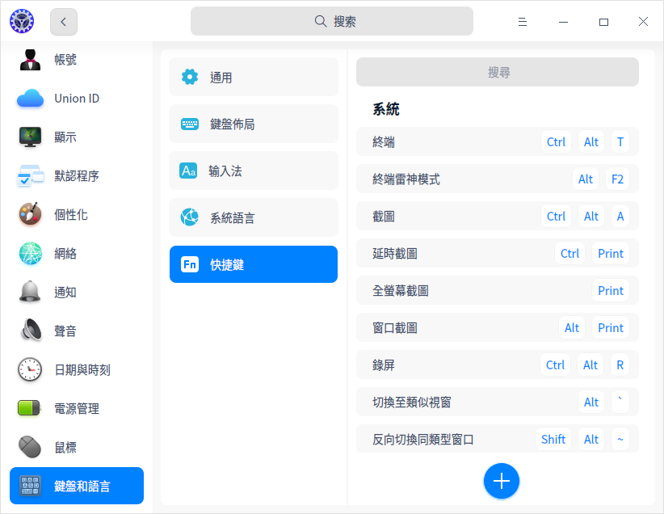

##### 查看快捷鍵

1. 在控制中心首頁，單擊 。
2. 單擊 **快捷鍵**，進入快捷鍵設置界面。
3. 搜索或查看默認的系統快捷鍵、窗口快捷鍵和工作區快捷鍵。

##### 修改快捷鍵

1. 在控制中心首頁，單擊 。
2. 單擊 **快捷鍵**，進入快捷鍵設置界面。
3. 單擊需要修改的快捷鍵。
4. 使用鍵盤輸入新的快捷鍵。

>  竅門：若要禁用快捷鍵，請按下鍵盤上的 **Backspace**  鍵。若要取消修改快捷鍵，按下 **Esc**鍵，或單擊下方的 **恢復默認** 按鈕。

##### 自定義快捷鍵

您可以為常用的應用自定義一個快捷鍵。

1. 在控制中心首頁，單擊 。
2. 單擊 **快捷鍵**。
3. 單擊 **添加** 按鈕 ，進入添加快捷鍵界面。
4. 輸入快捷鍵名稱、命令和快捷鍵。
5. 單擊 **添加**。
6. 添加成功後，單擊 **自定義快捷鍵** 後的 **更改**。
7. 單擊某個快捷鍵後 ， 刪除自定義的快捷鍵。

>  竅門：若要修改快捷鍵，單擊輸入新的快捷鍵即可。若要修改自定義快捷鍵的名稱和命令，單擊 **自定義快捷鍵** 後的 **更改** ，單擊快捷鍵名稱後的 ，進入修改頁面。

### 輔助功能

在輔助功能界面，您可以使用桌面智能助手、語音聽寫、語音朗讀、文本翻譯等功能。

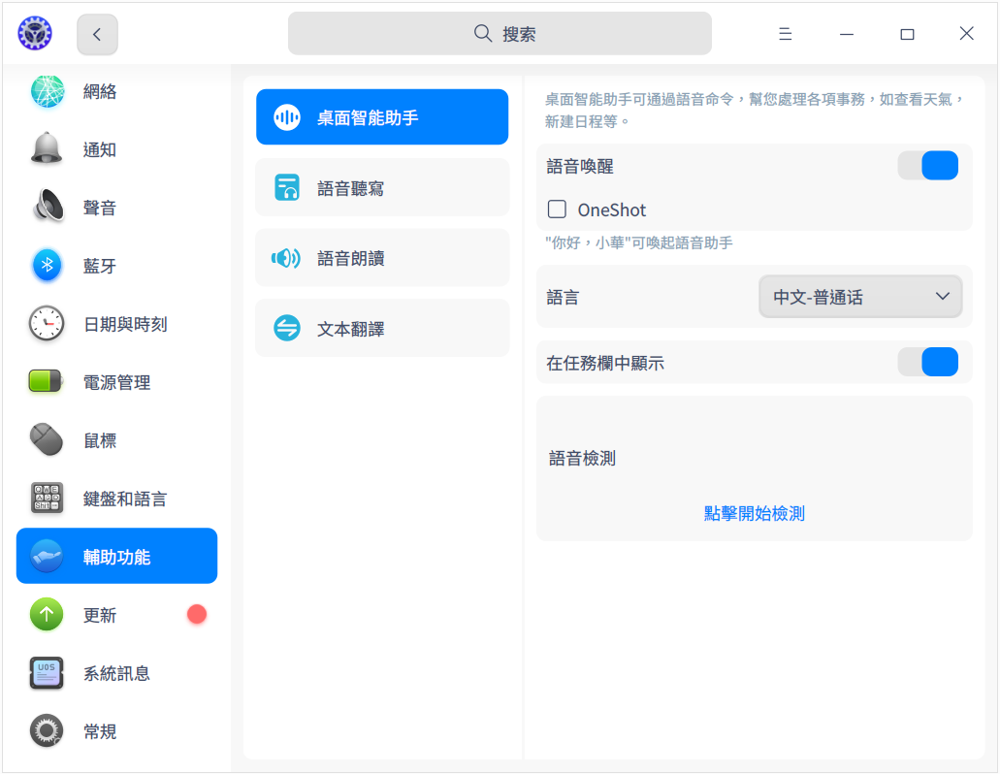

#### 桌面智能助手

桌面智能助手可通過語言命令，幫助您處理各項事務，如查看天氣、新建日程等。

- 開啟/關閉語音喚醒：當開啟語音喚醒方式時，支持勾選OneShot，開啟 **喚醒命令+語義命令** 喚起方式，例如：你好，小華！香港天氣怎樣？
- 設置語言：中文-普通話
- 開啟/關閉在任務欄中顯示：開啟在任務欄中顯示，關閉則不在任務欄中顯示，關閉後還可以使用快捷鍵喚起。
- 語音檢測：可以檢測語音輸入狀態是否正常。

#### 語音聽寫

- 語音聽寫：當有音頻輸入設備時，默認語音聽寫為開啟狀態；當沒有音頻輸入設備時，則默認為關閉狀態。
- 語言：設置語音識別語言，支持設定為中文-普通話、英語。

#### 語音朗讀

- 開啟/關閉語音朗讀：當有音頻輸出設備時，默認語音朗讀為開啟狀態；當沒有音頻輸出設備時，則默認為關閉狀態；如無音頻輸出設備則隱藏此項 。
- 開啟/關閉朗讀控制項顯示：當為關閉狀態時，表示不展示朗讀控件，但仍可以使用快捷鍵或在右鍵菜單中喚起。
- 音源：設定語音音源，女聲、男聲。

#### 文本翻譯

- 開啟/關閉文本翻譯：默認設置翻譯為開啟狀態。
- 語言：支持設置翻譯語言，中譯英、英譯中。

### 更新

當系統存在更新時會在控制中心首頁提示，單擊 **更新** 按鈕  進入 **更新** 頁面，單擊 **檢查更新**，檢查完畢後，即可進行下載並安裝更新。除此之外，在更新設置模塊中還可以設置自動下載更新。

>  竅門：如果不需要檢查更新，不需要收到系統或應用的更新提示，可在 **更新設置** 中關閉 **檢查更新** 或 **更新提醒**。

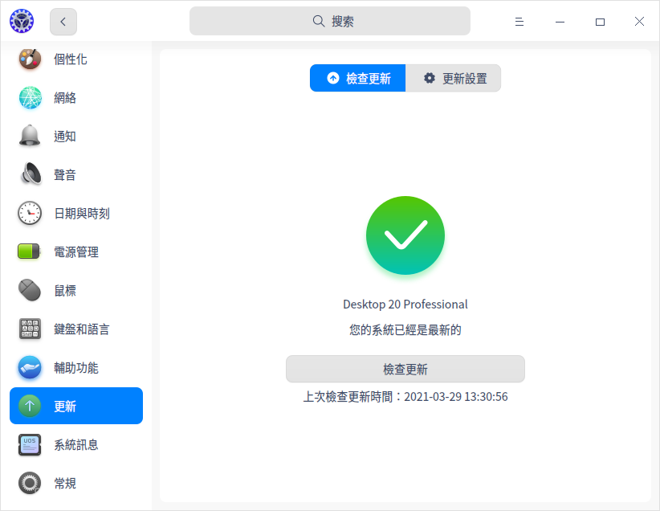

#### 更新和升級

1. 在控制中心首頁，單擊 。
2. 單擊 **檢查更新**，進入檢查系統更新界面。

 - 如果系統沒有更新將會提示 **您的系統已經是最新的**。
 - 如果系統存在更新，將顯示 **下載並安裝更新** 按鈕，下載數據大小和更新詳情。

3. 單擊 **安裝更新** 按鈕，系統將自動開始下載並安裝更新。
4. 更新完成後，會出現 **更新成功** 提示。

>  說明：在下載過程中，您可以單擊按鈕暫停下載，再次單擊按鈕繼續下載。更新完成後，會彈出對話框提醒用戶 **重啟** 或 **關機** 。

#### 自動下載更新

1. 在控制中心首頁，單擊 。
2. 單擊 **更新設置**。
3. 打開 **下載更新**。
4. 當系統存在更新時，將自動下載數據。

>  竅門：打開 **清除軟件包緩存** 開關，系統會定期清理下載軟件包導致的緩存。

### 系統訊息

您可以查看系統版本、版本協議和電腦硬件等訊息，以及該系統的一些協議。

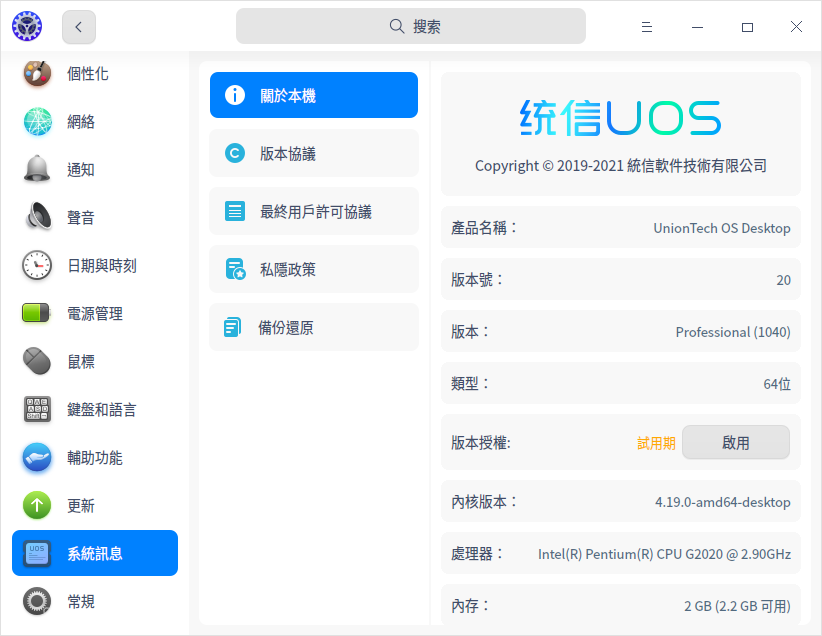

#### 關於本機

1. 在控制中心首頁，單擊 。
2. 在 **關於本機** 下，您可以查看當前系統版本、版本授權及電腦硬件訊息。
3. 若系統未啟動，可在此頁面單擊 **啟動**，進行系統啟動。

#### 版本協議

1. 在控制中心首頁，單擊 。
2. 在 **版本協議** 下，查看系統版本協議。

#### 最終用戶許可協議

1. 在控制中心首頁，單擊 。
2. 在 **最終用戶許可協議** 下，查看最終用戶許可協議。

#### 私隱政策

1. 在控制中心首頁，單擊 。
2. 在 **私隱政策** 下，查看私隱政策。

### 授權管理

授權管理為公司自研的一款工具，幫助您啟用系統。
以下將從未啟用、啟用方式、啟用成功及啟用失敗這幾個方面進行介紹。

#### 未啟用

未啟用狀態分為未啟用和過期未啟用。

- 未啟用：界面包括產品名稱、產品版本和授權狀態訊息。
- 過期未啟用：在截止時間內未啟用系統，界面包括產品名稱、產品版本、授權狀態、授權對象和截止日期訊息。

系統未啟用時運行授權管理工具有以下兩種方式：

- 單擊右下角托盤上的  進入界面。
- 打開 **控制中心**，選擇 **系統訊息**，單擊 **關於本機**。可查看版本授權，單擊 **啟用** 進入頁面。

>  說明：如果系統未啟用，授權管理圖標  會一直在右下角托盤顯示。

#### 啟用方式

授權管理啟用方式分在線啟用和離線啟用，而在線啟用方式包含試用期啟用、輸入序列號、導入啟用文檔。

>  注意：只有在試用期或被啟用成功的系統，才能正常使用UOS的所有功能，否則會有部分功能受到限制。

**在線啟用**

網絡連接正常時，可以使用在線啟用。

試用期啟用

每台設備僅有一次試用期啟用機會（默認開機自動啟用），從啟用當天算起，有效期為90天。試用期間可使用系統全部功能。

如果系統未啟用，可以執行如下操作啟用系統。

1. 單擊右下角托盤上的  進入界面。

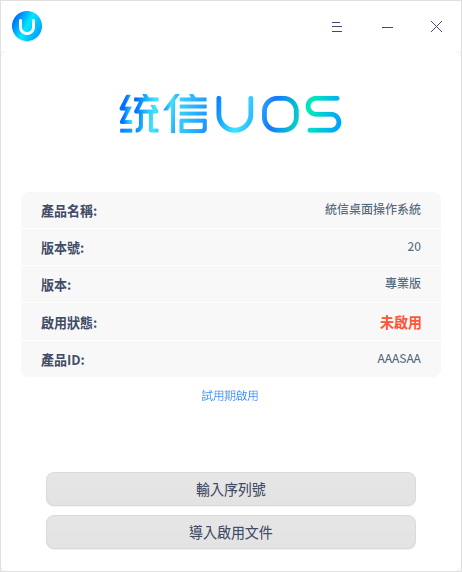

2. 單擊 **試用期啟用**，跳轉到啟用界面。

3. 單擊 **立即啟用**，彈出二次確認彈框，單擊 **確定**，彈出試用期啟用成功界面，此時任務欄圖標變為 。

系統成功啟用後，可查看啟用狀態、可查看試用到期時間等訊息，也可以選擇永久啟用系統。

   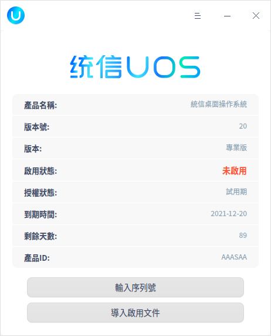

輸入序列號

1. 單擊右下角托盤上的  進入界面。

2. 單擊 **輸入序列號**，輸入或複製正確的序列號，單擊 **立即啟用**。

>  說明：統信UOS既支持16位的序列號，也支持25位的序列號。

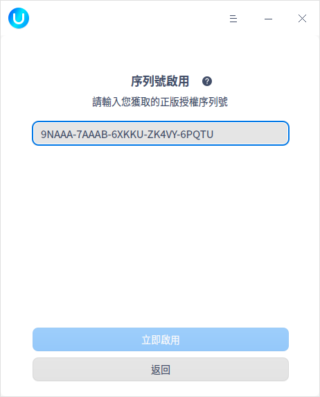

3. 會彈出二次確認彈框，單擊 **確定**，彈出啟用成功界面。

導入啟用文檔

1. 單擊右下角托盤上的  進入界面。

2. 單擊 **導入啟用文檔**，彈出檔案管理員，選擇.key格式的啟用文檔。

 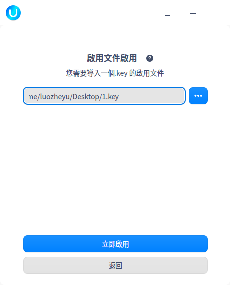

3. 選擇正確的文檔，單擊 **立即啟用**。會彈出二次確認彈框，單擊 **確定**，彈出啟用成功界面。

**離線啟用**

網絡連接異常時，可使用離線啟用。

1. 選擇輸入序列號或導入授權文檔啟用時，系統檢測網絡連接異常，則跳轉到離線啟用界面。

2. 離線啟用界面顯示二維碼、序列號、機器ID及離線啟用碼輸入框。

3. 手機掃描二維碼，手機端彈出啟用界面，界面顯示當前機器ID及序列號。

   

4. 單擊 **立即啟用**，會彈出二次確認彈框，單擊 **確定**。

5. 跳轉到啟用成功界面，顯示機器ID、序列號和離線啟用碼。

   

6. 手動將手機端的離線啟用碼輸入電腦端的離線啟用碼輸入框。

   

7. 單擊 **離線啟用**，跳轉到啟用成功界面。

#### 啟用成功

系統啟用成功後，右下角托盤不再顯示授權管理圖標，在 **控制中心 > 系統訊息 > 關於本機** 中，單擊 **查看** 可以查看授權管理訊息。
啟用成功界面包含產品名稱、版本和啟用狀態等訊息，也可以單擊 **查看詳情** 查看更多訊息。

主要訊息如下所示：

- 產品名稱：操作系統的名稱。
- 版本：操作系統的版本。
- 啟用狀態：分為未啟用、過期未啟用、已啟用等。
- 授權狀態：分為試用期、未授權、已過期、已授權等。
- 啟用方式：根據實際啟用方式體現。
- 到期時間：到期時間前 10 天開始，每次開機進入系統，會彈出系統授權即將到期的提示訊息。

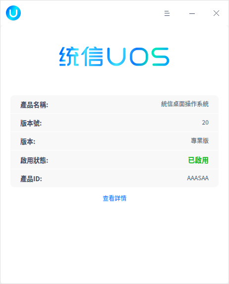

##### 更換序列號

系統啟用成功後，由於某些原因需要變更序列號。

有且僅當滿足如下條件時，支持更換序列號。

- 網絡狀態為在線時，支持序列號更換，離線狀態暫不支持序列號更換，但支持手機掃碼啟用。
- 僅授權狀態為已啟用時，支持序列號更換。
- 僅授權模式為OPEN時，支持序列號更換

更換序列號操作步驟如下：

1. 在啟用詳情界面，單擊 **更換序列號**。
2. 彈出更換序列號提示框，單擊 **更換**。
3. 進入序列號啟用界面，輸入新的序列號。
4. 單擊 **立即啟用** 即可更換序列號。

> 說明：系統支持命令行 **uos-activator-cmd -c/-C** 更換序列號，僅支持3次序列號更換。

#### 啟用失敗

若啟用文檔已使用或已失效，則會彈出啟用失敗界面。

#### 啟用伺服器設置

如果當前啟用伺服器出現異常或崩潰了，通過授權管理界面，單擊  主菜單中的 **設置**，可以自定義新的啟用伺服器。

### 備份還原

為避免因軟件缺陷、硬件損毀、人為操作不當、駭客攻擊、電腦病毒、自然災害等因素造成數據缺失或損壞，可以進行應用數據或系統數據的備份還原，以保障系統的正常運行。

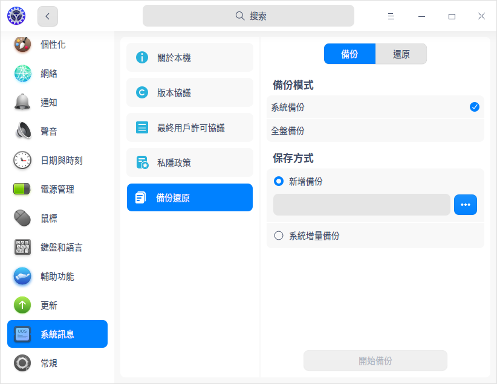

#### 備份

統信UOS提供初始化備份、控制中心備份的備份方式。

##### 通過初始化進行備份

在系統安裝時，如果選擇全盤安裝，會先自動創建恢復分區，並在後續安裝過程中備份啟動分區和根分區。

##### 通過控制中心進行備份

在控制中心，用戶可以通過全盤備份或系統備份來備份數據。

1. 在控制中心首頁，單擊 。
2. 選擇 **備份/還原** > **備份**，設置備份模式和備份文檔的保存路徑。
   - 備份模式：全盤備份、系統備份
      - 全盤備份：備份全磁盤的系統文檔和用戶文檔
      - 系統備份：備份根分區、啟動分區
   - 保存方式：新增備份、系統增量備份

   > 說明：全盤備份無法備份在自己本身的磁盤裏，只能備份在其他存儲介質中。

3. 單擊 **開始備份**，彈出密碼輸入框，請輸入密碼授權備份文檔，直至文檔備份完成。

> 注意：在備份文檔的過程中，請不要拔掉電源或強行關機，以防止數據的丟失或損壞。

#### 還原

統信UOS支持從Grub、控制中心進行數據還原。

##### 從Grub進入還原

在開機時，選擇系統界面，單擊 **系統還原**，進入統信UOS系統還原。用戶可以選擇 **恢復出廠設置** 讀取安裝時的初始化備份，也可以選擇“自定義恢復”恢復已創建的歷史還原點。

##### 通過控制中心進行還原

用戶既可以恢復出廠設置，也可以自定義恢復還原前期備份的數據。

1. 在控制中心首頁，單擊 。
2. 選擇 **備份/還原** > **還原**，您可以選擇：

   - 恢復出廠設置
      1. 選擇是否勾選 **保留個人數據**，單擊 **開始還原**，在彈出的對話框中，單擊 **確定**。 
      2. 在彈出的密碼輸入框中，輸入密碼授權進行數據的還原。
   - 自定義恢復
      1. 勾選 **自定義恢復** 後，單擊選擇要還原的文件。
      2. 單擊 **開始還原**，開始還原系統。

### 通用設置

通用設置模塊下包括啟動菜單、開發者模式和用戶體驗計劃等訊息。

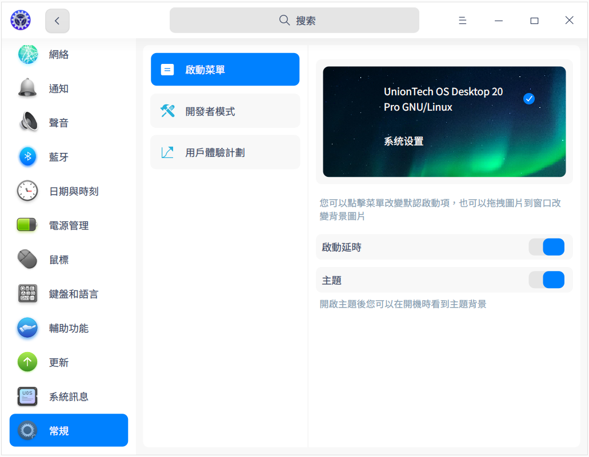

#### 設置啟動菜單

啟動菜單，指的是開機後選擇操作系統的菜單。選擇某一系統後，計算機就會引導進入該操作系統。

##### 設置啟動延時

當設備中存在多個系統時，**啟動延時** 默認開啟，開機後在啟動菜單停留5秒鐘，您可以在啟動菜單單擊要進入的系統。

當設備僅存在一個系統時，**啟動延時** 默認關閉，開機後在啟動菜單停留1秒鐘，不需要進行選擇。

##### 修改默認啟動項

1. 在控制中心首頁，單擊 。
2. 單擊 **啟動菜單**，進入啟動菜單界面。
3. 單擊選中某一菜單項後，彈出授權認證窗口，請輸入密碼授權該項，該項將成為默認啟動項。

##### 更改啟動菜單背景

1. 在控制中心首頁，單擊 。
2. 單擊 **啟動菜單**，進入啟動菜單界面。
3. 開啟 **主題**，使用該主題為啟動菜單的背景。

>  竅門：您也可以把圖片拖拽到預覽窗口，來更換啟動菜單的背景。

#### 開發者模式

進入開發者模式您可以使用root權限，執行sudo操作，安裝和運行未在應用商店上架的非簽名應用。系統默認未進入開發者模式。

> 注意：進入開發者模式後的行為可能存在風險，且將不再享有官方保修服務，請謹慎操作。

1. 在控制中心首頁，單擊 。
2. 單擊 **開發者模式**，單擊 **進入開發者模式** 按鈕。
   - 選擇在線模式，請先登錄網絡帳號。仔細查看開發者模式免責聲明，了解注意事項後，勾選 **同意並進入開發者模式**，單擊 **確定**。待系統下發證書後，按鈕變為 **已進入開發者模式**。
   - 選擇離線模式，根據提示下載證書，待系統導入證書後，即可進入開發者模式。
3. 在彈出的對話框中單擊 **立即重啟**， 重啟系統後開發者模式生效。

> 注意：進入開發者模式後不可退出或撤銷。系統所有帳號都將擁有root權限。

#### 用戶體驗計劃
用戶體驗計劃會收集用戶的硬件訊息、應用訊息和系統訊息，收集到的訊息方便研發團隊改善用戶最常使用的功能，並幫助解決軟件操作過程遇到的問題，從而更好地滿足用戶的需求、提升用戶體驗。
為了更好地使用該系統，建議用戶開啟用戶體驗計劃，該計劃可以隨時參與或退出。

1. 在控制中心首頁，單擊 。
2. 打開 **用戶體驗計劃** 開關，了解私隱協議。
3. 若同意，勾選 **同意並加入用戶體驗計劃**，單擊 **確定**。

## 窗口管理器

窗口管理器可以在不同的工作區內展示不同的窗口內容。通過窗口管理器您可以同時使用多個桌面，以便對桌面窗口進行分組管理。

>  說明：只有在控制中心 > 個性化 > 通用界面，開啟了窗口特效功能後，才支持運行窗口管理器功能。

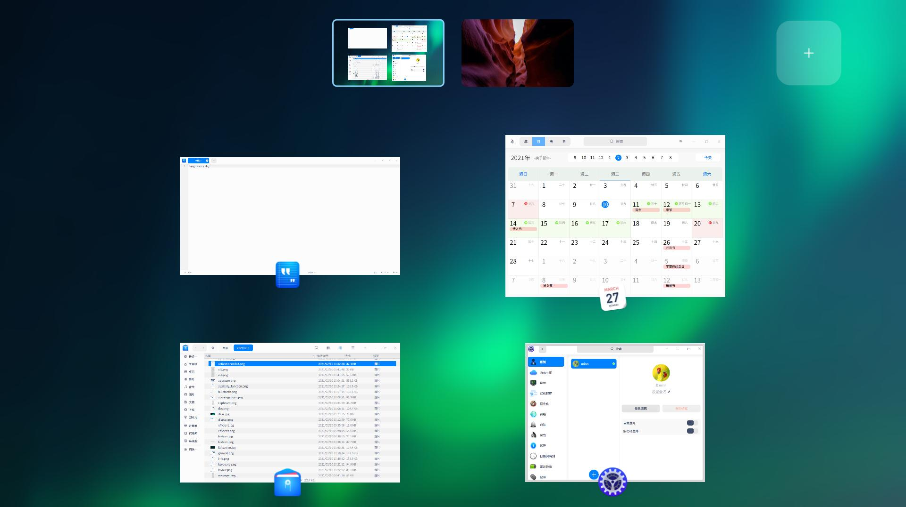

> 說明：在觸控板上，四指/五指向上移動顯示多任務視圖，緊接着向下移動隱藏多任務視圖， 對應 **Super** + **S** 快捷鍵。

### 打開工作區

工作區可以將桌面窗口進行分組管理，通過劃分工作區可以增大工作區域。

按下 **Super** + **S** 組合鍵，或單擊  打開工作區界面。

### 添加工作區

在工作區界面，您可以通過以下方式添加工作區。

- 單擊工作區上方的 。

- 按下键盘上的 。

>  說明：當您添加的工作區達到最大值時，將不能再添加工作區。
>

### 切換工作區

在桌面和工作區界面，您可以通過以下方式切換工作區。

- 在桌面，按下鍵盤上的 **Super** +  /  組合鍵，切換到上一個/下一個工作區。
- 在桌面，按下鍵盤上的 **Super** + 數字鍵（1-4），切換到指定順序的工作區。
- 在工作區界面，滾動鼠標滾輪切換到上一個/下一個工作區。
- 在工作區界面，單擊對應的預覽窗口或按下數字鍵（1-4）來切換到指定工作區。

> 說明：在觸控板上，四指/五指向左或向右移動，切換到前一個或後一個工作區，對應 **Super** + **Left** 或 **Super** + **Right** 快捷鍵。

### 刪除工作區

執行刪除工作區操作後，該工作區中的所有窗口將自動轉移到相鄰的工作區中顯示，當桌面環境中只存在一個工作區時，將不能執行刪除工作區的操作。

- 在工作區界面，單擊 刪除工作區。
- 在工作區界面，按下鍵盤上的 **Alt** + **-**。
- 鼠標將某個工作區向上拖拽出螢幕，刪除當前工作區。

### 退出工作區

當您在工作區界面完成相關操作後，可以通過以下方式退出工作區。

- 按下鍵盤上的 **Esc** 鍵。
- 在當前工作區界面區域內的任意位置單擊一下鼠標。
- 再次按下鍵盤上的 **Super** + **S** 組合鍵。

### 查看所有窗口

您可以通過以下方式查看工作區的所有窗口。

- 按下鍵盤上的 **Super** + **A** 組合鍵，查看所有工作區的窗口。
- 按下鍵盤上的 **Super** + **W** 組合鍵，查看當前工作區的窗口。

### 移動工作區窗口

您可以通過以下方式移動窗口到另一工作區。

- 在工作區界面，拖拽窗口到指定的工作區。
- 在桌面，按下鍵盤上的 **Super** + **Shift** +  /  鍵，將當前窗口移動到上一個/下一個工作區。
- 在桌面，按下鍵盤上的 **Super** + **Shift** + 數字鍵，將當前窗口移動到對應順序的工作區。
- 在桌面，按下鍵盤上的 **AIt** + **Space** 或在窗口標題欄上單擊右鍵，打開窗口快捷操作菜單，選擇 **總在可見工作區**，或 **移至右邊的工作區** 或 **移至左邊的工作區**，將當前窗口移動到指定的工作區。

>  竅門：在窗口快捷操作菜單，您還可以選擇最小化、最大化、移動窗口、改變窗口大小、置頂窗口和關閉窗口。

### 切換桌面窗口

您可以通過以下方式切換當前工作區的桌面窗口。

#### 快速切換相鄰窗口

同時按下 **AIt** + **Tab** 並快速釋放，快速切換當前窗口和相鄰程序窗口；

同時按下 **AIt** + **Shift** + **Tab** 並快速釋放，快速反向切換當前窗口和相鄰程序窗口。

#### 快速切換同類型窗口

同時按下 **AIt** +  並快速釋放，快速切換當前同類型窗口；

同時按下 **AIt** + **Shift** +  並快速釋放，快速反向切換當前同類型窗口。

#### 切換所有窗口

按住鍵盤上的 **AIt** 鍵不放，連續按下鍵盤上的 **Tab** 鍵，所有窗口依次向右切換顯示；

按住鍵盤上的 **AIt** + **Shift** 鍵不放，連續按下鍵盤上的 **Tab** 鍵，所有窗口依次向左切換顯示。

#### 切換同類型窗口

按住鍵盤上的 **AIt** 鍵不放，連續按下鍵盤上的  鍵，當前同類型窗口依次向右切換顯示；

按住鍵盤上的 **AIt** + **Shift** 鍵不放，連續按下鍵盤上的  鍵，窗口依次向左切換顯示。

### 窗口分屏

使用窗口分屏，讓多個應用和任務窗口同時顯示在大螢幕上，既充分利用了大螢幕的空間，又能減少在多個應用窗口之間頻繁切換，提高您的工作學習效率。

1. 拖拽窗口到螢幕左側或者右側，當光標接觸到螢幕左右側邊緣時，會出現一個透明的白色背景，釋放窗口，窗口將吸附在螢幕左半邊或右半邊；

>  窍门：要取消窗口分屏，只需将窗口从屏幕一侧拖离即可。
>
> 
