# 桌面環境|dde|

## 概述

deepin 作業系統是一款美觀易用、安全可靠的國產桌面作業系統。deepin 預裝了檔案管理器、應用商店、系統監視器等一系列原生應用程式。它既能讓您體驗到豐富多彩的娛樂生活，也可以滿足您的日常工作需要。隨著功能的不斷升級和完善，deepin 作業系統已成為中國最受歡迎的桌面作業系統之一。

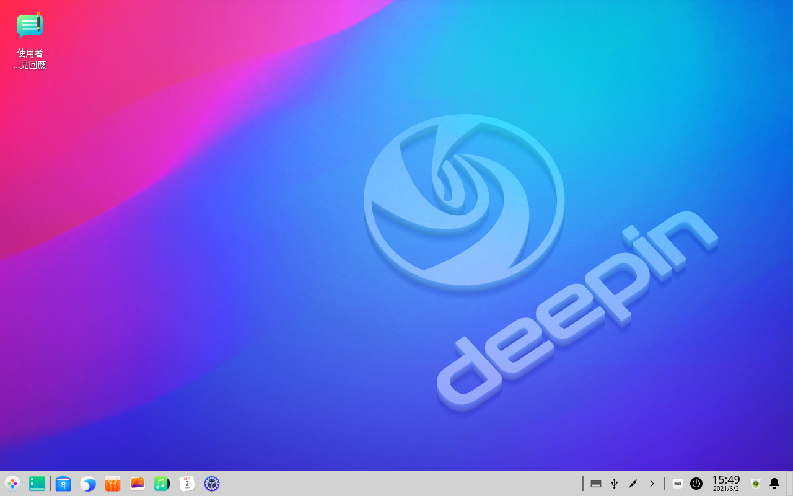

### 系統簡介

初次進入 deepin 會自動打開歡迎程式。您可以觀看影片了解系統功能，選擇桌面模式和圖示主題，進一步了解該系統。

成功登入系統後，即可體驗 deepin 桌面環境。桌面環境主要由桌面、任務欄、啟動器、控制中心和視窗管理器等組成，是您使用該作業系統的基礎。

## 桌面

桌面是您登入後看到的主螢幕區域。在桌面上，您可以新增文件/資料夾、排列文件、開啓終端機、設定桌布和螢幕保護程式等，還可以透過 [設定捷徑](#設定捷徑) 向桌面添加應用程式的捷徑。

>說明：在觸控板上，四指/五指向下移動顯示桌面，緊接著向上移動隱藏桌面， 對應 **Super** + **D** 快捷鍵。

### 新增資料夾/文件

在桌面建立資料夾或文件，也可以對文件進行一般操作，和在檔案管理器中一樣。

   - 在桌面上，單擊滑鼠右鍵，單擊 **新增資料夾**，輸入新增資料夾的名稱。
   - 在桌面上，單擊滑鼠右鍵，單擊 **新增文件**，選擇新增文件的類型，輸入新增文件的名稱。

在桌面文件或資料夾上，單擊滑鼠右鍵，您可以使用檔案管理器的相關功能：

| 功能        | 說明                                                     |
| ----------- | -------------------------------------------------------- |
| 用其他程式開啟   | 選定系統預設打開方式，也可以選擇其他關聯應用程式來打開。 |
| 剪下        | 移動文件或資料夾。                                       |
| 複製        | 複製文件或資料夾。                                       |
| 重新命名    | 重新命名文件或資料夾。                                   |
| 刪除        | 刪除文件或資料夾。                                       |
| 建立連結    | 建立一個捷徑。                                           |
| 標籤內容   | 添加標籤內容，以對文件或資料夾進行標籤化管理。           |
| 壓縮/解壓 | 壓縮文件或資料夾，或對壓縮文件進行解壓。                 |
| 屬性        | 查看文件或資料夾的基本訊息、共享方式及其權限。           |

> 說明：
>   - 當使用觸控螢幕電腦時，在觸摸屏上長按1秒再抬起即打開目前物件的右鍵選單。
>   - 在觸控板上，二指單擊，顯示右鍵選單。
>   - 在鍵盤上按下 **Alt** + **M** 快捷鍵，打開右鍵選單。

### 設定排列方式

您可以對桌面上的圖示按照需要進行排序。

1. 在桌面上，單擊滑鼠右鍵。
2. 單擊 **排列順序**，您可以：

   - 單擊 **檔案名稱**，將按文件的名稱順序顯示。
   - 單擊 **修改時間**，文件將按最近一次的修改日期順序顯示。
   - 單擊 **大小**，將按文件的大小順序顯示。
   - 單擊 **類型**，將按文件的類型順序顯示。

> 竅門：您也可以勾選 **自動排列**，桌面圖示將從上往下，從左往右按照目前排序規則排列，有圖示被刪除時後面的圖示會自動向前填充。

### 調整圖示大小

1. 在桌面上，單擊滑鼠右鍵。
2. 單擊 **圖示大小**。
3. 選擇一個合適的圖示大小。

> 竅門：您也可以用 **Ctrl** + //滑鼠滾動來調整桌面和啟動器中的圖示大小。

### 設定顯示器

從這裡快速進入控制中心設定顯示器的縮放比例、解析度和亮度等。

1. 在桌面上，單擊滑鼠右鍵。
2. 單擊 **顯示設定**，快速進入控制中心的顯示設定介面。

> 說明：關於顯示的設定，具體操作請參閱 [螢幕設定](#螢幕設定)。

### 更改桌布

您可以選擇一些精美、時尚的桌布來美化桌面，讓您的電腦顯示與眾不同。

1. 在桌面上，單擊滑鼠右鍵。
2. 單擊 **桌布與螢幕保護程式**，在桌面底部預覽所有桌布。
3. 選擇某一桌布後，桌布就會在桌面和鎖定螢幕中生效。
4. 您可以單擊 **僅桌面** 和 **僅鎖定畫面** 來控制桌布的生效範圍。

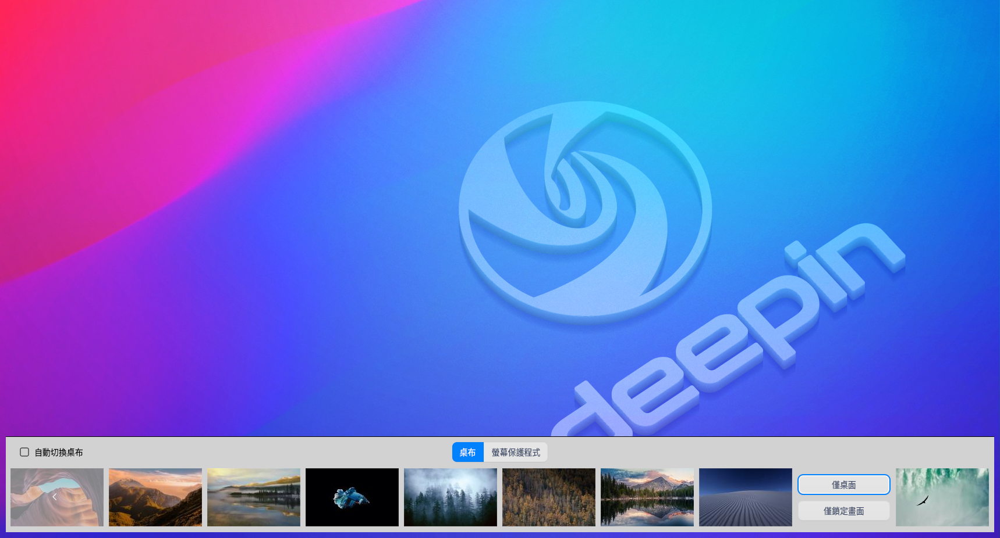

&nbsp;&nbsp;&nbsp;&nbsp;&nbsp;&nbsp;&nbsp;&nbsp;&nbsp;&nbsp;&nbsp;&nbsp;&nbsp;
>  竅門：
>   - 勾選 **自動切換桌布**，設定自動切換桌布的時間間隔。您還可以設定在「登入時」和「喚醒時」自動更換桌布。
>   - 您還可以在圖片檢視器中設定您喜歡的圖片為桌面桌布。

### 設定螢幕保護程式

螢幕保護程式原本是為了保護映像管，現在一般用來防範他人偷窺您電腦上的一些隱私。

1. 在桌面上，單擊滑鼠右鍵。
2. 單擊 **桌布與螢幕保護程式**，單擊 **螢幕保護程式**，在桌面底部預覽所有螢幕保護程式。
3. 選擇其中一個螢幕保護程式，單擊 **套用**，在上方選擇 **等待時間**。
4. 您可以勾選 **喚醒時需要密碼**，以便更好地保護您的隱私。
5. 待電腦等待指定時間後，將啟動您選擇的螢幕保護程式。

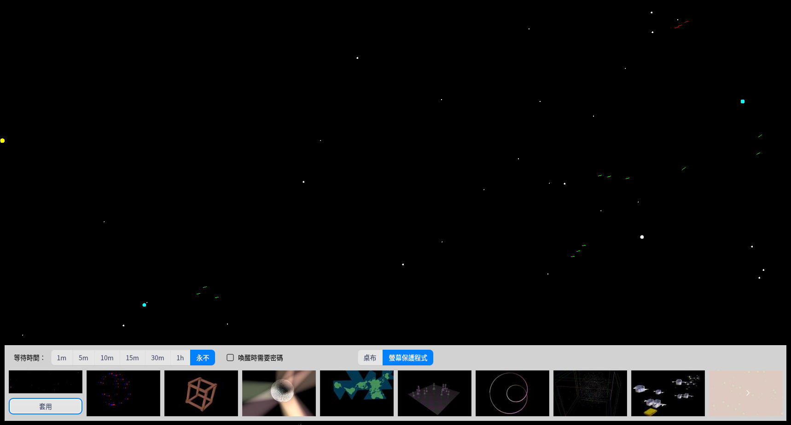

### 剪貼簿

剪貼簿展示目前使用者登入系統後複製和剪下的所有文字、圖片和文件。使用剪貼簿可以快速複製其中的某項內容。註銷或關機後，剪貼簿會自動清空。

1. 使用快捷鍵 **Ctrl** + **Alt** + **V** 喚出剪貼簿。
2. 雙擊剪貼簿內的某一區塊，會快速複製目前內容，且目前區塊會被移動到剪貼簿頂部。
3. 選擇目標位置貼上。
4. 滑鼠移入剪貼簿的某一區塊，單擊上方的，刪除目前內容；單擊頂部的 **全部清除**，清空剪貼簿。

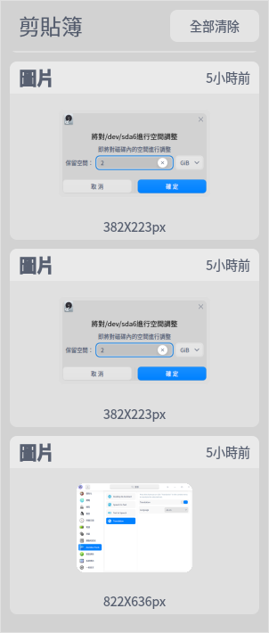

> 說明：當使用觸控螢幕電腦時，在觸摸屏上從螢幕左側邊緣劃入超過任務欄高度，喚出剪貼簿。

## 任務欄

任務欄是指位於桌面底部的長條，主要由啟動器、應用程式圖示、託盤區、系統附加元件等組成。在任務欄，您可以打開啟動器、顯示桌面、進入工作區，對其上的應用程式進行打開、建立、關閉、強制離開等操作，還可以設定輸入法，調節音量，連接Wi-Fi，查看日曆，進入關機介面等。

### 認識任務欄圖示

任務欄圖示包括啟動器圖示、應用程式圖示、系統託盤區圖示、系統附加元件圖示等。

| 圖示 | 說明 |
| ---- | ---- |
|                    | 啟動器 - 點擊查看所有已安裝的應用。 |
|  | 顯示桌面。                                          |
|  | 多任務檢視 - 點擊顯示工作區。 |
|       | 檔案管理器 - 點擊查看磁碟中的文件、資料夾。 |
|  | 瀏覽器 - 點擊打開網頁。    |
|         | 應用商店 - 搜尋安裝應用軟體。                         |
|                  | 相簿 - 匯入並管理照片。 |
|               | 音樂 - 播放本機音樂。                               |
|               | 日曆 - 查看日期、建立日程。                         |
|                 | 控制中心 - 點擊進入系統設定。     |
|               | 通知中心 - 顯示所有系統和應用程式的通知。             |
| | 螢幕鍵盤 - 點擊使用虛擬鍵盤。 |
|                    | 電源 - 點擊進入關機介面。            |
|                       | 回收桶。 |

&nbsp;&nbsp;&nbsp;&nbsp;&nbsp;&nbsp;&nbsp;&nbsp;&nbsp;&nbsp;&nbsp;&nbsp;&nbsp;
> 竅門：在高效模式下，單擊任務欄右側可顯示桌面。將滑鼠指標移到任務欄上已打開視窗的圖示時，會顯示相應的預覽視窗。

### 切換顯示模式

任務欄提供兩種顯示模式：時尚模式和高效模式，顯示不同的圖示大小和應用程式視窗啟動效果。

&nbsp;&nbsp;&nbsp;&nbsp;&nbsp;&nbsp;&nbsp;&nbsp;&nbsp;&nbsp;&nbsp;&nbsp;&nbsp;

您可以透過以下操作來切換顯示模式：

1. 右鍵單擊任務欄。
2. 在 **模式** 子選單中選擇一種顯示模式。

### 設定任務欄位置

您可以將任務欄放置在桌面的任意方向。

1. 右鍵單擊任務欄。
2. 在 **位置** 子選單中選擇一個方向。

### 調整任務欄高度 

滑鼠拖動任務欄邊緣，改變任務欄高度。

### 顯示/隱藏任務欄

任務欄可以隱藏，以便最大程度的擴展桌面的可操作區域。

1. 右鍵單擊任務欄。
2. 在 **狀態** 子選單中您可以：
   - 選擇 **永遠顯示**，任務欄將會一直顯示在桌面上。
   - 選擇 **永遠隱藏**，任務欄將會隱藏起來，只有在滑鼠移至任務欄區域時才會顯示。
   - 選擇 **智慧隱藏**，當占用任務欄區域時，任務欄自動隱藏。

> 說明：當使用觸控螢幕電腦時，在觸摸屏上：
> 當任務欄設定為「智慧隱藏」或「一直隱藏」時，如果任務欄在底部，在螢幕邊緣從下往上划入，喚出任務欄；如果任務欄在頂部，在螢幕邊緣從上往下划入，喚出任務欄。

### 顯示/隱藏附加元件

1. 右鍵單擊任務欄。
2. 在 **附加元件** 子選單中勾選或取消勾選 **回收桶、電源、顯示桌面、螢幕鍵盤、通知中心、多任務檢視、日期時間**，可以設定這些附加元件在任務欄上的顯示和隱藏效果。

### 查看通知

當有系統或應用程式通知時，會在桌面上方彈出通知消息。若有按鈕，單擊按鈕執行對應操作；若無按鈕，單擊關閉此消息。

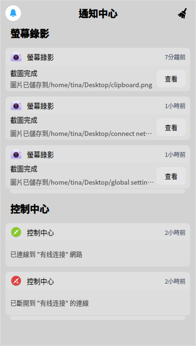

&nbsp;&nbsp;&nbsp;&nbsp;&nbsp;&nbsp;&nbsp;&nbsp;&nbsp;&nbsp;&nbsp;&nbsp;&nbsp;

此外，還可以單擊任務欄上的 ， 打開通知中心，查看所有通知。

> 說明：當使用觸控螢幕電腦時，手指從螢幕右側邊緣劃入超過任務欄高度，喚出通知中心。

### 查看日期時間

   - 滑鼠指標懸停在任務欄的時間上，查看目前日期、星期和時間。
   - 單擊時間，打開日曆。

### 進入關機介面

您可以單擊任務欄上的  進入關機介面，也可以在啟動器的小視窗模式中單擊 。

| 功能                                                         | 說明                                                         |
| ------------------------------------------------------------ | ------------------------------------------------------------ |
| 關機        | 關閉電腦。                                                   |
| 重新啟動        | 關機後再次重新執行您的電腦。                                 |
| 待機          | 整個系統將處於低能耗運轉的狀態。                             |
| 休眠                | 識別到有swap分區的機器休眠掛載到硬碟。沒有swap分區不顯示此項。 |
| 鎖定                | 鎖定電腦，或按下鍵盤上的 **Super** + **L** 組合鍵鎖定。      |
| 切換使用者 | 選擇另一個使用者帳戶登入。                                   |
| 登出            | 清除目前登入使用者的訊息。                                   |
| 啟動系統監視器 | 快速啟動系統監視器。                                         |

&nbsp;&nbsp;&nbsp;&nbsp;&nbsp;&nbsp;&nbsp;&nbsp;&nbsp;&nbsp;&nbsp;&nbsp;&nbsp;

> 說明：當系統存在多個帳戶時才顯示 **切換使用者**。

### 回收桶

電腦中臨時被刪除的所有文件您都可以在回收桶中找到，回收桶中的文件可以被還原或清除。

#### 還原文件

臨時被刪除的文件，可以在回收桶進行還原，或使用快捷鍵 **Ctrl** + **Z** 還原剛刪除的文件。

1. 在回收桶中，選擇要復原的文件。
2. 單擊滑鼠右鍵，選擇 **還原**。
3. 還原文件到原來的儲存路徑下。

> 注意：如果原來所在的資料夾已經刪除，還原文件時會自動新增資料夾。

#### 刪除文件

回收桶中可以單獨清除某一文件。

1. 在回收桶中，選擇要刪除的文件。
2. 單擊滑鼠右鍵，選擇 **刪除**，即可刪除回收桶的文件。

#### 清空回收桶

在回收桶中，單擊 **清空**，將徹底刪除回收桶的所有內容。

## 啟動器

啟動器  幫助您管理系統中已安裝的所有應用程式，在啟動器中使用分類導航或搜尋功能可以快速找到您需要的應用程式。

> 說明：arm架構系統暫不支援啟動選單設定。

您可以進入啟動器查看新安裝的應用程式。新安裝應用程式的旁邊會出現一個小藍點提示。

> 說明：在觸控板上，四指/五指單擊，顯示/隱藏啟動器， 對應 **Super** 快捷鍵。

### 切換模式

啟動器有全螢幕和小視窗兩種模式。單擊啟動器介面右上角的圖示來切換模式。

兩種模式均支援搜尋應用程式、建立捷徑等操作。

小視窗模式還支援快速打開檔案管理器、控制中心和進入關機介面等功能。

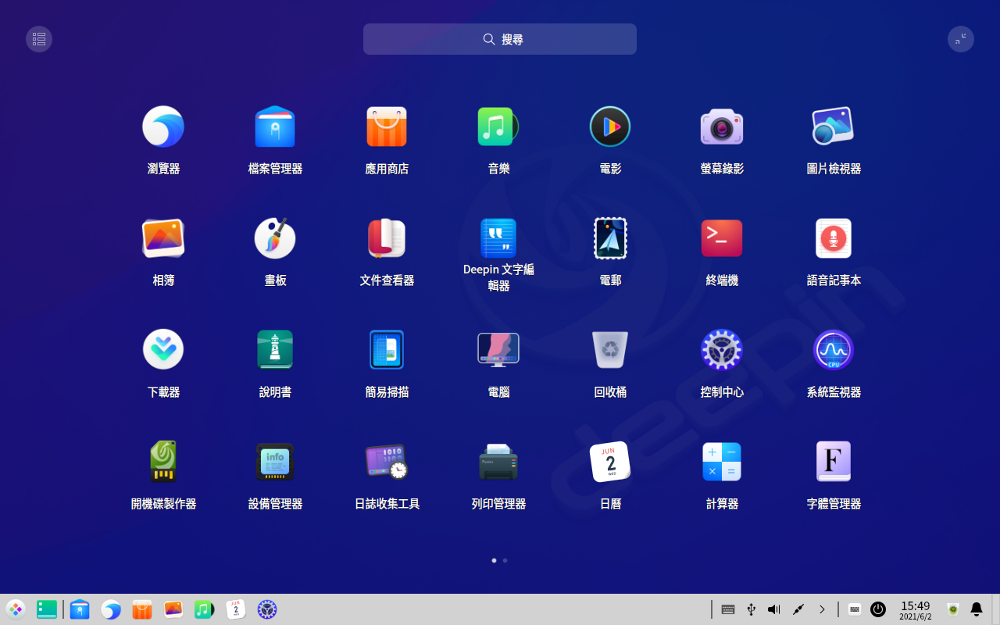
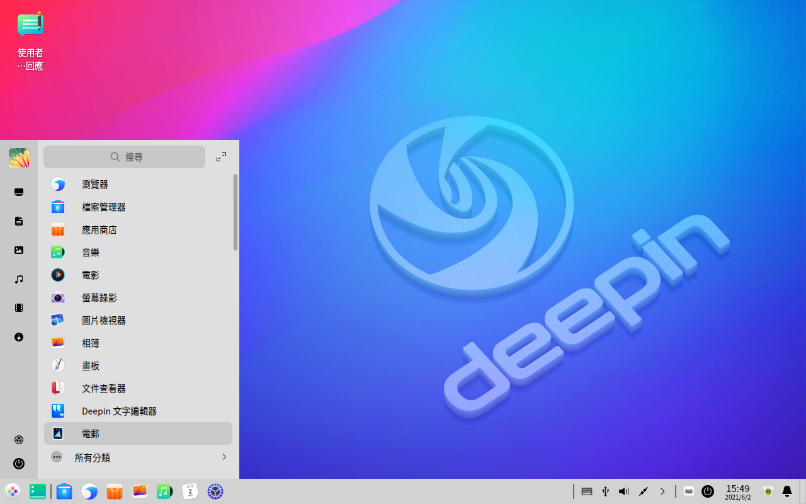

### 排列應用程式

在全螢幕模式下，系統預設按照安裝時間排列所有應用程式。

   - 將滑鼠懸停在應用程式圖示上，按住滑鼠左鍵不放，將應用程式圖示拖曳到指定的位置自由排列。
   - 單擊啟動器介面左上角分類圖示  進行排列。

&nbsp;&nbsp;&nbsp;&nbsp;&nbsp;&nbsp;&nbsp;&nbsp;&nbsp;&nbsp;&nbsp;&nbsp;&nbsp;

在小視窗模式下，預設按照使用頻率排列應用程式。

### 尋找應用程式

在啟動器中，您可以滾動滑鼠滾輪或切換分類導航尋找應用程式。

如果知道應用程式名稱，直接在搜尋框中輸入關鍵字，快速定位到需要的應用程式。

### 設定捷徑

捷徑提供了一種簡單快捷地啟動應用程式的方法。

#### 建立捷徑

將應用程式發送到桌面或任務欄上，方便您的後續操作。

在啟動器中，右鍵單擊應用程式圖示，您可以：

   - 單擊 **建立桌面捷徑**，在桌面建立捷徑。

   - 單擊 **釘選到Dock**，將應用程式固定到任務欄。

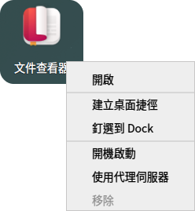

> 說明：您還可以從啟動器拖曳應用程式圖示到任務欄上放置。但是當應用程式處於執行狀態時您將無法拖曳固定，此時您可以右鍵單擊任務欄上的應用程式圖示，選擇 **駐停** 將應用程式固定到任務欄，以便下次使用時從任務欄上快速開啟。

#### 刪除捷徑

您既可以在桌面直接刪除應用程式的捷徑，也可以在任務欄和啟動器中刪除。

**從任務欄上刪除**

   - 在任務欄上，按住滑鼠左鍵不放，將應用程式圖示拖曳到任務欄以外的區域移除捷徑。
   - 當應用程式處於執行狀態時您將無法拖曳移除，此時可以右鍵單擊任務欄上的應用程式圖示，選擇 **解除駐停** 將應用程式從任務欄上移除。

**從啟動器中刪除**

在啟動器中，右鍵單擊應用程式圖示，您可以：

   - 單擊 **移除桌面捷徑**，刪除桌面捷徑。
   - 單擊 **移除Dock捷徑**，將固定到任務欄上的應用程式移除。

> 說明：以上操作，只會刪除應用程式的捷徑，而不會移除應用程式。

### 安裝應用程式

如果啟動器中沒有您需要的應用，可以在應用商店一鍵下載安裝。

### 執行應用程式

對於已經建立了桌面捷徑或固定到任務欄上的應用程式，您可以透過以下途徑來打開應用程式。

   - 雙擊桌面圖示，或右鍵單擊桌面圖示選擇 **開啟**。
   - 直接單擊任務欄上的應用程式圖示，或右鍵單擊任務欄上的應用程式圖示選擇 **開放**。

在啟動器中，直接單擊應用程式圖示打開，或右鍵單擊應用程式圖示選擇 **開啟**。

> 竅門：對於經常使用的應用程式，您可以在啟動器中，右鍵單擊應用程式圖示選擇 **開機啟動**。

### 移除應用程式

對於不再使用的應用程式，您可以選擇將其移除，以節省硬碟空間。

1. 在啟動器中，右鍵單擊應用程式圖示。
2. 單擊 **移除**。

> 竅門：在 **時尚模式** 下，您還可以在啟動器的全螢幕模式介面，按住滑鼠左鍵不放，將應用程式圖示拖曳到任務欄的  中移除應用程式。

## 控制中心

Deepin 作業系統透過控制中心來管理系統的基本設定，包括帳戶管理、網路設定、日期和時間、個性化設定、螢幕設定、系統升級等。當您進入桌面環境後，單擊任務欄上的  即可打開控制中心視窗。

### 首頁介紹

控制中心首頁主要展示各個設定模組，方便日常查看和快速設定。

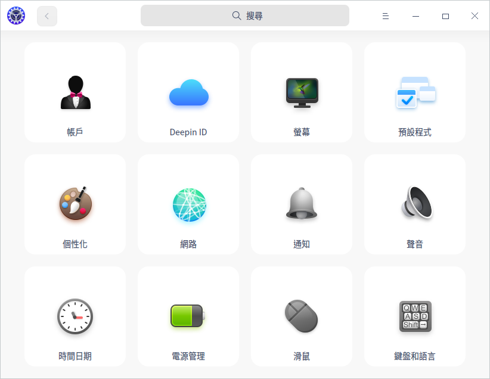

&nbsp;&nbsp;&nbsp;&nbsp;&nbsp;&nbsp;&nbsp;&nbsp;&nbsp;&nbsp;&nbsp;&nbsp;&nbsp;

打開控制中心的某一設定模組後，可以透過左側導航欄快速切換到另一設定模組。

#### 標題欄

標題欄包含返回按鈕、搜尋框、主選單及視窗按鈕。

   - 返回按鈕：若要返回首頁，單擊 。
   - 搜尋框：輸入關鍵字，單擊鍵盤上 **Enter** 鍵，搜尋相應設定。
   - 主選單：單擊  進入主選單。在主選單中，您可以設定視窗主題、查看版本或離開控制中心。

### 帳戶設定

在安裝系統時您已經建立了一個帳戶。在這裡，您可以修改帳戶設定或建立一個新帳戶。

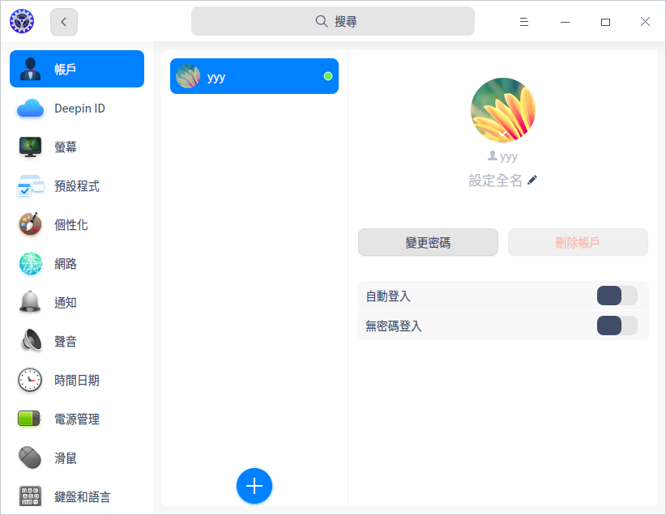

#### 建立新帳戶

1. 在控制中心首頁，單擊 。
2. 單擊。
3. 輸入使用者名稱、密碼和確認密碼。
4. 單擊 **建立**。
5. 在授權對話框輸入目前帳戶的密碼，新帳戶就會添加到帳戶列表中。

#### 更改頭像

1. 在控制中心首頁，單擊 。
2. 單擊列表中的帳戶。
3. 單擊帳戶，選擇一個頭像或添加本機頭像，頭像就取代完成了。

#### 設定全名

帳戶全名會顯示在帳戶列表和系統登入介面，可根據需要設定。

1. 在控制中心首頁，單擊 。
2. 單擊列表中的帳戶。
3. 單擊 **設定全名** 後的 ，輸入帳戶全名。

#### 修改密碼

1. 在控制中心首頁，單擊 。
2. 單擊目前帳戶。
3. 單擊 **變更密碼**，進入變更密碼頁面。
4. 輸入目前密碼、新的密碼和確認密碼，單擊 **儲存**。

#### 自動登入

開啟 **自動登入** 後， 下次啟動系統時（重新啟動、開機）可直接進入桌面。在鎖定螢幕和登出後再次登入需要密碼。

1. 在控制中心首頁，單擊。
2. 單擊目前帳戶。
3. 打開 **自動登入** 開關，開啟自動登入功能。

#### 無密碼登入

開啟 **無密碼登入** 後，下次登入系統時（重新啟動、開機和在登出後再次登入），不需要密碼，單擊  即可登入系統。

1. 在控制中心首頁，單擊。
2. 單擊目前帳戶。
3. 打開 **無密碼登入** 開關，開啟後可以不用輸入密碼登入系統。

>  竅門： 
>
>   - 若 **無密碼登入** 和 **自動登入** 同時打開，下次啟動系統（重新啟動、開機）則直接進入桌面。
>   - 預設勾選 **清空鑰匙環密碼**，在無密碼登入情況下登入已經記錄密碼的程式時不需要再次輸入系統登入密碼，反之則每次都需要輸入系統登入密碼。

#### 設定指紋ID

指紋ID可以用來登入系統、解鎖螢幕、特殊操作授權。當需要輸入帳戶密碼時，請掃描您的指紋。

1. 在控制中心首頁，單擊 。
2. 單擊目前帳戶。
3. 單擊 **新增指紋** 。
4. 使用指紋裝置輸入指紋。
5. 待指紋添加成功之後單擊 **完成**。

> 說明：您可以添加多個指紋ID；也可以刪除一個個指紋密碼。

#### 刪除帳戶

1. 在控制中心首頁，單擊 。
2. 單擊其他未登入的帳號。
3. 單擊 **刪除帳戶** 。
4. 在彈出的確認介面中單擊 **刪除**。

> 注意: 已登入的帳戶無法被刪除。

### Deepin ID

登入 Deepin ID 後，您可以使用雲同步、應用商店、郵箱用戶端、瀏覽器等相關雲服務功能。

首次登入時，會彈出 **隱私政策** 視窗，如果使用者需要開啟雲服務等功能，可以勾選 **我已閱讀並同意《隱私政策》**，單擊 **確認**開啟雲服務等功能。

開啟雲同步功能可自動同步各種系統配置到雲端，如網路、聲音、滑鼠、更新、任務欄、啟動器、桌布、主題、電源等。若想在另一台電腦上使用相同的系統配置，只需登入此網路帳戶，即可一鍵同步以上配置到該裝置。

> 竅門： 當 **自動同步** 開啟時，可以選擇同步項；關閉時，全部不能同步。

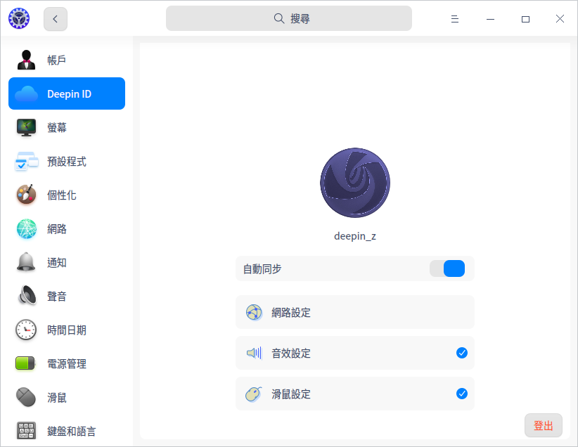

### 螢幕設定

設定顯示器的解析度、螢幕亮度、螢幕方向以及縮放倍數，讓您的電腦顯示到達最佳狀態。

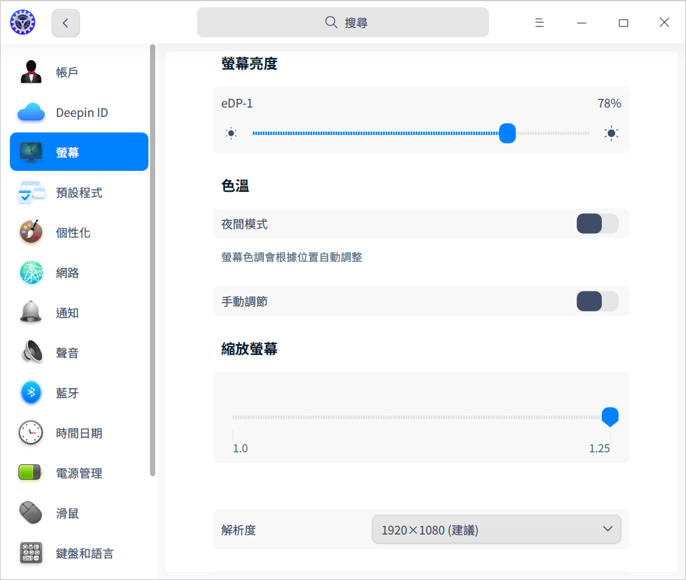

#### 單屏設定

##### 調節螢幕亮度

1. 在控制中心首頁，單擊 。
2. 在 **螢幕亮度** 區域，透過拖動滑塊調節螢幕亮度。

##### 調節色溫

1. 在控制中心首頁，單擊 。
2. 設定 **色溫**：
   - 開啟 **夜間模式** 開關，進入護眼模式，自動調節螢幕色溫。
   - 開啟 **手動調節** 開關，手動調節螢幕色溫。

>  說明：**夜間模式** 開啟時，如單擊開啟 **手動調節** 開關將自動關閉 **夜間模式**；反之亦然。

##### 設定螢幕縮放

當桌面和視窗顯示過大或過小時，您可能需要調節螢幕縮放，以便正常顯示。

1. 在控制中心首頁，單擊 。
2. 在 **縮放螢幕** 區域，可以設定 **解析度**、**刷新率** 和 **方向**。
3. 登出後重新登入以便縮放生效。

>  說明：
>   - 當檢測到螢幕為高分屏時，會自動調整縮放倍數。
>   - 有的應用程式可能不支援螢幕縮放，可以在啟動器中右鍵單擊該應用程式，選擇 **停用畫面縮放**，以獲得更好的顯示效果。

#### 多屏設定

多顯示器模式讓您的視野無限延伸！使用VGA、HDMI、EDP等線纜將您的電腦和另一台顯示器、投影機等連接起來，同時在多個螢幕顯示您電腦上的內容。

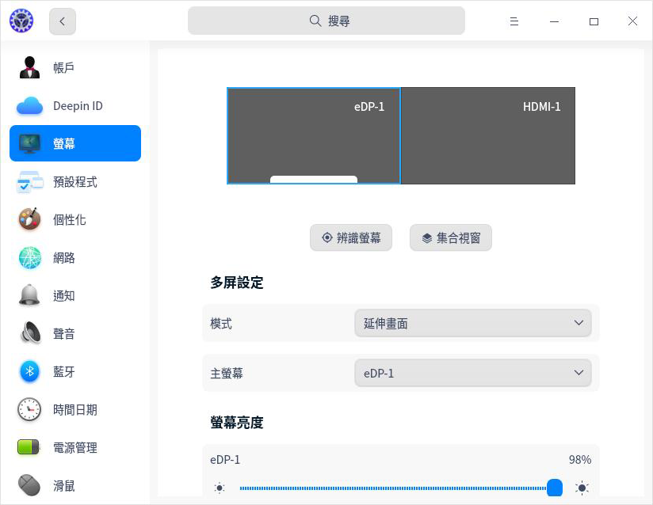

1. 在控制中心首頁，單擊 。
2. 在 **多屏設定** 區域，模式下拉框中選擇螢幕顯示樣式。

   - **同步顯示畫面**將主屏的顯示內容同步顯示到其他螢幕。
   - **延伸畫面** 將主屏的顯示內容延伸到其他螢幕，擴大桌面區域。
   - **僅 xxx 屏** 只在某個螢幕顯示內容。

在多顯示器環境下，按下 **Super** + **P**調出多顯示器模式的OSD。

詳細操作方法如下。

1. 按住 **Super** 不放，再按下 **P** 或滑鼠單擊來進行模式選擇。
2. 鬆開按鍵，確認選擇，模式生效。

> 說明：當多屏顯示時，副屏也支援桌面圖示顯示、右鍵選單操作等功能。

### 觸控屏設定

當接入觸控屏時，您可以設定所在螢幕，並對其進行調整。

1. 在控制中心首頁，單擊 ，對螢幕進行設定。
2. 單擊 **確定**。

### 預設程式

當安裝有多個功能相似的應用程式時，可以選擇其中的一個應用程式作為對應文件類型的預設啟動程式。

#### 設定預設程式

1. 右鍵單擊文件，選擇 **用其他程式開啟** > **選擇預設開啟程式**。
2. 選擇一個應用程式，自動勾選 **作為預設值**，單擊 **確定**。
3. 該應用程式將自動添加到控制中心的預設程式列表。

#### 更改預設程式

1. 在控制中心首頁，單擊 。
2. 選擇一個文件類型進入預設程式列表。
3. 在列表中選擇另一個應用程式。

#### 添加預設程式

1. 在控制中心首頁，單擊 。
2. 選擇文件類型進入預設程式列表。
3. 單擊列表下的，選擇desktop文件（一般在/usr/share/applications)，或特定的二進位制文件。
4. 該程式將添加到列表，並自動設定為預設程式。

#### 刪除預設程式

在預設程式列表中，您只能刪除自己添加的應用程式，不能刪除系統已經安裝的應用程式。要刪除系統已經安裝的應用程式，只能移除應用程式。移除後該應用程式將自動從預設程式列表中刪除。

可用以下方法刪除自己添加的預設程式。

1. 在控制中心首頁，單擊 。
2. 選擇文件類型進入預設程式列表。
3. 單擊程式後面的，刪除預設程式。

### 個性化設定

在這裡，您可以設定透明度、調節啟動器（小視窗模式）、任務欄的透明度；還可以設定系統主題、強調色、字型、視窗特效等，改變桌面和視窗的外觀，設定成您喜歡的顯示風格。

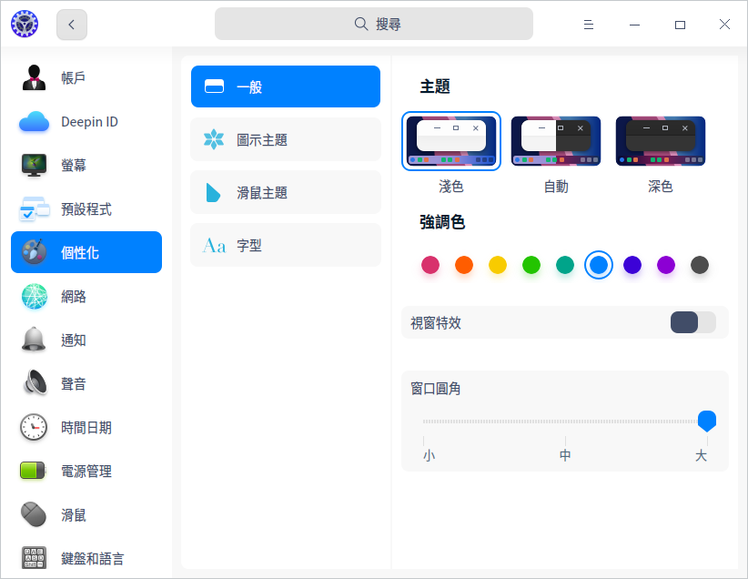

#### 設定視窗主題

1. 在控制中心首頁，單擊 。
2. 單擊 **一般**，選擇一種視窗主題。
3. 該主題即為系統視窗主題。

> 說明：自動主題表示根據目前時區的時間，根據日出日落的時間自動更換視窗主題。日出後是淺色，日落後是深色。

#### 更改強調色

強調色是指選中某一選項時的強調色。

1. 在控制中心首頁，單擊 。
2. 單擊 **一般**。
3. 單擊 **強調色** 下的一種顏色，可即時查看該顏色效果。

#### 開啟視窗特效

開啟視窗特效可以讓桌面和視窗更美觀精緻。

1. 在控制中心首頁，單擊 。
2. 單擊 **一般**。
3. 打開 **視窗特效** 開關，開啟視窗特效。

> 說明：開啟視窗特效後，可以設定最小化時效果為縮放或魔燈，調節窗口圓角的大小。

#### 調節透明度

您可以設定任務欄和啟動器（小視窗模式）的透明度。滑塊越靠左越透明，越靠右越不透明。

1. 在控制中心首頁，單擊 。
2. 單擊 **一般**，開啟 **視窗特效**。
3. 單擊 **透明度調節**，可即時體驗透明效果。

#### 設定圖示主題

1. 在控制中心首頁，單擊 。
2. 單擊 **圖示主題**，選擇一款圖示樣式。

#### 設定滑鼠主題

1. 在控制中心首頁，單擊 。
2. 單擊 **滑鼠主題**，選擇一款滑鼠樣式。

#### 更改系統字型

1. 在控制中心首頁，單擊 。
2. 單擊 **字型**，進入設定字型介面。
3. 設定系統文字大小和字型。

### 網路設定

登入系統後，您需要連接網路，才能接收郵件、瀏覽新聞、下載文件、聊天、網路上購物等。

> 竅門：您可以單擊任務欄託盤區的網路圖示，查看目前網路狀態。

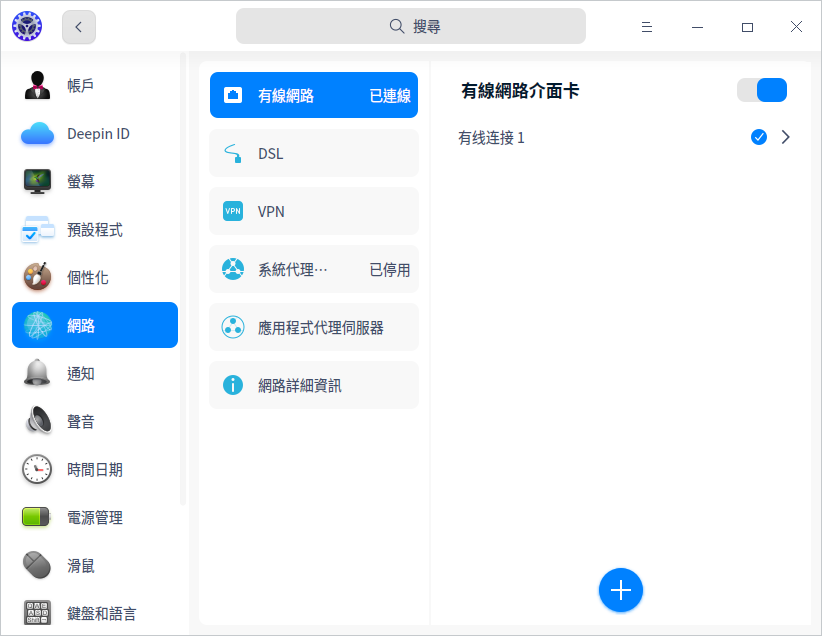

#### 有線網路

有線網路安全快速穩定，是最常見的網路連接方式。當您設定好路由器後，把網路線兩端分別插入電腦和路由器，即可連接有線網路。

1. 將網路線插入電腦上的網路插孔。
2. 將網路線的另一端插入路由器或網路埠。
3. 在控制中心首頁，單擊  。
4. 單擊 **有線網路**，進入有線網路設定介面。
5. 打開 **有線網路介面卡**，開啟有線網路連接功能。
6. 當網路連線成功後，桌面右上角將彈出 **已連接到有線連接網路** 的提示訊息。

您還可以在有線網路的設定介面，編輯或建立有線網路設定。

#### 無線網路

無線網路幫助您擺脫線纜的束縛，上網形式更加靈活，支援更多裝置使用。

##### 連接無線網路

1. 在控制中心首頁，單擊  。
2. 單擊 **無線網路**，進入無線網路設定介面。
3. 打開 **無線網路介面卡**，開啟無線網路連接功能。
4. 電腦會自動搜尋並顯示附近可用的無線網路。
5. 選擇需要連接的無線網路。

   - 如果該網路是開放的，將自動連接到此網路。
   - 如果該網路是加密的，請根據提示輸入密碼，單擊 **連線**，然後將自動完成連接。

##### 連接隱藏網路

為了防止他人掃描到自己的無線網路，進而破解無線網路密碼連接您的網路，您可以在路由器設定介面隱藏無線網路。設定後，您需要手動連接隱藏網路才能上網。

1. 在控制中心首頁，單擊  。
2. 單擊 **無線網路**，進入無線網路設定介面。
3. 單擊 **連線到隱藏網路**。
4. 輸入網路名稱、SSID和其他必填選項。
5. 單擊 **儲存** 。

#### 無線熱點

無線熱點將電腦連接的網路訊號轉換為無線網路熱點，以供一定距離內的其他裝置無線上網。要開啟無線熱點，電腦必須連接到網路並裝有無線網卡。

1. 在控制中心首頁，單擊  。
2. 單擊 **個人熱點**。
3. 打開 **熱點** 開關，設定熱點訊息。
4. 單擊 **儲存**。

#### 移動網路

當您處於一個沒有網路訊號的地方時，可以使用無線上網卡來上網。在有電話訊號覆蓋的任何地方，無線上網卡透過運營商的移動資料網路接入寬頻服務。

1. 將移動網卡插入電腦上的USB介面中。
2. 電腦將根據移動網卡和運營商訊息，自動適配並自動連接網路。
3. 在控制中心首頁，單擊  。
4. 單擊 **移動網路**，查看詳細設定訊息。

#### 撥號網路

撥號上網（DSL）是指透過本機電話撥號連接到網路的連接方式。配置好數據機，把電話線插入電腦的網路介面，建立寬頻撥號連接，輸入運營商提供的使用者名稱和密碼，即可撥號連接到Internet上。

##### 建立撥號連接

1. 在控制中心首頁，單擊  。
2. 單擊 **DSL**，單擊 。
3. 輸入寬頻名稱、服務、密碼。
4. 單擊 **儲存**，系統自動建立寬頻連接並嘗試連接。

#### VPN

VPN即虛擬專用網路，其主要功能是在公用網路上建立專用網路，進行加密通訊。無論您是在外地出差還是在家中辦公，只要能上網就能利用VPN訪問企業的內網資源。您還可以使用VPN加速瀏覽其他國家的網站。

1. 在控制中心首頁，單擊  。
2. 單擊 **VPN**，選擇  或 。
3. 選擇VPN類型，並輸入名稱、閘道器、使用者名称、密碼等訊息。（匯入VPN會自動填充訊息）
4. 單擊 **儲存**，系統自動嘗試連接VPN網路。
5. 您可以將VPN設定匯出，備用或共享給其他使用者。

> 說明：打開 **僅套用到相對應來源** 開關，可以不將VPN設定為預設路由，只在特定的網路資源上生效。

#### 系統代理伺服器

1. 在控制中心首頁，單擊  。
2. 單擊 **系統代理伺服器**，進入系統代理伺服器介面。
3. 開啟系統代理，在代理類型後的下拉框中選擇 **手動** 或 **自動**。

   - 單擊 **手動**，輸入代理伺服器的地址和連線埠訊息。
   - 單擊 **自動**，輸入URL，系統將自動配置代理伺服器的訊息。

4. 單擊 **儲存**。

#### 應用程式代理伺服器

1. 在控制中心首頁，單擊  。
2. 單擊 **應用程式代理伺服器**。
3. 設定應用程式代理伺服器參數。
4. 單擊 **儲存**。

> 說明：應用程式代理伺服器設定成功後，打開啟動器，右鍵單擊應用程式圖示，可以選擇 **使用代理伺服器**。

#### 網路詳細資訊

在網路詳細資訊介面，您可以查看MAC、IP位址、閘道器和其他網路訊息。

1. 在控制中心首頁，單擊 。
2. 單擊 **網路詳細資訊**，進入網路詳細資訊介面。
3. 查看目前有線網路或無線網路的訊息。

### 通知設定

設定系統通知的勿擾模式，開啟或關閉某些應用程式的通知顯示。

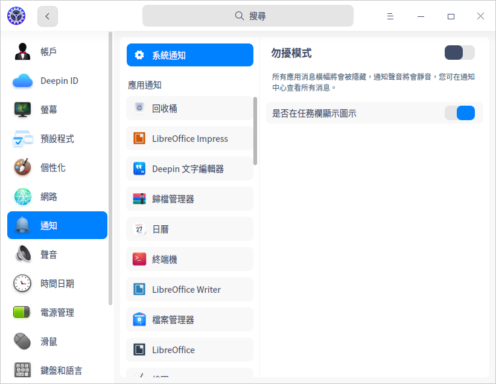

#### 設定系統通知

設定系統通知的勿擾模式及是否在任務欄顯示通知圖示。

1. 在控制中心首頁，單擊 。

2. 單擊 **系統通知**，進入系統通知介面。

   - 開啟或關閉勿擾模式。
     當開啟勿擾模式後，可以設定勿擾模式的開啟時間、結束時間；也可以設定 **在螢幕鎖定螢幕時** 顯示通知。開啟勿擾模式可以使所有通知靜音，但您可以在通知中心查看所有消息。
   - 設定 **是否在任務欄顯示圖示**。

#### 設定應用程式通知

應用程式可以自設定個性化的通知顯示。

1. 在控制中心首頁，單擊 。
2. 在應用程式通知區域選擇開啟一個應用程式，在開啟的應用程式介面中，您可以勾選：
   - 通知時提示聲音
   - 鎖定螢幕時顯示消息
   - 在通知中心顯示
   - 顯示消息預覽

### 聲音設定

設定輸出和輸入設備（如設定揚聲器和麥克風），讓您聽得更舒適，錄音更清晰。

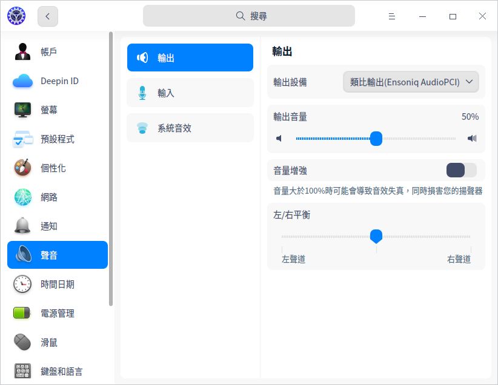

#### 輸出裝置

1. 在控制中心首頁，單擊 。
2. 單擊 **輸出**，進入輸出設備設定介面，您可以：
   - 在輸出裝置後面的下拉框中選擇輸出裝置類型。
   - 透過拖曳滑塊調節輸出裝置音量和左/右聲道平衡。
   - 打開 **音量增強**，音量的可調節區間由0~100%轉變為0~150%。

#### 輸入裝置

1. 在控制中心首頁，單擊 。
2. 單擊 **輸入**，進入輸入設備設定介面，您可以：
   - 在輸入裝置後面的下拉框中選擇輸入裝置類型。
   - 透過拖曳滑塊調節輸入裝置音量。
   - 打開 **啟用** 開關，還可以設定 **噪音抑制** 功能。

> 竅門：通常，需要調大輸入音量，確保能夠聽到聲源的聲音，但是音量不宜過大，因為這會導致聲音失真。可以對著輸入設備以正常說話的音量講話，並觀察回饋音量的變化，變化較明顯，則說明輸入音量合適。

#### 系統音效

1. 在控制中心首頁，單擊 。
2. 單擊 **系統音效**，勾選選項，開啟某一事件發生時的聲音效果。

> 竅門：您可以單擊試聽音效。

### 藍牙設定

藍牙能夠實現短距離的無線通信。透過藍牙與附近的其它藍牙裝置連接，而無需網路或連接線。常見的藍牙裝置包括：藍牙鍵盤、藍牙滑鼠、藍牙耳機、藍牙音響等。

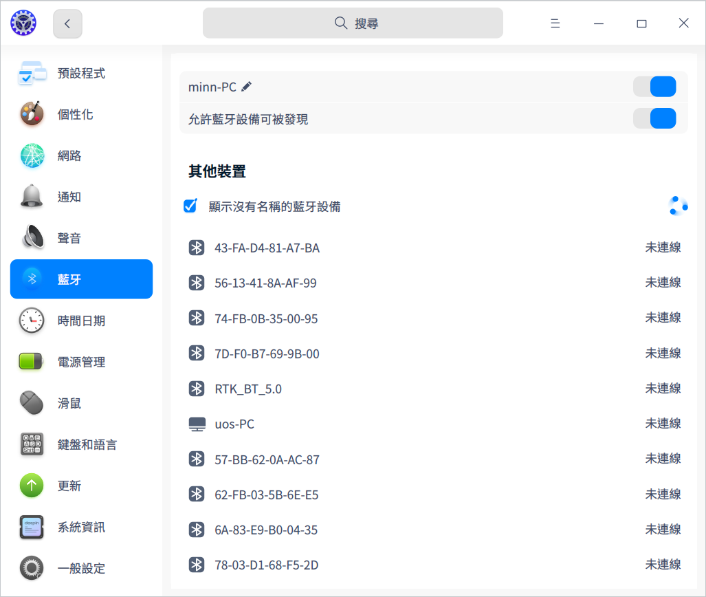

&nbsp;&nbsp;&nbsp;&nbsp;&nbsp;&nbsp;&nbsp;&nbsp;&nbsp;&nbsp;&nbsp;&nbsp;&nbsp;

> 說明：大多數筆記型電腦都配備有藍牙模組，您只需開啟藍牙開關；而大部分桌上型電腦都沒有配備藍牙，您可以購買藍牙適配器，插入到電腦的USB埠中使用。

#### 修改藍牙名稱

1. 在控制中心首頁，單擊 。
2. 單擊藍牙名稱旁的 ，輸入本機新的藍牙名稱。

> 說明：修改藍牙名稱後，將自動對外廣播藍牙裝置的新名字，需要其他裝置重新進行搜尋。

#### 連接藍牙設備

1. 在控制中心首頁，單擊 。
2. 開啟 **藍牙**，系統將自動掃描附近的藍牙設備，並顯示在 **其他設備** 列表。
3. 單擊想連接的藍牙設備，在該設備上輸入藍牙配對碼（若需要），配對成功後將自動連接。
4. 連線成功後，藍牙設備會添加到 **我的設備** 列表中。
5. 在列表中單擊該設備，您可以 **斷開連線**，或修改設備名稱。

#### 使用藍牙傳送/接收文件

Deepin  PC 與非 Deepin  PC 或者 Deepin  PC與行動裝置（手機/平板）之間通過藍牙裝置傳送/接收文件。

前提條件：發送端藍牙裝置與接收端藍牙裝置已配對並連接成功。

**使用Deepin PC端藍牙傳送文件**

場景：發送端（Deepin PC）透過藍牙向接收端（非Deepin PC/手機/平板）傳送文件。

1. 在控制中心首頁，單擊 。
2. 開啟 **藍牙**，系統將自動掃描附近的藍牙裝置。
3. 進入“我的裝置”選擇已配對連接的藍牙裝置，單擊進入詳情，單擊 **發送文件** 按鈕（僅PC/手機/平板的藍牙裝置有該按鈕），在彈出的檔案管理器視窗中選擇要發送的文件，單擊 **打開**。
4. 在彈出的選擇接收此文件的藍牙裝置視窗中，單擊 **發送**，發送傳輸文件請求。

**使用手機端藍牙傳送文件**

場景：發送端（以安卓手機為例）透過藍牙向接收端（Deepin PC）傳送文件。

1. 開啟 **藍牙**，系統將自動掃描附近的藍牙裝置。
2. 選擇已配對並連線成功的藍牙裝置。
3. 在手機中選擇文件，單擊 **發送**，透過藍牙發送文件。

**使用藍牙接收文件**

發送端發送文件後，接收端彈出提示視窗，使用者可以單擊 **接受** 或 **拒絕** 文件。

   - 如果接收端藍牙裝置同意接收，則發送端開始傳輸文件並顯示發送文件視窗；文件傳輸完成後，接收端會彈出提示訊息，使用者可以查看接收成功的文件。
   - 如果接收端為如下情況，發送端部分文件傳輸失敗，會顯示在傳輸失敗列表。
      + 接收端藍牙裝置選擇拒絕，則結束傳輸，顯示傳輸失敗。
      + 接收端藍牙裝置超時未操作或超出傳輸範圍，則顯示傳輸失敗（藍牙裝置連線失敗）。
      + 接收端即不單擊接收也不單擊拒絕，預設1分鐘後則結束傳輸，顯示傳輸失敗。

### 時間日期

正確選擇您所在的時區，一般即可顯示正確的日期和時間。您也可以手動修改時間和日期。

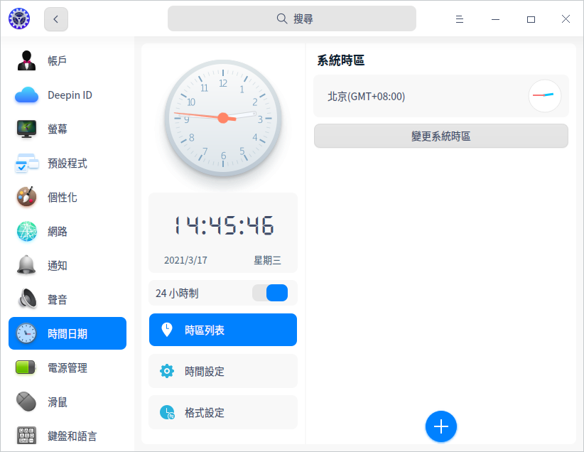

#### 變更系統時區

在您安裝系統時，已選擇了系統時區。若要修改系統時區，請按如下步驟設定。

1. 在控制中心首頁，單擊 。
2. 單擊 **時區列表**。
3. 單擊 **變更系統時區**， 透過搜尋或單擊地圖選擇時區。
4. 單擊 **確認**。

#### 新增時區

您可以同時使用多個時區，以便查看另一時區的時間。

1. 在控制中心首頁，單擊 。
2. 單擊 **時區列表**。
3. 單擊 ，透過搜尋或單擊地圖選擇時區。
4. 單擊 **新增**。

#### 刪除時區

1. 在控制中心首頁，單擊 。
2. 單擊 **時區列表**。
3. 單擊時區列表後面的 **編輯**。
4. 單擊 ，刪除已添加的時區。

#### 修改時間和日期

預設情況下，系統透過網路自動同步該時區的本機時間和日期。您也可以手動修改時間和日期。手動設定後，自動同步功能會被關閉。

1. 在控制中心首頁，單擊 。
2. 單擊 **時間設定** 。
   - 開啟或關閉自動同步配置。
   - 設定正確的時間和日期。
3. 單擊 **確認**。

> 說明：您還可以打開 **自動同步配置**，設定伺服器同步參數。

#### 設定時間日期格式

支援即時設定時間日期的格式。

1. 在控制中心首頁，單擊 。
2. 單擊 **格式設定**，可以設定星期、長短日期、長短時間等格式。

### 電源管理

對系統電源進行一些設定，讓筆記本電池更耐用，讓系統更安全。

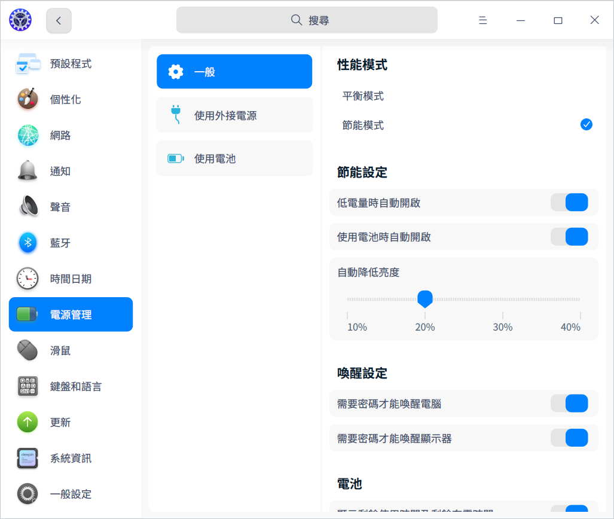

&nbsp;&nbsp;&nbsp;&nbsp;&nbsp;&nbsp;&nbsp;&nbsp;&nbsp;&nbsp;&nbsp;&nbsp;&nbsp;

#### 性能模式

1. 在控制中心首頁，單擊 。
2. 單擊 **一般**。
3. 選擇**平衡模式**、**節能模式** 或 **高性能模式**。

>說明：只有當裝置支援「高性能模式」時才可看到該選項。

#### 節能設定

為降低筆記本的耗電量，您可以設定節能模式。

1. 在控制中心首頁，單擊 。

2. 單擊 **一般**。

3. 在 **節能設定** 區域，可執行如下操作：
   - 打開 **低電量時自動開啟** 開關（僅適用於筆記型電腦）。
   - 打開 **使用電池時自動開啟** 開關（僅適用於筆記型電腦）。
   - 拖動亮度條滑塊，調節亮度。

> 說明：當 **使用電池時自動開啟** 開關關閉時，系統直接進入 **平衡模式**。

#### 喚醒設定

1. 在控制中心首頁，單擊 。
2. 單擊 **一般**。
3. 打開 **需要密碼才能喚醒電腦**/**需要密碼才能喚醒顯示器**，開啟相應安全設定。

#### 電池

1. 在控制中心首頁，單擊 。
2. 單擊 **一般**。
   - 打開 **顯示剩餘使用時間及剩餘充電時間**，顯示剩餘電量及剩餘充電時間（將滑鼠指針置於托盤區電源圖示上）。
   - 關閉 **顯示剩餘使用時間及剩餘充電時間**，則僅顯示剩餘電量（將滑鼠指針置於托盤區電源圖示上）。

> 說明：僅筆記本電腦支援設定電量顯示模式。

#### 設定顯示器關閉時間

1. 在控制中心首頁，單擊 。
2. 單擊 **使用外接電源** 或 **使用電池**。
3. 選擇關閉顯示器的時間。

> 說明：筆記型電腦使用者可以在 **使用外接電源** 和 **使用電池** 下對同一設定項分別設定不同的時間。

#### 設定電腦待機時間

1. 在控制中心首頁，單擊 。
2. 單擊 **使用外接電源** 或 **使用電池**。
3. 選擇電腦開始待機的時間。

> 竅門：筆記型電腦使用者還可以開啟 **筆記本合蓋時待機**，以便在使用電源時合蓋待機。

#### 設定自動鎖定螢幕時間

1. 在控制中心首頁，單擊 。
2. 單擊 **使用外接電源** 或 **使用電池**。
3. 選擇自動鎖定螢幕的時間。

#### 設定合蓋顯示狀態

1. 在控制中心首頁，單擊 。
2. 單擊 **使用外接電源** 或 **使用電池**。
3. 設定 **筆記本合蓋時** 為 **待機**、**休眠**、**關閉顯示器** 或 **無任何操作**。

> 說明：僅筆記本電腦支援設定合蓋顯示狀態。

#### 設定電源按鈕

1. 在控制中心首頁，單擊 。
2. 單擊 **使用外接電源** 或 **使用電池**。
3. 選擇電源按鈕 **關機**、**待機**、**休眠**、**關閉顯示器** 或 **無任何操作**，更改電源設定。

更改設定後會即時生效，同時系統通知使用者已修改電源設定。

#### 設定低電量通知

1. 在控制中心首頁，單擊 。
2. 單擊 **使用電池**。
3. 打開 **低電量通知**，當電池剩餘電量低於設定的閾值（例如，20%）時，系統會發出低電量通知。

使用者可以通過拖拽低電量滑塊，調節低電量的閾值。

> 說明：僅筆記本電腦支援設定低電量通知。

#### 設定自動待機電量

1. 在控制中心首頁，單擊 。
2. 單擊 **使用電池**。
3. 通過拖拽自動待機電量滑塊，調節待機電量的閾值。

> 說明：僅筆記本電腦支援設定自動待機電量。

### 滑鼠和觸控板

滑鼠和觸控板是電腦的常用輸入設備。使用滑鼠，可以使操作更加簡便快捷。對於筆記型電腦使用者，當沒有滑鼠時，也可以使用觸控板代替滑鼠進行操作。

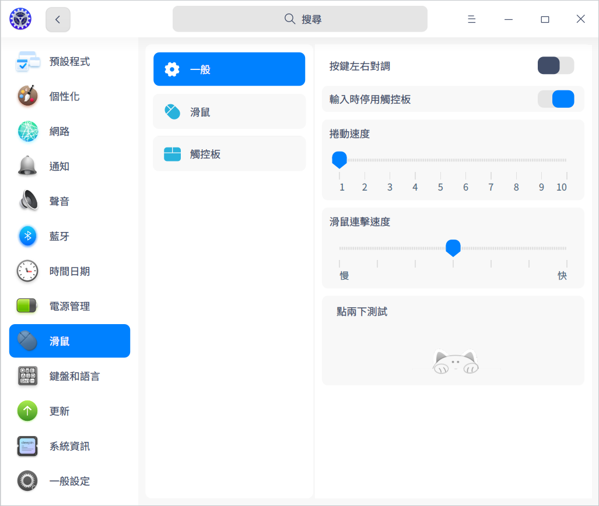

#### 一般設定

1. 在控制中心首頁，單擊 。
2. 單擊 **一般**。
3. 開啟 **按鍵左右對調**，調節滑鼠和觸控板的**捲動速度**，**連擊速度**。

> 說明：開啟 **按鍵左右對調** 模式後，滑鼠和觸控板的左右鍵功能互換。

#### 滑鼠設定

插入或連接滑鼠後，在控制中心進行相關設定，讓其更符合您的使用習慣。

> 說明：當沒有觸控板時，不會顯示 **插入滑鼠時停用觸控板**。

1. 在控制中心首頁，單擊 。
2. 單擊 **滑鼠**。
3. 調節 **遊標移動速度**， 控制滑鼠移動時遊標移動的速度。
4. 單擊 **反向捲動**、**滑鼠加速度** 開關，開啟相應功能。

> 說明：
>
>   - 開啟滑鼠加速度可提高遊標的精確度，滑鼠遊標在螢幕上的移動距離會根據移動速度的加快而增加。可以根據使用情況開啟或關閉。
>   - 反向捲動開啟後，滑鼠滾輪向下滾動，內容會向下滾動；滑鼠滾輪向上滾動，內容會向上滾動。

#### 觸控板設定

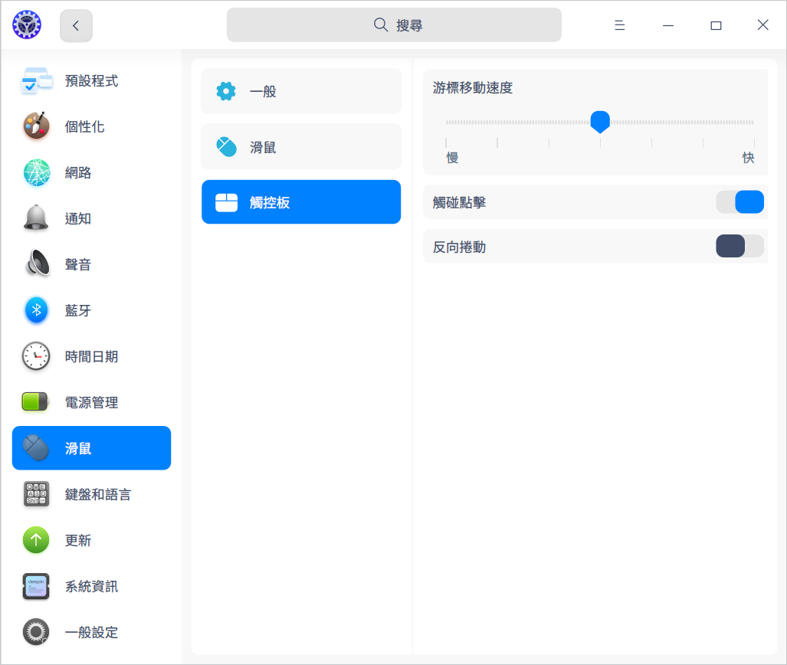

&nbsp;&nbsp;&nbsp;&nbsp;&nbsp;&nbsp;&nbsp;&nbsp;&nbsp;&nbsp;&nbsp;&nbsp;&nbsp;

若您使用的是筆記型電腦，可以在 **滑鼠** > **一般** 介面開啟 **輸入時停用觸控板**，在 **滑鼠** > **滑鼠** 介面開啟 **插入滑鼠時停用觸控板**，以避免誤觸觸控板。

您還可以調節觸控板的 **遊標移動速度**，控制手指移動時遊標移動的速度；開啟反向捲動，變更滾動方向。

#### 小紅點設定

小紅點是一種主要應用於筆記型電腦的定點裝置，可用來控制指標的移動。

1. 在控制中心首頁，單擊 。
2. 單擊 **小紅點**。
3. 調節 **滑鼠遊標移動速度**， 控制使用小紅點時遊標移動的速度。

### 數位板

數位板，又名繪圖板、繪畫板、手繪板等，主要用作繪畫創作，是電腦的一種輸入裝置。
連線到電腦後，您可以設定數位板的壓感力度，即筆尖和橡皮擦的壓力感應值。

> 說明：連接數位板裝置後，該模組才會顯示。

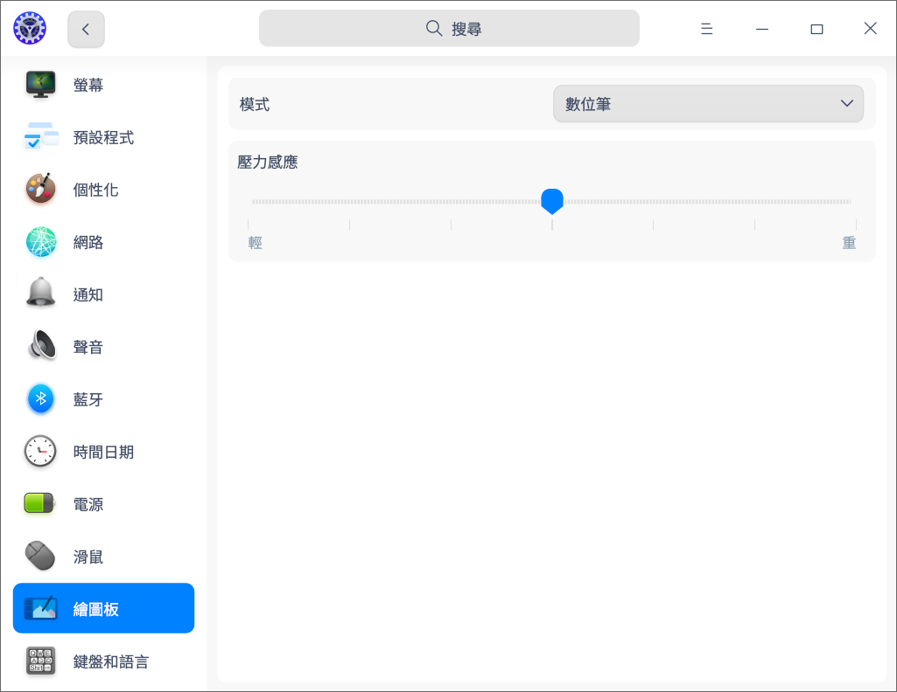

&nbsp;&nbsp;&nbsp;&nbsp;&nbsp;&nbsp;&nbsp;&nbsp;&nbsp;&nbsp;&nbsp;&nbsp;&nbsp;

1. 在控制中心首頁，單擊 。
2. 選擇 **筆** 模式。
3. 調節 **壓力感應** 。

### 鍵盤和語言

在此模組，您可以設定鍵盤屬性，以便符合您的輸入習慣，還可以根據國家和語言調整鍵盤佈局，設定系統語言，以及自訂快捷鍵。

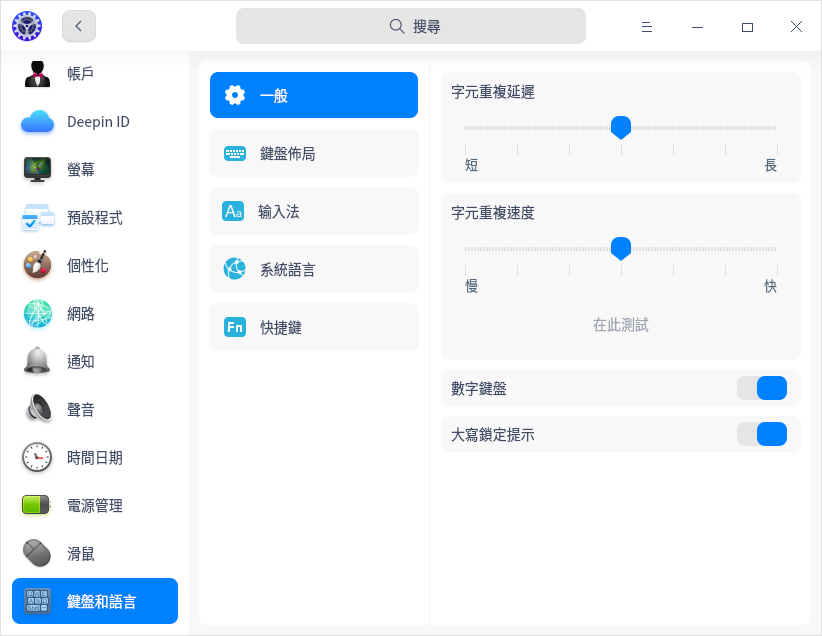

#### 鍵盤屬性

1. 在控制中心首頁，單擊 。
2. 單擊 **一般**。
3. 調節 **字元重複延遲**/**字元重複速度**。
4. 單擊 **在此測試**，按下鍵盤上的任意字元不鬆開，查看調節效果。
5. 單擊 **數字鍵盤**/**大寫鎖定提示** 開關，開啟相應功能。

#### 鍵盤佈局

設定鍵盤佈局，可以為目前語言自訂鍵盤。按下鍵盤上的按鍵時，鍵盤佈局會控制哪些字元顯示在螢幕上。更改鍵盤佈局後，螢幕上的字元可能與鍵盤按鍵上的字元不相符。 

一般在安裝系統時，就已經設定了鍵盤佈局，您也可以添加其他的鍵盤佈局。

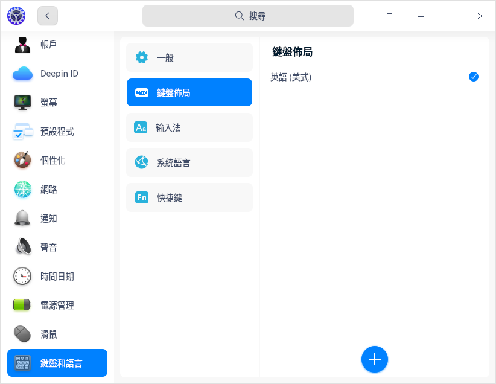

##### 添加鍵盤佈局

1. 在控制中心首頁，單擊 。
2. 單擊 **鍵盤佈局**，進入鍵盤佈局介面。
3. 單擊 ，單擊某一鍵盤佈局即可添加到列表。

##### 刪除鍵盤佈局

1. 在控制中心首頁，單擊 。
2. 單擊 **鍵盤佈局**，進入鍵盤佈局介面。
3. 單擊 **鍵盤佈局** 後的 **編輯**。
4. 單擊 ，刪除該鍵盤佈局。

#### 輸入法

對輸入法進行設定，可以為系統提供更豐富的輸入方式。在輸入法介面可以添加多個輸入法，設定輸入法切換的快捷鍵，以便使用者選擇符合個人打字習慣的輸入方式。

##### 添加輸入法

您可以添加多個輸入法到輸入法管理列表，以便切換輸入法。

1. 在控制中心首頁，單擊 。
2. 單擊 **輸入法**，進入輸入法介面。
3. 單擊 **添加** 按鈕  ，您可以：
   - 單擊 **前往商店下載**，在應用商店下載輸入法，當該輸入法下載完成後，系統自動設定其為預設輸入法。
   - 進入添加輸入法介面，選擇輸入法，將該輸入法添加到輸入法管理列表。

>說明： 在輸入法管理介面，單擊 **編輯**，單擊 **刪除** 按鈕即可移除某輸入法。對於被移除（非移除）的輸入法，可以在添加輸入法介面進行添加。

##### 設定輸入法排序

1. 在控制中心首頁，單擊 。
2. 單擊 **輸入法**，進入輸入法介面。
3. 在輸入法管理區域，上下拖動輸入法或單擊輸入法後面的上下箭頭，進行排序。

##### 設定輸入法配置項

1. 在控制中心首頁，單擊 。
2. 單擊 **輸入法**，進入輸入法介面。
3. 在輸入法管理區域，單擊輸入法後面的 **設定** 按鈕 ，設定輸入法自身的配置項。

##### 設定輸入法切換快捷鍵

1. 在控制中心首頁，單擊 。
2. 單擊 **輸入法**，進入輸入法介面。
3. 在快捷鍵區域，切換輸入法下列框中，選擇輸入法切換的快捷鍵。

>說明：輸入法切換快捷鍵設定成功後，當切換輸入法，自動切換為輸入法對應的鍵盤布局。選擇 **切換方式**， 讓切換後的鍵盤布局應用於整個系統或目前應用。

#### 系統語言

系統語言預設為您安裝系統時所選擇的語言，可以隨時更改。

##### 添加系統語言

您可以添加多個語言到系統語言列表，以便切換系統語言。

1. 在控制中心首頁，單擊 。
2. 單擊 **系統語言**，進入系統語言介面。
3. 單擊  進入語言列表。
4. 選擇語言，該語言將自動添加到系統語言列表。

##### 設定系統語言

1. 在控制中心首頁，單擊 。
2. 單擊 **系統語言**，進入系統語言介面。
3. 選擇要切換的語言，系統將自動開始安裝語言包。
4. 語言包安裝完成後，需要登出後重新登入，以便讓設定生效。

> 注意：更改系統語言後，鍵盤佈局可能也會發生改變。重新登入時，請確保使用正確的鍵盤佈局來輸入密碼。

#### 快捷鍵
快捷鍵列表顯示了系統所有的快捷鍵。您可以在這裡查看、修改和自訂快捷鍵。

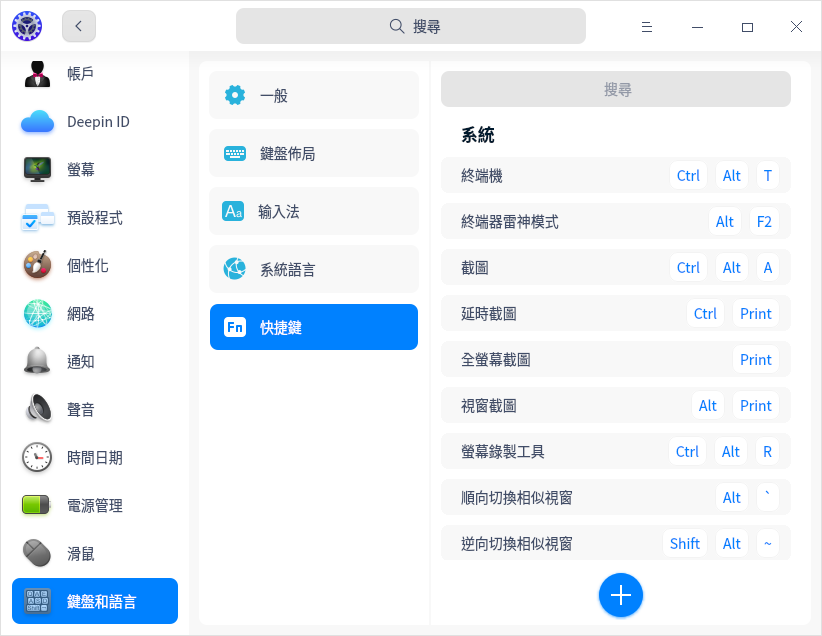

##### 查看快捷鍵

1. 在控制中心首頁，單擊 。
2. 單擊 **快捷鍵**，進入快捷鍵設定介面。
3. 搜尋或查看預設的系統快捷鍵、視窗快捷鍵和工作區快捷鍵。

##### 修改快捷鍵

1. 在控制中心首頁，單擊 。
2. 單擊 **快捷鍵**，進入快捷鍵設定介面。
3. 單擊需要修改的快捷鍵。
4. 使用鍵盤輸入新的快捷鍵。

> 竅門：若要禁用快捷鍵，請按下鍵盤上的 **Backspace**  鍵。若要取消修改快捷鍵，按下 **Esc** 鍵，或單擊下方的 **還原至預設值** 按鈕。

##### 自訂快捷鍵

您可以為常用的應用程式自訂一個快捷鍵。

1. 在控制中心首頁，單擊 。
2. 單擊 **快捷鍵**。
3. 單擊 ，進入新增自訂快捷鍵介面。
4. 輸入快捷鍵名稱、命令和快捷鍵。
5. 單擊 **加入**。
6. 添加成功後，單擊 **自訂快捷鍵** 後的 **編輯**。
7. 單擊某個快捷鍵後 ， 刪除自訂的快捷鍵。

> 竅門：若要修改快捷鍵，單擊輸入新的快捷鍵即可。若要修改自訂快捷鍵的名稱和命令，單擊 **自訂快捷鍵** 後的 **編輯** ，單擊快捷鍵名稱後的 ，進入修改頁面。

### 檢查更新

當系統存在更新時會在控制中心首頁提示，單擊  進入 **檢查更新** 頁面，單擊 **檢查更新**，檢查完畢後，即可開始下載和安裝更新。您還可以設定自動下載更新。

> 竅門：如果不需要檢查更新，不需要收到系統或應用程式的更新提示，可在 **更新設定** 中關閉 **檢查更新** 或 **更新通知**。

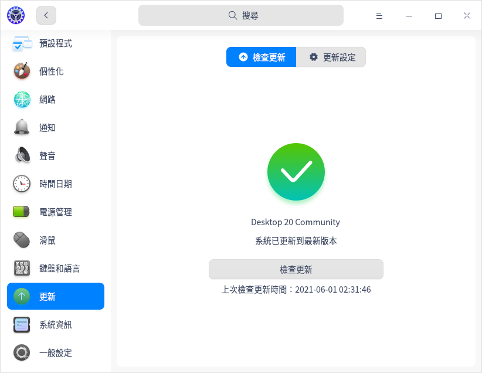

#### 更新和升級

1. 在控制中心首頁，單擊 。
2. 單擊 **檢查更新**，進入檢查系統更新介面。

   - 如果系統沒有更新將會提示 **系統已更新到最新版本**。
   - 如果系統存在更新，將顯示 **安裝更新** 按鈕，下載資料大小和更新詳情。

3. 單擊 **安裝更新** 按鈕，系統將自動開始下載並安裝更新。
4. 更新完成後，會出現 **更新成功** 提示。

> 說明：在下載過程中，您可以單擊按鈕暫停下載，再次單擊按鈕繼續下載。更新完成後，會彈出對話框提醒使用者 **重新啟動** 或 **關機** 。

#### 自動下載更新

1. 在控制中心首頁，單擊 。
2. 單擊 **更新設定**。
3. 打開 **下載更新**。
4. 當系統存在更新時，將自動下載資料。

> 竅門：打開 **清除套裝軟體快取** 開關，系統會定期清理下載套裝軟體導致的快取。

### 系統資訊

您可以查看系統版本、版本許可證和電腦硬體等訊息，以及該系統的一些協議。

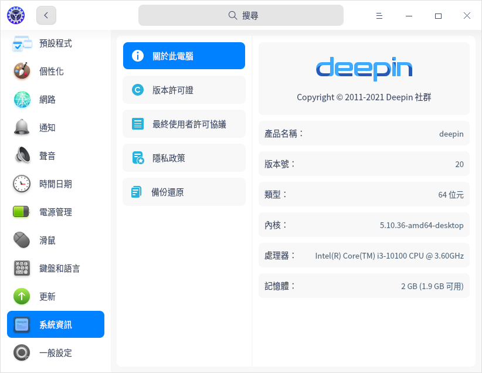

#### 關於此電腦

1. 在控制中心首頁，單擊 。
2. 在 **關於此電腦** 下，您可以查看目前系統版本、版本授權及電腦硬體訊息。
3. 若系統未啟動，可在此頁面單擊 **啟動**，進行系統啟動。

#### 版本許可證

1. 在控制中心首頁，單擊 。
2. 在 **版本許可證** 下，查看系統版本協議。

#### 最終使用者許可協議

1. 在控制中心首頁，單擊 。
2. 在 **最終使用者許可協議** 下，查看最終使用者許可協議。

#### 隱私政策
1. 在控制中心首頁，單擊 。
2. 在 **隱私政策** 下，查看隱私政策。

### 備份還原

為避免因軟體缺陷、硬體損毀、人為操作不當、駭客攻擊、電腦病毒、自然災害等因素造成資料缺失或損壞，可以進行應用程式資料或系統資料的備份還原，以保障系統的正常執行。

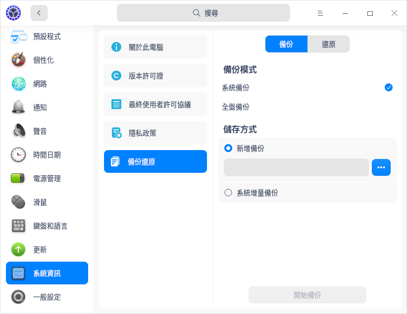

#### 備份

Deepin 提供初始化備份、控制中心備份的備份方式。

##### 透過初始化進行備份

當系統安裝完成時，會先自動建立還原分區，再備份啟動分區和根分區，並儲存還原分區訊息及磁碟分區配置。

##### 透過控制中心進行備份

使用者既可以手動備份/手動還原資料，也可以透過一鍵還原復原資料。

1. 在控制中心首頁，單擊 。
2. 選擇 **備份/還原** > **備份**，設定備份模式和備份文件的儲存路徑。
   - 備份模式：全盤備份、系統備份
      + 全盤備份：備份全磁碟的系統檔案和使用者文件
      + 系統備份：備份根分區、啟動分區
   - 儲存方式：新增備份、系統增量備份
     
      
> 說明：全盤備份無法備份在自己本身的磁碟裡，只能備份在其它儲存介質中。

3. 單擊 **開始備份**，彈出密碼輸入框，請輸入密碼授權備份文件，直至文件備份完成。

> 注意：在備份文件的過程中，請不要拔掉電源或強行關機，以防止資料的遺失或損壞。

#### 還原

Deepin 提供從Grub進入還原、控制中心還原的還原方式。

##### 從Grub進入還原

在開機時，選擇系統介面，單擊 **Deepin Restore**，進入Deepin 系統還原，使用者可以選擇 **復原出廠設定** 讀取還原出廠設定備份，也可以選擇 **自備份文件還原** 打開文件目錄選取要還原的備份。

##### 透過控制中心進行還原

使用者既可以還原所有設定，也可以手動還原前期備份的資料。

1. 在控制中心首頁，單擊 。
2. 選擇 **備份/還原** > **還原**，您可以選擇：
   - 復原出廠設定
      1. 選擇是否勾選 **保留個人資料**，單擊 **開始還原**，在彈出的對話框中，單擊 **確認**。 
      2. 在彈出的密碼輸入框中，輸入密碼授權進行資料的還原。
   - 自備份文件還原
      1. 在選擇備份文件參數後，單擊  選擇要還原的文件。
      2. 單擊 **開始還原**，開始還原系統。

### 一般設定

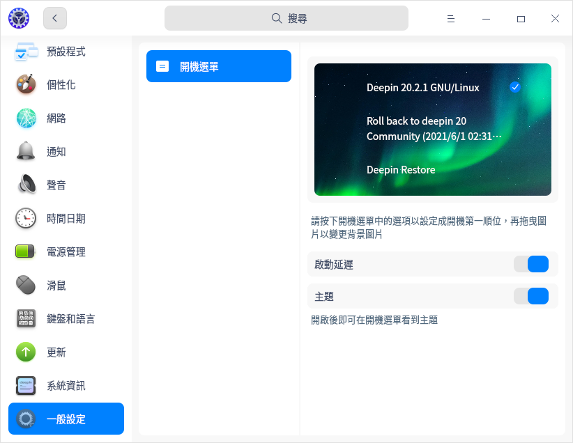

#### 設定開機選單

開機選單，指的是開機後選擇作業系統的選單。選擇某一系統後，電腦就會引導進入該作業系統。

##### 設定啟動延遲

當系統存在多個系統時，**啟動延遲** 預設開啟，開機後在啟動選單停留5秒鐘，您可以在啟動選單單擊要進入的系統。

當系統僅存在一個系統時，**啟動延遲** 預設關閉，開機後在啟動選單停留1秒鐘，不需要進行選擇。

##### 修改預設啟動項

1. 在控制中心首頁，單擊 。
2. 單擊 **開機選單**，進入開機選單介面。
3. 單擊選中某一選單項後，該項將成為預設啟動項。

##### 更改開機選單背景

1. 在控制中心首頁，單擊 。
2. 單擊 **開機選單**，進入開機選單介面。
3. 開啟 **主題**，使用該主題為開機選單的背景。

> 竅門：您也可以把圖片拖曳到預覽視窗，來更換開機選單的背景。

## 視窗管理器

視窗管理器可以在不同的工作區內展示不同的視窗內容。透過視窗管理器您可以同時使用多個桌面，以便對桌面視窗進行分組管理。

> 說明：只有在控制中心 > 個性化 > 一般介面，開啟了視窗特效功能後，才支援執行視窗管理器功能。

### 打開工作區

工作區將您的桌面視窗進行分組管理，透過劃分工作區可以增大您的工作區域。

按下 **Super** + **S** 組合鍵，或單擊  打開工作區介面。

### 添加工作區

在工作區介面，您可以透過以下方式添加工作區。

   - 單擊工作區上方的 **+**。

   - 按下鍵盤上的 **+**。

> 說明：當您添加的工作區達到最大值時，將不能再添加工作區。

### 切換工作區

在桌面和工作區介面，您可以透過以下方式切換工作區。

   - 在桌面，按下鍵盤上的 **Super** +  /  組合鍵，切換到上一個/下一個工作區。
   - 在桌面，按下鍵盤上的 **Super** + 數字鍵（1-4）， 切換到指定順序的工作區。
   - 在工作區介面，滾動滑鼠滾輪切換到上一個/下一個工作區。
   - 在工作區介面，按下鍵盤上的  /  鍵來切換到上一個/下一個工作區。
   - 在工作區介面，單擊對應的預覽視窗或按下數字鍵（1-4）來切換到指定工作區。

### 刪除工作區

當您執行刪除工作區操作後，該工作區中的所有視窗將自動轉移到相鄰的工作區中顯示，當桌面環境中只存在一個工作區時，將不能執行刪除工作區的操作。

   - 在工作區介面，單擊  刪除工作區。

### 退出工作區

當您在工作區介面完成相關操作後，可以透過以下方式退出工作區。

   - 按下鍵盤上的 **Esc** 鍵。
   - 在目前工作區介面區域內的任意位置單擊一下滑鼠。
   - 再次按下鍵盤上的 **Super** + **S** 組合鍵。

### 查看所有視窗

您可以透過以下方式查看工作區的所有視窗。

   - 按下鍵盤上的 **Super** + **A** 組合鍵，查看所有工作區的視窗。
   - 按下鍵盤上的 **Super** + **W** 組合鍵，查看目前工作區的視窗。

### 移動工作區視窗

您可以透過以下方式移動視窗到另一工作區。

   - 在工作區介面，拖曳視窗到指定的工作區。
   - 在桌面，按下鍵盤上的 **Super** + **Shift** +  /  鍵，將目前視窗移動到上一個/下一個工作區。
   - 在桌面，按下鍵盤上的 **Super** + **Shift** + 數字鍵，將目前視窗移動到對應順序的工作區。
   - 在桌面，按下鍵盤上的 **Alt** + **Space** 或在視窗標題欄上單擊右鍵，打開視窗快捷操作選單，選擇 **永遠在可見工作區**，或 **移至右方工作區** 或 **移至左方工作區**，將目前視窗移動到指定的工作區。

> 竅門：在視窗快捷操作選單，您還可以選擇最小化、最大化、移動、變更大小、永遠置頂和關閉視窗。

### 切換桌面視窗

您可以透過以下方式切換目前工作區的桌面視窗。

#### 快速切換相鄰視窗

   - 同時按下 **Alt** + **Tab** 並快速釋放，快速切換目前視窗和相鄰程式視窗；

   - 同時按下 **Alt** + **Shift** + **Tab** 並快速釋放，快速反向切換目前視窗和相鄰程式視窗。

#### 快速切換同類型視窗

   - 同時按下 **Alt** +  並快速釋放，快速切換目前同類型視窗；

   - 同時按下 **Alt** + **Shift** +  並快速釋放，快速反向切換目前同類型視窗。

#### 切換所有視窗

   - 按住鍵盤上的 **Alt** 鍵不放，連續按下鍵盤上的 **Tab** 鍵，所有視窗依次向右切換顯示；

   - 按住鍵盤上的 **Alt** + **Shift** 鍵不放，連續按下鍵盤上的 **Tab** 鍵，所有視窗依次向左切換顯示。

#### 切換同類型視窗

   - 按住鍵盤上的 **Alt** 鍵不放，連續按下鍵盤上的  鍵，目前同類型視窗依次向右切換顯示；

   - 按住鍵盤上的 **Alt** + **Shift** 鍵不放，連續按下鍵盤上的  鍵，視窗依次向左切換顯示。

### 視窗分屏

使用視窗分屏，讓多個應用程式和任務視窗同時顯示在大螢幕上，既充分利用了大螢幕的空間，又能減少在多個應用程式視窗之間頻繁切換，提高您的工作學習效率。

1. 拖曳視窗到螢幕左側或者右側，當游標接觸到螢幕左右側邊緣時，會出現一個透明的白色背景，釋放視窗，視窗將吸附在螢幕左半邊或右半邊；
2. 在另一半未被占據的螢幕中，會出現其他所有視窗的預覽，單擊其中一個就能讓其顯示在另一半的螢幕中，實現分屏瀏覽。
3. 分屏瀏覽時，將游標移動到螢幕中間兩個視窗的連接處左右拖曳，同時修改兩個視窗的寬度。也可以把其他視窗拖曳到兩邊，疊加分屏視窗。

> 竅門：要取消視窗分屏，只需將視窗從螢幕一側拖離即可。
