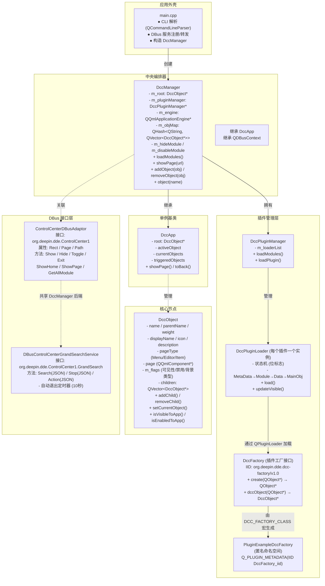
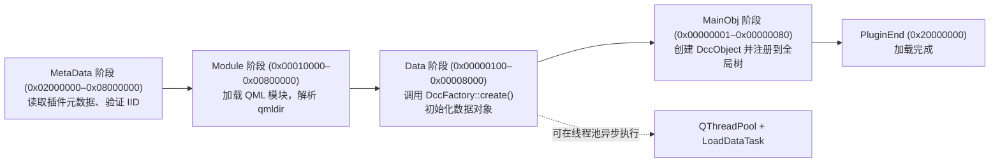
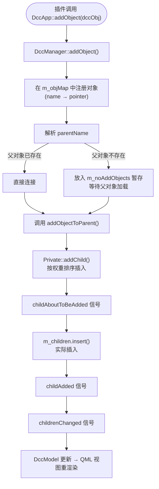
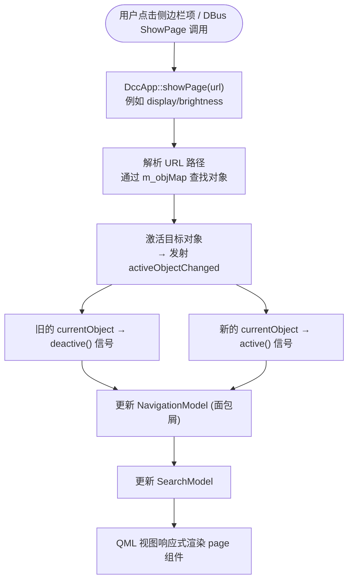
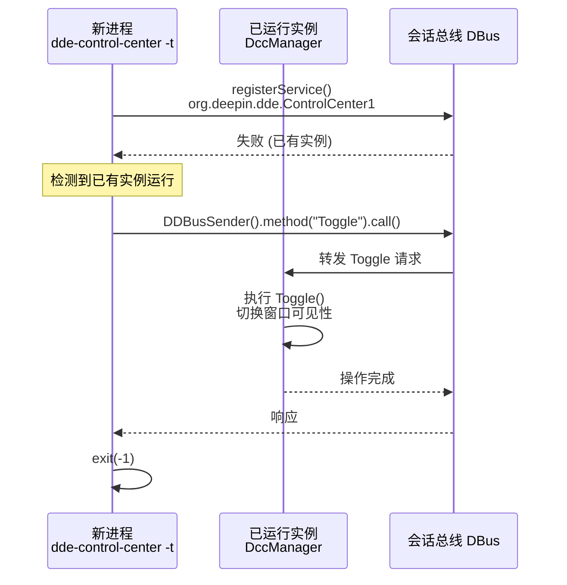

# DDE 控制中心 (dde-control-center) 简介

> 基于 v25 版本编写 | 2026-07-06

---

## 一、项目概述

**DDE 控制中心**（`dde-control-center`）是深度桌面环境（Deepin Desktop Environment, DDE）的统一系统设置面板。它负责在桌面操作系统下掌管所有系统配置项，为用户提供图形化的设置界面，涵盖从显示、声音、网络到用户账户、个性化等全方位的系统管理功能。

控制中心采用**模块化插件架构**构建，其中每个设置模块——显示、声音、蓝牙、键盘等——均作为可独立加载的插件交付。整个框架采用 **C++17** 编写，UI 层使用 **Qt 6 Quick/QML**，并基于 **DTK 6**（Deepin Tool Kit）桌面工具包开发。

| 属性 | 值 |
|------|-----|
| 二进制文件 | `/usr/bin/dde-control-center` |
| 插件目录 | `/usr/lib/x86_64-linux-gnu/dde-control-center/plugins_v1.1/`（含 `plugins_v1.0/` 向后兼容） |
| 构建系统 | CMake ≥ 3.18 |
| 插件接口 | Qt Plugin (QPluginLoader) |
| IPC | Qt DBus (session bus) |
| 配置系统 | DConfig (Dtk::Core) |

### 掌管的核心模块

控制中心内置 **20+ 个插件**，覆盖桌面操作系统的方方面面：

| 插件 | 功能 |
|------|------|
| plugin-display | 显示器、分辨率、亮度、缩放 |
| plugin-sound | 音量、输出设备、输入设备 |
| plugin-bluetooth | 蓝牙适配器开关、设备配对 |
| plugin-keyboard | 键盘布局、快捷键、输入语言 |
| plugin-mouse | 鼠标、触摸板及手势设置 |
| plugin-touchscreen | 触摸屏校准与配置 |
| plugin-wacom | 数位板/手写板配置 |
| plugin-accounts | 用户账户管理、自动登录 |
| plugin-authentication | 指纹、面部、虹膜认证 |
| plugin-personalization | 主题、壁纸、字体、桌面效果 |
| plugin-power | 电源管理、电池、休眠、合盖动作 |
| plugin-notification | 应用通知权限与设置 |
| plugin-datetime | 日期、时间及时区设置 |
| plugin-deepinid | UOS ID 云服务与账户同步 |
| plugin-defaultapp | 默认应用关联 |
| plugin-dock | 桌面与任务栏设置 |
| plugin-privacy | 隐私与安全（摄像头、文件夹权限） |
| plugin-commoninfo | 引导菜单与开发者选项 |
| plugin-systeminfo | 系统版本、设备信息与开源声明 |
| plugin-device | 外设硬件分类入口 |
| plugin-system | 系统公共设置（含子模块入口） |

---

## 二、项目结构（按功能层次标注）

整个代码库按**六层职责**组织，以下在目录树上逐一标注各组件所属的角色。

```

dde-control-center/
├── include/                          # 公共 SDK 头文件
│   └── dccfactory.h                  # 插件工厂接口（核心 SDK）
│
├── src/
│   ├── dde-control-center/           # ★ 应用外壳 + QML 框架
│   │   ├── main.cpp                  # 入口点，CLI 解析，DBus 注册，单实例守护
│   │   ├── dccmanager.h/cpp          # 继承 DccApp + QDBusContext
│   │   ├── dccpluginloader.h/cpp     # 每个插件的异步状态机（位标志）
│   │   │                               MetaData→Module→Data→MainObj 四阶段推进
│   │   │                               Data 阶段在 QThreadPool 中异步执行
│   │   ├── pluginmanager.h/cpp       # 插件发现与生命周期管理（v1.0/v1.1 双格式）
│   │   ├── navigationmodel.h/cpp     # 侧边栏/面包屑数据模型
│   │   ├── searchmodel.h/cpp         # 全文搜索模型
│   │   ├── controlcenterdbusadaptor.h/cpp  # DBus主接口适配器（Show/Hide/Toggle/ShowPage）
│   │   └── plugin/                   # 核心框架类型
│   │       ├── dccapp.h/cpp          # DccApp 单例，管理根对象树
│   │       │                           showPage()/toBack() API + m_objMap 全局注册表
│   │       ├── dccobject.h/cpp       # DccObject 树节点
│   │       │                           name/parentName 自组装，weight 排序
│   │       ├── dccobject_p.h         # 私有实现
│   │       ├── dccrepeater.h/cpp     # 动态对象生成器
│   │       ├── dccmodel.h/cpp        # Qt 模型/视图桥接
│   │       ├── DccWindow.qml         # 主窗口框架
│   │       ├── DccGroupView.qml      # 分组设置布局
│   │       ├── DccSettingsView.qml   # 完整设置页面布局
│   │       └── ...                   # 更多 QML 组件（被动消费 DccObject 树）
│   │
│   ├── plugin-accounts/              # 用户账户管理插件
│   ├── plugin-bluetooth/             # 蓝牙设置插件
│   ├── plugin-display/               # 显示器与显示设置插件
│   ├── plugin-sound/                 # 音频设置插件
│   ├── plugin-keyboard/              # 键盘与语言设置插件
│   ├── plugin-personalization/       # 个性化设置插件
│   ├── plugin-power/                 # 电源管理插件
│   ├── plugin-notification/          # 通知设置插件
│   ├── plugin-network/               # 网络设置插件
│   └── ... (20+ 个插件目录)          # 所有其他设置模块
│
│   └── shared-utils/                 # 区域设置工具
│
├── examples/
│   └── plugin-example/               # 完整可运行的插件示例
│
├── misc/
│   ├── configs/                      # DConfig JSON 配置（hideModule/disableModule）
│   ├── DdeControlCenterPluginMacros.cmake  # CMake 插件辅助宏
│   ├── systemd/                      # D-Bus 服务文件
│   └── org.deepin.dde.ControlCenter1.service.in  # DBus 激活服务
│
├── translations/                     # 国际化 .ts 文件（90+ 种语言）
├── tests/                            # 单元测试
└── toolGenerate/                     # 代码生成工具

```

---

## 三、代码架构

### 3.1 核心类图



### 3.2 核心抽象

三个概念足以理解整个代码库：

| 抽象 | 角色 | 说明 |
|------|------|------|
| **DccObject** | 树节点 | 设置层级中的每个可导航项、设置控件的基础构建块。通过 `name`/`parentName` 自组装成树，`weight` 控制排序 |
| **DccApp** | 单例管理器 | 拥有根 DccObject，提供 `showPage()`/`toBack()` API，维护全局对象注册表 `m_objMap`。QML 中作为全局 `DccApp` 可用 |
| **DccFactory** | 插件桥梁 | C++ 插件与框架之间的 Qt 插件接口。`DCC_FACTORY_CLASS` 宏自动生成工厂子类 |

---

## 四、核心工作流

### 4.1 应用启动流程


### 4.2 插件加载状态机

每个插件由一个 `DccPluginLoader` 实例管理，通过位标志状态机推进四个主要阶段：



- `DataBegin→DataEnd` 阶段通过 `LoadDataTask` 在 `QThreadPool` 工作线程中异步执行
- 使用位掩码表达式（如 `(status & (DataEnd | MainObjLoad)) == DataEnd`）检查当前阶段状态

### 4.3 DccObject 树组装流程



### 4.4 页面导航流程



### 4.5 DBus 单实例守护



---

## 五、命令行参数

| 参数 | 长格式 | 作用 | 示例 |
|------|--------|------|------|
| `-s` | `--show` | 启动时显示主窗口 | `dde-control-center -s` |
| `-t` | `--toggle` | 切换窗口可见性（显示/隐藏） | `dde-control-center -t` |
| `-d` | `--dbus` | 以 DBus 守护模式启动（默认隐藏，等待外部调用） | `dde-control-center -d` |
| `-m <module>` | (无) | 启动后导航至指定模块 | `dde-control-center -m display` |
| `-p <page>` | (无) | 结合 `-m` 导航至模块内的子页面 | `dde-control-center -m privacy -p camera` |
| `--spec <dir>` | `--spec` | 从自定义目录加载插件（调试用） | `/usr/bin/dde-control-center --spec ./build/src/dcc-update-plugin/lib/plugins_v1.1/` |
| `-l <module>,<level>` | (无) | 按模块和级别过滤日志输出 | `dde-control-center -l display,debug` |

---

## 六、DBus 接口

### 6.1 服务标识

| 属性 | 值 |
|------|-----|
| 服务名称 | `org.deepin.dde.ControlCenter1` |
| 对象路径 | `/org/deepin/dde/ControlCenter1` |
| 接口名称 | `org.deepin.dde.ControlCenter1` |
| 总线类型 | 会话总线 (Session Bus) |

### 6.2 主接口方法

| 方法 | 签名 | 说明 |
|------|------|------|
| `Show` | `void Show()` | 显示并激活主窗口 |
| `Hide` | `void Hide()` | 隐藏主窗口 |
| `Toggle` | `void Toggle()` | 切换窗口可见性 |
| `Exit` | `void Exit()` | 终止应用程序 |
| `ShowHome` | `void ShowHome()` | 导航至根页面（回到首页） |
| `ShowPage` | `void ShowPage(QString url)` | 导航至指定 URL 路径。支持 `?indicator=true` 查询参数（指示器模式，不显示窗口） |
| `ShowPage` (已弃用) | `void ShowPage(QString module, QString page)` | 两参数版本。拼接 `module/page` 后委托给单参数版本 |
| `ShowModule` (已弃用) | `void ShowModule(QString module)` | 委托给 `ShowPage(module)` |
| `GetAllModule` | `QString GetAllModule()` | 返回所有已注册模块的 JSON 列表（异步回复） |

### 6.3 主接口属性

| 属性 | 类型 | 说明 |
|------|------|------|
| `Rect` | `QRect` | 主窗口几何信息（位置与大小） |
| `Page` | `QString` | 当前活动页面的内部对象路径（斜杠分隔的 name，不含 "root"） |
| `Path` | `QString` | 当前活动页面的本地化显示路径（斜杠分隔的 displayName） |

> 属性变化时发射 `org.freedesktop.DBus.PropertiesChanged` 信号。

### 6.4 全局搜索接口

接口名称：`org.deepin.dde.ControlCenter1.GrandSearch`

| 方法 | 签名 | 说明 |
|------|------|------|
| `Search` | `QString Search(QString json)` | 执行搜索查询。输入 JSON 格式：`{"cont":"关键词","ver":1,"mID":"test"}`。返回匹配项的 JSON 结果 |
| `Stop` | `bool Stop(QString json)` | 停止正在进行的搜索。始终返回 `true` |
| `Action` | `bool Action(QString json)` | 执行搜索结果动作（导航至该项）。输入 JSON 需包含 `"action":"openitem"` 和 `"item":"URL路径"` |

**自动退出机制**：全局搜索适配器构造时启动 10 秒定时器，每次 `Search`/`Stop`/`Action` 调用重启定时器。超时且主窗口不可见时自动退出。

### 6.5 DBus 命令行调用示例

```bash
# 显示控制中心
gdbus call --session \
  --dest=org.deepin.dde.ControlCenter1 \
  --object-path /org/deepin/dde/ControlCenter1 \
  --method org.deepin.dde.ControlCenter1.Show

# 隐藏控制中心
gdbus call --session \
  --dest=org.deepin.dde.ControlCenter1 \
  --object-path /org/deepin/dde/ControlCenter1 \
  --method org.deepin.dde.ControlCenter1.Hide

# 切换显示/隐藏
gdbus call --session \
  --dest=org.deepin.dde.ControlCenter1 \
  --object-path /org/deepin/dde/ControlCenter1 \
  --method org.deepin.dde.ControlCenter1.Toggle

# 导航到指定模块页面
gdbus call --session \
  --dest=org.deepin.dde.ControlCenter1 \
  --object-path /org/deepin/dde/ControlCenter1 \
  --method org.deepin.dde.ControlCenter1.ShowPage \
  "privacy/camera"

# 回到首页
gdbus call --session \
  --dest=org.deepin.dde.ControlCenter1 \
  --object-path /org/deepin/dde/ControlCenter1 \
  --method org.deepin.dde.ControlCenter1.ShowHome

# 全局搜索（搜索蓝牙相关设置）
gdbus call --session \
  --dest=org.deepin.dde.ControlCenter1 \
  --object-path /org/deepin/dde/ControlCenter1 \
  --method org.deepin.dde.ControlCenter1.GrandSearch.Search \
  '{"cont":"bluetooth","ver":1,"mID":"test"}'

# 获取所有模块列表
gdbus call --session \
  --dest=org.deepin.dde.ControlCenter1 \
  --object-path /org/deepin/dde/ControlCenter1 \
  --method org.deepin.dde.ControlCenter1.GetAllModule

# 监听属性变化信号
gdbus monitor --session \
  --dest=org.deepin.dde.ControlCenter1
```

---

## 七、DConfig 配置系统

控制中心利用 DTK 的 **DConfig** 配置框架管理各模块的运行时行为。所有配置项以 JSON 格式定义在 [`misc/configs/`](misc/configs/) 目录下，构建时通过 `dconfig2cpp` 工具自动生成类型安全的 C++ 访问类。

> 说明：以下 `appid` 统一为 `org.deepin.dde.control-center`（区域格式除外），`resource` 为 JSON 文件名（不含 `.json` 后缀）。
> 如需查阅更多未列出的项，可以用 `dde-dconfig --list -a <appid>` 自查。

### 7.1 配置项索引

#### 全局配置（resource: `org.deepin.dde.control-center`）

| key | 类型 | 默认值 | 说明 | 来源文件 |
|-----|------|--------|------|---------|
| `hideModule` | `string[]` | `[]` | 隐藏模块。被列出的模块在 UI 中不可见（仍在后台加载） | `misc/configs/org.deepin.dde.control-center.json` |
| `disableModule` | `string[]` | `[]` | 禁用模块。被列出的模块完全跳过加载 | 同上 |
| `width` | `double` | `800` | 主窗口默认宽度 | 同上 |
| `height` | `double` | `600` | 主窗口默认高度 | 同上 |
| `sidebarWidth` | `double` | `-1` | 侧边栏宽度（-1 自动适应） | 同上 |

#### 账户模块（resource: `org.deepin.dde.control-center.accounts`）

| key | 类型 | 默认值 | 说明 | 来源文件 |
|-----|------|--------|------|---------|
| `avatarPath` | `string` | `""` | 用户头像默认路径 | `misc/configs/org.deepin.dde.control-center.accounts.json` |

#### 日期时间模块（resource: `org.deepin.dde.control-center.datetime`）

| key | 类型 | 默认值 | 说明 | 来源文件 |
|-----|------|--------|------|---------|
| `customNtpServer` | `string` | `""` | 自定义 NTP 服务器地址 | `misc/configs/org.deepin.dde.control-center.datetime.json` |

#### 显示模块（resource: `org.deepin.dde.control-center.display`）

| key | 类型 | 默认值 | 说明 | 来源文件 |
|-----|------|--------|------|---------|
| `minBrightnessValue` | `double` | `0.1` | 亮度调节最小值 | `misc/configs/org.deepin.dde.control-center.display.json` |

#### 电源模块（resource: `org.deepin.dde.control-center.power`）

| key | 类型 | 默认值 | 说明 | 来源文件 |
|-----|------|--------|------|---------|
| `linePowerScreenBlackDelay` | `string[]` | `["1m","5m","10m","15m","30m","1h"]` | 插入电源—关闭显示器的时间选项 | `misc/configs/org.deepin.dde.control-center.power.json` |
| `linePowerSleepDelay` | `string[]` | `["10m","15m","30m","1h","2h","3h"]` | 插入电源—进入待机的时间选项 | 同上 |
| `linePowerLockDelay` | `string[]` | `["1m","5m","10m","15m","30m","1h"]` | 插入电源—自动锁屏的时间选项 | 同上 |
| `batteryScreenBlackDelay` | `string[]` | `["1m","5m","10m","15m","30m","1h"]` | 使用电池—关闭显示器的时间选项 | 同上 |
| `batterySleepDelay` | `string[]` | `["10m","15m","30m","1h","2h","3h"]` | 使用电池—进入待机的时间选项 | 同上 |
| `batteryLockDelay` | `string[]` | `["1m","5m","10m","15m","30m","1h"]` | 使用电池—自动锁屏的时间选项 | 同上 |
| `showHibernate` | `bool` | `true` | 下拉框是否显示休眠选项 | 同上 |
| `showShutdown` | `bool` | `true` | 下拉框是否显示关机选项 | 同上 |
| `showSuspend` | `bool` | `true` | 下拉框是否显示待机选项 | 同上 |
| `enableScheduledShutdown` | `string` | `"Enabled"` | 定时关机显示状态：`Enabled` 正常 / `Disabled` 置灰 / `Hidden` 隐藏 | 同上 |

#### 声音模块（resource: `org.deepin.dde.control-center.sound`）

| key | 类型 | 默认值 | 说明 | 来源文件 |
|-----|------|--------|------|---------|
| `showDeviceManager` | `bool` | `true` | 是否显示设备管理（用于启用端口自动切换） | `misc/configs/org.deepin.dde.control-center.sound.json` |

#### 个性化模块（resource: `org.deepin.dde.control-center.personalization`）

| key | 类型 | 默认值 | 说明 | 来源文件 |
|-----|------|--------|------|---------|
| `hideIconThemes` | `string[]` | `["Papirus","Papirus-Dark",...]` | 需要隐藏的图标主题列表 ⚠️ 只读 | `misc/configs/org.deepin.dde.control-center.personalization.json` |
| `titleBarHeightStatus` | `string` | `"Enabled"` | 标题栏高度状态：Enabled/Disabled | 同上 |
| `titleBarHeightSupportCompactDisplay` | `bool` | `true` | 标题栏高度是否联动紧凑模式 | 同上 |
| `scrollbarPolicyStatus` | `string` | `"Enabled"` | 滚动条显示策略状态 | 同上 |
| `compactDisplayStatus` | `string` | `"Enabled"` | 紧凑模式状态 | 同上 |

#### 通用信息模块（resource: `org.deepin.dde.control-center.commoninfo`）

| key | 类型 | 默认值 | 说明 | 来源文件 |
|-----|------|--------|------|---------|
| `showReadOnlyProtection` | `bool` | `true` | 开发者模式中是否显示只读保护选项 | `misc/configs/org.deepin.dde.control-center.commoninfo.json` |
| `bootWallpaperEnabled` | `bool` | `true` | GRUB 启动菜单背景图片是否可编辑 | 同上 |
| `bootGrubUserNameVisible` | `bool` | `true` | 启动菜单验证弹窗中是否显示用户名 | 同上 |

#### 区域格式（appid: `org.deepin.region-format`, resource: `org.deepin.region-format`）

| key | 类型 | 默认值 | 说明 | 来源文件 |
|-----|------|--------|------|---------|
| `country` | `string` | `""` | 国家/地区 | `misc/configs/common/org.deepin.region-format.json` |
| `languageRegion` | `string` | `""` | 语言与区域格式 | 同上 |
| `localeName` | `string` | `""` | 语言名称（如 `zh_CN.UTF-8`） | 同上 |
| `firstDayOfWeek` | `int` | `1` | 每周第一天（1=周一，7=周日） | 同上 |
| `use24HourFormat` | `bool` | `true` | 是否使用 24 小时制 | 同上 |
| `currency` | `string` | `""` | 货币符号 | 同上 |
| `shortDateFormat` | `string` | `""` | 短日期格式 | 同上 |
| `longDateFormat` | `string` | `""` | 长日期格式 | 同上 |
| `shortTimeFormat` | `string` | `""` | 短时间格式 | 同上 |
| `longTimeFormat` | `string` | `""` | 长时间格式 | 同上 |
| `numericFormat` | `string` | `""` | 数字格式（含小数点与千分位规则） | 同上 |
| `paperSize` | `string` | `""` | 纸张大小（如 `A4`） | 同上 |

### 7.2 配置生命周期

1. **定义阶段**：开发者编写 JSON schema 文件放入 `misc/configs/`
2. **代码生成**：构建时 `dconfig2cpp` 工具为每个 JSON 生成 `*_control-center.hpp` C++ 类，暴露 Q_PROPERTY 属性
3. **运行时**：DccManager 在初始化时读取 `hideModule`/`disableModule`，DccPluginLoader 根据配置决定插件是否加载或隐藏
4. **动态更新**：配置变化时通过 DConfig 信号触发，控制中心实时响应（无需重启）

### 7.3 常用命令示例

```

# 列出控制中心全量 dconfig
dde-dconfig --list -a org.deepin.dde.control-center

# 读取 hideModule
dde-dconfig --get -a org.deepin.dde.control-center \
  -r org.deepin.dde.control-center -k hideModule

# 设置 hideModule 隐藏指定模块
dde-dconfig --set -a org.deepin.dde.control-center \
  -r org.deepin.dde.control-center -k hideModule -v '["display"]'

# 读取电源模块 showHibernate
dde-dconfig --get -a org.deepin.dde.control-center \
  -r org.deepin.dde.control-center.power -k showHibernate

# 读取区域格式配置（独立 appid）
dde-dconfig --get -a org.deepin.region-format \
  -r org.deepin.region-format -k country

```

---

## 八、Q&&A

1. 什么是.dci文件
    .dci文件的缩写是Deepin Custom Icon格式的图标文件，是deepin桌面环境自由的矢量图标格式

2. dde-control-center 日志在哪里
   `vim ~/.cache/deepin/dde-control-center/dde-control-center.log`
   - 需要实时查看的时候： `tail -f ~/.cache/deepin/dde-control-center/dde-control-center.log`
  
3. 
> **参考来源**：[zread.ai 上的 dde-control-center 文档集](https://zread.ai/linuxdeepin/dde-control-center/1-overview)