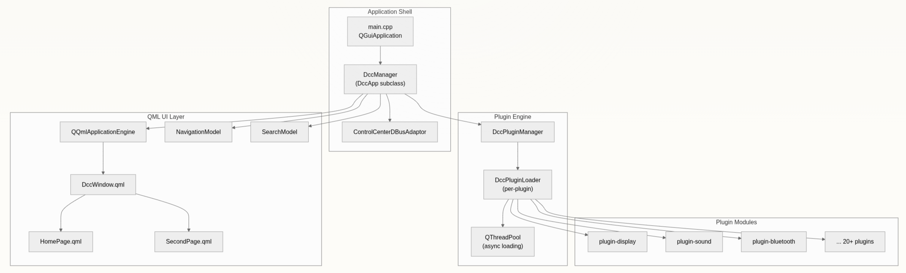
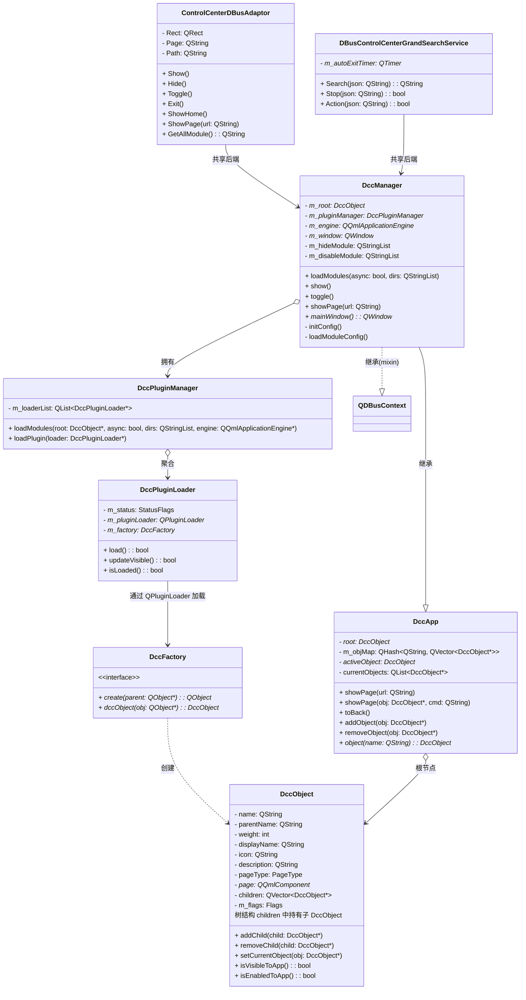
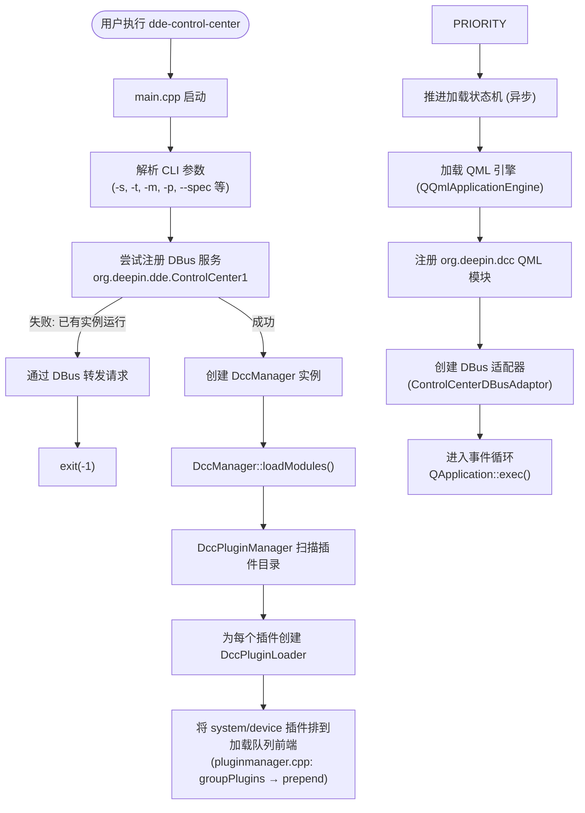
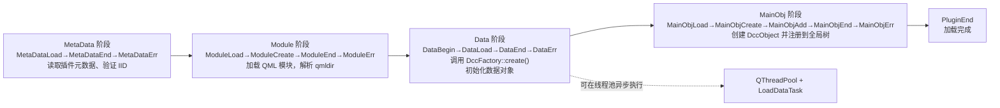
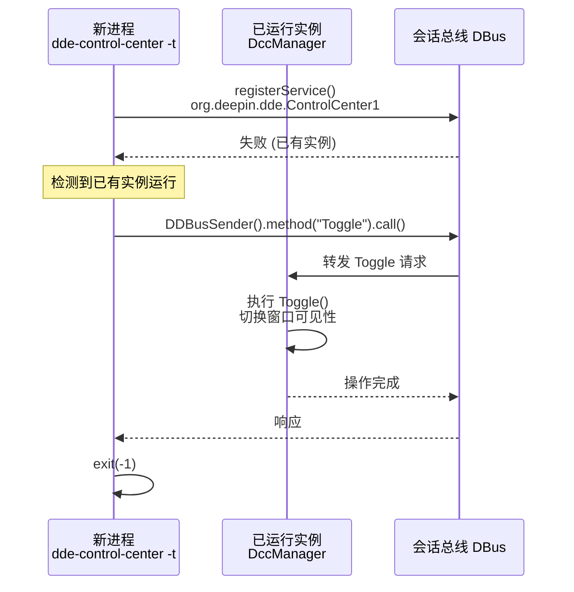

# DDE 控制中心 (dde-control-center) 简介

> 基于 v25 版本编写 | 2026-07-08

---

## 一、项目概述

**DDE 控制中心**（`dde-control-center`）是深度桌面环境（Deepin Desktop Environment, DDE）的统一系统设置面板。它负责在桌面操作系统下掌管所有系统配置项，为用户提供图形化的设置界面，涵盖从显示、声音、网络到用户账户、个性化等全方位的系统管理功能。

控制中心采用**模块化插件架构**构建，其中每个设置模块——显示、声音、蓝牙、键盘等——均作为可独立加载的插件交付。整个框架采用 **C++17** 编写，UI 层使用 **Qt 6 Quick/QML**，并基于 **DTK 6**（Deepin Tool Kit）桌面工具包开发。

| 属性 | 值 |
|------|-----|
| 命令路径 | `/usr/bin/dde-control-center`（实际是 shell 包装脚本，见下方说明） |
| 真实二进制 | `/usr/libexec/deepin/dde-control-center`（由包装脚本间接调用） |
| 插件目录 | `/usr/lib/x86_64-linux-gnu/dde-control-center/plugins_v1.1/`（含 `plugins_v1.0/` 向后兼容） |
| 构建系统 | CMake ≥ 3.18 |
| 插件接口 | Qt Plugin (QPluginLoader) |
| IPC | Qt DBus (session bus) |
| 配置系统 | DConfig (Dtk::Core) |

> **安全加载器说明**：`/usr/bin/dde-control-center` 并非真正的 ELF 二进制，而是一个 shell 包装脚本（见 `misc/dde-control-center-loader-wrapper`）。引入这一层是为了在调用受保护的系统服务时**免 polkit 授权弹窗**。完整的启动链路如下：
>
> ```
> 入口（三种触发方式）
> ├── 用户直接执行 dde-control-center -s
> ├── DBus 激活（/usr/share/dbus-1/services/ 中 Exec=/usr/bin/dde-control-center -d）
> └── systemd user service（ExecStart=/usr/bin/dde-control-center -d）
>       │
>       ▼
> /usr/bin/dde-control-center（shell 脚本，仅 1.2KB）
>       │
>       ├─ 检查 /usr/bin/deepin-security-loader-exec 是否存在、可执行
>       │   └─ 检查其是否拥有 cap_setgid=ep 能力（getcap 检测）
>       │
>       ├─ 条件满足（有 cap_setgid）：
>       │   └─ exec deepin-security-loader --group deepin-daemon \
>       │        -- /usr/libexec/deepin/dde-control-center "$@"
>       │       ├─ deepin-security-loader 本身也是 shell 脚本(组织者)
>       │       ├─ deepin-security-loader-exec 是 ELF（拥有 cap_setgid=ep）
>       │       │   └─ 通过 cap_setgid 能力切换到 deepin-daemon 组
>       │       └─ 最终执行真实二进制时具备 deepin-daemon 组权限
>       │           └─ 调用受保护系统服务时无需 polkit 弹出授权
>       │
>       └─ 条件不满足（无 loader/无 cap_setgid）：
>           └─ exec /usr/libexec/deepin/dde-control-center "$@"（回退，无免授权能力）
>                 └─ 真实 ELF 二进制（约 24MB，含 debug_info，未 strip）
> ```

## 二、架构一览

控制中心采用**三层架构**运作：一个轻量级应用外壳、一个插件管理引擎，以及每个插件各自的 QML+C++ 模块。外壳（`dde-control-center` 二进制文件）引导启动一个 `DccManager` 单例，该单例拥有 `DccApp` 实例、`DccPluginManager` 以及 QML 应用引擎。插件管理器从插件目录发现并加载共享库，每个共享库注册一个 `DccFactory`，用于生成数据对象和 `DccObject` 树。随后，QML 引擎使用内置视图组件（如 `DccGroupView`、`DccSettingsView` 和 `DccRepeater`）渲染这些对象。



数据流：当应用启动时，` main.cpp ` 创建 DccManager 并调用 `loadModules()` 。插件管理器生成 ` DccPluginLoader ` 实例，每个实例遍历一个多阶段状态机（元数据 → 模块 → 数据 → 主对象），并可选地在线程池上异步执行。每个已加载的插件将 `DccObject`  节点贡献给以`DccApp.root`  为根的全局树。QML 场景读取此树，并自动渲染导航、主页图标和详情页。

### 三层职责

| 层级 | 组件 | 职责 |
|------|------|------|
| 应用外壳 | `main.cpp` | CLI 解析、DBus 服务注册（`org.deepin.dde.ControlCenter1`）、单实例守护、异常处理 |
| 插件管理引擎 | `DccManager` + `DccPluginManager` + `DccPluginLoader` | 生命周期编排、插件扫描与发现、异步加载调度、DccObject 树组装、导航与搜索 |
| 插件模块 | 每个插件一组文件（`{name}.qml` + `{name}Main.qml` + `{name}.so`） | 提供具体设置项的数据模型（Model）、后端逻辑（Worker）、UI 布局（QML 组件） |

### 掌管的核心模块

控制中心内置 **20+ 个插件**，覆盖桌面操作系统的方方面面：

| 插件 | 功能 |
|------|------|
| plugin-display | 显示器、分辨率、亮度、缩放 |
| plugin-sound | 音量、输出设备、输入设备 |
| plugin-bluetooth | 蓝牙适配器开关、设备配对 |
| plugin-keyboard | 键盘布局、快捷键、输入语言 |
| plugin-mouse | 鼠标、触摸板及手势设置 |
| plugin-touchscreen | 触摸屏校准与配置 |
| plugin-wacom | 数位板/手写板配置 |
| plugin-accounts | 用户账户管理、自动登录 |
| plugin-authentication | 指纹、面部、虹膜认证 |
| plugin-personalization | 主题、壁纸、字体、桌面效果 |
| plugin-power | 电源管理、电池、休眠、合盖动作 |
| plugin-notification | 应用通知权限与设置 |
| plugin-datetime | 日期、时间及时区设置 |
| plugin-deepinid | UOS ID 云服务与账户同步 |
| plugin-defaultapp | 默认应用关联 |
| plugin-dock | 桌面与任务栏设置 |
| plugin-privacy | 隐私与安全（摄像头、文件夹权限） |
| plugin-commoninfo | 引导菜单与开发者选项 |
| plugin-systeminfo | 系统版本、设备信息与开源声明 |
| plugin-device | 外设硬件分类入口 |
| plugin-system | 系统公共设置（含子模块入口） |

---

## 三、项目结构（按功能层次标注）

整个代码库按**六层职责**组织，以下在目录树上逐一标注各组件所属的角色。

```

dde-control-center/
├── include/                          # 公共 SDK 头文件
│   └── dccfactory.h                  # 插件工厂接口（核心 SDK）
│
├── src/
│   ├── dde-control-center/           # ★ 应用外壳 + QML 框架
│   │   ├── main.cpp                  # 入口点，CLI 解析，DBus 注册，单实例守护
│   │   ├── dccmanager.h/cpp          # 继承 DccApp + QDBusContext
│   │   ├── dccpluginloader.h/cpp     # 每个插件的异步状态机（位标志）
│   │   │                               MetaData→Module→Data→MainObj 四阶段推进
│   │   │                               Data 阶段在 QThreadPool 中异步执行
│   │   ├── pluginmanager.h/cpp       # 插件发现与生命周期管理（v1.0/v1.1 双格式）
│   │   ├── navigationmodel.h/cpp     # 侧边栏/面包屑数据模型
│   │   ├── searchmodel.h/cpp         # 全文搜索模型
│   │   ├── controlcenterdbusadaptor.h/cpp  # DBus主接口适配器（Show/Hide/Toggle/ShowPage）
│   │   └── plugin/                   # 核心框架类型
│   │       ├── dccapp.h/cpp          # DccApp 单例，管理根对象树
│   │       │                           showPage()/toBack() API + m_objMap 全局注册表
│   │       ├── dccobject.h/cpp       # DccObject 树节点
│   │       │                           name/parentName 自组装，weight 排序
│   │       ├── dccobject_p.h         # 私有实现
│   │       ├── dccrepeater.h/cpp     # 动态对象生成器
│   │       ├── dccmodel.h/cpp        # Qt 模型/视图桥接
│   │       ├── DccWindow.qml         # 主窗口框架
│   │       ├── DccGroupView.qml      # 分组设置布局
│   │       ├── DccSettingsView.qml   # 完整设置页面布局
│   │       └── ...                   # 更多 QML 组件（被动消费 DccObject 树）
│   │
│   ├── plugin-accounts/              # 用户账户管理插件
│   ├── plugin-bluetooth/             # 蓝牙设置插件
│   ├── plugin-display/               # 显示器与显示设置插件
│   ├── plugin-sound/                 # 音频设置插件
│   ├── plugin-keyboard/              # 键盘与语言设置插件
│   ├── plugin-personalization/       # 个性化设置插件
│   ├── plugin-power/                 # 电源管理插件
│   ├── plugin-notification/          # 通知设置插件
│   ├── plugin-network/               # 网络设置插件
│   └── ... (20+ 个插件目录)          # 所有其他设置模块
│
│   └── shared-utils/                 # 区域设置工具
│
├── examples/
│   └── plugin-example/               # 完整可运行的插件示例
│
├── misc/
│   ├── configs/                      # DConfig JSON 配置（hideModule/disableModule）
│   ├── DdeControlCenterPluginMacros.cmake  # CMake 插件辅助宏
│   ├── systemd/                      # D-Bus 服务文件
│   └── org.deepin.dde.ControlCenter1.service.in  # DBus 激活服务
│
├── translations/                     # 国际化 .ts 文件（90+ 种语言）
├── tests/                            # 单元测试
└── toolGenerate/                     # 代码生成工具

```

---

## 四、核心类图



> **类图设计说明**：整个类体系围绕 **`DccObject` 树** 展开，`DccApp` 持有根节点，`DccManager` 继承自 `DccApp` 并融合 `QDBusContext` 以响应 DBus 调用。`DccPluginManager` 聚合一组 `DccPluginLoader`，每个加载器通过 `QPluginLoader` 加载插件中的 `DccFactory` 工厂实现，再由工厂创建具体的 `DccObject` 子树。`ControlCenterDBusAdaptor` 和 `DBusControlCenterGrandSearchService` 作为两个 DBus 面向前端，共享同一个 `DccManager` 后端实例，分别对外暴露控制中心主操作接口和全局搜索接口。

---

## 五、核心工作流

### 5.1 应用启动流程



> **启动流程说明**：整个启动过程可归纳为三个阶段——**前置裁决**（CLI 解析与 DBus 单实例检测）、**插件引导**（扫描目录、创建加载器、按优先级排队）和 **UI 就绪**（QML 引擎装配、DBus 适配器注册、进入事件循环）。其中 DBus 注册是关键的"单实例阀门"：若注册失败则说明已有实例运行，新进程会将请求通过 DBus 转发给既有实例后自行退出，确保桌面始终只有一个控制中心进程。插件加载采用**异步策略**，`DccManager::loadModules()` 在调用后立即返回，不会阻塞事件循环的启动。

### 5.2 插件加载状态机

每个插件由一个 `DccPluginLoader` 实例管理，通过位标志状态机推进四个主要阶段：



> **状态机设计说明**：`DccPluginLoader` 使用**位标志（bit flag）**驱动四阶段流水线，每个阶段独占不同的位范围以避免冲突。这种设计带来两个关键优势：一是支持乱序/跳跃式状态推进（例如元数据加载失败可直接置入 `MetaDataErr` 跳过后续阶段）；二是可以通过位掩码表达式一次性检测多个阶段状态（如 `status & PluginEndMask` 判断是否全部完成）。其中 **Data 阶段**是唯一的"耗时瓶颈"——它通过 `LoadDataTask` 提交到 `QThreadPool` 后台线程执行，不会阻塞主线程的 QML 渲染和事件处理。

### 状态机枚举说明

整个状态机使用位标志（bit flag）设计，每个阶段的状态值独占特定的位范围：

| 阶段 | 位范围 | 枚举值 |
|------|--------|--------|
| **MetaData**（元数据） | `0xFF000000` | `MetaDataLoad=0x02000000` → `MetaDataEnd=0x04000000` → `MetaDataErr=0x08000000` |
| **Module**（QML 模块） | `0x00FF0000` | `ModuleLoad=0x00010000` → `ModuleCreate=0x00020000` → `ModuleEnd=0x00400000` → `ModuleErr=0x00800000` |
| **Data**（C++ 数据） | `0x0000FF00` | `DataBegin=0x00000100` → `DataLoad=0x00000200` → `DataEnd=0x00004000` → `DataErr=0x00008000` |
| **MainObj**（对象树） | `0x000000FF` | `MainObjLoad=0x00000001` → `MainObjCreate=0x00000002` → `MainObjAdd=0x00000004` → `MainObjEnd=0x00000040` → `MainObjErr=0x00000080` |

**组合掩码**：

- `PluginErrMask = MetaDataErr \| ModuleErr \| DataErr \| MainObjErr` — 任意阶段出错
- `PluginEndMask = PluginEnd \| MetaDataEnd \| ModuleEnd \| DataEnd \| MainObjEnd` — 所有阶段完成

- `DataBegin→DataEnd` 阶段通过 `LoadDataTask` 在 `QThreadPool` 工作线程中异步执行
- 使用位掩码表达式（如 `(status & (DataEnd | MainObjLoad)) == DataEnd`）检查当前阶段状态

### 5.3 DccObject 树组装流程


> **树组装说明**：`DccObject` 树的核心组装机制基于 **name/parentName 配对自组装**——每个插件在调用 `addObject()` 时只需声明自己的 `name` 和 `parentName`，框架自动将其挂接到正确的父节点下。这里的关键设计是**暂存队列**（`m_noAddObjects`）：由于插件异步加载，子对象可能比父对象先到，此时子对象会被暂存起来，待父对象注册后再通过 `addObjectToParent()` 完成挂接。排序依据 `weight` 属性（0-65535），插件之间通常使用 10 的步长来预留插入空间。

### 5.4 页面导航流程


> **页面导航说明**：导航的核心是 **URL 驱动的对象激活模型**——每个 `DccObject` 的 `name` 构成 URL 路径段（如 `display/brightness`），`DccApp::showPage()` 通过 `m_objMap` 全局注册表以 O(1) 时间复杂度定位目标对象。激活过程中会依次触发旧对象的 `deactive()` 信号和新对象的 `active()` 信号，形成清晰的**生命周期钩子**，方便插件在各阶段执行资源释放或数据刷新。导航模型（`NavigationModel`）同步维护面包屑路径，而搜索模型（`SearchModel`）亦随之更新，确保全文搜索索引与当前导航状态一致。

### 5.5 DBus 单实例守护



> **单实例守护说明**：DDE 控制中心通过 **DBus 服务名独占注册** 实现单实例约束。`org.deepin.dde.ControlCenter1` 是会话总线上的唯一点名服务——当一个控制中心进程已成功注册该名称后，后续进程的 `registerService()` 必然失败。这时新进程不会鲁莽启动，而是通过 `DDBusSender` 向已运行实例发出与其 CLI 参数对应的操作请求（如 `-t` 对应 `Toggle`），然后自行退出。这种设计既避免了多个控制中心窗口同时存在的混乱，又确保了命令行操作能够准确作用于正在运行的后台实例。

---

## 六、命令行参数

| 参数 | 长格式 | 作用 | 示例 |
|------|--------|------|------|
| `-s` | `--show` | 启动时显示主窗口 | `dde-control-center -s` |
| `-t` | `--toggle` | 切换窗口可见性（显示/隐藏） | `dde-control-center -t` |
| `-d` | `--dbus` | 以 DBus 守护模式启动（默认隐藏，等待外部调用） | `dde-control-center -d` |
| `-m <module>` | (无) | 启动后导航至指定模块 | `dde-control-center -m display` |
| `-p <page>` | (无) | 结合 `-m` 导航至模块内的子页面 | `dde-control-center -m privacy -p camera` |
| `--spec <dir>` | `--spec` | 从自定义目录加载插件（调试用） | `/usr/bin/dde-control-center --spec ./build/src/dcc-update-plugin/lib/plugins_v1.1/` |
| `-l <module>,<level>` | (无) | 按模块和级别过滤日志输出 | `dde-control-center -l display,debug` |

---

## 七、DBus 接口

详见 [docs/references/dbus-interface.md](docs/references/dbus-interface.md)：

- 服务标识：`org.deepin.dde.ControlCenter1`（会话总线）
- 方法：`Show` / `Hide` / `Toggle` / `Exit` / `ShowHome` / `ShowPage` / `GetAllModule`
- 属性：`Rect` / `Page` / `Path`
- 全局搜索子接口：`GrandSearch.Search` / `Stop` / `Action`
- 命令行 `gdbus` 调用示例

---

## 八、DConfig 配置系统

详见 [docs/references/dconfig-configuration.md](docs/references/dconfig-configuration.md)：

- 全局配置（`hideModule` / `disableModule` / 窗口尺寸）
- 各插件模块配置：账户、日期时间、显示、电源、声音、个性化、通用信息
- 区域格式配置（独立 appid）
- 配置生命周期：定义 → 代码生成 → 运行时 → 动态更新
- 常用 `dde-dconfig` 命令示例

---

## 九、快速指南

### 想了解整体架构？

| 目标 | 章节 |
|------|------|
| 项目概述与技术栈 | [一、项目概述](#一项目概述) |
| 三层架构总览与插件模块 | [二、架构一览](#二架构一览) |
| 源码目录结构与各层职责 | [三、项目结构](#三项目结构按功能层次标注) |
| 核心类图与关键抽象 | [四、代码架构](#四代码架构) |
| 启动/加载/导航/DBus 单实例流程 | [五、核心工作流](#五核心工作流) |
| CLI 参数列表 | [六、命令行参数](#六命令行参数) |

### 想进行日常运维/调试？

| 目标 | 参考 |
|------|------|
| DBus 调用控制中心（显示/隐藏/跳转页面） | [DBus 接口参考 → 命令行调用示例](docs/references/dbus-interface.md#命令行调用示例) |
| 查询/修改配置项（隐藏模块、电源策略等） | [DConfig 配置参考 → 常用命令示例](docs/references/dconfig-configuration.md#常用命令示例) |
| 查看运行日志 | `tail -f ~/.cache/deepin/dde-control-center/dde-control-center.log` |
| 指定自定义插件目录调试 | `dde-control-center --spec ./build/.../plugins_v1.1/` |

### 常见概念

| 概念 | 说明 |
|------|------|
| **.dci 文件** | Deepin Custom Icon 格式的图标文件，deepin 桌面环境自有的矢量图标格式 |
| **DccObject** | 树节点，一切 UI 元素的基础构建块（详见[代码架构](#四代码架构)） |
| **DccFactory** | 插件工厂接口，`DCC_FACTORY_CLASS` 宏自动注册（详见[核心类图](#41-核心类图)） |

### 想开发一个新插件？

1. 阅读 [examples/plugin-example/](../examples/plugin-example/) 完整示例
2. 参考 `DCC_FACTORY_CLASS` 宏用法（[include/dccfactory.h](../include/dccfactory.h)）
3. 插件命名规则：`{name}.qml`（元数据）+ `{name}Main.qml`（完整 UI）+ `{name}.so`（C++ 后端）
4. CMake 模板：`dcc_install_plugin()` + `dcc_handle_plugin_translation()`
5. 详见 [v25-dcc-interface.zh_CN.md](docs/v25-dcc-interface.zh_CN.md)

### 参考来源

- [zread.ai 上的 dde-control-center 文档集](https://zread.ai/linuxdeepin/dde-control-center/1-overview)
- [docs/v25-dcc-interface.zh_CN.md](docs/v25-dcc-interface.zh_CN.md)
- [docs/references/dbus-interface.md](docs/references/dbus-interface.md) — DBus 接口完整参考
- [docs/references/dconfig-configuration.md](docs/references/dconfig-configuration.md) — DConfig 配置完整参考